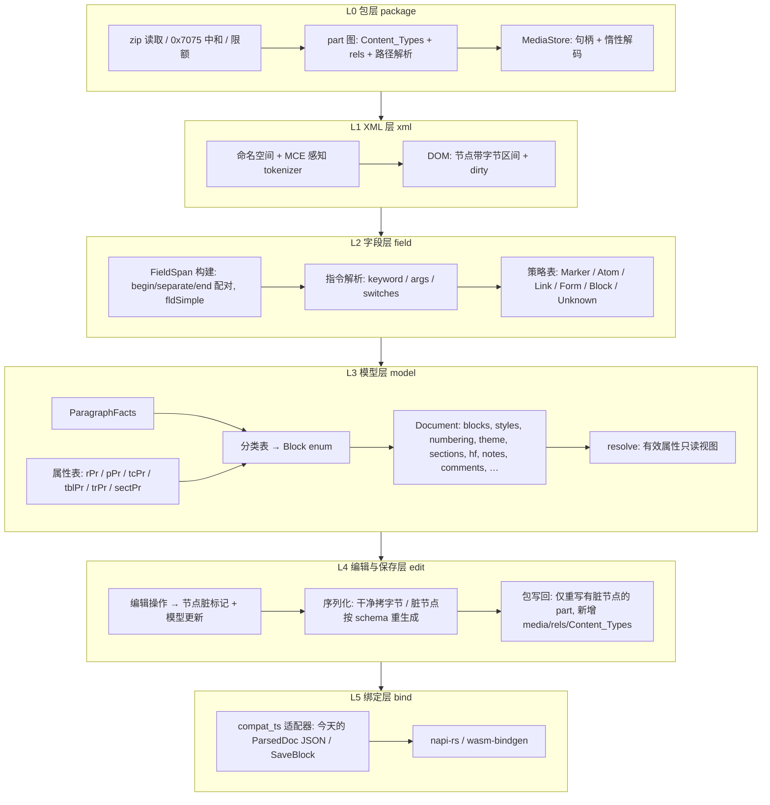

# docx 引擎 Rust 重写：整体设计（v2）

> **已被 `rust-engine-design-v3.md` 取代。** v3 合并了评审采纳项：Span 层泛化、`DescendantDirty`/`SelfDirty`、字段结果保留多 run、MCE 补全、`CompatFacts`、`RelTarget`、`SdtInfo` 的 dataBinding/lock/docPart、修订与 Strict 的范围声明、随机编辑序列测试，并定义了六个核心类型。本文件仅作历史记录。
> 前置文档：`rust-parser-dev-guide.md`（现有 TS 实现的规格）。
> 范围：方案 A。Rust 整体替换 `parseDocx` 与 `saveDocx`，产出编辑器今天消费的模型（含显示模型），不做布局与渲染。
> 基线：`main` @ `a4d58fc`，2026-09-03。

---

## 0. 结论先行

1. **保真策略沿用 genoffice**：文件是真相，未编辑内容零字节改动。
2. **把补丁粒度从"body 顶层元素"推广到"任意 XML 节点"**：一棵带字节区间和脏标记的 DOM，干净子树拷原字节，脏子树按 schema 重生成。`sdtShell`、`rawPPr`、`rawRPr`、`rawTcPr`、`rawTrPrs`、`patchTextboxParas`、`patchTableCellTexts` 这些特例全部消失。
3. **字段（Field）单独成层**：字段是"跨兄弟节点、可跨段落、可嵌套"的区间结构，DOM 表达不了；它也是今天段落变成不可编辑保护块的头号原因。字段层用一张策略表取代现有的 6 处零散字段逻辑。
4. **模型分"声明"与"解析"两层**：模型只存文档声明的属性；样式链、主题、docDefaults 的合并由独立的 `resolve` 模块产出只读视图。排版启发式全部移出解析器。
5. **借鉴取舍**：借 LibreOffice 的 tokenizer 层（命名空间与 MCE 处理）、导出器里的 schema 顺序知识、真实测试语料、`oox` 的颜色与 VML 表；不借 DomainMapper。借 python-docx 一类库的"就地修改 DOM"思路。

---

## 1. 目标与边界

### 1.1 输入输出

- 输入：`.docx` 字节。
- 输出（解析）：`Document` 模型，经适配器可序列化为与今天 TS `ParsedDoc` 字段兼容的 JSON（第一阶段），之后切换到新模型 JSON。
- 输入（修改）：编辑操作序列，或第一阶段兼容今天的 `SaveBlock[]`。
- 输出（修改）：新的 `.docx` 字节。

### 1.2 不做的事

- 不做分页、行布局、字体度量、渲染。
- 不做 Word 之外的格式（`.doc`、RTF、ODT）。但 tokenizer 与模型层之间留出事件流缝，将来可接。
- 不在解析器里做排版决策（碰撞位移、画布分栏、WordArt 字号、连线抓取带、把样式填充烘进单元格）。这些迁到 TS 渲染器，或由 `resolve` 视图提供带来源的数据。

### 1.3 必须保持的不变式

1. 无编辑保存 → 输出字节与输入完全相同。
2. 编辑一个节点 → 其他 zip 条目字节相同；同一 part 中所有干净节点的原文子串原样出现。
3. 病态输入（超深嵌套、损坏片段）→ 局部降级为保护块，文档整体仍能字节保真保存。

---

## 2. 分层架构



每层只依赖下层。L2 与 L3 之间的接口是"段落节点 + 该段的字段区间列表"；L3 与 L4 之间的接口是"模型对象持有 `NodeId`"。

---

## 3. L1：带字节区间的命名空间感知 DOM

### 3.1 节点

```rust
struct NodeId(u32);                       // arena 索引

struct Node {
    name: QName,                          // (NsId, LocalId)，由 schema 表生成的枚举
    attrs: Vec<Attr>,                     // 保持原顺序；value 为原文切片 + 惰性解码
    children: Vec<NodeId>,                // 元素与文本节点混排，保持顺序
    range: Range<u32>,                    // 在 part 原文中的 [start, end) 字节区间
    inner: Range<u32>,                    // 开标签结束到闭标签开始
    dirty: Dirty,                         // Clean | Modified | New | Deleted
    parent: Option<NodeId>,
}
enum Attr { Raw { name: QName, value: Range<u32> }, Owned { name: QName, value: String } }
```

- 文本节点保留原文区间，不 trim；`xml:space` 语义在模型层处理（与今天一致）。
- 实体：读取时按需解码五个命名实体与数字实体；写回干净节点时直接拷字节，避免"二次解码"问题。
- 深度：迭代解析，无递归；深度上限 100k（POI 5000 层表格）。
- 一个 part 一棵树；`document.xml`、每个 header/footer、`styles.xml`、`numbering.xml`、`comments.xml`、`footnotes.xml`、`[Content_Types].xml`、各 `.rels` 都用同一机制，这样写回逻辑只有一份。

### 3.2 命名空间与 token

- 每个 part 解析时建 `prefix → NsId` 表（含默认命名空间），元素与属性名比较的是 `(NsId, LocalId)`，不是前缀字符串。
- `LocalId` 枚举与 `NsId` 枚举由一张精选的 schema 表生成（`build.rs`），覆盖 WordprocessingML、DrawingML、`wp`/`wps`/`wpg`/`pic`/`c`/`dgm`/`dsp`/`lc`、VML `v`/`o`/`w10`、`m`、`mc`、`w14`/`w15`、`r`、rels、Content_Types。未知名字落到 `Unknown(interned)`，仍可原样写回。
- 借鉴：LibreOffice `writerfilter/source/ooxml/model.xml` 的做法，但不生成处理器，只生成名字表。

### 3.3 MCE（`mc:AlternateContent`）

- tokenizer 层实现 ECMA-376 Part 3：`mc:Ignorable` 记录可忽略前缀；`mc:AlternateContent` 按 `Requires` 里的命名空间是否都在"已理解集合"里选 `Choice`，否则选 `Fallback`。
- 树里**两支都保留**（写回需要），但被选中的一支标 `active`，模型层遍历只走 `active` 分支。今天用正则删 `Fallback` 的 5 处代码全部消失。
- 已理解集合初始为 `wps, wpg, wp14, w14, w15, cx(chartex 部分)`，可配置。

### 3.4 从树到"切片"

今天所有 `rawXxx` 与 `originalXml` 都由 `range` 直接给出，不再有 `serializeXNode`、`rawPPrOf`、`splitXmlChildren`、`topLevelDrawings`、`ommlFragmentsOf`、`rubyFragmentsOf` 及其"计数对齐"。

---

## 4. L2：字段层（Field Layer）

### 4.1 为什么必须单独成层

- 字段的边界是 `w:fldChar` begin/separate/end 三个**兄弟级**标记，可以跨段落（TOC、INDEX、多段 IF），可以嵌套（`IF { MERGEFIELD }`）。树结构表达不了，必须是覆盖在 run 序列上的区间结构。
- 今天字段散在 6 处：`buildBlock` 的探测与保护分支、`onlyXeFields`/`SIMPLE_INLINE_FIELD_RE`/`convertibleHyperlink`/`checkboxStateOf`、`extractRuns` 的状态机与 `xeTerm`/`refField`/`refInstr`/`instrField`/`fldBeginXml` 五个逃生字段、`fieldDisplayOf`/`fieldLabel`、页眉页脚里用正则把 PAGE 改写成 `PAGE_MARK`、`generate.ts` 里的 TOC/XE/REF/SEQ 生成。
- 今天"含字段的段落"默认整段保护，是可编辑范围最大的缺口。

### 4.2 数据结构

```rust
struct FieldId(u32);

struct FieldSpan {
    id: FieldId,
    form: FieldForm,                      // Complex { begin, separate: Option, end } | Simple { node }
    instr: Instruction,                   // 见 4.4
    result: Vec<NodeId>,                  // separate 与 end 之间的节点（run / 嵌套字段的节点）
    nested: Vec<FieldId>,                 // 出现在指令区或结果区里的子字段
    parent: Option<FieldId>,
    paragraphs: Range<usize>,             // 覆盖的段落数；>1 即跨段
    lock: bool,                           // w:fldLock
    dirty_flag: bool,                     // w:dirty
    ff_data: Option<NodeId>,              // 表单字段定义（begin run 内 w:ffData）
    policy: FieldPolicy,                  // 由策略表决定
}
```

字段区间不持有字节，只持有 `NodeId`；所有原文都通过 DOM 区间获得。

### 4.3 构建算法

1. 对每个 part，按文档序遍历所有 `w:r`（含 `w:ins`/`w:del`/`w:hyperlink`/`w:sdt`/`w:smartTag` 内部），用一个栈配对 `fldChar begin/separate/end`。`w:fldSimple` 直接成闭合区间；其子 run 是结果，子 `fldSimple` 是嵌套。
2. 指令文本 = begin 到 separate（或 end）之间所有 `w:instrText` 的拼接；`w:delInstrText` 标记为"指令被修订删除"，段落走修订路径。
3. 栏位：未闭合的 begin（文档截断）→ 整段落降级为保护块，并写入 `warnings`。
4. 段落上记录 `fields_here: Vec<FieldId>` 与 `inside_result_of: Option<FieldId>`（该段整体位于某个跨段字段的结果里）。

### 4.4 指令解析

ECMA-376 §17.16.5 的语法足够简单，手写即可：

```
instruction := keyword (argument | switch)*
argument    := quoted-string | bare-token
switch      := '\' letter [argument]          // 字段专属开关，如 \h \o \r \p \l
general     := '\*' fmt | '\#' fmt | '\@' fmt | '\!'
keyword     := 首个 token，大小写不敏感；'=' 为公式字段
```

嵌套字段在 XML 里已经是嵌套的 `FieldSpan`，指令解析器只需在遇到子字段时放一个占位 token。

### 4.5 策略表

`keyword → FieldPolicy`，未命中 → `Unknown`。策略只描述**显示形态、可编辑性、保存行为**三件事，不描述如何计算结果（那是 Word 的事）。

| 策略 | 显示 | 编辑 | 保存 | 关键字（初始表） |
| --- | --- | --- | --- | --- |
| `Marker` | 不可见零宽 | 随文本移动/删除 | 干净则原字节；段落重生成时按原文重发 | XE, TA, TC, RD, PRIVATE, SET |
| `Atom` | 缓存结果作为一个不可键入的内联原子 | 可整体删除、可改格式（改结果 run 的 rPr） | 干净则原字节；改格式只重生成结果 run；删除 = 删 begin..end | PAGE, NUMPAGES, SECTION, SECTIONPAGES, NUMWORDS, NUMCHARS, DATE, TIME, CREATEDATE, SAVEDATE, PRINTDATE, EDITTIME, AUTHOR, TITLE, SUBJECT, KEYWORDS, COMMENTS, LASTSAVEDBY, FILENAME, FILESIZE, TEMPLATE, DOCPROPERTY, DOCVARIABLE, USERNAME, USERINITIALS, USERADDRESS, SEQ, STYLEREF, PAGEREF, NOTEREF, REF, QUOTE, SYMBOL, LISTNUM, AUTONUM, AUTONUMLGL, AUTONUMOUT, REVNUM, INFO, `=`, MERGEFIELD, MERGEREC, MERGESEQ, NEXT, NEXTIF, SKIPIF, IF（单段）, COMPARE, ADVANCE, EQ, GOTOBUTTON, MACROBUTTON, CITATION, FILLIN, ASK, GREETINGLINE, ADDRESSBLOCK, AUTOTEXT, AUTOTEXTLIST |
| `Link` | 超链接 | 改文字、改目标 | 仍以字段形式写回（不再转成 `w:hyperlink`）；新建链接才用 `w:hyperlink` | HYPERLINK |
| `Form` | 复选框/文本框/下拉的合成字形或值 | 切换/输入改 `w:ffData` | 重生成 begin run（含 ffData）+ 结果 | FORMCHECKBOX, FORMTEXT, FORMDROPDOWN |
| `Picture` | 图片 | 同图片原子 | 原字节 | INCLUDEPICTURE |
| `Object` | OLE 预览 | 同对象原子 | 原字节 | EMBED, LINK |
| `Block` | 结果为多个段落，整体显示为字段块（TOC 行等） | 结果段落只读；"更新"= 由生成器重算整块 | 干净则原字节；更新时替换 separate..end 之间的全部节点 | TOC, INDEX, BIBLIOGRAPHY, INCLUDETEXT, DATABASE，以及**任何跨段**字段 |
| `Unknown` | 同 `Atom` | 同 `Atom` | 原字节 | 其余 |

编辑器侧对应的能力变化：含 `Atom`/`Marker`/`Link`/`Form` 字段的段落**全部可编辑**；只有 `Block` 的结果段落保持只读。

### 4.6 与其他层的关系

- **页眉页脚**：不再有 `PAGE_MARK`/`TOTAL_PAGES_MARK` 与正则改写。PAGE/NUMPAGES 就是 `Atom` 字段，渲染器看到 `Field{keyword: PAGE}` 自己替换页码；`hasPageNumber` 由字段列表推导。
- **TOC 与 sdt**：Word 的 TOC 通常是 `w:sdt(docPartGallery)` 包着一个 `Block` 字段。DOM 里这只是两层节点，"更新目录"= 用生成器产出新结果节点并替换 separate..end，sdt 外壳自然保留。
- **修订**：`w:delInstrText`、字段标记落在 `w:ins`/`w:del` 内的情况由字段层识别并标注，模型层据此决定是否降级。
- **生成器**：新建字段（插入目录、题注 SEQ、交叉引用 REF、索引 XE）走同一个 `FieldSpan → 节点` 的生成函数，而不是今天每种字段一段字符串拼接。

### 4.7 借鉴

- 策略表的**形状**借 LibreOffice `FieldConversionMap`；内容不借（它映射到 Writer 字段类型）。
- 关键字全集来自 ECMA-376 §17.16.5 与 [MS-OI29500] 的补充。

---

## 5. L3：文档模型层

### 5.1 Block

```rust
enum Block {
    Text(TextBlock),                      // kind: Paragraph | Heading{level} | ListItem{list}
    Table(TableBlock),
    Image(ImageBlock),
    Protected(ProtectedBlock),
}
struct ProtectedBlock {
    node: NodeId,
    kind: ProtectedKind,
    preview: String,
    display: Option<Display>,            // 显示模型（见 5.5）
}
enum ProtectedKind {
    FieldBlockResult(FieldId),            // 跨段字段的结果段落
    Equation(FormulaDisplay),
    TextBox(Vec<TextboxDisplay>),
    Chart(ChartDisplay),
    SmartArt(DiagramDisplay),
    Ole(OleDisplay),
    Rule(RuleDisplay),
    Invisible,                            // 顶层 bookmarkEnd/proofErr 等、不可见形状、隐藏段落
    SectionBreak,                         // 无内容的分节段落
    SectionProps,                         // 尾部 w:sectPr（今天的 hidden）
    Unparseable,                          // 解析失败降级
}
```

- 所有块持有 `NodeId`；今天的 `docxIndex`/`originalXml`/`id` 由 `NodeId` 与其区间替代。`compat_ts` 适配器负责把 body 直接子节点的序号映射回 `docxIndex`。
- `label` 变成 i18n key（`ProtectedKind` 本身即是 key），不再是英文 UI 文案。
- `sdt`：不再是"外壳字节"，而是段落上的信息字段 `sdt: Option<SdtInfo{alias, tag, control_type, node}>`；写回由 DOM 自然处理。多段 sdt 不需要 `group`。
- `w:ins`/`w:del` 顶层包裹、`pPrChange`、段落标记删除等修订信息保留为模型字段，语义与今天相同。

### 5.2 内联内容

```rust
enum Inline { Run(Run), Atom(InlineAtom) }
struct Run { node: NodeId, text: String, props: RunProps /* 声明值 */, link: Option<Link>, rev: Option<RevisionCtx>, comments: SmallVec<CommentId> }
struct InlineAtom { node: NodeId, kind: AtomKind, display_text: String, props: RunProps, rev: Option<RevisionCtx> }
enum AtomKind {
    Field(FieldId),                       // 取代 xeTerm / refField / refInstr / instrField / fldBeginXml
    Math,                                 // m:oMath，display_text = token 串
    Ruby { rt: String },
    Image(ImageRef),                      // 内联/锚定图片，几何见 5.5
    NoteRef { kind: NoteKind, id: String },
    Break(BreakKind),                     // page / column / textWrapping，不再编码成控制字符
    Symbol { font: String, code: u32 },   // w:sym
    Object(OleDisplay),
    Drawing(NodeId),                      // 段落内的其他锚定绘图（装饰形状），显示模型另给
}
```

- 五种字段逃生字段合成一个 `Field` 原子；数学/ruby/图片今天已经是原子，统一进 `AtomKind`。
- `\f`/`\v`/`\n` 控制字符是今天 run 文本与 OOXML 之间的隐式协议，改成显式 `Break` 原子；`compat_ts` 再折回控制字符。
- run 合并（`mergeRuns`）保留：相邻、同声明属性、同链接、同修订、同批注的 run 合并为一个逻辑 run，但每个逻辑 run 记录它覆盖的 `NodeId` 列表，写回时能定位。

### 5.3 属性表：一张表驱动读、比、合、序

`RunProps`/`ParaProps`/`CellProps`/`TableProps`/`RowProps`/`SectionProps` 由声明式表格生成（宏或 `build.rs`）：

| 列 | 含义 |
| --- | --- |
| 字段名 | `bold`、`size_half_points`、… |
| 元素 | `w:b`、`w:sz`、… |
| 值编解码 | `OnOff`（三态）、`HalfPoints`、`Twips`、`HexColor{theme_aware}`、`Enum<…>`、`Raw` |
| Cs 孪生 | `w:bCs`/`w:iCs`/`w:szCs` 与主属性的配对关系 |
| schema 序号 | 在 `CT_RPr`/`CT_PPr`/… 中的位置，决定重生成时的插入点 |
| 修订快照 | 是否出现在 `rPrChange.old`/`pPrChange.old` |

由这张表生成：读取（DOM → props）、比较（脏检测）、合并写回（保留未建模子元素、按序插入建模子元素）、修订快照读取。今天 `buildRun` 的 40 段 `findChild`、`rPrChange.old` 的重复代码、`generate.ts` 的 `mergeRPrModel`/`mergePPrFormat`、`schema-order.test.ts` 关心的顺序问题，都收敛到这一张表。三态语义（`onOffOf` vs `boolProp` 的不一致）在表里显式声明，`keepNext` 与 `pageBreakBefore` 不再有不同行为。

schema 顺序来源：ECMA-376 的 XSD，对照 LibreOffice `docxattributeoutput.cxx` 的实际输出顺序校验。

### 5.4 声明值与解析值分离

- 模型里的 `RunProps`/`ParaProps` 只含文档**声明**的值（含主题引用原样，如 `asciiTheme=minorHAnsi`）。
- `resolve` 模块提供只读视图：`resolve::run(run, para, styles, theme, doc_defaults) -> EffectiveRunProps`，处理样式链（basedOn、linked）、主题字体/颜色、空 EA 槽回填、rtl 下的 Cs 选择、docDefaults；`resolve::para` 同理；`resolve::table_cell` 处理表格样式的条件格式（`tblLook`）与边框/边距回退，输出**带来源**的值（`Declared | FromStyle(id) | FromTableStyle(cond) | Default`）。
- `bidi` 段落的 `jc` 存逻辑值；`resolve::para` 给视觉值。
- 空段落的行高信息保留为声明值 `para_mark_rpr: Option<RunProps>`，不再在解析时挑出 `emptyRunSizeHalfPoints`。
- `compat_ts` 适配器用 `resolve` 复现今天 `Run.font`/`fontAscii`/`csFont`/`eaSlotEmpty` 那种"半解析"输出，隔离在一个模块里，编辑器迁移后删除。

### 5.5 显示模型：保留数据，剥离排版

Rust 仍产出编辑器需要的显示模型，但只保留**文档事实**：

- `TextboxDisplay`：填充、边框、几何（EMU 原值 + px）、预设几何名、旋转、inset、锁定高度、内容段落、组变换后的偏移、锚点元数据（relH/relV/align/pct/offset/wrap 类型/behindDoc/allowOverlap）。
- `ImageRef`/`ImageBlock`：媒体句柄、extent、裁剪、fillRect、旋转翻转、边框、锚点元数据、`relativeHeight` 原值。
- `ChartDisplay`、`DiagramDisplay`（SmartArt 预计算布局与 lockedCanvas 的形状几何、文本、字号原值）、`OleDisplay`、`RuleDisplay`。

**从解析器删除、由渲染器承担**：`allowOverlap` 碰撞位移；lockedCanvas 的分栏堆叠与逐字母拆分；WordArt 字号压缩；零高度连线的 12px 抓取带；`wrapTopAndBottom` 的 band 计算（渲染器有锚点元数据与盒高，自己算）；页面/边距锚定的绝对位置换算（渲染器有 `sectPr` 几何）；`imageZOrder` 归一（保存层做统一改写，模型只存原值）；`floatSide`/环绕侧的 4680 twips 猜测（渲染器用节几何判断）。

颜色算法借 `oox::drawingml::Color`：lumMod/lumOff/tint/shade/satMod/hueMod 等在规范要求的色彩空间里计算，输出 sRGB。VML `o:spt` 到预设几何、`mso-*` 样式属性、单位解析借 `oox/source/vml` 的表。

### 5.6 分类：facts → 表

一次遍历段落节点得到：

```rust
struct ParagraphFacts {
    has_sect_pr, visible_text, visible_text_outside_boxes,
    fields: Vec<FieldId>, inside_field_result: Option<FieldId>,
    drawings: Vec<DrawingFacts>,  // 每个顶层 drawing：kind(chart|diagram|canvas|picture|shape|line), anchored, has_txbx_text, has_blip
    picts: Vec<PictFacts>,        // VML：imagedata / textbox / wordart / hr / shapetype-only / hidden
    objects: usize,               // w:object
    math: MathFacts,              // count, has_omath_para
    revision: RevisionFacts,      // del_instr, cell_ins_del, move_from_to, block_wrapper
    style_id, style_vanish, toc_style_level, numbering_ref, outline_level,
}
```

分类函数是 facts 的纯函数，用一张按优先级排列的规则表实现，每条规则可单测。今天 `buildBlock` 的 530 行 `if` 变成约 25 条规则。

### 5.7 其余子模型

- 样式、编号、主题、设置、批注、脚注尾注、参考文献、节信息、页眉页脚 part：语义与前置文档一致，但页眉页脚**复用正文管线**（同一个段落/表格构建器，不同上下文），`HfParagraph`/`HfTableCell`/`HfImage` 三个弱模型删除，页眉页脚 part 的内容就是 `Vec<Block>`。
- 编号补齐 `lvlRestart`、`isLgl`、`lvlPicBulletId`。
- 节：保留 `sectPr` 节点引用与 header/footer 引用；"未声明时继承上一节"的链在 `resolve::sections` 里给出。
- `Document.warnings: Vec<Diagnostic{part, range, code, message}>`：每次降级、每次 catch 都记录。

---

## 6. L4：编辑与保存

### 6.1 编辑操作

第一阶段兼容今天的 `SaveBlock[]`：`{kind:'original', docxIndex}` 映射为"节点保持干净"，`{kind:'generated', block}` 映射为"该 body 子节点标脏并以新内容替换"，`{kind:'xml', xml}` 映射为"插入新节点（解析该片段为子树）"。

之后提供原生操作集（每个操作 = 更新模型 + 标脏最小节点集）：

- 段落：`replace_inlines(para, Vec<Inline>)`、`set_para_props(para, patch)`、`set_style`、`set_list`
- run：`set_run_props(range, patch)`、`split/merge`
- 块：`insert_after(node, NewBlock)`、`delete(node)`、`move(node, to)`
- 表：`set_cell_inlines`、`set_cell_props`、`insert_row/col`、`delete_row/col`
- 字段：`set_field_result_props`、`toggle_checkbox`、`set_link_target`、`update_block_field(id, generator)`、`insert_field(kind, args)`
- 文本框：`replace_inlines(txbx_para, …)`（因为文本框段落也是普通段落节点，不再需要 `patchTextboxParas`）
- 节：`set_section_props`、`set_header_footer(kind, variant, Vec<Block>)`
- 修订：`accept/reject(revision)`
- 部件：`add_media(bytes, mime) -> MediaId`、`add_chart`、`set_note_text`、`set_comment`

### 6.2 序列化规则

```
serialize(node):
  Clean    → 拷贝 src[node.range]
  Deleted  → 空
  New      → 按 schema 生成整棵子树
  Modified → 开标签（原属性按原序 + 修改）+ 子节点逐个 serialize + 闭标签
```

属性容器（`w:rPr`/`w:pPr`/`w:tcPr`/`w:tblPr`/`w:trPr`/`w:sectPr`）的 `Modified` 走属性表的合并规则：未建模子元素按原字节保留在原位，建模子元素按 schema 序号替换或插入。这就是今天 `mergeRPrModel` 的一般化。

新节点所需的命名空间前缀若 part 根未声明，在根上补声明（今天 `notes.ts` 的 `rootAttributes` 做的事，改为通用）。

### 6.3 包写回

- 仅重写含脏节点的 part；其余 zip 条目按原压缩字节拷贝，保持条目顺序。
- 新增 part（media、chart、notes、comments）通过同一 DOM 机制修改 `[Content_Types].xml` 与对应 `.rels`。
- `docProps/core.xml` 的修改时间与 `removePersonalInformation` 处理保留为选项。
- 无任何脏节点且无新增 part → 直接返回原字节。

### 6.4 不变式如何保证

- 不变式 1：无脏节点即返回原字节，无序列化过程。
- 不变式 2：序列化只在脏节点处生成字节，其余全是原文拷贝；测试对每个干净节点断言其原文子串出现在输出中。
- 不变式 3：解析失败的子树标 `Unparseable` 且保持 `Clean`，永远原字节拷贝。

---

## 7. L0：包与媒体

- zip：先对字节做 `0x7075` 字段中和，再交给 `zip` crate；限额（≤10,000 part、单 part ≤512 MiB、总计 ≤1.5 GiB）按 central directory 声明大小检查。
- 主 part：`word/document.xml`，否则 `_rels/.rels` 的 `officeDocument` 目标；ODF 检测报错。
- part 图：`[Content_Types].xml` 的 Default/Override，每个 part 的 `.rels`；统一的路径解析函数（`/` 前缀、相对当前 part 目录、`..` 归一化）。今天分散在 6 处的路径拼接收敛为一个。
- `MediaStore`：`MediaId → {path, mime, zip 条目}`；解码（EMF/WMF/EMZ/WMZ → PNG，TIFF → PNG）为可插拔服务，默认惰性。模型只引用 `MediaId`；`compat_ts` 阶段内联 dataURL，之后改为句柄 + 独立二进制表。
- EMF/WMF 转换：Rust 无成熟 crate。第一阶段输出 `MediaKind::Metafile` 让 TS 侧继续用现有转换器渲染；后续再决定移植还是 FFI。

---

## 8. L5：绑定与输出

- napi-rs（Electron）优先，wasm-bindgen 备选。
- 第一阶段 `compat_ts`：把 `Document` 映射为今天的 `ParsedDoc` JSON（含 `blocks[].docxIndex`、`originalXml`、`rawPPr`、`Run` 的半解析字体字段、控制字符、dataURL），`saveDocx(parsed, SaveBlock[])` 也走适配器。编辑器零改动接入，用 JSON diff 与 TS 解析器做差分。
- 第二阶段切换到新模型 JSON：tagged enum、`NodeId`、`MediaId`、`Field`、`resolve` 视图按需请求。

---

## 9. 借鉴对照

| 来源 | 借什么 | 不借什么 |
| --- | --- | --- |
| genoffice docx-engine | 保真策略、保护块降级、恶意输入限额、兼容性细节清单、测试场景 | 双层 XML 处理、正则切片、`buildBlock` 顺序 `if`、`Block` 大杂烩、解析器里的排版启发式 |
| LibreOffice writerfilter（ooxml 子目录）与 oox/core | 命名空间感知 token 表、`mc:AlternateContent`/`Ignorable` 处理 | DomainMapper、Writer 模型映射、表格栈机、兼容标志 |
| LibreOffice DOCX 导出器 | `CT_*` 子元素顺序、必填属性、Word 容忍度 | 全量重序列化 |
| LibreOffice oox drawingml/vml | 颜色变换算法、VML `o:spt` 表、`mso-*` 样式解析 | 形状到 Draw 对象的映射 |
| LibreOffice sw/qa/extras | 真实文档语料 + 最小断言 + 导出 XPath 断言的测试模式（复用文件前确认许可） | |
| python-docx / docx4j | "就地修改 DOM、未知节点自然保留" | 全量重序列化 |
| ECMA-376 §17.16 / [MS-OI29500] | 字段关键字与开关全集 | |

---

## 10. 测试策略

1. **差分测试**（第一阶段主力）：TS 脚本把 77 个测试文件用到的合成 docx 落盘为 `.docx` + `parseDocx` 的期望 JSON；Rust `compat_ts` 输出与之 diff。
2. **字节保真**：每个语料文档无编辑往返 → 字节相同；编辑单节点 → 其他干净节点原文子串全部出现。
3. **保存 XPath 断言**：对生成的 `document.xml` 用 XPath 断言结构（schema 顺序、字段结构、rels 一致性），照 LO `ooxmlexport` 模式。
4. **真实语料**：建立落盘语料目录（含 LO 公开测试文档中许可允许的部分、自有样本），每个文档一个最小断言与一次往返。
5. **恶意输入**：现有 `hostile-input` 三场景 + tokenizer 模糊测试（cargo-fuzz）。
6. **属性表测试**：对表中每一行生成读/写/合并的往返用例。
7. **字段层测试**：每种策略至少一个正向用例；跨段、嵌套、未闭合、`fldSimple` 嵌套、`delInstrText`、锁定字段。

---

## 11. 里程碑

| 阶段 | 内容 | 验收 |
| --- | --- | --- |
| M0 | L0 + L1：包层、tokenizer、DOM、MCE、schema 名字表；`serialize` 干净拷贝 | 任意语料 parse→serialize 字节相同 |
| M1 | 属性表 + `RunProps`/`ParaProps` 读写合并；文本段落、heading、list；`compat_ts` 骨架 | 文本段落 JSON 与 TS 一致；改一段文字往返满足不变式 2 |
| M2 | 字段层全部策略；批注/修订/书签/ruby/数学/noteRef 原子；符号字体 | 字段相关测试场景；含字段段落可编辑 |
| M3 | 表格（嵌套、样式条件格式走 `resolve`）、sdt 信息化 | 表格测试场景；改单元格文本往返 |
| M4 | 绘图显示模型（不含排版启发式）、图片原子、VML、颜色算法 | 绘图测试场景（断言改为文档事实） |
| M5 | 页眉页脚复用正文管线、脚注尾注、参考文献、节、保护、设置 | hf/notes/sections 场景 |
| M6 | 图表、SmartArt、lockedCanvas、OLE、`MediaStore` | chart/smartart/ole 场景 |
| M7 | 保存层：`SaveBlock[]` 兼容、部件写回、新增 media/chart/notes；与 `saveDocx` 差分 | 现有 roundtrip/text-patch/table-edit/textbox-edit 场景全部通过 |
| M8 | 编辑器切换到 Rust 引擎（`compat_ts`） | e2e 通过 |
| M9 | 新模型 JSON、原生编辑操作、媒体句柄、渲染器接管排版启发式；删除 `compat_ts` | 编辑器迁移完成 |

---

## 12. 风险与未决

- **schema 顺序表的完整性**：`CT_PPr`/`CT_RPr` 子元素多且有条件顺序，需从 XSD 生成并用 LO 输出交叉校验。
- **`compat_ts` 的成本**：复现今天的半解析规则与控制字符协议是纯负担，必须限定在一个模块并设删除期限。
- **跨段字段的编辑边界**：`Block` 策略把结果段落设为只读，用户体验与今天相同；进一步放开需要生成器能重算结果，逐字段评估。
- **DOM 内存**：一个 arena 节点约 40–64 字节；100 MB 的 `document.xml` 约 200 万节点，内存可接受，但要避免为文本节点复制字符串（用区间）。
- **EMF/WMF**：Rust 侧暂不转换，TS 侧继续渲染；长期方案待定。
- **多前缀/非标准命名空间**：token 表按 URI 比较已覆盖；ISO Strict 的 URI（`http://purl.oclc.org/ooxml/...`）在 `NsId` 里作为别名处理。注意 TS 引擎在基线之后新增了 `src/ooxml-normalize.ts`：在 zip 装载时把 Strict URI 与非规范前缀**改写为** transitional URI 与规范前缀，之后解析、补丁、保存都基于改写后的文本。这意味着 Strict 文档在 TS 引擎里保存后会变成 transitional。Rust 版按 URI 匹配无需改写，可以保住原字节；但"保存后仍是 Strict"是否是期望行为要与产品确认（Word 两种都能打开，转 transitional 更稳妥）。
- **基线之后 TS 引擎的其他变化**（工作树 `f105f36` 相对 `a4d58fc`）：新增 `fontTable.xml` 解析（`parseFontTable` → `FontTableEntry{name, altName, panose, family, pitch}`，字体替换提示），应纳入 L3 子模型；`generate.ts` 有嵌套表格编辑相关改动，属于 L4 兼容范围，实施 M7 时以当时的 `saveDocx` 行为为差分基准。
