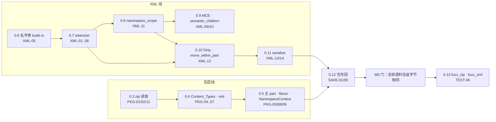
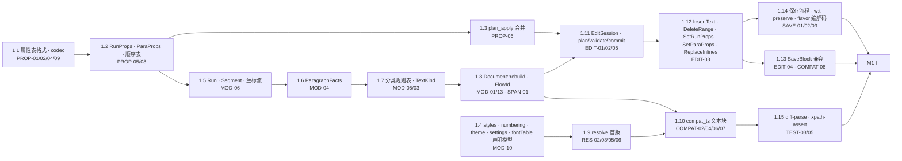

# 开发计划 v1：M0 / M1 执行方案

> 日期：2026-09-04。基线：`docs/03` v3.2（冻结）、`spec/12-m0-m1-plan.md` 的任务分解。本文不改任务定义，只给出：环境核查结果、`spec/12` 四条风险提示的结论、仓库布局、执行顺序与并行组、CI 门、待决事项。
> 本文随实现推进更新；任务状态用复选框维护。

---

## 0. 结论先行

1. **tokenizer 自写**，不用 `quick-xml`（§2.1）。`XML-03/04/13` 需要属性名与属性值的字节区间、引号风格、原始限定名，`quick-xml` 不公开这些区间（`IterState` 是 `pub(crate)`），用它等于再写一遍标签扫描。
2. **zip 用 `zip` 8.6**，`default-features = false` + `deflate-flate2-zlib-rs`（§2.2）。`raw_copy_file`、`extra_data_fields`、`header_start`/`data_start` 都在，够 `PKG-01`/`SAVE-06`。`0x7075` 中和按 spec 自己做，不依赖库行为。
3. **单 lib crate `rsword`** + 独立工具 crate（§3）。模块目录与 `docs/03` §2 一一对应，测试函数名引用 spec ID。
4. **任务 0.1、0.2 已完成**（§4.1）：语料导出工具 `tools/export-golden/` 建成并运行（573 个合成文档、162 份 `SaveBlock[]` 记录、16 个恶意输入），crate 骨架、`Diagnostic`/`ValidationOrigin`/`Error`、CI、语料目录就位，`cargo fmt/clippy/test` 全绿。
5. **下一步编码**：任务 0.3（zip 读取）与 0.6 → 0.7（名字表 → tokenizer）两条线并行；汇合于 0.11/0.12 的往返门。

---

## 1. 环境核查（2026-09-04 实测）

| 项 | 结果 | 影响 |
| --- | --- | --- |
| Rust | `rustc 1.98.0` / `cargo 1.98.0`，stable，aarch64-apple-darwin | 满足 `zip` 8.6 的 MSRV 1.88；workspace `rust-version = "1.88"` |
| rustfmt / clippy | 原本**未安装**，本次 `rustup component add rustfmt clippy` 已装 | CI 三件套可本地跑 |
| nightly / cargo-fuzz | **无** | 任务 0.13 前需 `rustup toolchain install nightly && cargo install cargo-fuzz`；不阻塞 0.3–0.12 |
| crates.io | 可达；`zip 8.6.0`、`quick-xml 0.41.0`、`roxmltree 0.21.1`、`memchr`、`thiserror`、`serde(_json)` 已在本地缓存 | 离线也能建 M0 |
| genoffice | `~/code/genoffice`，HEAD = `f105f36`（与 `docs/03` 基线一致）。**工作树有 31 处已暂存未提交的改动**（`apps/docs` AI 功能、`packages/docx-engine/src/generate.ts`、`tests/nested-table-edit.test.ts`） | 导出的 `expected.json` 反映的是 f105f36 + 这些改动；`manifest.jsonl` 首行记录 `genoffice_dirty_files`。见 §8 |
| docx-engine 测试 | **87** 个测试文件（`docs/03` §11 写的 77 已增长）；`buildDocx` 608 次、`buildKitchenSinkDocx` 13 次、`saveDocx` 188 次（44 个文件）；全套 16 秒 | 语料规模上限；实际落盘按字节去重 |
| 运行方式 | npm workspaces（不是 pnpm；`pnpm exec` 会因 `@genoffice/pptx-engine` 不在 registry 而失败）；vitest 4.1.10 在仓库根 `node_modules/.bin/vitest`；Node 24.15 | `tools/export-golden/run.sh` 直接调用根 vitest |

---

## 2. `spec/12` 风险提示的结论

### 2.1 风险 1：`quick-xml` 能否满足 `XML-03`

**结论：不满足，自写。** 逐项对照：

| 需求 | `quick-xml` 0.41 | 结果 |
| --- | --- | --- |
| 开标签 `[start, end)`、`lex.name` 原始限定名区间 | `buffer_position()` 只给事件结束位置；名字是 `&[u8]` 切片，无区间 | 需从事件字节反推 |
| 属性 `lex_name`、值区间、`quote` | `Attribute { key, value: Cow<[u8]> }`；带区间的 `Attr<Range>` 与 `IterState` 是 `pub(crate)` | **不可得** |
| 重复属性容忍（`XML-04`） | `Attributes::with_checks(false)` 可以 | 可 |
| 不 trim、不解实体（`XML-06/07`） | 配置可关 trim；默认不解实体 | 可 |
| 注释 / PI / CDATA 作 `Opaque` 原字节 | 事件有，区间需反推 | 需反推 |
| 迭代、100k 深度（`XML-08`） | 事件流天然迭代 | 可 |
| 序言 / 尾声区间（`XML-01`） | 需自己记录 | 需反推 |

"反推"就是在事件的原始字节上再扫一遍标签结构，等价于写 tokenizer 的一半。自写的范围是 OOXML 子集（无 DTD、无内部实体声明），预计 1.5k 行含测试。`roxmltree` 有 `range()` 但递归下降、解实体、不保留属性引号，同样不适用。

补充做法：把 `quick-xml` 作为 **dev-dependency 的差分 oracle**（同一 part 两边都跑，比较元素/属性/文本序列），给 tokenizer 加一道独立校验。可选，不进主依赖。

### 2.2 风险 2：`zip` crate 对 `0x7075` 与 `raw_copy_file`

**结论：可用，特征收窄。**

- `zip 8.6.0` 有 `ZipWriter::raw_copy_file(ZipFile)`、`raw_copy_file_rename`、`raw_copy_file_touch`；读侧有 `extra_data()`、`extra_data_fields()`、`header_start()`、`data_start()`、`compressed_size()`、`size()`。
- 默认特征拉入 aes / bzip2 / lzma / zstd / xz / ppmd / zopfli；docx 只用 Store 与 Deflate。已配置 `default-features = false, features = ["deflate-flate2-zlib-rs"]`（纯 Rust 的 zlib-rs），编译通过。
- `0x7075` 中和：不指望库忽略该字段。按 `PKG-01` 在交给库之前复制字节、扫 EOCD → central directory、把字段 id 改成 `0xFFFF`；zip64 不处理；保存返回原始字节（不变式 1 用原字节，不用中和副本）。
- **待 0.12 首个测试验证**：`raw_copy_file` 是否原样保留本地头 extra 字段与通用标志位。`SAVE-06` 已声明包级元数据不保证逐字节一致，所以即使不保留也不违反不变式 2，但要知道实际行为并写进测试注释。

### 2.3 风险 3：属性表生成器格式

`build.rs` + TOML（每张表一个文件 `schema/props/*.toml`，列与 `PROP-01` 一致）。不写通用 DSL；生成的 Rust 直接 `include!`。M1 任务 1.1。

### 2.4 风险 4：`compat_ts` 的 `docxIndex` 对齐

M1 任务 1.10 的**第一件事**就是 `COMPAT-04`（sdt 拆分与 `elements[]` 对齐），用导出语料里的 `sdt__*` 用例做首个断言；对齐失败则 `diff-parse` 全盘不可信。

---

## 3. 仓库与 crate 布局

```
rsWordParser/
  Cargo.toml                 # workspace：members = crates/rsword（M1 加 tools/diff-parse、tools/xpath-assert）
  rustfmt.toml
  .github/workflows/ci.yml   # fmt --check、clippy -D warnings、test；fuzz 作业留注释待 0.13
  crates/rsword/
    Cargo.toml               # zip、memchr、thiserror
    src/lib.rs               # 模块索引 + 规范映射表
    src/diag.rs              # Diagnostic / DiagCode / ValidationOrigin（00 §0.5）
    src/error.rs             # Error / NotOoxml / Result（PKG-02/03、XML-08、SAVE-02）
    src/package/             # L0  PKG-*   （PartId、limits、PartFlavor、PackageFlavor 已定义）
    src/xml/                 # L1  XML-*   （MAX_DEPTH、Dirty 已定义）
    src/span/  span/field/   # L2  SPAN-* / FLD-*
    src/semantic/            # L3  PROP-* / MOD-04,05
    src/model/               # L3  MOD-*
    src/resolve/             #     RES-*
    src/edit/                # L4  EDIT-*
    src/save/                #     SAVE-*
    src/bind/compat_ts/      #     COMPAT-*（M1 建，M9 删）
    tests/common/mod.rs      # 语料发现
    tests/corpus_layout.rs   # TEST-01；0.11 后追加 corpus_roundtrip.rs
  corpus/{synthetic,real,hostile}/
  fixtures/resolve/
  tools/export-golden/       # TEST-02 导出脚本（TS，运行在 genoffice 上，不改 genoffice）
  docs/  spec/
```

约定：

- **测试命名**：`<spec 前缀小写>_<序号>_<描述>`，如 `xml_12_dirty_propagation`、`pkg_06_path_escapes_root`。每条 spec 的"验收"小节至少对应一个同名前缀的测试。
- **诊断代码**：只在 `diag::DiagCode` 追加，`as_str()` 用 spec 的大写下划线写法；新增代码同时补进对应 spec 的文本。
- **lints**：`unsafe_code = "forbid"`；clippy `all` warn，CI 下 `-D warnings`。`cast_possible_truncation` 关闭（`u32` 偏移与 `usize` 互转是常态）。
- **提交粒度**：一个任务编号一个或几个提交，提交信息带任务号与 spec ID（`m0.7: xml tokenizer (XML-01..08)`）。

---

## 4. M0 执行方案

目标（`spec/12`）：任意语料 `parse → serialize` 字节相同（含 Strict）；tokenizer 与 zip 层过模糊测试。

### 4.1 已完成

- [x] **0.1 语料导出**：`tools/export-golden/`（§6.1）。首批产物（genoffice `f105f36` + 31 处未提交改动）：
  - `corpus/synthetic/`：573 个 docx + 573 个 `.expected.json`（0 个解析失败），来自 79 个测试文件的 740 次构造调用（167 次按字节去重）；162 份 `.save.<k>.json`（193 次 `saveDocx` 中 31 次的源文档不是经 `buildDocx` 构造的，只记 manifest）；含 `extra__strict-minimal`、`extra__mixed-flavor`。7.8 MB。
  - `corpus/hostile/`：TEST-09 全部 16 项 + `manifest.json`（每项期望）。1.1 MB。
- [x] **0.2 crate 骨架与错误类型**：`rsword` 编译、`cargo test` 5 个测试通过、clippy 零警告。
- [x] **0.6 名字表**（887eafc）：54 个命名空间、913 个局部名，`build.rs` 生成 `NsId`/`LocalName`。
- [x] **0.7 tokenizer + DOM + Clean 序列化**（ca396fa）：语料 589 个文档 3093 个 XML part 全部 `parse → serialize` 字节相同（UTF-16 part 按转码后字节比对）。
- [x] **0.3 zip 读取**（43e90c1）：0x7075 中和、三项限额；`zip` crate 确认会按 0x7075 改名，中和是必需的。
- [x] **0.4 路径 / 内容类型 / 关系**（7304d1a）。
- [x] **0.5 Package / 主 part / flavor / NamespaceContext**（5b4ea54）。
- [x] **0.8 + 0.9 作用域 / MCE / 语义遍历**（43f8681）。
- [x] **0.10 + 0.11 变更原语 / 脏规则 / 前缀生成序列化**（0bd5f29）。
- [x] **0.12 包写回**（7b435ed）：无编辑保存对全部语料字节相同；改一个 `w:t` 后其他条目 CRC 与压缩字节不变。
- [x] **0.13 fuzz**（727dc29、9c82f48）：`fuzz_xml` 首轮几秒内发现实体片段切进多字节字符的 panic，修复后 10 分钟 4369 万次无崩溃；`fuzz_zip` 10 分钟 1352 万次无崩溃。CI 侧放在 `.github/workflows/fuzz.yml`（手动 / 每周）。

**M0 门全部通过（2026-09-04）。**

### 4.2 待做任务与依赖



两条线可由两人并行，或一人先走 XML 线（更长、更关键）再补包层。0.4 的 `.rels` 与 `[Content_Types].xml` 解析依赖 0.7 的 tokenizer（它们也是 XML part，保存时走同一 DOM 机制），所以单人顺序建议：0.6 → 0.7 → 0.3 → 0.4 → 0.5 → 0.8 → 0.9 → 0.10 → 0.11 → 0.12 → 0.13。

| # | 任务 | 产出（文件） | 关键测试（名字 → 规范验收） | 备注 |
| --- | --- | --- | --- | --- |
| 0.3 | zip 读取 | `package/zip.rs`：`neutralize_unicode_path(&[u8]) -> Vec<u8>`、`check_limits(central_dir)`、`ZipEntryRef`（条目序号、名字、压缩方法、原字节区间） | `pkg_01_unicode_path_shadow`（`corpus/hostile/zip-unicode-path-shadow.docx` 正文为 RIGHT）、`pkg_02_*` 三个限额用例命中三种 `DiagCode` | 限额**在解压前**按 central directory 判定；保留原始字节 `Arc<[u8]>` 供保存 |
| 0.4 | 内容类型、关系、路径 | `package/content_types.rs`、`package/rels.rs`、`package/uri.rs`：`resolve(base, target)` 唯一路径函数、`RelType` 双族 | `pkg_04_bin_override_is_image`、`pkg_05_external_not_normalized`、`pkg_06_three_spellings_same_part`、`pkg_06_escape_root`（`hostile/rels-escape-root`）、`pkg_07_strict_rel_types` | 用 0.7 的 tokenizer 解析 |
| 0.5 | 主 part、flavor、`NamespaceContext` | `package/mod.rs`：`Package::open(bytes)`、`Part`、`PackageFlavor` 判定、`NamespaceContext` | `pkg_03_trial_xml_main_part`、`pkg_03_odt_rejected`、`pkg_08_{transitional,strict,mixed}`（`extra__strict-minimal`、`extra__mixed-flavor`）、`pkg_11_unbalanced_header_is_opaque` | `Part.dom` 惰性；非主 part 解析失败 → `Opaque` + `PkgOpaquePart` |
| 0.6 | 名字表 | `schema/names.toml` → `build.rs` → `xml/names.rs`：`NsId`（含 `Xml`/`Xmlns`/`None`/`Unbound`/`Other`）、`LocalName`、URI ↔ `NsId` 双族映射、规范前缀表 | `xml_05_strict_and_transitional_same_nsid`、名字表覆盖检查（脚本扫 `docs/01` 中出现的全部限定名） | 先只收 `docs/01` 出现过的名字；未收录落 `Other(Interned)` |
| 0.7 | tokenizer → DOM | `xml/lex.rs`（`Lex`）、`xml/tokenizer.rs`、`xml/dom.rs`（`Dom`、`Node`、`Attr`、arena、prolog/epilog、`transcoded`） | `xml_01_bom_and_utf16`（`hostile/encoding-utf16-part`）、`xml_03_lex_invariants_on_corpus`（每个 part：子区间有序不重叠，`serialize(Clean) == src`）、`xml_04_quotes_gt_dup_attrs`、`xml_06_entities_decode_once`、`xml_08_deep_{smarttag,table}`、`xml_08_unbalanced_main_is_err` | 迭代解析（显式栈）；文本不 trim；实体按需解码；属性值区间指向引号内 |
| 0.8 | 命名空间作用域 | `xml/ns.rs`：`namespace_scope`、`namespace_compatible`、`required_decls`（带子树失效的缓存） | `xml_11_scope_shadowing`、`xml_11_compatible_when_same_uri`、`xml_11_required_decls` | 前缀解析在 0.7 建树时按作用域做（`QName` 需要它），核心函数与 0.7 同期写 |
| 0.9 | MCE | `xml/mce.rs`：`Mce`、`Ignorable`/`AlternateContent`/`ProcessContent`/`MustUnderstand`、`semantic_children` | `xml_09_choice_selected`、`xml_09_fallback_selected`、`xml_09_process_content_flattened`、`xml_09_ignorable_hidden_but_preserved`、`xml_10_semantic_children_skips_deleted` | 已理解集合 `wps wpg wp14 w14 w15 cx` 来自 `PKG-09`，可配置；语料 `mce-namespace__*`、`part-namespaces__*` |
| 0.10 | 脏状态 | `xml/dirty.rs`：传播（规则 A–D）、`move_within_part`（规则 E）、`Clean` 克隆（规则 F）；`Dirty` 枚举已在 `xml/mod.rs` | `xml_12_dirty_propagation`、`xml_12_move_adds_xmlns_when_incompatible`、`xml_12_move_keeps_clean_when_compatible`、`xml_12_clone_shares_lex` | `rehome_subtree`（规则 E′）到 M5/M7 再做，M0 只留签名 |
| 0.11 | 序列化 | `save/serialize.rs`：五态分派、`write_open_tag` 复用 `lex_name`、`XML-14` 子树根声明 | `xml_13_clean_roundtrip_all_corpus`（M0 门主体）、`xml_13_selfdirty_keeps_attr_order_and_quotes`、`xml_13_descendant_dirty_keeps_open_tag_bytes`、`xml_14_new_subtree_declares_prefix` | 接到 `tests/corpus_roundtrip.rs`，遍历 `synthetic` + `hostile` 中可解析者 |
| 0.12 | 包写回 | `save/package_writer.rs`：`raw_copy_file` 拷未变条目、顺序不变、无脏短路返回原字节 | `save_01_no_edit_returns_original_bytes`、`save_06_untouched_entries_keep_crc_and_compressed_bytes`（人为把一个 part 标脏） | 顺带验证 §2.2 的"待验证"项 |
| 0.13 | 模糊 | `fuzz/fuzz_targets/{fuzz_zip,fuzz_xml}.rs` | 各 10 分钟无 panic；`fuzz_xml` 成功即 `serialize == input` | 需 nightly + cargo-fuzz；CI 作业取消注释 |

### 4.3 M0 门（`TEST-10`）

- `cargo test` 中 `xml_13_clean_roundtrip_all_corpus` 与 `save_01_no_edit_returns_original_bytes` 对**全部** `corpus/synthetic`（573）与 `corpus/hostile` 中应成功解析的文件通过（含 `extra__strict-minimal`、`extra__mixed-flavor`、`zip-unicode-path-shadow`、`field-unclosed`、`span-orphan-end`、`rels-missing-target`）。
- `xml-unbalanced-main` → `Err(Malformed)`；`xml-unbalanced-header` → 成功且 header `Opaque`；三个 zip 限额用例命中对应 `DiagCode`；`content-types-missing` 解析继续并记 `PkgNoContentTypes`。
- `fuzz_zip`/`fuzz_xml` 各 10 分钟无崩溃。

---

## 5. M1 执行方案

目标：文本段落（paragraph / heading / listItem）的 `compat_ts` JSON 与 TS 一致；改一段文字后保存满足不变式 2；Strict 文档改字后仍为 Strict。



并行组：

- **组 P（属性表）**：1.1 → 1.2 → 1.3。独立性最高，M0 0.7 出 DOM 后即可开工。
- **组 D（声明模型）**：1.4，只依赖 DOM。
- **组 M（模型）**：1.5 → 1.6 → 1.7 → 1.8，依赖 1.2 的 `RunProps`/`ParaProps` 读取。
- **组 E（编辑）**：1.11 → 1.12 → 1.13 → 1.14，依赖 1.3 与 1.8。
- **组 C（兼容与工具）**：1.9 → 1.10 → 1.15，依赖 1.4、1.8。

关键提醒：

- 1.10 从 `COMPAT-04`（`docxIndex`/`elements` 对齐）开始（§2.4）。
- 1.12 的 `DeleteRange` 遇到范围标记时"标记不动"并记 `EngineInvariantViolation`（`spec/12` 已规定），M2 再做 Anchor 变换。
- 1.9 的 toggle 用占位规则并在代码中标 `RES-04 placeholder`；fixture 集在 M5 前建齐。
- 1.13 的输入直接来自 `corpus/synthetic/*.save.<k>.json`（`blocks` + `options`），期望是其中的 `documentXml`，用 1.15 的 `xpath-assert` 做等价比较。
- `KNOWN_DIFFS.md` 放在 `crates/rsword/src/bind/compat_ts/`，第一批预期条目：`rawRPr` 引号/自闭合差异、Strict 文档的 `internal.documentXml`（TS 装载时归一化为 Transitional，本引擎不归一化）、`image.wrap/offset` 的碰撞位移。

### 5.1 已完成

- [x] **1.1 属性表格式、生成器与 codec**：`schema/props/{types,run}.toml`（格式说明在 `schema/props/README.md`）+ `build/props.rs`（`toml`/`serde` 只作 build 依赖）。生成 `RunProps` / `RunPropsPatch` / `RunPropsField`、`read_* / read_*_change / diff_* / emit_* / order_index_*`、`FieldInfo` / `TableInfo`；手写 11 个 codec（`OnOff` 三态、四种度量、颜色、Hex2、百分比、整数、原文），解析失败一律 `Val::Raw` 保值 + `PROP_BAD_VALUE`。`RunProps` 表作为生成器的驱动用例一并落地（1.2 只需补 `ParaProps` 与子表）。验收：PROP-02 / 04 / 09 清单行全部有测试；语料 585 个文档 2072 个 `w:rPr` read → emit → read 建模字段全等、0 个 `PROP_BAD_VALUE`。`PROP-05` 的 rPr 顺序表与语料对照：2053/2072 单调，19 处例外（`rtl` 在 `b/bCs/iCs` 前、`szCs` 在 `sz/spacing` 前、`u` 在 `caps/smallCaps` 前）来自 TS 测试构造的 XML，顺序表不改。

- [x] **1.2 `ParaProps`、段落标记 rPr、子表与顺序表**：`schema/props/para.toml`（`ParaProps` + 子表 `NumPr` / `ParaBorders` / `Tabs`），`types.toml` 增 11 个枚举（含 `ST_Border` 全部 192 个字面）与 `Border` / `Spacing` / `Indent` / `FramePr` / `Tab` 结构体。生成器的三条新路径（嵌套表 → `TableChange<T, TPatch>`；`multi` → `Vec<T>` 整表替换；`legacy` 拼写 `w:start|w:left` 按 flavor 生成）都有测试。验收：PROP-04（`keepNext w:val="0"` → `Some(false)`）、PROP-02（`w:ind w:left="1in"` → 1440，Strict 写 `w:start`）、PROP-09（`w:jc w:val="weird"` 原文写回）；PROP-07 每行往返：样本覆盖 `ParaProps` 全部非 Raw 字段，两种 flavor 下 emit → read 全等且子元素顺序单调。语料：1514 个 `w:pPr` 往返全等、0 个 `PROP_BAD_VALUE`，1509 个顺序单调（5 处例外同样来自 TS 构造 XML）。

- [x] **1.3 `plan_apply_*` 合并算法**：`xml::plan` 新增 `NodeEdit`（`Insert` / `InsertClone` / `Replace` / `ReplaceClone` / `Delete`，以兄弟节点而非下标定位）、`Target::New(k)`（指向同一计划里第 k 条编辑创建的节点）与 `Dom::apply_edits`（机械执行，只调 `xml::edit` 原语）。生成的 `plan_apply_*` 先把 patch 施加到当前值再 `diff`，所以 `Set` 同值天然是空计划、嵌套 `TableChange::Set` 在已有容器上按 diff 局部合并；缺容器时新容器插为父节点第一个语义子节点之前，`Raw` 字段随后以 `InsertClone` 挂到 `Target::New`。验收：PROP-05（`w:spacing` 插在 `w:jc` 前、`w:b` 插在 `w:sz` 前、没有更大序号时插在 `*PrChange` 前）、PROP-06（改 `w:color` 后 `w:bdr` 原字节与位置不变、`rPr` 开标签 `<w:rPr  w:x='1' >` 原样、容器为 `DescendantDirty`）、PROP-07（两张表全部非 Raw 字段：Set 同值空计划，Set 新值 commit 后读回新值，两种 flavor）。

- [x] **1.4 声明模型**：styles / numbering / settings / fontTable 直接用属性表描述（`schema/props/{styles,numbering,settings,font_table}.toml`，17 张表；生成器为此增加**容器属性**列 `attrs`——`w:lvl/@ilvl`、`w:style/@styleId` 一类——与 `NodeEdit::SetAttr / RemoveAttr`），theme 手写（`model/theme.rs`：字体方案含 `a:font script→typeface` 表、颜色方案 12 槽、内建 Office 调色板 `OFFICE_DEFAULT_COLORS`）。`model/decl.rs` 加查找辅助（`Styles::get / default_for / own_heading_level`、`Numbering::num / abstract_num`、`Settings::compat_facts`、`FontTable::get`）。语料：585 个文档的五种 part 解析无 panic、1 个 `PROP_BAD_VALUE`（`w:numFmt="lowerGreek"`，非 schema 值，按原文保留）；与 TS `.expected.json` 对照 20 类字段共 2 万余次比较，0 个未登记差异（第一条 `KNOWN_DIFFS` 见 `src/bind/compat_ts/KNOWN_DIFFS.md`：未声明前缀的 `mc:Choice Requires`，本引擎按规范走 Fallback）。

- [x] **1.5 `Run` / `Segment` / 坐标流**（`model/inline.rs`、`model/build.rs`）：`Run` 与物理 `w:r` 一一对应，`segments` 覆盖全部子节点并给出 UTF-16 长度；坐标流贡献按 `MOD-06` 表（`w:t` 按有效 `xml:space` 决定是否 trim——**沿祖先继承**，语料里有根元素声明 `preserve` 的文档）；`w:sym` 先按 `U+F000 + (code & 0xFF)` 退路（映射表在 M2）；`Inline::Atom(Math)`、裸 `w:br` 占位；超链接（`r:id` → 关系外部目标 / `w:anchor`）、`w:ins/del/moveFrom/moveTo` 修订上下文、`rPrChange` 旧值、`w:sdt/smartTag/customXml/fldSimple/dir/bdo` 透明；内联容器嵌套 > 64 层局部降级为 `Atom(Other)` + `MOD_TOO_DEEP`（hostile 语料触发过栈溢出）。
- [x] **1.6 `ParagraphFacts`**（`model/facts.rs`）：一次遍历得到文本 / sectPr / 样式 / 编号 / outline / 公式 / 修订事实，外加绘图（按 `graphicData/@uri` 判种类、`wp:anchor`、blip、文本框文字、ink）与 VML（imagedata / textbox / textpath / hr / shapetype-only / hidden）粗事实；字段事实留空到 M2。`Styles::chain` 给 basedOn 链（类型一致、防环）。
- [x] **1.7 分类规则表**（`model/classify.rs`）：R01–R07 为 `classify_body_child`，R08–R19 为可单测的规则函数表 `PARA_RULES`，`text_kind` 按 `MOD-03`（ListRef > Heading > Paragraph；直接 `outlineLvl 9` 不看样式；样式 `numId 0` 取消继承）。R12 的 ChartEx-Fallback-图 → Image 留到 M3。
- [x] **1.8 `Document::rebuild` 与 `FlowId`**（`model/build.rs`、`span/mod.rs`）：`FlowMap::build` 一次前序遍历给每个元素分配流；`Document::rebuild(&mut Package)` 读五种辅助 part（关系优先、路径退路）并构建正文块（sdt 递归附 `SdtInfo`、修订包裹附 `Revision`、`w:customXml`/`w:smartTag` 块级透明）。语料：585 个文档 rebuild 幂等，1360 个块（624 文本 / 71 表格占位 / 46 图片 / 619 保护）；与 TS 对照：445 个文本段落的类型 / 级别 / 编号 / styleId 全部一致，387 个无字段等特殊段的段落坐标流文本一致（1 条临时 `KNOWN_DIFFS`：符号字体解码在 M2）。

- [x] **1.9 `resolve` 首版**（`resolve/{mod,fonts,color}.rs`）：`Resolver::new(&Document)`；`RES-02` 链（`Styles::chain`，类型一致、防环）、`w:link` 双向补缺、`heading_level`、`is_linked_char_shell`；`RES-03` run 层叠 docDefaults → 段落样式链 → 字符样式链（含 linked 补缺层）→ 直接，每字段 `Provenance`（生成器为此加 `merge_*`：标量整字段、struct 逐属性、嵌套表递归、multi 整表）；`RES-04` 占位规则单独列为 `TOGGLE_FIELDS` + 注释，暂与非 toggle 同（最具体声明胜出）；`RES-05` 主题字体（主题属性覆盖同槽字面值、空 EA 槽按 `themeFontLang` 查 script 表 → ja/ko 实测缺省 → DengXian，docDefaults 的 `w:lang/@eastAsia` 回填）与颜色（槽位映射、dk1/lt1 缺省、shade 后 tint、无 theme part 用内建调色板）；`RES-06` `cs` = 直接 rtl ?? 字符链 ?? 段落链 ?? false，`bold()/italic()/size()` 无交叉回退；`RES-07` 段落层叠含编号级别 `ind`（段落自身无 `ind` 时），`RES-09` 级别查找（override 整级、`numStyleLink → 样式.numPr → abstractNum` 防环）。语料：573 个文档 2897 个样式，与 TS `StyleDisplay` 17 个 run 字段 + 16 个段落字段共 86,465 次比较、`headingLevel` 2326 次、`linkedCharShell` 2897 次、`docDefaults` 216 次，0 差异（修了一处：重复 `styleId` 取最后声明）。

- [x] **1.10 `compat_ts` 文本块**（`bind/compat_ts/{mod,blocks,decl,utf16,diff}.rs`）：`parsed_doc(&mut Package) -> serde_json::Value` 产出整份 TS `ParsedDoc`（含 `extras`）。`COMPAT-04`：body 顶层元素序列、`splitSdtParts` 的多段 sdt 拆分（首块从 sdt 开头、末块到 sdt 结尾、`sdtShell.group`）、单段 sdt 的 `sdtShell`、TS `INVISIBLE_BODY_MARKERS`、`w:ins/w:del` 包裹的 `blockRevision`；`COMPAT-06`：`Utf16Index`（每 4 KiB 一个字符边界标记）给 `internal.bodyInner*` 与 `extras.elements`；`COMPAT-07`：`buildRun` 全部字段（`rawRPr` 用原字节、`cs`/`vanish` 的样式继承、`themedRFonts` 与 `themeRFonts`、`rPrChange.old`）与 `mergeRuns` 的 `sameStyle`；`COMPAT-02`：`ParaFormat`（`extractParaFormat` + 空段度量 + `ptab` 制表位 + 样式 `autoSpace` 补齐 + 重复 `w:pBdr`）、`StyleInfo`（含 `numPr`、`linkedCharShell`、`headingStyleIds`、`listParagraphStyleId`）、`docDefaults`（空对象不输出）、`NumberingDef`（`numStyleLink` 合并、`lvlOverride`）、`themeFonts/themeColors`、保护与 settings 杂项、`fontTable`。为此 `ParaProps` 加 `suppressAutoHyphens`，`ParagraphFacts` 加 `unvanish` / `has_range_marker` 并让无 pStyle 的段落按默认段落样式判隐藏。`COMPAT-09` 容忍差分 `diff_json` + 路径模式 `KNOWN_PATHS`。语料：573 份里 193 份"文本段落"用例整份 JSON 差异为 0（5 处已知：`tableDisplay`、`charIndents`；整份放行 5 类文档，见 `KNOWN_DIFFS.md`）。

- [x] **1.15 `diff-parse` / `xpath-assert`**（`tools/`，workspace 成员）：`diff-parse` 对 `corpus/synthetic` 跑 `compat_ts` 并按 `COMPAT-09` 差分，按去下标路径聚合计数与首例，`--scope text|all`、`--doc`、`--json`，有未知差异退出码 1；已知差异清单改为 `KNOWN_DIFFS.md` 里的 ```known-diffs 围栏块（`<文档 glob> <路径 glob>`），`include_str!` 编进库，`tests/compat.rs` 与工具共用同一份（`compat_ts::{known_diffs, is_text_case, split_known, Report}`）。`xpath-assert` 基于新增的 `xml::xpath` 子集求值器（`count/string/normalize-space`、`/` `//` 步、`@attr`、`text()`、`[n]/[last()]/[@a='v']/[w:pPr/w:numPr]/[w:t='x']`，前缀表 = 规范前缀，按 `QName` 匹配所以 Strict / Transitional 同一表达式），可对单个 part 求值或 `--compare` 两份文件的一组 XPath（`COMPAT-08` 等价比较用）。CI 增加 `cargo run -p diff-parse -- --scope text`（M1 门第一条）。当前 `--scope text`：223 份 0 未知差异；`--scope all`：341 份有差异（表格 / 图片 / 字段 / 页眉页脚等后续里程碑）。

- [x] **1.14（第一批）保存校验与 flavor**（`save/validate.rs`，分支 `m1.15-diff-tools`）：`validate_part` 做 `SAVE-02` 的 M1 子集——`New`/`SelfDirty` 节点的未绑定前缀、属性容器里新子元素的 `PROP-05` 序号（前后已知序号夹逼，`Clean` 子树不报）；`ensure_extension_declarations` 把新节点用到的 `w14/w15/w16*/wp14` 声明到 part 根并补进 `mc:Ignorable`（缺 `mc` 时一并声明，`XML-14` 允许改根的唯一情形）；`enforce` 在调试构建 / CI 下把 `EngineInvariantViolation` 变成 `Err(SAVE_INVARIANT)`，发布构建记诊断。`Package::save` 接入：校验 → 补声明 → 序列化 → 写回。`SAVE-03` 补一条：文本子节点变了而 `w:t` 只是 `DescendantDirty` 时也重建开标签补 `xml:space="preserve"`。测试 `tests/save_validate.rs`：`extra__strict-minimal` 改字 + 关闭加粗后保存，根命名空间仍为 Strict、`w:b w:val="false"`、改过的 `w:t` 带 preserve、其他 run 原字节原样（M1 门第三条）；绕过 `plan_apply` 的乱序 `w:b` 在调试构建下让 `save` 失败。`SAVE-01` 的 `save(session, opts)` 编排、Span 物化与保存选项等 `EditSession` 合并后接入。

- [x] **1.11 `EditSession` / `InlinePos` / `MutationPlan`**（`edit/{mod,pos,plan,session}.rs`，分支 `m1.15-diff-tools`）：`EditSession::open(bytes)` 持有 `Package`（规范状态）与 `Document`（投影），`apply(op, ctx)` / `apply_all(ops, ctx)` / `save()`；`EDIT-02` 的 `InlinePos { para, offset: Utf16Offset }` 与 `locate` → `Loc::{Boundary, InRun, InText}`（代理对中间 → `EDIT_SPLIT_SURROGATE`，越界 / 非文本段落 → `EDIT_BAD_POSITION`）；`EDIT-05` 的 `MutationPlan { part, node_edits, affected_paragraphs, structure_changed, diagnostics, offset_delta }`，`validate(&Dom)` 只读检查每条 `NodeEdit` 的目标（存在、未删除、类型、`before` 是父的子节点、`Target::New(k)` 指向前面的创建、`Move` 不进自己子树），`commit(&mut Dom)` 只调 `Dom::apply_edits`，之后 `Document::refresh_paragraphs` 局部重建（块增删移则整体 `rebuild`）。事务：`apply` 前克隆主 part DOM 作快照，操作内部可分多个 plan/commit 阶段，任一阶段 `Err` → 恢复快照并重建投影。`xml::plan` 新增 `NodeEdit::SetText` / `NodeEdit::Move`、`NewElement::from_dom`（跨 DOM 重新 intern）；`xml::fragment::parse_fragment` 把 XML 片段（`rawPPr` / `rawRPr` / OMML …）解析为 `NewElement`。新诊断 `EDIT_BAD_POSITION / EDIT_CROSS_PARAGRAPH / EDIT_BAD_TEXT / EDIT_ANCHOR_UNMOVED / EDIT_PLAN_INVALID / EDIT_UNSUPPORTED`，错误 `Error::Edit { code, message }`。测试 `tests/edit.rs`：`edit_02_*`（😀 中间 → Err、原子前后差 1）、`edit_05_*`（三步批操作第三步越界 → 无脏节点、投影相等、保存返回原字节；单操作内部多阶段失败同样回滚）。
- [x] **1.12 内联操作**（`edit/{ops,inline}.rs`）：`InsertText`（`props == None` 且紧邻 / 落在 `Text` 段 → `SetText` 该 `w:t` 文本节点，只有它变脏；否则边界插入 `New` run，`rPr` 为左侧 run 的字节克隆或 `default_run_props`，再按 `PROP-06` 合并 `props`；段中间先 `split_run`；`\t \n \r \v \f` 折回 `w:tab / w:br / w:cr`，XML 非法字符剔除记 `EDIT_BAD_TEXT`）、`DeleteRange`（同段：部分覆盖的文本段截断、整段 / 整 run / 原子 `Deleted`；字段结构段（`fldChar / instrText / commentReference …`）与范围标记原地保留并记 `EDIT_ANCHOR_UNMOVED`；跨段 → `EDIT_CROSS_PARAGRAPH`）、`SetRunProps`（先在 `to`、再在 `from` 处拆 run——右半 `New`、`rPr` 字节克隆、其后的段克隆并删原节点；范围内非零宽 run 各自 `plan_apply_run_props`）、`SetParaProps`（`plan_apply_para_props`）、`ReplaceInlines`（内容子节点全 `Deleted`，`NewInline::{Run, Hyperlink, Ins, Del, Marker, Xml}` 生成 `New`，修订 `w:id` 缺省按 `EDIT-06` 取文档最大值 + 1）；另有 compat 路径用的 `ReplaceParaProps`（整个 `pPr` 换成片段）与块级 `InsertBlock / DeleteBlock / MoveBlock`（`BlockPos::End(body)` 落在尾部 `sectPr` 之前）。测试 `tests/edit.rs`：干净 run 中间插字 → 只有该 `w:t` 子树变脏、`w:p` `DescendantDirty`、其他 zip 条目 CRC 与字节相同、其他块 `originalXml` 原样（M1 门第二条）；带 props 与控制字符的插入拆 run 并继承 `rPr`；删除截断 / 整 run / 原子并保留书签；REF 结果删除后字段结构仍在；`SetRunProps` 拆出的 run 与未覆盖 run 的原字节；`SetParaProps` 新建 `pPr` 与按序插入；`ReplaceInlines` 不动 `pPr`。

### 5.2 M1 门（`TEST-10`）

- `diff-parse` 对 `corpus/synthetic` 中"文本段落"用例（paragraph / heading / listItem，无字段、表格、绘图）非已知差异为 0。
- `TEST-04` 单节点编辑：随机选一段 `InsertText`，其他 zip 条目 CRC 与压缩字节相同；`Clean` 节点 `lex` 字节都是输出子串。
- `extra__strict-minimal` 改字后根命名空间仍为 Strict，新写的 `ST_OnOff` 为 `true/false`。

---

## 6. 测试基础设施

### 6.1 语料导出（`tools/export-golden/`，已建）

- 不改 genoffice 文件：`run.sh` 把 `*.ts` 临时复制到 `<docx-engine>/export-golden.tmp/`，用 genoffice 根 `node_modules/.bin/vitest` 跑全部测试，两条 `resolve.alias` 把 `./helpers/build-docx` 与 `../src/index` 重定向到录制包装；结束即删。全套 16 秒。
- 产物：`<测试文件>__<序号>.docx` + `.expected.json`（TS `parseDocx` 规范化：Map→对象、Uint8Array→省略、undefined→删除、键排序）；解析抛错则 `.error.json`；`saveDocx` 调用落为 `<stem>.save.<k>.json`（`SaveBlock[]`、`SaveOptions`、输出 `document.xml`、输出是否与源字节相同）。同字节内容去重，`manifest.jsonl` 记 `duplicate_of`。
- `hostile.export.test.ts` 生成 TEST-09 的 16 项到 `corpus/hostile/`（附 `manifest.json` 写明每项期望），并补 `extra__strict-minimal`、`extra__mixed-flavor` 到 `synthetic`。
- 局限见该目录 README：直接用 JSZip 拼包、或从 `../src/parse` 导入 `saveDocx` 的用例不会被捕获（本次 87 个文件中 8 个没有经包装构造文档）；字节后处理（炸弹、0x7075）只能由 hostile 生成器重建。
- **重导条件**：genoffice `docx-engine` 的 `src/` 或 `tests/` 变更后重跑并在提交信息记录 genoffice 提交号。

### 6.2 Rust 侧测试

| 层 | 位置 | 内容 |
| --- | --- | --- |
| 单元 | 各模块 `#[cfg(test)]` | 规范验收清单逐条 |
| 集成 | `crates/rsword/tests/` | `corpus_layout`（已有）、`corpus_roundtrip`（0.11）、`corpus_edit_fidelity`（M1 1.14，`TEST-04`） |
| 差分 | `tools/diff-parse`（M1 1.15） | `compat_ts` JSON vs `expected.json`，`COMPAT-09` 容忍，`KNOWN_DIFFS.md` glob 过滤 |
| XPath | `tools/xpath-assert`（M1 1.15） | 对保存输出求 XPath；`COMPAT-08` 用 `.save.<k>.json` 的 `documentXml` 与本引擎输出做 XPath 等价 |
| 模糊 | `fuzz/`（0.13） | `fuzz_zip`、`fuzz_xml`；M2 `fuzz_instr`；M7 `fuzz_edit` |
| 性质 | M7 | `TEST-07` 随机编辑序列，`refresh == rebuild` oracle |

### 6.3 CI（`.github/workflows/ci.yml`）

fmt、clippy、test 之后跑 `cargo run -p diff-parse -- --scope text`：`synthetic` 文本段落用例与 TS 的差分除 `KNOWN_DIFFS.md` 外为 0，否则失败。


已配置 `fmt --check`、`clippy`（`RUSTFLAGS=-D warnings`）、`test`。M0 门通过后 `corpus_roundtrip` 自动成为门；0.13 后取消 fuzz 作业注释（nightly，各 10 分钟）。语料是二进制且随 genoffice 变化，随仓库提交（当前 8.9 MB，见 §8）。

---

## 7. 工作方式

1. **先写验收测试再实现**：每个任务先把 spec 验收清单翻成测试函数名（表 4.2 已列），红 → 绿。
2. **spec 与实现的双向修订**：实现中发现 spec 缺口，先改 spec（加条目或标 `[已撤销]`），再改代码；`DiagCode` 新增同步到 spec 文本。
3. **不变式自检常开**：`debug_assert!` 检查 `Dirty` 不变式（非 `Clean` 的祖先不为 `Clean`）、`Lex` 子区间有序不重叠；`SAVE-08` 的三条自检在调试构建下始终启用。
4. **性能基线**：0.7 完成后用最大的语料 part 做一次 `parse → serialize` 计时并记录，后续任务不得倒退一个量级。

---

## 8. 实现偏差记录（相对 `docs/03` / `spec` 的措辞，语义等价或补充）

| 处 | 规范写法 | 实现 | 原因 |
| --- | --- | --- | --- |
| `docs/03` §4.1 `Lex.name` | 原始限定名在 `Lex` | `Element::lex_name: Option<Range<u32>>`，与 `Attr::lex_name` 对称 | `None` 直接表达"改名 / New，需按作用域生成前缀"；`Lex` 只管位置 |
| `docs/03` §4.4 `Mce` | 四个字段 | 多一个 `ignorable: bool` | 语义遍历需要按节点缓存"属于可忽略且未理解的命名空间"，否则每次重算作用域 |
| `PKG-05` `Relationship` | `{id, kind, target, raw_type}` | 另有 `family: Option<PartFlavor>`、`node: NodeId` | flavor 判定要用关系类型的族别；写回要定位 `.rels` 节点 |
| `PKG-06` | 唯一路径函数 | `uri::resolve` 唯一；`parse_rels` 在目标不存在且写法为 `../` 时按 `_rels/` 目录再解析一次 | 兼容相对 `_rels/` 写目标的生成器（验收清单要求三种写法解析到同一 part） |
| `XML-01` 转码 part | "Clean 拷贝的是转码后的字节" | 同；被改写时 XML 声明的 `encoding` 改为 `UTF-8` | 否则声明与字节不一致 |
| `XML-14` | 声明补在新子树根 | 序列化器在 `New` 子树根预声明全部所需命名空间；漏网的在首次使用处内联声明；`Dom::declare_for_new_subtree` 供编辑引擎把声明写进 DOM | 序列化不改 DOM，但 DOM 侧显式声明能让 `namespace_scope` 看到 |
| `PKG-02` 限额检查 | 解压前 | 同；额外把 `Compression::Other` 记为非 Store/Deflate 而不解码 | `zip` 特征集只开 deflate |
| `PROP-01` 列 `order` | 每行一个序号 | 表级 `order = [...]` 列出容器**全部** schema 子元素（含未建模），字段序号由此推出 | 未建模元素（`w:sectPr`、`w:bdr`）也要有序号，否则新元素插不到它们前面 |
| `PROP-01` 列 `attrs` | 行内属性列表 | `types.toml` 的 `[struct.X]`，字段以 `codec = "X"` 引用 | `w:shd`、边框、`CT_TblWidth` 等结构在多张表间共用 |
| `PROP-01` 列 `cs_twin` | — | 只进 `FieldInfo` 元数据，不生成逻辑 | `PROP-03`：选择权在 resolve |
| `PROP-02` / `PROP-09` `Raw(text)` | 只对枚举与颜色 | 所有可失败的标量 codec（度量、整数、Hex2、百分比）统一 `Val<T>::Raw`；`OnOff` 按规范给 `true` + 诊断，`Str` 不会失败 | 度量解析失败同样不能丢值 |
| `PROP-02` codec 列表 | 无 `SignedHalfPoints` | 增加（`w:position` 是 `ST_SignedHpsMeasure`） | 无符号 `HalfPoints` 装不下负值 |
| `PROP-07` `read_xxx(dom, container)` | 两参数 | 多一个 `&mut Vec<Diagnostic>`；`order_index_*` 按值收 `QName` | 读取期诊断需要出口 |
| `PROP-07` `plan_apply_*` | 直接产出 `Vec<NodeEdit>` | 同；`NodeEdit` / `Target` / `NewElement` 定义在 `xml::plan`（L1），`plan_apply_*` 内部先 `read` 当前值、施加 patch、再 `diff`，对归一化后的变更产出编辑 | codec 输出可单测；"Set 同值 = 空计划"与"嵌套 Set 局部合并"由 diff 统一保证，不必逐字段比较 |
| `RES-02` 默认样式 | "该类型无声明 → 该类型第一个样式"（ECMA-376 §17.7.4.17） | `Styles::default_for`：最后一个 `w:default` 胜出；无声明时取该类型 styleId / name 为 `Normal` 的样式；再无 → `None` | Word 实测不用 first-of-type（TS 注释 + 差分语料：无声明时 `Hyperlink` 不是默认字符样式） |
| `MOD-10` Theme | "字体方案、颜色方案" | 同；另有 `ColorScheme::office_default()` 内建调色板 | 文档没有 theme part 时 Word / TS 仍按 Office 调色板解析 `themeColor`（`RES-05` 用） |
| `EDIT-05` 事务 | `plan → validate → commit`，`apply_all` 在临时视图上逐个 validate 或快照回滚 | 每个操作可含多个 plan/validate/commit 阶段（拆 run → 改属性），`apply` / `apply_all` 前克隆主 part DOM 作快照，任一阶段失败恢复快照并重建投影 | 拆分产生的 `New` run 在提交前没有 `NodeId`，第二阶段的 `plan_apply_*` 需要读它的 `rPr`；快照实现简单且在 M1 只涉及主 part，M2 再换撤销日志 |
| `EDIT-03 InsertText` 继承格式 | "左侧 run 的 rPr 字节克隆，或 `default_run_props`" | 左侧没有 run 时先用**右侧**最近 run 的 `rPr`，再退到 `default_run_props` | 段首插字沿用段内首 run 格式是 Word 行为 |
| `EDIT-03 DeleteRange`（M1） | 覆盖原子形态字段 → begin..end 全 `Deleted` | 字段在 M2 才建 `FieldSpan`：含 `fldChar / instrText / commentReference` 等零宽结构段的 run 原地保留，只删其文本段，并与范围标记一样记 `EDIT_ANCHOR_UNMOVED` | `spec/12` 的 M1 约定（"标记不动 + `EngineInvariantViolation`"）扩展到字段结构 |
| `EDIT-04` generated 块 | `ReplaceInlines` + `SetParaProps` | 增加 `EditOp::ReplaceParaProps { para, props: Option<NewElement> }`：`rawPPr` 逐字或 `format` 重建都是"整个 `pPr` 换掉" | 补丁表达不了"删除全部未建模子元素"（TS 无 `rawPPr` 时只按 `format` 重建） |
| `xml::plan::NodeEdit` | `Insert / InsertClone / Replace / ReplaceClone / Delete / SetAttr / RemoveAttr` | 增加 `SetText { node, text }` 与 `Move { node, parent, before }` | 文本插入 / 截断与 `MoveBlock` 需要；两者都只调 `xml::edit` 原语 |
| `PROP-01` 表格式 | 每行一个子元素 | 表另可声明 `attrs`（容器自身属性），读 / diff / emit / plan 一并生成；plan 用 `NodeEdit::SetAttr / RemoveAttr` | `w:lvl`、`w:style`、`w:num`、`w:font` 的身份都在属性上；M2 的 `w:cols` 也需要 |
| `MOD-06` `xml:space` | "`w:t` 无 `xml:space="preserve"` 时 trim" | 按 XML 规范取**有效值**：最近祖先（含自身）的声明生效，`default` 复位 | 语料 `layout-fidelity__002` 在 `w:document` 上声明 `preserve`，TS 与 Word 都保留空格 |
| `MOD-05` R07 | 非 `w:p/w:tbl/w:sdt/w:sectPr/w:br/w:ins/w:del` 的 body 子节点 → `Unknown` | `w:customXml` / `w:smartTag` 块级包裹透明递归；`w:moveFrom/w:moveTo` 包裹同 R06 | 它们是 `SPAN-01` 列出的容器，内容是普通段落 |
| `MOD-01` `rebuild(&dom_set, &spans)` | 参数是 DOM 集合与 Span 索引 | `Document::rebuild(&mut Package)`；辅助 part 关系优先、约定路径退路 | 声明 part 要从包里定位；M1 没有 Span 索引，`FlowMap` 直接挂在 `Document` 上 |
| `RES-01` API | `resolve::run(...)` 等自由函数 | `Resolver` 结构体持有声明模型引用，方法 `run / para / style_run_props / fonts / color / level`；`EffectiveRunProps` 按字段查 `Provenance` | 缓存键（样式表版本号）与表格上下文要挂在一个对象上 |
| `MOD-10` Styles 重复 `styleId` | 未规定 | `Styles::get` 取最后一个声明 | 语料 `rfonts-dual-slot__015` 有两个 `Heading1`，TS 的 `Map` 语义是后者胜；与 `w:default` "最后一个胜出"一致 |
| `RES-05` 空 EA 槽 | "`ja` → Yu Gothic(major)/Yu Mincho(minor)，`ko` → Malgun Gothic，其他 → DengXian" | 同；另按 TS 先查主题 `a:font script` 表（`zh-cn/zh-sg → Hans`、`zh-tw/hk/mo → Hant`、`ko → Hang`、`ja → Jpan`），命中优先 | TS 实测规则（`themeLangEaSlotFont`），差分语料要求 |
| `COMPAT-07` `rawRPr` | "`rPr` 节点字节（TS 是重序列化结果）" | 同；TS 构造的语料里两者一致，尚无需登记引号 / 自闭合差异 | — |
| `MOD-05` R08 | 只看样式链 `vanish` | 模型不变；适配器另按 TS 复现"段落标记 `rPr/vanish` + 无文字 + 无排版内容"与"无 pStyle 时看默认段落样式"两条隐藏规则（`COMPAT-03`） | 分类表保持规范；TS 半解析规则留在适配器 |
| `SAVE-03` preserve | "`New` 或 `SelfDirty` 的 `w:t` 一律写 preserve" | 文本子节点改了而 `w:t` 只是 `DescendantDirty` 时同样重建开标签补 preserve | `set_text` 只标文本节点；不补的话新文本的首尾空格会在 Word 里丢失 |
| `PROP-06` 第 1 步 | 新容器"按父容器的 schema 顺序插入" | 顶层容器（`w:pPr` / `w:rPr`）插为父节点第一个语义子节点之前；子表容器按父表 `order` 插入 | `w:p` / `w:r` 不是属性表，没有 order；M2 的 `trPr`（在 `tblPrEx` 之后）到时补规则 |

## 9. 待决事项（需要项目负责人拍板）

| # | 事项 | 建议 |
| --- | --- | --- |
| 1 | 仓库尚无任何提交 | 三次提交：`docs + spec`（v3.2 基线）、`workspace skeleton (m0.2)`、`corpus export tool + first corpus (m0.1)` |
| 2 | genoffice 工作树 31 处已暂存未提交的改动（含 `docx-engine/src/generate.ts`）会影响 `.save.json` 的期望输出 | 要么在干净的 f105f36（或新基线提交）上重跑 `run.sh`，要么接受并在语料提交信息里写明 `dirty_files` |
| 3 | 语料体积 8.9 MB（`expected.json` 含整个 `documentXml`） | 直接提交；超过约 30 MB 再考虑 git-lfs |
| 4 | 导出脚本是否也提交到 genoffice（`spec/11` TEST-02 写"待写于 genoffice"） | 建议保留在本仓库，genoffice 侧不落文件；若两边团队分离再提 PR 到 genoffice |
| 5 | crate 名 `rsword`；`docs/03` §11 的"77 个测试文件"更新为 87 | 名字无异议即沿用；数字更新随 0.1 提交顺手改 |
| 6 | nightly 安装时机 | 0.13 之前；不阻塞其他任务 |
