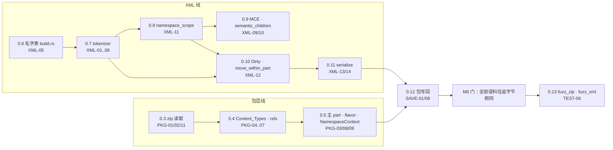
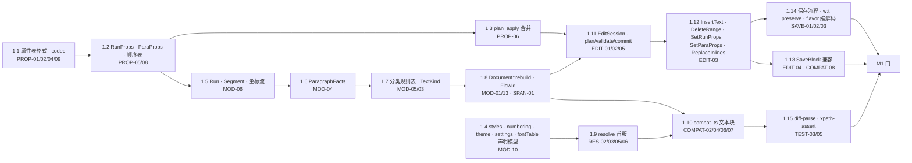

# 开发计划 v1：M0 / M1 执行方案

> 日期：2026-09-04。基线：`docs/03` v3.2（冻结）、`spec/12-m0-m1-plan.md` 的任务分解。本文不改任务定义，只给出：环境核查结果、`spec/12` 四条风险提示的结论、仓库布局、执行顺序与并行组、CI 门、待决事项。
> 本文随实现推进更新；任务状态用复选框维护。

---

## 0. 结论先行

1. **tokenizer 自写**，不用 `quick-xml`（§2.1）。`XML-03/04/13` 需要属性名与属性值的字节区间、引号风格、原始限定名，`quick-xml` 不公开这些区间（`IterState` 是 `pub(crate)`），用它等于再写一遍标签扫描。
2. **zip 用 `zip` 8.6**，`default-features = false` + `deflate-flate2-zlib-rs`（§2.2）。`raw_copy_file`、`extra_data_fields`、`header_start`/`data_start` 都在，够 `PKG-01`/`SAVE-06`。`0x7075` 中和按 spec 自己做，不依赖库行为。
3. **单 lib crate `rsword`** + 独立工具 crate（§3）。模块目录与 `docs/03` §2 一一对应，测试函数名引用 spec ID。
4. **任务 0.1、0.2 已完成**（§4.1）：语料导出工具 `tools/export-golden/` 建成并运行（573 个合成文档、162 份 `SaveBlock[]` 记录、16 个恶意输入），crate 骨架、`Diagnostic`/`ValidationOrigin`/`Error`、CI、语料目录就位，`cargo fmt/clippy/test` 全绿。
5. **下一步编码**：任务 0.3（zip 读取）与 0.6 → 0.7（名字表 → tokenizer）两条线并行；汇合于 0.11/0.12 的往返门。

---

## 1. 环境核查（2026-09-04 实测）

| 项 | 结果 | 影响 |
| --- | --- | --- |
| Rust | `rustc 1.98.0` / `cargo 1.98.0`，stable，aarch64-apple-darwin | 满足 `zip` 8.6 的 MSRV 1.88；workspace `rust-version = "1.88"` |
| rustfmt / clippy | 原本**未安装**，本次 `rustup component add rustfmt clippy` 已装 | CI 三件套可本地跑 |
| nightly / cargo-fuzz | **无** | 任务 0.13 前需 `rustup toolchain install nightly && cargo install cargo-fuzz`；不阻塞 0.3–0.12 |
| crates.io | 可达；`zip 8.6.0`、`quick-xml 0.41.0`、`roxmltree 0.21.1`、`memchr`、`thiserror`、`serde(_json)` 已在本地缓存 | 离线也能建 M0 |
| genoffice | `~/code/genoffice`，HEAD = `f105f36`（与 `docs/03` 基线一致）。**工作树有 31 处已暂存未提交的改动**（`apps/docs` AI 功能、`packages/docx-engine/src/generate.ts`、`tests/nested-table-edit.test.ts`） | 导出的 `expected.json` 反映的是 f105f36 + 这些改动；`manifest.jsonl` 首行记录 `genoffice_dirty_files`。见 §8 |
| docx-engine 测试 | **87** 个测试文件（`docs/03` §11 写的 77 已增长）；`buildDocx` 608 次、`buildKitchenSinkDocx` 13 次、`saveDocx` 188 次（44 个文件）；全套 16 秒 | 语料规模上限；实际落盘按字节去重 |
| 运行方式 | npm workspaces（不是 pnpm；`pnpm exec` 会因 `@genoffice/pptx-engine` 不在 registry 而失败）；vitest 4.1.10 在仓库根 `node_modules/.bin/vitest`；Node 24.15 | `tools/export-golden/run.sh` 直接调用根 vitest |

---

## 2. `spec/12` 风险提示的结论

### 2.1 风险 1：`quick-xml` 能否满足 `XML-03`

**结论：不满足，自写。** 逐项对照：

| 需求 | `quick-xml` 0.41 | 结果 |
| --- | --- | --- |
| 开标签 `[start, end)`、`lex.name` 原始限定名区间 | `buffer_position()` 只给事件结束位置；名字是 `&[u8]` 切片，无区间 | 需从事件字节反推 |
| 属性 `lex_name`、值区间、`quote` | `Attribute { key, value: Cow<[u8]> }`；带区间的 `Attr<Range>` 与 `IterState` 是 `pub(crate)` | **不可得** |
| 重复属性容忍（`XML-04`） | `Attributes::with_checks(false)` 可以 | 可 |
| 不 trim、不解实体（`XML-06/07`） | 配置可关 trim；默认不解实体 | 可 |
| 注释 / PI / CDATA 作 `Opaque` 原字节 | 事件有，区间需反推 | 需反推 |
| 迭代、100k 深度（`XML-08`） | 事件流天然迭代 | 可 |
| 序言 / 尾声区间（`XML-01`） | 需自己记录 | 需反推 |

"反推"就是在事件的原始字节上再扫一遍标签结构，等价于写 tokenizer 的一半。自写的范围是 OOXML 子集（无 DTD、无内部实体声明），预计 1.5k 行含测试。`roxmltree` 有 `range()` 但递归下降、解实体、不保留属性引号，同样不适用。

补充做法：把 `quick-xml` 作为 **dev-dependency 的差分 oracle**（同一 part 两边都跑，比较元素/属性/文本序列），给 tokenizer 加一道独立校验。可选，不进主依赖。

### 2.2 风险 2：`zip` crate 对 `0x7075` 与 `raw_copy_file`

**结论：可用，特征收窄。**

- `zip 8.6.0` 有 `ZipWriter::raw_copy_file(ZipFile)`、`raw_copy_file_rename`、`raw_copy_file_touch`；读侧有 `extra_data()`、`extra_data_fields()`、`header_start()`、`data_start()`、`compressed_size()`、`size()`。
- 默认特征拉入 aes / bzip2 / lzma / zstd / xz / ppmd / zopfli；docx 只用 Store 与 Deflate。已配置 `default-features = false, features = ["deflate-flate2-zlib-rs"]`（纯 Rust 的 zlib-rs），编译通过。
- `0x7075` 中和：不指望库忽略该字段。按 `PKG-01` 在交给库之前复制字节、扫 EOCD → central directory、把字段 id 改成 `0xFFFF`；zip64 不处理；保存返回原始字节（不变式 1 用原字节，不用中和副本）。
- **待 0.12 首个测试验证**：`raw_copy_file` 是否原样保留本地头 extra 字段与通用标志位。`SAVE-06` 已声明包级元数据不保证逐字节一致，所以即使不保留也不违反不变式 2，但要知道实际行为并写进测试注释。

### 2.3 风险 3：属性表生成器格式

`build.rs` + TOML（每张表一个文件 `schema/props/*.toml`，列与 `PROP-01` 一致）。不写通用 DSL；生成的 Rust 直接 `include!`。M1 任务 1.1。

### 2.4 风险 4：`compat_ts` 的 `docxIndex` 对齐

M1 任务 1.10 的**第一件事**就是 `COMPAT-04`（sdt 拆分与 `elements[]` 对齐），用导出语料里的 `sdt__*` 用例做首个断言；对齐失败则 `diff-parse` 全盘不可信。

---

## 3. 仓库与 crate 布局

```
rsWordParser/
  Cargo.toml                 # workspace：members = crates/rsword（M1 加 tools/diff-parse、tools/xpath-assert）
  rustfmt.toml
  .github/workflows/ci.yml   # fmt --check、clippy -D warnings、test；fuzz 作业留注释待 0.13
  crates/rsword/
    Cargo.toml               # zip、memchr、thiserror
    src/lib.rs               # 模块索引 + 规范映射表
    src/diag.rs              # Diagnostic / DiagCode / ValidationOrigin（00 §0.5）
    src/error.rs             # Error / NotOoxml / Result（PKG-02/03、XML-08、SAVE-02）
    src/package/             # L0  PKG-*   （PartId、limits、PartFlavor、PackageFlavor 已定义）
    src/xml/                 # L1  XML-*   （MAX_DEPTH、Dirty 已定义）
    src/span/  span/field/   # L2  SPAN-* / FLD-*
    src/semantic/            # L3  PROP-* / MOD-04,05
    src/model/               # L3  MOD-*
    src/resolve/             #     RES-*
    src/edit/                # L4  EDIT-*
    src/save/                #     SAVE-*
    src/bind/compat_ts/      #     COMPAT-*（M1 建，M9 删）
    tests/common/mod.rs      # 语料发现
    tests/corpus_layout.rs   # TEST-01；0.11 后追加 corpus_roundtrip.rs
  corpus/{synthetic,real,hostile}/
  fixtures/resolve/
  tools/export-golden/       # TEST-02 导出脚本（TS，运行在 genoffice 上，不改 genoffice）
  docs/  spec/
```

约定：

- **测试命名**：`<spec 前缀小写>_<序号>_<描述>`，如 `xml_12_dirty_propagation`、`pkg_06_path_escapes_root`。每条 spec 的"验收"小节至少对应一个同名前缀的测试。
- **诊断代码**：只在 `diag::DiagCode` 追加，`as_str()` 用 spec 的大写下划线写法；新增代码同时补进对应 spec 的文本。
- **lints**：`unsafe_code = "forbid"`；clippy `all` warn，CI 下 `-D warnings`。`cast_possible_truncation` 关闭（`u32` 偏移与 `usize` 互转是常态）。
- **提交粒度**：一个任务编号一个或几个提交，提交信息带任务号与 spec ID（`m0.7: xml tokenizer (XML-01..08)`）。

---

## 4. M0 执行方案

目标（`spec/12`）：任意语料 `parse → serialize` 字节相同（含 Strict）；tokenizer 与 zip 层过模糊测试。

### 4.1 已完成

- [x] **0.1 语料导出**：`tools/export-golden/`（§6.1）。首批产物（genoffice `f105f36` + 31 处未提交改动）：
  - `corpus/synthetic/`：573 个 docx + 573 个 `.expected.json`（0 个解析失败），来自 79 个测试文件的 740 次构造调用（167 次按字节去重）；162 份 `.save.<k>.json`（193 次 `saveDocx` 中 31 次的源文档不是经 `buildDocx` 构造的，只记 manifest）；含 `extra__strict-minimal`、`extra__mixed-flavor`。7.8 MB。
  - `corpus/hostile/`：TEST-09 全部 16 项 + `manifest.json`（每项期望）。1.1 MB。
- [x] **0.2 crate 骨架与错误类型**：`rsword` 编译、`cargo test` 5 个测试通过、clippy 零警告。
- [x] **0.6 名字表**（887eafc）：54 个命名空间、913 个局部名，`build.rs` 生成 `NsId`/`LocalName`。
- [x] **0.7 tokenizer + DOM + Clean 序列化**（ca396fa）：语料 589 个文档 3093 个 XML part 全部 `parse → serialize` 字节相同（UTF-16 part 按转码后字节比对）。
- [x] **0.3 zip 读取**（43e90c1）：0x7075 中和、三项限额；`zip` crate 确认会按 0x7075 改名，中和是必需的。
- [x] **0.4 路径 / 内容类型 / 关系**（7304d1a）。
- [x] **0.5 Package / 主 part / flavor / NamespaceContext**（5b4ea54）。
- [x] **0.8 + 0.9 作用域 / MCE / 语义遍历**（43f8681）。
- [x] **0.10 + 0.11 变更原语 / 脏规则 / 前缀生成序列化**（0bd5f29）。
- [x] **0.12 包写回**（7b435ed）：无编辑保存对全部语料字节相同；改一个 `w:t` 后其他条目 CRC 与压缩字节不变。
- [x] **0.13 fuzz**（727dc29、9c82f48）：`fuzz_xml` 首轮几秒内发现实体片段切进多字节字符的 panic，修复后 10 分钟 4369 万次无崩溃；`fuzz_zip` 10 分钟 1352 万次无崩溃。CI 侧放在 `.github/workflows/fuzz.yml`（手动 / 每周）。

**M0 门全部通过（2026-09-04）。**

### 4.2 待做任务与依赖



两条线可由两人并行，或一人先走 XML 线（更长、更关键）再补包层。0.4 的 `.rels` 与 `[Content_Types].xml` 解析依赖 0.7 的 tokenizer（它们也是 XML part，保存时走同一 DOM 机制），所以单人顺序建议：0.6 → 0.7 → 0.3 → 0.4 → 0.5 → 0.8 → 0.9 → 0.10 → 0.11 → 0.12 → 0.13。

| # | 任务 | 产出（文件） | 关键测试（名字 → 规范验收） | 备注 |
| --- | --- | --- | --- | --- |
| 0.3 | zip 读取 | `package/zip.rs`：`neutralize_unicode_path(&[u8]) -> Vec<u8>`、`check_limits(central_dir)`、`ZipEntryRef`（条目序号、名字、压缩方法、原字节区间） | `pkg_01_unicode_path_shadow`（`corpus/hostile/zip-unicode-path-shadow.docx` 正文为 RIGHT）、`pkg_02_*` 三个限额用例命中三种 `DiagCode` | 限额**在解压前**按 central directory 判定；保留原始字节 `Arc<[u8]>` 供保存 |
| 0.4 | 内容类型、关系、路径 | `package/content_types.rs`、`package/rels.rs`、`package/uri.rs`：`resolve(base, target)` 唯一路径函数、`RelType` 双族 | `pkg_04_bin_override_is_image`、`pkg_05_external_not_normalized`、`pkg_06_three_spellings_same_part`、`pkg_06_escape_root`（`hostile/rels-escape-root`）、`pkg_07_strict_rel_types` | 用 0.7 的 tokenizer 解析 |
| 0.5 | 主 part、flavor、`NamespaceContext` | `package/mod.rs`：`Package::open(bytes)`、`Part`、`PackageFlavor` 判定、`NamespaceContext` | `pkg_03_trial_xml_main_part`、`pkg_03_odt_rejected`、`pkg_08_{transitional,strict,mixed}`（`extra__strict-minimal`、`extra__mixed-flavor`）、`pkg_11_unbalanced_header_is_opaque` | `Part.dom` 惰性；非主 part 解析失败 → `Opaque` + `PkgOpaquePart` |
| 0.6 | 名字表 | `schema/names.toml` → `build.rs` → `xml/names.rs`：`NsId`（含 `Xml`/`Xmlns`/`None`/`Unbound`/`Other`）、`LocalName`、URI ↔ `NsId` 双族映射、规范前缀表 | `xml_05_strict_and_transitional_same_nsid`、名字表覆盖检查（脚本扫 `docs/01` 中出现的全部限定名） | 先只收 `docs/01` 出现过的名字；未收录落 `Other(Interned)` |
| 0.7 | tokenizer → DOM | `xml/lex.rs`（`Lex`）、`xml/tokenizer.rs`、`xml/dom.rs`（`Dom`、`Node`、`Attr`、arena、prolog/epilog、`transcoded`） | `xml_01_bom_and_utf16`（`hostile/encoding-utf16-part`）、`xml_03_lex_invariants_on_corpus`（每个 part：子区间有序不重叠，`serialize(Clean) == src`）、`xml_04_quotes_gt_dup_attrs`、`xml_06_entities_decode_once`、`xml_08_deep_{smarttag,table}`、`xml_08_unbalanced_main_is_err` | 迭代解析（显式栈）；文本不 trim；实体按需解码；属性值区间指向引号内 |
| 0.8 | 命名空间作用域 | `xml/ns.rs`：`namespace_scope`、`namespace_compatible`、`required_decls`（带子树失效的缓存） | `xml_11_scope_shadowing`、`xml_11_compatible_when_same_uri`、`xml_11_required_decls` | 前缀解析在 0.7 建树时按作用域做（`QName` 需要它），核心函数与 0.7 同期写 |
| 0.9 | MCE | `xml/mce.rs`：`Mce`、`Ignorable`/`AlternateContent`/`ProcessContent`/`MustUnderstand`、`semantic_children` | `xml_09_choice_selected`、`xml_09_fallback_selected`、`xml_09_process_content_flattened`、`xml_09_ignorable_hidden_but_preserved`、`xml_10_semantic_children_skips_deleted` | 已理解集合 `wps wpg wp14 w14 w15 cx` 来自 `PKG-09`，可配置；语料 `mce-namespace__*`、`part-namespaces__*` |
| 0.10 | 脏状态 | `xml/dirty.rs`：传播（规则 A–D）、`move_within_part`（规则 E）、`Clean` 克隆（规则 F）；`Dirty` 枚举已在 `xml/mod.rs` | `xml_12_dirty_propagation`、`xml_12_move_adds_xmlns_when_incompatible`、`xml_12_move_keeps_clean_when_compatible`、`xml_12_clone_shares_lex` | `rehome_subtree`（规则 E′）到 M5/M7 再做，M0 只留签名 |
| 0.11 | 序列化 | `save/serialize.rs`：五态分派、`write_open_tag` 复用 `lex_name`、`XML-14` 子树根声明 | `xml_13_clean_roundtrip_all_corpus`（M0 门主体）、`xml_13_selfdirty_keeps_attr_order_and_quotes`、`xml_13_descendant_dirty_keeps_open_tag_bytes`、`xml_14_new_subtree_declares_prefix` | 接到 `tests/corpus_roundtrip.rs`，遍历 `synthetic` + `hostile` 中可解析者 |
| 0.12 | 包写回 | `save/package_writer.rs`：`raw_copy_file` 拷未变条目、顺序不变、无脏短路返回原字节 | `save_01_no_edit_returns_original_bytes`、`save_06_untouched_entries_keep_crc_and_compressed_bytes`（人为把一个 part 标脏） | 顺带验证 §2.2 的"待验证"项 |
| 0.13 | 模糊 | `fuzz/fuzz_targets/{fuzz_zip,fuzz_xml}.rs` | 各 10 分钟无 panic；`fuzz_xml` 成功即 `serialize == input` | 需 nightly + cargo-fuzz；CI 作业取消注释 |

### 4.3 M0 门（`TEST-10`）

- `cargo test` 中 `xml_13_clean_roundtrip_all_corpus` 与 `save_01_no_edit_returns_original_bytes` 对**全部** `corpus/synthetic`（573）与 `corpus/hostile` 中应成功解析的文件通过（含 `extra__strict-minimal`、`extra__mixed-flavor`、`zip-unicode-path-shadow`、`field-unclosed`、`span-orphan-end`、`rels-missing-target`）。
- `xml-unbalanced-main` → `Err(Malformed)`；`xml-unbalanced-header` → 成功且 header `Opaque`；三个 zip 限额用例命中对应 `DiagCode`；`content-types-missing` 解析继续并记 `PkgNoContentTypes`。
- `fuzz_zip`/`fuzz_xml` 各 10 分钟无崩溃。

---

## 5. M1 执行方案

目标：文本段落（paragraph / heading / listItem）的 `compat_ts` JSON 与 TS 一致；改一段文字后保存满足不变式 2；Strict 文档改字后仍为 Strict。



并行组：

- **组 P（属性表）**：1.1 → 1.2 → 1.3。独立性最高，M0 0.7 出 DOM 后即可开工。
- **组 D（声明模型）**：1.4，只依赖 DOM。
- **组 M（模型）**：1.5 → 1.6 → 1.7 → 1.8，依赖 1.2 的 `RunProps`/`ParaProps` 读取。
- **组 E（编辑）**：1.11 → 1.12 → 1.13 → 1.14，依赖 1.3 与 1.8。
- **组 C（兼容与工具）**：1.9 → 1.10 → 1.15，依赖 1.4、1.8。

关键提醒：

- 1.10 从 `COMPAT-04`（`docxIndex`/`elements` 对齐）开始（§2.4）。
- 1.12 的 `DeleteRange` 遇到范围标记时"标记不动"并记 `EngineInvariantViolation`（`spec/12` 已规定），M2 再做 Anchor 变换。
- 1.9 的 toggle 用占位规则并在代码中标 `RES-04 placeholder`；5.8 把它换成 `resolve::toggle` 里参数化的 `resolve_toggle`，fixture 集已建齐（观察值待填，见 `fixtures/resolve/README.md`）。
- 1.13 的输入直接来自 `corpus/synthetic/*.save.<k>.json`（`blocks` + `options`），期望是其中的 `documentXml`，用 1.15 的 `xpath-assert` 做等价比较。
- `KNOWN_DIFFS.md` 放在 `crates/rsword/src/bind/compat_ts/`，第一批预期条目：`rawRPr` 引号/自闭合差异、Strict 文档的 `internal.documentXml`（TS 装载时归一化为 Transitional，本引擎不归一化）、`image.wrap/offset` 的碰撞位移。

### 5.1 已完成

- [x] **1.1 属性表格式、生成器与 codec**：`schema/props/{types,run}.toml`（格式说明在 `schema/props/README.md`）+ `build/props.rs`（`toml`/`serde` 只作 build 依赖）。生成 `RunProps` / `RunPropsPatch` / `RunPropsField`、`read_* / read_*_change / diff_* / emit_* / order_index_*`、`FieldInfo` / `TableInfo`；手写 11 个 codec（`OnOff` 三态、四种度量、颜色、Hex2、百分比、整数、原文），解析失败一律 `Val::Raw` 保值 + `PROP_BAD_VALUE`。`RunProps` 表作为生成器的驱动用例一并落地（1.2 只需补 `ParaProps` 与子表）。验收：PROP-02 / 04 / 09 清单行全部有测试；语料 585 个文档 2072 个 `w:rPr` read → emit → read 建模字段全等、0 个 `PROP_BAD_VALUE`。`PROP-05` 的 rPr 顺序表与语料对照：2053/2072 单调，19 处例外（`rtl` 在 `b/bCs/iCs` 前、`szCs` 在 `sz/spacing` 前、`u` 在 `caps/smallCaps` 前）来自 TS 测试构造的 XML，顺序表不改。

- [x] **1.2 `ParaProps`、段落标记 rPr、子表与顺序表**：`schema/props/para.toml`（`ParaProps` + 子表 `NumPr` / `ParaBorders` / `Tabs`），`types.toml` 增 11 个枚举（含 `ST_Border` 全部 192 个字面）与 `Border` / `Spacing` / `Indent` / `FramePr` / `Tab` 结构体。生成器的三条新路径（嵌套表 → `TableChange<T, TPatch>`；`multi` → `Vec<T>` 整表替换；`legacy` 拼写 `w:start|w:left` 按 flavor 生成）都有测试。验收：PROP-04（`keepNext w:val="0"` → `Some(false)`）、PROP-02（`w:ind w:left="1in"` → 1440，Strict 写 `w:start`）、PROP-09（`w:jc w:val="weird"` 原文写回）；PROP-07 每行往返：样本覆盖 `ParaProps` 全部非 Raw 字段，两种 flavor 下 emit → read 全等且子元素顺序单调。语料：1514 个 `w:pPr` 往返全等、0 个 `PROP_BAD_VALUE`，1509 个顺序单调（5 处例外同样来自 TS 构造 XML）。

- [x] **1.3 `plan_apply_*` 合并算法**：`xml::plan` 新增 `NodeEdit`（`Insert` / `InsertClone` / `Replace` / `ReplaceClone` / `Delete`，以兄弟节点而非下标定位）、`Target::New(k)`（指向同一计划里第 k 条编辑创建的节点）与 `Dom::apply_edits`（机械执行，只调 `xml::edit` 原语）。生成的 `plan_apply_*` 先把 patch 施加到当前值再 `diff`，所以 `Set` 同值天然是空计划、嵌套 `TableChange::Set` 在已有容器上按 diff 局部合并；缺容器时新容器插为父节点第一个语义子节点之前，`Raw` 字段随后以 `InsertClone` 挂到 `Target::New`。验收：PROP-05（`w:spacing` 插在 `w:jc` 前、`w:b` 插在 `w:sz` 前、没有更大序号时插在 `*PrChange` 前）、PROP-06（改 `w:color` 后 `w:bdr` 原字节与位置不变、`rPr` 开标签 `<w:rPr  w:x='1' >` 原样、容器为 `DescendantDirty`）、PROP-07（两张表全部非 Raw 字段：Set 同值空计划，Set 新值 commit 后读回新值，两种 flavor）。

- [x] **1.4 声明模型**：styles / numbering / settings / fontTable 直接用属性表描述（`schema/props/{styles,numbering,settings,font_table}.toml`，17 张表；生成器为此增加**容器属性**列 `attrs`——`w:lvl/@ilvl`、`w:style/@styleId` 一类——与 `NodeEdit::SetAttr / RemoveAttr`），theme 手写（`model/theme.rs`：字体方案含 `a:font script→typeface` 表、颜色方案 12 槽、内建 Office 调色板 `OFFICE_DEFAULT_COLORS`）。`model/decl.rs` 加查找辅助（`Styles::get / default_for / own_heading_level`、`Numbering::num / abstract_num`、`Settings::compat_facts`、`FontTable::get`）。语料：585 个文档的五种 part 解析无 panic、1 个 `PROP_BAD_VALUE`（`w:numFmt="lowerGreek"`，非 schema 值，按原文保留）；与 TS `.expected.json` 对照 20 类字段共 2 万余次比较，0 个未登记差异（第一条 `KNOWN_DIFFS` 见 `src/bind/compat_ts/KNOWN_DIFFS.md`：未声明前缀的 `mc:Choice Requires`，本引擎按规范走 Fallback）。

- [x] **1.5 `Run` / `Segment` / 坐标流**（`model/inline.rs`、`model/build.rs`）：`Run` 与物理 `w:r` 一一对应，`segments` 覆盖全部子节点并给出 UTF-16 长度；坐标流贡献按 `MOD-06` 表（`w:t` 按有效 `xml:space` 决定是否 trim——**沿祖先继承**，语料里有根元素声明 `preserve` 的文档）；`w:sym` 先按 `U+F000 + (code & 0xFF)` 退路（映射表在 M2）；`Inline::Atom(Math)`、裸 `w:br` 占位；超链接（`r:id` → 关系外部目标 / `w:anchor`）、`w:ins/del/moveFrom/moveTo` 修订上下文、`rPrChange` 旧值、`w:sdt/smartTag/customXml/fldSimple/dir/bdo` 透明；内联容器嵌套 > 64 层局部降级为 `Atom(Other)` + `MOD_TOO_DEEP`（hostile 语料触发过栈溢出）。
- [x] **1.6 `ParagraphFacts`**（`model/facts.rs`）：一次遍历得到文本 / sectPr / 样式 / 编号 / outline / 公式 / 修订事实，外加绘图（按 `graphicData/@uri` 判种类、`wp:anchor`、blip、文本框文字、ink）与 VML（imagedata / textbox / textpath / hr / shapetype-only / hidden）粗事实；字段事实留空到 M2。`Styles::chain` 给 basedOn 链（类型一致、防环）。
- [x] **1.7 分类规则表**（`model/classify.rs`）：R01–R07 为 `classify_body_child`，R08–R19 为可单测的规则函数表 `PARA_RULES`，`text_kind` 按 `MOD-03`（ListRef > Heading > Paragraph；直接 `outlineLvl 9` 不看样式；样式 `numId 0` 取消继承）。R12 的 ChartEx-Fallback-图 → Image 留到 M3。
- [x] **1.8 `Document::rebuild` 与 `FlowId`**（`model/build.rs`、`span/mod.rs`）：`FlowMap::build` 一次前序遍历给每个元素分配流；`Document::rebuild(&mut Package)` 读五种辅助 part（关系优先、路径退路）并构建正文块（sdt 递归附 `SdtInfo`、修订包裹附 `Revision`、`w:customXml`/`w:smartTag` 块级透明）。语料：585 个文档 rebuild 幂等，1360 个块（624 文本 / 71 表格占位 / 46 图片 / 619 保护）；与 TS 对照：445 个文本段落的类型 / 级别 / 编号 / styleId 全部一致，387 个无字段等特殊段的段落坐标流文本一致（1 条临时 `KNOWN_DIFFS`：符号字体解码在 M2）。

- [x] **1.9 `resolve` 首版**（`resolve/{mod,fonts,color}.rs`）：`Resolver::new(&Document)`；`RES-02` 链（`Styles::chain`，类型一致、防环）、`w:link` 双向补缺、`heading_level`、`is_linked_char_shell`；`RES-03` run 层叠 docDefaults → 段落样式链 → 字符样式链（含 linked 补缺层）→ 直接，每字段 `Provenance`（生成器为此加 `merge_*`：标量整字段、struct 逐属性、嵌套表递归、multi 整表）；`RES-04` 占位规则单独列为 `TOGGLE_FIELDS` + 注释，暂与非 toggle 同（最具体声明胜出）；`RES-05` 主题字体（主题属性覆盖同槽字面值、空 EA 槽按 `themeFontLang` 查 script 表 → ja/ko 实测缺省 → DengXian，docDefaults 的 `w:lang/@eastAsia` 回填）与颜色（槽位映射、dk1/lt1 缺省、shade 后 tint、无 theme part 用内建调色板）；`RES-06` `cs` = 直接 rtl ?? 字符链 ?? 段落链 ?? false，`bold()/italic()/size()` 无交叉回退；`RES-07` 段落层叠含编号级别 `ind`（段落自身无 `ind` 时），`RES-09` 级别查找（override 整级、`numStyleLink → 样式.numPr → abstractNum` 防环）。语料：573 个文档 2897 个样式，与 TS `StyleDisplay` 17 个 run 字段 + 16 个段落字段共 86,465 次比较、`headingLevel` 2326 次、`linkedCharShell` 2897 次、`docDefaults` 216 次，0 差异（修了一处：重复 `styleId` 取最后声明）。

- [x] **1.10 `compat_ts` 文本块**（`bind/compat_ts/{mod,blocks,decl,utf16,diff}.rs`）：`parsed_doc(&mut Package) -> serde_json::Value` 产出整份 TS `ParsedDoc`（含 `extras`）。`COMPAT-04`：body 顶层元素序列、`splitSdtParts` 的多段 sdt 拆分（首块从 sdt 开头、末块到 sdt 结尾、`sdtShell.group`）、单段 sdt 的 `sdtShell`、TS `INVISIBLE_BODY_MARKERS`、`w:ins/w:del` 包裹的 `blockRevision`；`COMPAT-06`：`Utf16Index`（每 4 KiB 一个字符边界标记）给 `internal.bodyInner*` 与 `extras.elements`；`COMPAT-07`：`buildRun` 全部字段（`rawRPr` 用原字节、`cs`/`vanish` 的样式继承、`themedRFonts` 与 `themeRFonts`、`rPrChange.old`）与 `mergeRuns` 的 `sameStyle`；`COMPAT-02`：`ParaFormat`（`extractParaFormat` + 空段度量 + `ptab` 制表位 + 样式 `autoSpace` 补齐 + 重复 `w:pBdr`）、`StyleInfo`（含 `numPr`、`linkedCharShell`、`headingStyleIds`、`listParagraphStyleId`）、`docDefaults`（空对象不输出）、`NumberingDef`（`numStyleLink` 合并、`lvlOverride`）、`themeFonts/themeColors`、保护与 settings 杂项、`fontTable`。为此 `ParaProps` 加 `suppressAutoHyphens`，`ParagraphFacts` 加 `unvanish` / `has_range_marker` 并让无 pStyle 的段落按默认段落样式判隐藏。`COMPAT-09` 容忍差分 `diff_json` + 路径模式 `KNOWN_PATHS`。语料：573 份里 193 份"文本段落"用例整份 JSON 差异为 0（5 处已知：`tableDisplay`、`charIndents`；整份放行 5 类文档，见 `KNOWN_DIFFS.md`）。

- [x] **1.15 `diff-parse` / `xpath-assert`**（`tools/`，workspace 成员）：`diff-parse` 对 `corpus/synthetic` 跑 `compat_ts` 并按 `COMPAT-09` 差分，按去下标路径聚合计数与首例，`--scope text|all`、`--doc`、`--json`，有未知差异退出码 1；已知差异清单改为 `KNOWN_DIFFS.md` 里的 ```known-diffs 围栏块（`<文档 glob> <路径 glob>`），`include_str!` 编进库，`tests/compat.rs` 与工具共用同一份（`compat_ts::{known_diffs, is_text_case, split_known, Report}`）。`xpath-assert` 基于新增的 `xml::xpath` 子集求值器（`count/string/normalize-space`、`/` `//` 步、`@attr`、`text()`、`[n]/[last()]/[@a='v']/[w:pPr/w:numPr]/[w:t='x']`，前缀表 = 规范前缀，按 `QName` 匹配所以 Strict / Transitional 同一表达式），可对单个 part 求值或 `--compare` 两份文件的一组 XPath（`COMPAT-08` 等价比较用）。CI 增加 `cargo run -p diff-parse -- --scope text`（M1 门第一条）。当前 `--scope text`：223 份 0 未知差异；`--scope all`：341 份有差异（表格 / 图片 / 字段 / 页眉页脚等后续里程碑）。

- [x] **1.14（第一批）保存校验与 flavor**（`save/validate.rs`）：`validate_part` 做 `SAVE-02` 的 M1 子集——`New`/`SelfDirty` 节点的未绑定前缀、属性容器里新子元素的 `PROP-05` 序号（前后已知序号夹逼，`Clean` 子树不报）；`ensure_extension_declarations` 把新节点用到的 `w14/w15/w16*/wp14` 声明到 part 根并补进 `mc:Ignorable`（缺 `mc` 时一并声明，`XML-14` 允许改根的唯一情形）；`enforce` 在调试构建 / CI 下把 `EngineInvariantViolation` 变成 `Err(SAVE_INVARIANT)`，发布构建记诊断。`Package::save` 接入：校验 → 补声明 → 序列化 → 写回。`SAVE-03` 补一条：文本子节点变了而 `w:t` 只是 `DescendantDirty` 时也重建开标签补 `xml:space="preserve"`。测试 `tests/save_validate.rs`：`extra__strict-minimal` 改字 + 关闭加粗后保存，根命名空间仍为 Strict、`w:b w:val="false"`、改过的 `w:t` 带 preserve、其他 run 原字节原样（M1 门第三条）；绕过 `plan_apply` 的乱序 `w:b` 在调试构建下让 `save` 失败。

- [x] **1.11 `EditSession` / `InlinePos` / `MutationPlan`**（`edit/{mod,pos,plan,session}.rs`）：`EditSession::open(bytes)` 持有 `Package`（规范状态）与 `Document`（投影），`apply(op, ctx)` / `apply_all(ops, ctx)` / `save()`；`EDIT-02` 的 `InlinePos { para, offset: Utf16Offset }` 与 `locate` → `Loc::{Boundary, InRun, InText}`（代理对中间 → `EDIT_SPLIT_SURROGATE`，越界 / 非文本段落 → `EDIT_BAD_POSITION`）；`EDIT-05` 的 `MutationPlan { part, node_edits, affected_paragraphs, structure_changed, diagnostics, offset_delta }`，`validate(&Dom)` 只读检查每条 `NodeEdit` 的目标（存在、未删除、类型、`before` 是父的子节点、`Target::New(k)` 指向前面的创建、`Move` 不进自己子树），`commit(&mut Dom)` 只调 `Dom::apply_edits`，之后 `Document::refresh_paragraphs` 局部重建（块增删移则整体 `rebuild`）。事务：`apply` 前克隆主 part DOM 作快照，操作内部可分多个 plan/commit 阶段，任一阶段 `Err` → 恢复快照并重建投影。`xml::plan` 新增 `NodeEdit::SetText` / `NodeEdit::Move`、`NewElement::from_dom`（跨 DOM 重新 intern）；`xml::fragment::parse_fragment` 把 XML 片段（`rawPPr` / `rawRPr` / OMML …）解析为 `NewElement`。新诊断 `EDIT_BAD_POSITION / EDIT_CROSS_PARAGRAPH / EDIT_BAD_TEXT / EDIT_ANCHOR_UNMOVED / EDIT_PLAN_INVALID / EDIT_UNSUPPORTED`，错误 `Error::Edit { code, message }`。测试 `tests/edit.rs`：`edit_02_*`（😀 中间 → Err、原子前后差 1）、`edit_05_*`（三步批操作第三步越界 → 无脏节点、投影相等、保存返回原字节；单操作内部多阶段失败同样回滚）。
- [x] **1.12 内联操作**（`edit/{ops,inline}.rs`）：`InsertText`（`props == None` 且紧邻 / 落在 `Text` 段 → `SetText` 该 `w:t` 文本节点，只有它变脏；否则边界插入 `New` run，`rPr` 为左侧 run 的字节克隆或 `default_run_props`，再按 `PROP-06` 合并 `props`；段中间先 `split_run`；`\t \n \r \v \f` 折回 `w:tab / w:br / w:cr`，XML 非法字符剔除记 `EDIT_BAD_TEXT`）、`DeleteRange`（同段：部分覆盖的文本段截断、整段 / 整 run / 原子 `Deleted`；字段结构段（`fldChar / instrText / commentReference …`）与范围标记原地保留并记 `EDIT_ANCHOR_UNMOVED`；跨段 → `EDIT_CROSS_PARAGRAPH`）、`SetRunProps`（先在 `to`、再在 `from` 处拆 run——右半 `New`、`rPr` 字节克隆、其后的段克隆并删原节点；范围内非零宽 run 各自 `plan_apply_run_props`）、`SetParaProps`（`plan_apply_para_props`）、`ReplaceInlines`（内容子节点全 `Deleted`，`NewInline::{Run, Hyperlink, Ins, Del, Marker, Xml}` 生成 `New`，修订 `w:id` 缺省按 `EDIT-06` 取文档最大值 + 1）；另有 compat 路径用的 `ReplaceParaProps`（整个 `pPr` 换成片段）与块级 `InsertBlock / DeleteBlock / MoveBlock`（`BlockPos::End(body)` 落在尾部 `sectPr` 之前）。测试 `tests/edit.rs`：干净 run 中间插字 → 只有该 `w:t` 子树变脏、`w:p` `DescendantDirty`、其他 zip 条目 CRC 与字节相同、其他块 `originalXml` 原样（M1 门第二条）；带 props 与控制字符的插入拆 run 并继承 `rPr`；删除截断 / 整 run / 原子并保留书签；REF 结果删除后字段结构仍在；`SetRunProps` 拆出的 run 与未覆盖 run 的原字节；`SetParaProps` 新建 `pPr` 与按序插入；`ReplaceInlines` 不动 `pPr`。
- [x] **1.13 `SaveBlock[]` 兼容映射**（`bind/compat_ts/save_blocks.rs`，`xml/canon.rs`）：`apply_save_blocks(session, finalBlocks, options)` 按 `EDIT-04` 翻译 TS `saveDocx` 的输入——`docxIndex → 节点` 走与 `parsed_doc` 同一套枚举（`blocks::element_nodes`，多段 sdt 拆成每段）；TS `isUnchanged`（全 original 顺序不变、无选项、文档无 `removePersonalInformation`）→ 无操作；两个 present original 之间的 generated / xml 与其间缺失的 original 按序配对：generated 配到 `w:p`（或单段 sdt 里的 `w:p`）→ `ReplaceParaProps`（`rawPPr` 与现有 `pPr` 原字节相同则不动；否则 `rawPPr` 片段或按 `type/level/list/format` 重建——`headingStyleIds` / `listParagraphStyleId` 取自 `parsed_doc`，`formatPPrChildren` 全部字段含 `pBdr / shd / bidi / spacing / ind / jc（bidi 左右互换）/ tabs / framePr / dropCap / 段落标记 rPr`）+ `ReplaceInlines`；多余的 generated → `InsertBlock{Paragraph}` 插在下一个 original 之前（sdt 首段前 → 整个 sdt 之前，末尾 → 尾部 `sectPr` 之前）；`xml` → 每个顶层元素一个 `InsertBlock{Xml}`（带 `docxIndex` 先插后删）；块级 `revision` → `NewBlock::Wrapped`（`w:ins/w:del`，缺 id 按 `EDIT-06`）；缺失的 original → `DeleteBlock`；全 original 的重排 → `MoveBlock`。`runs` 按 TS `runsXml`：`commentIds` 首末 run 处重发批注范围标记与引用、同 `href` 连续 run 合成 `w:hyperlink`（`#anchor` / 已有 `rId`；新外链需 rId 分配 → M2）、`ins/del` 分组包裹、`math.omml` / `ruby.xml` / `image.xml` 走 `parse_fragment`、`noteRef` 生成引用 run；`rawRPr` 按 `mergeRPrModel` 分组比较（rStyle / rFonts（含 `mergeRFontsXml` 的槽合并与 theme 属性去除）/ bold / italic / strike / color / size / highlight / shading / underline / vertAlign / rtl，rtl 时比较 Cs 孪生），相等的组保留原值、不等的组重建，未建模子元素按 `order_index_run_props` 原位保留（`rPrChange` 由模型接管）；无 `rawRPr` → `modelRPrChildren`。`bookmarkIdOf` 的 31 进制哈希照抄。字段类 run（`refField / instrField / xeTerm / fldBeginXml`）、`rPrChange`、`chart / image` 块、`replaceImage`、所有 `SaveOptions` → `Err(EDIT_UNSUPPORTED)`（后续里程碑）。等价比较不用逐条 XPath 而用 `xml::canon::canonical`：`{uri}local` 名字（Strict / Transitional 同 URI、未绑定的规范前缀按其命名空间）、属性排序、忽略 `xmlns:*`、元素间空白丢弃、文本容器逐字——两树规范化文本相同 ⇔ 任何 XPath 子集表达式结果相同。测试 `tests/save_blocks.rs` 跑全部 162 份 `*.save.<k>.json`：72 份与 TS 输出等价（其中 40 份 `isUnchanged` 返回原字节），3 份已知差异（修订 `w:id` 分配：`EDIT-06` 最大值 + 1 vs TS 的 `0` / `9001`），87 份因 `SaveOptions` / 图表 / 图片 / 字段 / 新链接关系 / `removePersonalInformation` 跳过并列出原因；比较时忽略 `w:p` 上的 `w14:paraId` / `w:rsid*`（我们复用原段落节点）与 `xml:space`（`SAVE-03` 对 New `w:t` 一律写）。
- [x] **1.14（第二批）`save(session, opts)` 编排与保存选项**（`save/options.rs`、`edit/session.rs`）：`EditSession::save_with(&SaveOptions)` 按 `SAVE-01` 六步执行——① 无脏节点、`opts` 无强制请求、文档也没有 `w:removePersonalInformation` 标志 → 返回原字节（不变式 1）；② 校验（`SAVE-02`，在 `Package::save` 内）；③ Span 物化（`SPAN-08`）在 M2，此处无操作；④ `apply_save_options`：全部选项先翻成各 part 的 `MutationPlan`、**先整批 `validate`（只读）再逐个 `commit`**，所以 `commit` 不可能失败、也不需要快照；⑤⑥ 序列化脏 part 与写回。`commit_plan` 放开到任意 XML part（投影只在主 part 上刷新）。`SaveOptions`（`SAVE-07`，与 TS 对齐的 M1 子集）：`saved_at` 改 `docProps/core.xml` 的 `dcterms:modified`（`.mmmZ` → `Z`）并把 `cp:revision` +1，缺标签不注入；`remove_personal_info` 写 `word/settings.xml` 的标志（走 `plan_apply_settings`，`PROP-05` 顺序与既有设置都不动）并按 TS `scrubPersonalMetadata` 清洗全包——除 `customXml/*` 与 `docProps/custom.xml` 外每个 XML part 的 `w:author`（含无前缀 `author`）→ `Author`、`w:initials` → `A`，`core.xml` 的 `dc:creator` / `cp:lastModifiedBy` 清空，`app.xml` 的 `Manager` / `Company` 清空，`word/people.xml` 的 `w15:person` 整条删除；`None` 时沿用文档标志（`EditSession::remove_personal_info_flag`）。`compat_ts::apply_save_blocks` 把 TS `SaveOptions` JSON 的这两项翻成 `SaveOptions` 随 `SaveBlocksOutcome` 返回（其余键仍 `EDIT_UNSUPPORTED`），语料等价用例因此从 72 升到 **77**（41 份逐字节相同），`write-protection__003/004/005/006` 与 `docprops__001.save.2` 全部通过。另加一项 TS 没有的能力 `remove_date_and_time`（OOXML `w:removeDateAndTime`）：删除批注与修订上的 `w:date`、写入同名标志、也认文档自带的标志，与 `remove_personal_info` 相互独立。事务同时补强：`Snapshot` 改成记录事务碰过的**每个** part 的写前镜像（`commit_plan` 第一次写某 part 时按需克隆），`apply` / `apply_all` / 保存选项共用 `transaction()`；投影刷新遇到不在正文顶层的段落（表格单元格）改为整体重建，不再留过期投影。测试 `tests/save_options.rs` 7 个用例：不变式 1 的短路（含"`saved_at` 单独设置不触发保存"）、`saved_at` 只改 `core.xml` 而 `styles.xml` 原压缩数据不变、`write-protection__004` 的全包清洗（document / comments / header / footer / footnotes / endnotes / glossary 都没有非 `Author` 的作者，`customXml` 与自定义属性不动，`w:date` 保留）、文档标志触发清洗与 `Some(false)` 删标志不清洗、把标志写进已有 `settings.xml`（`SAVE-07` 验收行）、`remove_date_and_time` 的三种入口（选项 / 文档标志 / 与作者清洗同开）与"只开作者清洗时日期保留"；`edit/session.rs` 单元测试 `edit_05_transaction_rolls_back_every_touched_part` 覆盖多 part 回滚。

### 5.2 M1 门（`TEST-10`）

- `diff-parse` 对 `corpus/synthetic` 中"文本段落"用例（paragraph / heading / listItem，无字段、表格、绘图）非已知差异为 0。
- `TEST-04` 单节点编辑：随机选一段 `InsertText`，其他 zip 条目 CRC 与压缩字节相同；`Clean` 节点 `lex` 字节都是输出子串。
- `extra__strict-minimal` 改字后根命名空间仍为 Strict，新写的 `ST_OnOff` 为 `true/false`。

三条都已有测试覆盖（2026-09-04）：第一条 `cargo run -p diff-parse -- --scope text`（223 份文档 0 未知差异）与 `tests/compat.rs`；第二条 `tests/edit.rs::edit_03_insert_text_in_clean_run_keeps_everything_else`（其他条目 CRC 与字节相同，`SAVE-08` 的 `Clean` 子串自检在调试构建里对每个脏 part 抽样）；第三条 `tests/save_validate.rs::save_03_strict_document_stays_strict_after_edit`。

---

## 6. 测试基础设施

### 6.1 语料导出（`tools/export-golden/`，已建）

- 不改 genoffice 文件：`run.sh` 把 `*.ts` 临时复制到 `<docx-engine>/export-golden.tmp/`，用 genoffice 根 `node_modules/.bin/vitest` 跑全部测试，两条 `resolve.alias` 把 `./helpers/build-docx` 与 `../src/index` 重定向到录制包装；结束即删。全套 16 秒。
- 产物：`<测试文件>__<序号>.docx` + `.expected.json`（TS `parseDocx` 规范化：Map→对象、Uint8Array→省略、undefined→删除、键排序）；解析抛错则 `.error.json`；`saveDocx` 调用落为 `<stem>.save.<k>.json`（`SaveBlock[]`、`SaveOptions`、输出 `document.xml`、输出是否与源字节相同）。同字节内容去重，`manifest.jsonl` 记 `duplicate_of`。
- `hostile.export.test.ts` 生成 TEST-09 的 16 项到 `corpus/hostile/`（附 `manifest.json` 写明每项期望），并补 `extra__strict-minimal`、`extra__mixed-flavor` 到 `synthetic`。
- 局限见该目录 README：直接用 JSZip 拼包、或从 `../src/parse` 导入 `saveDocx` 的用例不会被捕获（本次 87 个文件中 8 个没有经包装构造文档）；字节后处理（炸弹、0x7075）只能由 hostile 生成器重建。
- **重导条件**：genoffice `docx-engine` 的 `src/` 或 `tests/` 变更后重跑并在提交信息记录 genoffice 提交号。

### 6.2 Rust 侧测试

| 层 | 位置 | 内容 |
| --- | --- | --- |
| 单元 | 各模块 `#[cfg(test)]` | 规范验收清单逐条 |
| 集成 | `crates/rsword/tests/` | `corpus_layout`（已有）、`corpus_roundtrip`（0.11）、`corpus_edit_fidelity`（M1 1.14，`TEST-04`） |
| 差分 | `tools/diff-parse`（M1 1.15） | `compat_ts` JSON vs `expected.json`，`COMPAT-09` 容忍，`KNOWN_DIFFS.md` glob 过滤 |
| XPath | `tools/xpath-assert`（M1 1.15） | 对保存输出求 XPath；`COMPAT-08` 用 `.save.<k>.json` 的 `documentXml` 与本引擎输出做 XPath 等价 |
| 模糊 | `fuzz/`（0.13） | `fuzz_zip`、`fuzz_xml`；M2 `fuzz_instr`；M7 `fuzz_edit` |
| 性质 | M7 | `TEST-07` 随机编辑序列，`refresh == rebuild` oracle |

### 6.3 CI（`.github/workflows/ci.yml`）

fmt、clippy、test 之后跑 `cargo run -p diff-parse -- --scope text`：`synthetic` 文本段落用例与 TS 的差分除 `KNOWN_DIFFS.md` 外为 0，否则失败。


已配置 `fmt --check`、`clippy`（`RUSTFLAGS=-D warnings`）、`test`。M0 门通过后 `corpus_roundtrip` 自动成为门；0.13 后取消 fuzz 作业注释（nightly，各 10 分钟）。语料是二进制且随 genoffice 变化，随仓库提交（当前 8.9 MB，见 §8）。

---

## 7. 工作方式

1. **先写验收测试再实现**：每个任务先把 spec 验收清单翻成测试函数名（表 4.2 已列），红 → 绿。
2. **spec 与实现的双向修订**：实现中发现 spec 缺口，先改 spec（加条目或标 `[已撤销]`），再改代码；`DiagCode` 新增同步到 spec 文本。
3. **不变式自检常开**：`debug_assert!` 检查 `Dirty` 不变式（非 `Clean` 的祖先不为 `Clean`）、`Lex` 子区间有序不重叠；`SAVE-08` 的三条自检在调试构建下始终启用。
4. **性能基线**：0.7 完成后用最大的语料 part 做一次 `parse → serialize` 计时并记录，后续任务不得倒退一个量级。

---

## 8. 实现偏差记录（相对 `docs/03` / `spec` 的措辞，语义等价或补充）

**验收政策（2026-09-04 定）**：TS `docx-engine` 是参考实现，不是验收权威。目标是**功能等价或更强**；
与 TS 逐字节 / 逐字段一致只是发现回归的手段。凡是有意做得不同的地方都要有出处：解析侧记在
`crates/rsword/src/bind/compat_ts/KNOWN_DIFFS.md` 的 ```known-diffs 块，保存侧记在
`crates/rsword/tests/save_blocks.rs` 的 `INTENTIONAL`，语义层面的记在下表。差分测试因此断言"只有列出的
差异"，而不是"零差异"。

| 处 | 规范写法 | 实现 | 原因 |
| --- | --- | --- | --- |
| `docs/03` §4.1 `Lex.name` | 原始限定名在 `Lex` | `Element::lex_name: Option<Range<u32>>`，与 `Attr::lex_name` 对称 | `None` 直接表达"改名 / New，需按作用域生成前缀"；`Lex` 只管位置 |
| `docs/03` §4.4 `Mce` | 四个字段 | 多一个 `ignorable: bool` | 语义遍历需要按节点缓存"属于可忽略且未理解的命名空间"，否则每次重算作用域 |
| `PKG-05` `Relationship` | `{id, kind, target, raw_type}` | 另有 `family: Option<PartFlavor>`、`node: NodeId` | flavor 判定要用关系类型的族别；写回要定位 `.rels` 节点 |
| `docs/03` §3.5 `MediaStore` | `MediaId → {part, mime, bytes}` | `Media { part, uri, mime, kind }`，字节惰性读取并缓存 | `kind`（Raster/Svg/Metafile/Tiff/Other）把「要不要送去外部转换」收敛成一个判断；`uri` 供诊断与按 part 去重；一张图被多处引用只解压一次 |
| `RES-05` DrawingML 颜色 | 「按 `oox::drawingml::Color` 的变换顺序在**规范要求的色彩空间**实现」 | `lumMod`/`lumOff`/`shade`/`tint` 用 sRGB 逐通道，`satMod`/`hueMod` 用 HSL；变换按文档顺序施加 | 比过两处（语料 `bugfix-regressions__025` 与 Office 调色板的「淡色 80%」）：逐通道与 HSL 结果相同，与 Word 公布值差 ≤ 1/255，正是 `RES-05` 验收允许的误差；逐通道又与 TS 一致，绘图域差分才能为 0。按线性空间重做要先有 Word 实测 fixture |
| `MOD-11` 绘图元素名 | 按 `QName`（URI + local）匹配 | `model/drawing.rs` 的 `eff_ns`：前缀**绑不上**时按字面量认（`wps` / `wpg` / `wp` / `pic` / `a`），能绑上的一律按 URI | TS 用字符串匹配 `<wps:wsp`，压根不看声明；语料里有文档只在根上声明了 `w`/`wp`/`a`/`pic`，`wps` 一个都没声明（`field-display__015`），按 URI 匹配会把整个形状看丢，段落分类全错。只对绑不上的前缀放宽，正常文档行为不变 |
| `XML-09` 已理解集合 | `wps wpg wp14 w14 w15 cx`（`docs/03` §4.4） | 加 `c14`（Word 2010 图表扩展；`xml/mce.rs` `DEFAULT_UNDERSTOOD`） | 图表 part 的 `c:style` 一律包在 `mc:AlternateContent` 里：Choice 是 `c14:style`（101–148），Fallback 是 `c:style`（1–48）。Word 2010+ 与 TS 读的都是 Choice；语料 `m6-chart__043` 两支故意不一致，走 Fallback 会把调色板认成灰阶（6.1） |
| `MOD-05` R12 chartex 回退图 | 「`ChartEx` 且有 Fallback 图 → `Image`」 | 图取 `mc:Fallback` 里的 `a:blip`，**尺寸取 `mc:Choice` 的 `wp:extent`**（`graphic_display`）；回退图的媒体解析不出来时是 `brokenImage` 的 `Image` 块，不退回图表芯片 | Word 排版占的是图表的位置，回退图只是替身（真实 Word 文件两处 extent 相同，TS 也读段落里第一个 `wp:extent`）。TS 在媒体解析失败时回到 `extractChart`，本引擎的分类不看媒体（分层：媒体在 compat）——只影响回退图坏掉的病态文档（6.2） |
| `XML-10` 语义遍历与媒体预取 | 媒体只从语义子树收 rId | `compat_ts/media.rs` 的 `collect_rids` 再走一遍原始树：Choice 里是 `cx:chart` 的 `mc:AlternateContent`，其 `mc:Fallback` 里的 `a:blip` / `v:imagedata` 也预取 | R12 要画的就是那张未生效分支里的图；别的 Fallback 仍不看（未生效 Choice 里的坏 rId 不算悬空引用，`hf-images__011` 一类照旧）（6.2） |
| `MOD-11` SmartArt 绘图 part 的定位 | 「路径由数据 part 路径 `data(\d*).xml → drawing$1.xml` 替换（TS 约定）」 | 先看数据 part 自己的 `diagramDrawing` 关系（`http://schemas.microsoft.com/office/2007/relationships/diagramDrawing`），没有再按路径约定 | 真实 Word 文档都写这条关系，路径只是 TS 没解析 `.rels` 时的替代；两种都认（6.3） |
| `MOD-11` SmartArt 绘图 part 的颜色 | 「`schemeClr` 查主题原值不做变换、缺省 `9AB5E4`——照抄 TS」 | 颜色走 `RES-05`（全部写法与 `lumMod` 等变换），槽位解不出时同样给 `9AB5E4`；别名 `tx1 / bg1` 认 | Word 写进 `dsp` 的颜色常带 `hueOff / satOff / lumOff`（多为 0），按定义解才是那张图的颜色；语料里没有带变换的样本，与 TS 无差异（6.3） |
| `MOD-05` R14 没有 `wp:extent` 的画布 | — | 显示尺寸退回 `a:chExt` 原值（缩放 1），仍是 `Drawing object` + `diagramDisplay`；TS 放弃画布改取第一张图 | `wp:inline` 缺 `wp:extent` 是畸形文档，TS 的图片是兜底而非规则；`m6-canvas__006` 五条路径登记在 `KNOWN_DIFFS.md`（6.3） |
| `EDIT-03 SetChartData` 对 chartex | 「chartex part → `Err(EDIT_UNSUPPORTED)`（TS 静默 no-op）」 | 照规范：报错 | 静默吞掉一次编辑比报错更糟；调用方拿到错误就知道这张图只能整 part 替换（6.6） |
| `ReplacePartXml` / `ReplacePartBytes` 的目标 | TS `partXml` / `partBinary` 对不存在的路径静默忽略 | 不存在 → `EDIT_TARGET_MISSING`；`ReplacePartXml` 对二进制 part → `EDIT_TARGET_OPAQUE`；主 part 不能按二进制换 | 同上：写错路径是调用方的 bug，不该无声无息（6.6） |
| 新绘图的 `wp:docPr/@id` | — | `EDIT-06`：主 part 里最大值 + 1，`@name` = `Chart {id}`；TS 从 8000 起 | 分配细节，`COMPAT-09` 在保存差分里容忍 `wp:docPr` / `pic:cNvPr` 的 `@id` / `@name`（6.6） |
| 内嵌工作簿的内容类型 | — | `[Content_Types]` 的 `Default Extension="xlsx"`（缺了才补） | 二进制 part 按扩展名声明是包规范的常规做法，也是 Word 自己的写法（6.6） |
| 资源回收的范围 | `spec/17` 6.7「只删本次会话让引用数归零的关系」 | 照规范：`prune_orphans` 只动**本次会话**造成的孤儿（写前基线里被引用、或本会话新加的关系）；原本就没人引用的 part / 关系一个字节不动 | TS `cleanupDocxOwnedResources` 把文件里原有的孤儿也一并删掉。文件是真相：用户没碰过的东西不该在一次保存里消失（可能是别的工具留下的、或被我们认不出的引用方式指着）；要清理就显式做（6.7） |
| 新媒体 part 的名字与去重表的归属 | `spec/17` 6.7 `MediaStore::add(pkg, bytes, mime) -> MediaId` | `EditSession::add_media(bytes, mime) -> rId`，part 名 `word/media/image{N}.{ext}`（TS `aidocs{N}`） | 去重表是会话状态（要随事务回滚），`MediaStore` 是只读解析视图；路径不进 `documentXml`，差分无影响（6.7） |
| 新图片段落的 `pPr` | `spec/17` 6.7「`spacing` / `jc` 走 `plan_apply_para_props`」 | 直接写在新段落模板里（`w:spacing` 在 `w:jc` 之前） | 整棵子树是 `New`，没有要合并的旧容器，`PROP-05` 顺序由构造保证；`plan_apply_*` 只管改**已有**属性容器（6.7） |
| `replaceImage` 的目标里没有 `a:blip` | — | 不动 + `EDIT_UNSUPPORTED` 诊断（TS `retargetImageBlip` 静默返回原 XML，媒体照样加进包里） | 调用方拿到诊断才知道换图没生效；我们也不为它分配媒体（6.7） |
| 墨迹媒体的去重 | `spec/17` 6.8「媒体走 `MediaStore::add`」（去重） | `add_media_with(dedup = false)`：每条墨迹一个 part | TS 也是每条一个（`aidocsink{N}.png`）；两笔画出同一张 PNG 只在测试里发生，去重只会让同段第二条的 `r:embed` 与 TS 分叉（`m6-ink__003/024`）。图片的去重不变（6.8） |
| 墨迹的判据 | TS `stripInkRuns` / `findInkRuns` 的正则要求 `<w:r><w:drawing><wp:anchor` 紧邻（run 不能有 `rPr`） | 结构判据：`w:drawing` 下的 `wp:anchor` 里有 `wp:docPr/@name` 以 `aidocs-ink` 开头，run 里有没有 `w:rPr` 不管 | 前缀才是语义；带 `rPr` 的墨迹 run 在 TS 里会退成图片块，是正则的副作用不是设计（6.8） |
| 墨迹锚点不是段落 | TS 静默跳过 | 跳过 + `EDIT_BAD_POSITION` 诊断；同样不分配媒体与关系 | 调用方要知道这条墨迹没写进去（6.8） |
| 内联容器嵌套过深的段落 | `MOD-07`「块容器超过 64 层的子树降级为 `TooDeep`」；内联容器过深时原来只把那个容器换成一个 `Other` 原子、段落仍是 `Text` | 整段降级为 `Protected(TooDeep)`（`Builder.inline_too_deep`，宿主段落连带） | 深处的文字没进内联模型，段落若仍可编辑，一次 `ReplaceInlines` 就会把它们无声删掉；只读 + 字节原样才安全。TS 对解析不了的段落也是整段 passthrough（`hostile-input__005`，6.9） |
| `EDIT-03 DeleteBlock` 删到跨段字段的一端 | `spec/08` 只说"`Deleted`" | 块里只有某个字段的一端（另一端在块外）→ `Err(EDIT_SPLIT_FIELD)`，状态不动 | 删了会把另一端留成孤儿，`FLD_STRAY_END` 是引擎自己造成的缺陷，于是**每次**保存都失败、整个会话再也存不下去。`EDIT-05` 的"拒绝即无副作用"比"先接受后锁死"好得多；要删整个字段走 `UpdateBlockField`（真实 Word 语料 `fields-toc-stale` 的 TOC 横跨四个块，`docs/09` 第三轮发现） |
| `EDIT-06` `wp:docPr/@id` 的扫描范围 | 语义遍历（`mc:Choice` 只看生效的那支） | 扫**全部**未删节点，含不理解的 `mc:Choice` 与 `mc:Fallback` | id 的唯一性是整个 part 的事，与 MCE 选哪支无关。Word 原生墨迹（`Requires="wpi"`）的 `docPr id="1"` 就藏在语义遍历看不见的分支里，撞号后 Word 打开弹恢复提示——桌面 Word 第二轮核对里 9 份失败全是这个（`corpus/real/_round2/EDITED.md`） |
| `EDIT-03 SetChartData` 的值容器 | TS `patchChartPartXml` 只认 `c:val` | `c:val`，没有时退到 `c:yVal`（散点 / 气泡图） | 读侧（`ChartPart::build`）一直是 `c:val ?? c:yVal`，写侧只认 `c:val` 会让「读得出来的值改不动」；TS 自己的读侧也是两者都认，写侧漏了 |
| `EDIT-03 SetChartData` 遇到没有 `c:title` 元素的图表 | TS 什么都不做（请求静默丢弃） | 按 `CT_Chart` 顺序新建一个 `c:title` 插在 `c:chart` 最前 | 与 chartex / `ReplacePart` 同一条政策：静默吞掉一次编辑比报错或补全更糟。Word 的「无标题」图表就是删掉这个元素（`corpus/real/chart/chart-no-title`） |
| `XML-09` 理解的命名空间 | `DEFAULT_UNDERSTOOD` = wps / wpg / wp14 / w14 / w15 / cx / c14 | 加 **`wpc`**（真实 Word 的绘图画布 `mc:Choice Requires="wpc"`），画布按 `chOff = 0` 的组处理 | 不理解就走 Fallback 的 VML `v:group`：颜色是 Word 算好的小写 hex、坐标是 VML 的，DrawingML 独有的字段全丢。本引擎会画 `wps:wsp` / `pic:pic`，画布只是给它们一个坐标系，理应算理解（`corpus/real/canvas-*`，2026-09-07） |
| 墨迹锚的 `relativeHeight`（保存比较） | — | `COMPAT-09`：`tests/save_blocks.rs` 对 `wp:docPr/@name` 以 `aidocs-ink` 开头的 `wp:anchor` 容忍 `@relativeHeight` | TS 写 `251658240 + docPrId`（id 从 9001 起），我们同样由 `EDIT-06` 的 id 派生——和 id 一样是分配细节；普通锚定图片的 `relativeHeight` 是输入的 z-order，照常比较（6.8） |
| `TEST-10` 门的 CI 形态 | 「对应域 diff 为 0」 | 还没关上的门用 `diff-parse --max-unknown N` 做棘轮：未知差异 ≤ N 放行，每落地一个任务往下拧，归零后删掉参数 | 门一建就进 CI，回归有人拦，数字有地方掉；`.github/workflows/ci.yml` 第七步（6.2 起 214，6.3 起 170） |
| `XML-09` `mc:Choice/@Requires` | 前缀按作用域解析 | 作用域里解析不到时，退一步看**分支子树内**有没有声明这个前缀 | 合成语料常把 `xmlns:wps` 写在 `wps:wsp` 元素自己身上，`Requires="wps"` 于是在 `mc:Choice` 处解析不出来、整段退到 VML Fallback（16 份文档）。意图毫无歧义，按分支内的声明认；前缀在**任何地方**都没声明的情况（`numbering-defs__012`）行为不变，仍是已知差异 |
| `PKG-06` | 唯一路径函数 | `uri::resolve` 唯一；`parse_rels` 在目标不存在且写法为 `../` 时按 `_rels/` 目录再解析一次 | 兼容相对 `_rels/` 写目标的生成器（验收清单要求三种写法解析到同一 part） |
| `XML-01` 转码 part | "Clean 拷贝的是转码后的字节" | 同；被改写时 XML 声明的 `encoding` 改为 `UTF-8` | 否则声明与字节不一致 |
| `XML-14` | 声明补在新子树根 | 序列化器在 `New` 子树根预声明全部所需命名空间；漏网的在首次使用处内联声明；`Dom::declare_for_new_subtree` 供编辑引擎把声明写进 DOM | 序列化不改 DOM，但 DOM 侧显式声明能让 `namespace_scope` 看到 |
| `PKG-02` 限额检查 | 解压前 | 同；额外把 `Compression::Other` 记为非 Store/Deflate 而不解码 | `zip` 特征集只开 deflate |
| `PROP-01` 列 `order` | 每行一个序号 | 表级 `order = [...]` 列出容器**全部** schema 子元素（含未建模），字段序号由此推出 | 未建模元素（`w:sectPr`、`w:bdr`）也要有序号，否则新元素插不到它们前面 |
| `PROP-01` 列 `attrs` | 行内属性列表 | `types.toml` 的 `[struct.X]`，字段以 `codec = "X"` 引用 | `w:shd`、边框、`CT_TblWidth` 等结构在多张表间共用 |
| `PROP-01` 列 `cs_twin` | — | 只进 `FieldInfo` 元数据，不生成逻辑 | `PROP-03`：选择权在 resolve |
| `PROP-02` / `PROP-09` `Raw(text)` | 只对枚举与颜色 | 所有可失败的标量 codec（度量、整数、Hex2、百分比）统一 `Val<T>::Raw`；`OnOff` 按规范给 `true` + 诊断，`Str` 不会失败 | 度量解析失败同样不能丢值 |
| `PROP-02` codec 列表 | 无 `SignedHalfPoints` | 增加（`w:position` 是 `ST_SignedHpsMeasure`） | 无符号 `HalfPoints` 装不下负值 |
| `PROP-07` `read_xxx(dom, container)` | 两参数 | 多一个 `&mut Vec<Diagnostic>`；`order_index_*` 按值收 `QName` | 读取期诊断需要出口 |
| `PROP-07` `plan_apply_*` | 直接产出 `Vec<NodeEdit>` | 同；`NodeEdit` / `Target` / `NewElement` 定义在 `xml::plan`（L1），`plan_apply_*` 内部先 `read` 当前值、施加 patch、再 `diff`，对归一化后的变更产出编辑 | codec 输出可单测；"Set 同值 = 空计划"与"嵌套 Set 局部合并"由 diff 统一保证，不必逐字段比较 |
| `RES-02` 默认样式 | "该类型无声明 → 该类型第一个样式"（ECMA-376 §17.7.4.17） | `Styles::default_for`：最后一个 `w:default` 胜出；无声明时取该类型 styleId / name 为 `Normal` 的样式；再无 → `None` | Word 实测不用 first-of-type（TS 注释 + 差分语料：无声明时 `Hyperlink` 不是默认字符样式） |
| `MOD-10` Theme | "字体方案、颜色方案" | 同；另有 `ColorScheme::office_default()` 内建调色板 | 文档没有 theme part 时 Word / TS 仍按 Office 调色板解析 `themeColor`（`RES-05` 用） |
| `EDIT-05` 事务 | `plan → validate → commit`，`apply_all` 在临时视图上逐个 validate 或快照回滚 | 每个操作可含多个 plan/validate/commit 阶段（拆 run → 改属性），`apply` / `apply_all` 前克隆主 part DOM 作快照，任一阶段失败恢复快照并重建投影 | 拆分产生的 `New` run 在提交前没有 `NodeId`，第二阶段的 `plan_apply_*` 需要读它的 `rPr`；快照实现简单且在 M1 只涉及主 part，M2 再换撤销日志 |
| `EDIT-03 InsertText` 继承格式 | "左侧 run 的 rPr 字节克隆，或 `default_run_props`" | 左侧没有 run 时先用**右侧**最近 run 的 `rPr`，再退到 `default_run_props` | 段首插字沿用段内首 run 格式是 Word 行为 |
| `EDIT-03 DeleteRange`（M1） | 覆盖原子形态字段 → begin..end 全 `Deleted` | 字段在 M2 才建 `FieldSpan`：含 `fldChar / instrText / commentReference` 等零宽结构段的 run 原地保留，只删其文本段，并与范围标记一样记 `EDIT_ANCHOR_UNMOVED` | `spec/12` 的 M1 约定（"标记不动 + `EngineInvariantViolation`"）扩展到字段结构 |
| `EDIT-04` generated 块 | `ReplaceInlines` + `SetParaProps` | 增加 `EditOp::ReplaceParaProps { para, props: Option<NewElement> }`：`rawPPr` 逐字或 `format` 重建都是"整个 `pPr` 换掉" | 补丁表达不了"删除全部未建模子元素"（TS 无 `rawPPr` 时只按 `format` 重建） |
| `xml::plan::NodeEdit` | `Insert / InsertClone / Replace / ReplaceClone / Delete / SetAttr / RemoveAttr` | 增加 `SetText { node, text }` 与 `Move { node, parent, before }` | 文本插入 / 截断与 `MoveBlock` 需要；两者都只调 `xml::edit` 原语 |
| `EDIT-04` generated ↔ original | "generated → ReplaceInlines + SetParaProps" | generated 只在它取代了一个**缺失的** original `w:p`（或单段 sdt 里的 `w:p`）时复用该节点；其余 generated 是 `InsertBlock` | `SaveBlock` 不带"来自哪个 original"的信息，只能按两个 present original 之间的位置配对；复用节点保住 `w14:paraId` / rsid |
| `EDIT-06` 修订 `w:id` | 全局 `max + 1` | 同；compat 路径下与 TS 不等价（TS 缺省写 `0`，run 级从 `9001` 起） | 按规范；`tests/save_blocks.rs` 的 `KNOWN` 列出 3 个用例 |
| `COMPAT-08` 等价比较 | "经 XPath 等价（`TEST-05`）" | `xml::canon::canonical` 的规范化文本相等（蕴含任意 XPath 子集表达式结果相同）；差异时再用 XPath 定位首个不同的块 | 逐用例手写 XPath 清单不可维护；规范化比较是其闭包 |
| `SAVE-03` New `w:t` preserve | 一律写 | 同；导致逐字重发的片段（`ruby.xml` 里的 `<w:t>`）比 TS 多一个 `xml:space="preserve"` | 语义更安全（Word 不再 trim）；等价测试忽略该属性 |
| `SAVE-01` 步骤 1 "`opts` 无变更请求" | 任何选项都算变更请求 | `saved_at` 单独设置**不**触发保存（`SaveOptions::forces_save` 只看 `remove_personal_info`） | 与 TS `isUnchanged` 一致；否则"打开→保存字节相同"（不变式 1、`SAVE-01` 验收行）会被时间戳打破 |
| `SAVE-07` `saved_at` | `core.xml` 的 `dcterms:modified` | 同；顺带 `cp:revision` +1；`None` 时**不碰** `core.xml`（TS 每次真实保存都写 `now()`） | 与 TS 的时间戳字段一致；不主动改时间戳才能保住"编辑一段 → 其他条目字节不变" |
| `SAVE-07` `remove_personal_info` | 修订与批注的 `w:author` 改 `Author`、**`w:date` 删除** | `w:author` → `Author`、`w:initials` → `A`；`w:date` **保留** | 同一句规范要求"与 TS 行为对齐"，而 TS 只改作者与缩写；删日期会让全部 `write-protection` 差分用例与 TS 不等价。要 Word 那种删日期的行为时再加开关 |
| `SAVE-07` 缺 `word/settings.xml` | 选项都翻成 DOM 变更 | 清洗照做，但标志写不进去：记一条 `EDIT_UNSUPPORTED` 诊断（TS 会新建 part + 关系） | 新建 part 属 `SAVE-05`（M2）；不因此让保存失败 |
| `SAVE-07` 选项集合 | `saved_at` / `remove_personal_info` / 节 / 页眉页脚 / 页面颜色 | 另有 `remove_date_and_time`（OOXML `w:removeDateAndTime`）：删除批注与修订上的 `w:date`，写入同名设置标志，也认文档自带的标志 | 规范 `SAVE-07` 要求"`w:date` 删除"，但那是 Word 里独立的一项开关；TS 完全没有这个能力。拆成两项后既实现了规范要求，又保住 `remove_personal_info` 与 TS 的一致（**功能超过 TS** 的一处） |
| `EDIT-06` 修订 `w:id` | 全局 `max + 1` | 按规范实现；因此 3 个 TS 保存用例有意不等价（TS 块级缺省写 `0`、run 级从 `9001` 起，重复插入会重号） | 见 §8 开头的政策：TS 的固定值是缺陷，不跟随 |
| `PROP-01` 表格式 | 每行一个子元素 | 表另可声明 `attrs`（容器自身属性），读 / diff / emit / plan 一并生成；plan 用 `NodeEdit::SetAttr / RemoveAttr` | `w:lvl`、`w:style`、`w:num`、`w:font` 的身份都在属性上；M2 的 `w:cols` 也需要 |
| `MOD-06` `xml:space` | "`w:t` 无 `xml:space="preserve"` 时 trim" | 按 XML 规范取**有效值**：最近祖先（含自身）的声明生效，`default` 复位 | 语料 `layout-fidelity__002` 在 `w:document` 上声明 `preserve`，TS 与 Word 都保留空格 |
| `MOD-05` R07 | 非 `w:p/w:tbl/w:sdt/w:sectPr/w:br/w:ins/w:del` 的 body 子节点 → `Unknown` | `w:customXml` / `w:smartTag` 块级包裹透明递归；`w:moveFrom/w:moveTo` 包裹同 R06 | 它们是 `SPAN-01` 列出的容器，内容是普通段落 |
| `MOD-01` `rebuild(&dom_set, &spans)` | 参数是 DOM 集合与 Span 索引 | `Document::rebuild(&mut Package)`；辅助 part 关系优先、约定路径退路 | 声明 part 要从包里定位；M1 没有 Span 索引，`FlowMap` 直接挂在 `Document` 上 |
| `RES-01` API | `resolve::run(...)` 等自由函数 | `Resolver` 结构体持有声明模型引用，方法 `run / para / style_run_props / fonts / color / level`；`EffectiveRunProps` 按字段查 `Provenance` | 缓存键（样式表版本号）与表格上下文要挂在一个对象上 |
| `MOD-10` Styles 重复 `styleId` | 未规定 | `Styles::get` 取最后一个声明 | 语料 `rfonts-dual-slot__015` 有两个 `Heading1`，TS 的 `Map` 语义是后者胜；与 `w:default` "最后一个胜出"一致 |
| `RES-05` 空 EA 槽 | "`ja` → Yu Gothic(major)/Yu Mincho(minor)，`ko` → Malgun Gothic，其他 → DengXian" | 同；另按 TS 先查主题 `a:font script` 表（`zh-cn/zh-sg → Hans`、`zh-tw/hk/mo → Hant`、`ko → Hang`、`ja → Jpan`），命中优先 | TS 实测规则（`themeLangEaSlotFont`），差分语料要求 |
| `COMPAT-07` `rawRPr` | "`rPr` 节点字节（TS 是重序列化结果）" | 同；TS 构造的语料里两者一致，尚无需登记引号 / 自闭合差异 | — |
| `MOD-05` R08 | 只看样式链 `vanish` | 模型不变；适配器另按 TS 复现"段落标记 `rPr/vanish` + 无文字 + 无排版内容"与"无 pStyle 时看默认段落样式"两条隐藏规则（`COMPAT-03`） | 分类表保持规范；TS 半解析规则留在适配器 |
| `SAVE-03` preserve | "`New` 或 `SelfDirty` 的 `w:t` 一律写 preserve" | 文本子节点改了而 `w:t` 只是 `DescendantDirty` 时同样重建开标签补 preserve | `set_text` 只标文本节点；不补的话新文本的首尾空格会在 Word 里丢失 |
| `docs/03` §5.3 `RangeSpan` | `{id, part, kind, start: Anchor, end: Option<Anchor>}` | `start` 也是 `Option<Anchor>`；另有 `flow: FlowId` 与 `origin: Parsed \| New` | `SPAN-04` 第 2 条要求把孤儿终点表示成 `start: None` 的范围；`flow` 是 `SPAN-01` 强制的同流判定依据（不靠祖先树推断）；`origin` 用来区分"文件里本来没有标记"（只有 `commentReference` 的批注）与"新建范围"，前者物化时**不得**补写标记 |
| `docs/03` §5.3 `RangeKind` | 七个变体 | 九个：补 `CustomXmlMoveFrom` / `CustomXmlMoveTo` | `SPAN-03` 的表列了这两对标记元素 |
| `docs/03` §5.2 `Dom::compare -> Ordering` | `Dom` 的方法，返回 `Ordering` | `span::compare(dom, flows, a, b) -> Option<Ordering>`（`SpanIndex::compare` 是便利方法） | 同流判定要 `FlowMap`，而 `FlowMap` 是 L2 的；跨流与畸形容器返回 `None`（调用方按 `SPAN_CROSS_FLOW` 处理），不用 `Result` 是因为它在校验与变换里被逐范围调用，不是错误路径 |
| `docs/03` §6.3 `RevisionMeta` | L3 类型 | 定义在 `span`（L2），`model::RevisionMeta` 重新导出 | 范围标记（`w:moveFromRangeStart`、`w:customXmlInsRangeStart`）与内容修订元素携带同一组 `w:id/author/date`，L2 不能反向依赖 L3 |
| `SPAN-05` 步骤 2 | "比较两侧在 `C.children` 中的子序号" | 一侧是另一侧祖先时用内容项下标；两侧都在 `C` 之下分叉时比较分叉节点的**原始**子序号 | 分叉点的原始子序号与内容序列同序，但不需要枚举内容序列；只有"祖先 vs 后代"那一支必须换算成内容项下标才能和 `index` 比 |
| `SPAN-06` 变换的入口 | 每个操作在自己的 `MutationPlan` 里算锚点变换 | 变换在 `commit_plan` 里**从 `node_edits` 统一推导**（`span::plan_update`）；操作只在 `MutationPlan.span` 里补编辑列表看不出来的语义（`keep_orphan_comments`、`rescan`、`split_items`） | 内容序列只因"插入 / 删除 / 移动内容项"变化，这三件事都写在编辑列表里；一处实现，每个操作（含 compat 路径与以后新增的操作）自动得到维护，不会漏 |
| `SPAN-06` 插入行 | 只按 affinity 分两种 | 增加"延续插入"：`split_run` 拆出的后半在该边界上让 `Left` 锚点也右移（`SpanPolicy::split_items`） | 拆分与新内容插入在 DOM 上是同一件事（在边界插一个元素），语义不同：后半是原内容的延续，否则"在范围内部输入"会把后半挤到范围外 |
| `SPAN-06` 移动子树 | 子树内 Anchor 不变 | 同；另外把 `FlowMap` 标脏并在提交后重建 | 新节点的 id 超出建表时的长度，跨流移动还会让缓存失效（`SPAN-01` 要求），不重建 `compare` 会返回"不可比" |
| `SPAN-07` MoveFrom / MoveTo / CustomXml 整体删除 | "由修订操作决定" | 当作删除（`Remove`）：范围失去内容后没有意义 | 接受 / 拒绝修订是 M7；在那之前把空的移动范围留着只会写出无意义的标记 |
| `SPAN-02` "禁止由标记推导 Anchor" | 无例外 | 一个例外：`ReplaceInlines` 整体重写的容器在提交后按新标记重建端点（`SpanIndex::rescan_container`） | compat 的 generated 块把段落内容连批注标记一起按 `commentIds` 重发，那是编辑器的意图；这时容器里标记的位置才是真相。跨容器范围落在被重写容器里的那一端置空，交给 `SPAN-09` 修复 |
| `SPAN-09` 孤儿端点 | "成对删除并记诊断" | 只在标记已不在、或已被本次会话改写过时删；`Clean` 标记原样写回，只记诊断 | 删一个从未被碰过的标记就是改写未编辑内容；不变式 1 / 2 优先于安全网。语料 `bugfix-regressions__002` 有一个 body 级未闭合书签，删掉它会让 compat 的块数变化 |
| `SPAN-09` 失败的 `origin` | "解析阶段就存在的缺陷为 `PreExistingDamage`；编辑后新出现的为 `EngineInvariantViolation`" | 再加一类按 `PreExistingDamage` 处理：调用方把容器内容**整体重写**时丢掉的那一端（`SpanOrigin::Damaged`）。引擎自己的变换弄丢 / 弄反的范围仍是 `EngineInvariantViolation`，并按 `SAVE-02` 在调试构建下 `Err(SAVE_INVARIANT)` | compat 的 `ReplaceInlines` 按编辑器的描述重发段落内容，描述里没有那个批注标记时范围就半开了——引擎照做了被要求的事，把它算成引擎缺陷会让这条合法路径在调试构建下保存失败；而不接 `enforce` 又会让"变换漏了锚点"这类真缺陷悄悄写出半开范围 |
| `SPAN-05` `compare` 的空范围 | `Left < Right` | 两端同位置时 `is_ordered` 直接算有序 | affinity 的次序只用来给同一边界上的**不同**范围排序；变换让一个范围折叠后不该被判成"起在终后" |
| `SPAN-06` rescan 的落单标记 | — | 重写容器里配不上对的标记先**认领**索引里刚失去这一端的跨容器范围，认领不到才留半开 | compat 会把批注范围的一端重发进被重写的段落，另一端在别的段落里；认领后范围复原，物理输出与 TS 一致（`comments__001.save.1` 因此仍等价） |
| `docs/03` §5.4 `FieldForm::Simple` | `Simple { node }` | 另有 `result_nodes: Vec<NodeId>` | `FLD-02` 第 5 条要求"其子 run 归入结果"，不记下来就得在每次读取时重新遍历子树 |
| `docs/03` §5.4 `FieldSpan` | 十一个字段 | 另有 `flow: FlowId` 与 `instr_deleted: bool` | 字段禁止跨流（`FLD-02` 第 7 条），同流判定要 `FlowId`；`instr_deleted` 是 `FLD-03` 的 `w:delInstrText` 标记（`MOD-09` 用） |
| `docs/03` §5.4 `Keyword` | 列了 20 个变体 + `…` | `FLD-06` 表里的全部 76 个关键字都是变体，由一张 `macro_rules!` 表同时生成 `parse` / `as_str` / `policy` | 策略表与关键字表必须是同一份数据，否则加关键字时会漏改策略；`FLD-11` 的 `has_page_number` 也要按变体判断 |
| `FLD-02` 索引的地位 | — | `FieldIndex` 是 DOM 的**投影**（编辑后作废重建），不像 `SpanIndex` 那样是规范状态的一半 | `FieldSpan` 里每条事实都能从节点重新读出来（`docs/03` §5.4："保存真相是 `instr_nodes` 的原字节"），没有 Anchor 那种"标记之外的信息"，增量维护只会多一份可能不同步的状态 |
| `FLD-13` 缺陷来源判定 | "解析阶段的缺陷为 `PreExistingDamage`；编辑后新出现的为 `EngineInvariantViolation`" | 第一次写某个 part 之前记下按诊断代码的缺陷计数作基线，保存前重建索引比对，多出来的按 `EngineInvariantViolation` 并经 `save::enforce` 在调试构建下报错 | 索引是重建出来的，没有"这条诊断是不是新的"的天然标识；计数比对不需要跨编辑追踪节点身份 |
| `TEST-09` hostile 语料 | 全部由 `tools/export-golden/hostile.export.test.ts` 生成 | `table-grid-mismatch` / `table-cell-no-paragraph` 两份手工构造（脚本见提交记录），登记在 `corpus/hostile/manifest.json` | genoffice 的 `buildDocx` 造不出这两种形状（它总会给单元格补段落）；而且重导会重写整份语料，与"接受当前基线不重导"的决定冲突。语料文件是**输入**不是期望值，与 TS 输出无关 |
| `EDIT-03` 表格操作集 | `docs/03` §8.2 只有 `SetCellProps` / `SetTableProps` | 另加 `SetRowProps` | `w:trPr` 的 `tblHeader` / `trHeight` / `cantSplit` / `gridBefore` 没有别的入口；行是表格的一等结构，属性操作不该缺它 |
| `RES-08` 视图入口 | `resolve::table_cell` 无参数 | `Resolver::table(&Dom, &TableBlock) -> TableView` 要多传一个 `Dom` | 重复声明的取舍（`w:tcW` 取最后一个、边框容器按边合并）要看模型按属性表通则去重时留在 `raw_unmodeled` 里的元素，只有 DOM 能拿到 |
| `RES-08` 列宽 | 一组列宽 | `ColumnView` 里绝对宽与百分比宽**分开**存 | TS 的拉伸只改绝对宽、百分比仍是拉伸前的比例；`tblGrid` 有 0 宽列时也只有百分比可用。合成一个数组就对不上 TS |
| `MOD-08` 读取时机 | `SdtInfo` 是「最近的 `w:sdt` 祖先信息」 | 块 / 行 / 格构建时就地读全（`SdtInfo::read`），不是编辑时按需读 | 投影要能直接回答「这一块能不能编辑」；`sdtPr` 很小，读一遍比每次编辑再扫一遍便宜 |
| `MOD-09` 表格修订的 `old` | `TablePropsChange` / `RowPropsChange` / `CellPropsChange` 的 `old: NodeId` | `old: Box<TableProps / RowProps / CellProps>`（类型化快照，同 `ParaPropsChange`）；`TableGridChange` 仍是 `NodeId`（网格没有属性表） | 3.1 之后三张表都有类型，快照读出来比留个节点再解析一次更好用；`RevisionMeta.node` 仍指向 `*PrChange` 元素，要原字节随时能取 |
| `MOD-07` 模型字段 | `props: TableProps` 等按值 | `TableBlock.props` / `Row.props` / `Row.tbl_pr_ex` / `Cell.props` 装箱 | 三张表各几 KB，64 层嵌套时按值搬运的栈帧在 debug 构建下超过 2 MiB 测试线程栈；`Block` 枚举也跟着小了 |
| `MOD-06` 内联深度上限 | "内联容器嵌套超过 64 层降级" | 上限相对**段落起点**计：`Builder.inline_base` 记段落开始时的容器深度，`build_inlines` 用差值判 | 单一计数器把块嵌套也算进去时，第 64 层表格里的段落会被误判 TooDeep；两个上限各自独立后最深 128 层，栈仍够 |
| `MOD-01` `Document` | 投影里没有字段索引 | `Document.fields: FieldIndex`，`rebuild` / `refresh_paragraphs` 一并重建 | 字段是 DOM 的投影（见上一行），模型建 inlines 时要用它；跟着投影一起重建就不会不同步。代价是每次段落刷新都全 part 扫一遍，M3 的容器级刷新一起解决 |
| `MOD-04` `toc_style_level` | styleId 匹配 `^TOC ?([1-9])$` | 另认 `TableofFigures` / `TableofAuthorities`（1 级） | Word 的图表目录 / 引文目录也是目录行，TS 同样给 `TOC entry` + `tocLine`（语料 `field-display__010`） |
| `MOD-05` R09 | 块字段的头段、尾段与其间所有段落 → `Protected(FieldBlockResult)` | 同；但 `compat_ts` 逐段复现 TS 的判定：中间那些**自己不含 `fldChar` / `instrText`** 的段落，TS 按规则 3（目录样式 → `TOC entry`）或普通段落处理 | TS 没有跨段的字段区间概念，它逐段看 XML。模型按 `FLD-08` 保护整段区间是对的（结果段落只读），适配器只是把标签对齐；既不含字段结构又没有目录样式的中间段落 TS 会当普通段落，本引擎仍是保护块（语料里没有这种，出现了再评估） |
| `EDIT-03 DeleteRange`（M1 债） | 覆盖字段结构段 → 整 run 保留 + `EDIT_ANCHOR_UNMOVED` | 覆盖**原子形态字段** → `begin..end`（含嵌套）整个删掉（`FLD-07`）；透明字段（`Link`）的结构 run 原地保留是正确行为，不再记诊断；诊断只留给未闭合 / 畸形字段的结构 run | 2.4 建了 `FieldSpan`，"整 run 保留"这条临时行为到期。原子只占 1 个坐标单位，区间与它相交就是整个覆盖 |
| `COMPAT-07` 折叠 run 的格式 | 未规定 | 取第一个非空结果 run 的格式；没有结果 run（未选中的复选框、无结果的 PAGE）时不带格式键 | 语料里这些字段的 begin run 都没有 `w:rPr`，TS 输出也没有格式键；等有反例再从 begin run 取（`FLD-07` 说原子字段的 `props` 取 begin run 的 rPr，那是给"新输入继承格式"用的） |
| `EDIT-06` 书签 `w:id` | part 内 `max+1` | compat 保存路径按 TS 的 `bookmarkIdOf`（名字的 31 进制哈希）给号 | 那条路径要复现 TS 的输出；引擎自己的 `AddBookmark`（2.9）按规范给号 |
| `PROP-06` 第 1 步 | 新容器"按父容器的 schema 顺序插入" | 顶层容器（`w:pPr` / `w:rPr`）插为父节点第一个语义子节点之前；子表容器按父表 `order` 插入 | `w:p` / `w:r` 不是属性表，没有 order；M2 的 `trPr`（在 `tblPrEx` 之后）到时补规则 |
| `PROP-05` CT_SectPr | `headerReference/footerReference`（0–6 个，顺序任意），然后 sequence | 两者共用 `order` 的第 0 格（`"a\|b"` 写法），因此 `order_index` 对两者都返回 0 | 它们是 schema 里的一个可重复组（EG_HdrFtrReferences），**组内顺序自由**，Word 按 default / first / even 的逻辑顺序写、两种元素会交错。分别编号会让 `SAVE-02` 的 PROP-05 单调性检查把合法的 `<ftr/><hdr/>` 判成乱序；同一格表达的正是"彼此之间无序、整组在其他子元素之前"，新引用也就插在已有引用之后、`w:footnotePr` 之前 |
| `PROP-08` `SectionProps` 清单 | `headerReference*, footerReference*, footnotePr, endnotePr, type, pgSz, pgMar, pgBorders, lnNumType, pgNumType, cols, formProt, vAlign, titlePg, textDirection, bidi, rtlGutter, docGrid` | 另建模 `noEndnote`（同类 OnOff，写回要用）；**不**建模 `paperSrc` 与 `printerSettings` | 前者是清单的遗漏（它就夹在 `vAlign` 与 `titlePg` 之间）；后两个是打印机硬件配置，编辑器与 resolve 都不用，不建模就原字节留在原位（`PROP-06`），需要时补一行即可 |
| `PROP-09` 枚举容错 | 字面不匹配 → `Val::Raw` + 诊断 | `ST_HdrFtr` 额外收非 schema 的 `odd` | Word 之外的生成器用 `w:type="odd"` 表示"缺省页"，TS 与 Word 都当 default（`docs/01` §12）。当成 `Raw` 只会白记一条 `PROP_BAD_VALUE`，而 `RES-10` 照样得把它当 default |
| `RES-01` toggle 的 `Provenance` | 每个字段一个来源 | toggle 由多个层级异或得出时是 `Provenance::Toggle { levels }` | 异或出来的值谁都没单独写过（两层各写一次 `true`，有效值是 `false`），指着任何一层都是撒谎。只有一个层级参与、且有效值就是它写的那个值时才指那一层。"只有 docDefaults 声明"也落到 `Toggle`——段落样式层会把 docDefaults 的值再贡献一次 |
| `RES-04` toggle（ECMA-376 §17.7.3） | 十三个 toggle 属性同一套奇偶规则 | **按字段分**（2026-09-07 桌面 Word 实测改写）：`b` / `i` / `bCs` / `iCs` / `caps` / `smallCaps` / `strike` / `vanish` 按层级异或（`docDefaults` **不**参与，只是无人声明时的底值），只有 `dstrike` 是"最具体的声明胜出"。异或的那条只跨**层级**，层级内部的 `basedOn` 链是普通的"子覆盖父"；段落样式层在链里一处都没声明时取 docDefaults 的值 | **2026-09-06 Word 网页版实测**（`fixtures/resolve/README.md` 有完整记录与方法）：`basedOn` 链上两层都 `b=true` 时 Word 仍然加粗，说明链内不计次数；"整份文档只有 docDefaults 声明 `b=true`"时 Word **不加粗**，只有"docDefaults 在两处各出现一次、自己抵消"这个模型对得上。补测的 `other-toggles` 又发现 `strike` / `caps` / `smallCaps` / `dstrike` 两层都声明时效果照样是开的——同一份规范里的 toggle，Word 并不同待遇。TS 参考实现全用"最具体胜出"，八份 fixture 里错了三份——按验收政策以 Word 为准。**只在 Word 网页版测过**，桌面版值得复核 |
| `MOD-10` `SectionGeom`（5.1 的决定） | 能解析的尺寸照原值给（`w:h="-1"` → `-1`） | 尺寸不是正数时回退缺省纸张 | `ST_TwipsMeasure` 是无符号的，`-1` 本来就不合法；而 `SectionGeom` 的每个消费者（列宽启发式、图片缩放、`body_width`）都拿它做版面算术，负数会一路传下去。声明值仍原样留在 `props` 里，写回不受影响——回退只发生在几何视图。hostile `sectpr-bad-values` 是这条的验收 |
| `MOD-11` VML 框的摊平表 | 未规定深度 | `vml_display` 穿过的 `w:txbxContent` 超过 8 层就截断（`too_deep` → `MOD_TOO_DEEP`）；`Builder` 建框内容也是 8 层预算 | 摊平表把更深的层重复列出，规模 O(n²)；建内容那条递归每层压几 KB 属性结构体，33 层就把 2 MiB 测试栈用光。语料里框套框最多 2 层（`textbox-edit__012`），Word 的界面根本做不出更深的。hostile `hf-deep-txbx` 套了 3000 层 |
| `SAVE-07` `sources` 选项（TS `buildSourcesXml`） | 新建的 `b:Sources` 同时声明 `xmlns:b` 与一个同 URI 的默认命名空间 | 只声明 `xmlns:b` | 两个绑定指同一个命名空间，但默认绑定会让新加的子元素序列化成不带前缀的 `<Source>`。语义完全相同（Word 与本引擎都按命名空间认），带前缀的形态更好读，也和 Word 自己写出来的一致 |
| `SAVE-07` `themeColors` 选项 | `applyThemeColors` 只替换 `a:srgbClr/@val`，槽里原来是 `a:sysClr` 的就整条跳过 | 槽里的颜色元素一律换成 `a:srgbClr` | 跳过等于把请求静默丢掉。`dk1` / `lt1` 那两个常见的 `sysClr` 槽本来就不在可写的八个里，所以这条只在文档把 `accentN` 写成 `sysClr` 时才生效——那时用户明确要求换色，换掉才对 |
| `SAVE-07` `header` 选项（TS `headerFooterPartXml`） | 重新生成整个页眉 part，把解析出来的水印文字重写成一棵新的 `watermarkParagraphXml` 子树 | 选项没有给 `watermark` 时原水印段落一个字节都不动 | 改页眉文字不是改水印。TS 因为整份重建 part 才顺带重写它，代价是水印原有的字号 / 颜色 / 位置被替换成生成器的字面值。保存语料只比 `documentXml`，这条差异不产生任何不等价 |
| `SAVE-07` `section` 选项 | TS `applySectionSettings` 整个替换 `w:pgSz` 与 `w:pgMar` | `w:pgMar` 里选项没给出的属性（`w:gutter`、未给 `headerDist` 时的 `w:header`）与 `w:pgSz/@w:code` 沿用原值 | 选项只表达"页面设置"，装订线与打印机纸型不在其中。TS 的正则式重建整个标签会顺手丢掉它们；不变式 1 的精神是"没让改的不动"。语料里没有带 `w:code` 的用例，所以这条差异目前不产生任何不等价 |
| `EDIT-03 SetSectionProps`（`spec/16` 5.5） | 新容器的位置：body 级 → `w:body` 最后一个子元素；段落级 → `pPr` 内 `rPr` 之后 `pPrChange` 之前 | 只合并**已有**的活 `w:sectPr`，否则 `Err(EDIT_BAD_POSITION)` | "新建 `sectPr`"就是**新建分节符**：要在某段之后断开节、把后续块划给新节、六个页眉页脚槽的继承随之改变——那是块级结构操作，不是属性合并。M5 的三条节操作（`SetSectionProps` / `SetHeaderFooter` / `LinkHeaderFooter`）都作用于已有的节；分节符的增删留到 M7 与段落结构操作一起做 |
| `spec/16` 5.5 的宏计划 | `SetSectionProps` 由 `table_props_op!` 泛化成 `props_container_op!` 一起生成 | 手写一个 `set_section_props` | 泛化后只有一个新客户（节表），而三张表格属性表的宏形状是"容器在 `w:tbl` / `w:tr` / `w:tc` 里按 order 新建"，节表要的是"容器已在，只合并"。够不上"同一形状三次"，5.6 的保存选项若再来两个容器操作再收 |
| `MOD-10` `SectionGeom` | — | `node` 从 `NodeId` 改为 `Option<NodeId>` | 隐式节（文档里没有任何 `w:sectPr`）也要有几何 |
| `MOD-10` `Notes` / `Comments` | 只有条目列表 | 各多一个 `idx: Option<AuxFlows>`（该 part 的三份索引） | 条目内容成块之后，`SPAN-01` 的流映射与该 part 的字段 / 范围索引得有地方放；5.5 的按 part 编辑要用 |
| `FLD-11` `has_page_number` | 由字段列表推导 | 另认旧式 `w:pgNum` 元素 | Word 6.0/95 的页码是一个 run 子元素而不是字段，语义相同（TS `hfContentFromXml` 把它换成 `PAGE_MARK` 并置 `hasPageNumber`）。坐标流里它占 1 个单位，与原子字段一致 |
| `docs/03` §6.6 `RevisionId` | 挂在每个修订上（`Revision` / `RevisionCtx` 各带一个 id） | 只在 `Document.revisions`（`RevisionIndex`）里给，模型类型不加字段 | 修订是**投影里的多处副本**（一个块级 `w:ins` 会出现在它包着的每个块的 `revisions` 里），给副本发 id 就得回答"两个副本是不是同一条"。索引按承载元素去重，一条修订一个 id，`EditSession` 再按 `(PartId, NodeId)` 让它在会话内稳定（`MOD-13`） |
| `spec/18` 7.1「把散在 `Run.rev` / `Block.revisions` … 上的修订收成一张表」 | 从模型投影收集 | 直接扫 DOM 的**全部未删节点**（含 `mc:Choice` / `mc:Fallback` 两支），迭代遍历 | 投影是压平过的：`RevisionCtx` 每种只有一格，500 层 `w:ins` / `w:del` 套娃只剩两条；内联容器超过 64 层的整段还会降级成 `Protected`，里面的修订彻底看不见。接受 / 拒绝要动的是每一层承载元素本身。扫两支的理由与 `wp:docPr/@id` 相同——`w:id` 的唯一性是整个包的事，与 MCE 选哪支无关。hostile `rev-nested-wrappers` 是这条的验收 |
| `spec/18` 7.1 `RevKind` 21 种 | `MOD-09` 16 + run 级 5 | **24 种**：多 `TablePropsExChange`、`ParaMarkMoveFrom`、`ParaMarkMoveTo` | `w:tblPrExChange` 不在 `MOD-09` 的清单里，但真实 Word 的表格修订一定写它（`fixtures/revisions/table-and-move/tracked.docx` 3 处、`corpus/real/revisions2/rev-table.docx` 2 处），门第 3 条要求接受 / 拒绝后一个标记不剩。`pPr/rPr` 里的 `w:moveFrom` / `w:moveTo` 与 `w:del` / `w:ins` 对段落标记的作用相同，但另立种类才说得清它是搬移的一部分 |
| `MOD-09` 搬移的配对 | 按 `w:moveFromRangeStart/@w:name` 配对 | **只配内容那一半**；段落标记上的 `w:moveFrom` / `w:moveTo` 不配对 | 真实 Word 把段落标记的搬移标记写在范围标记**之外**（`corpus/real/revisions2/rev-move.docx`：`w:moveFrom w:id="0"` 在 `w:moveFromRangeStart w:id="1"` 之前），按 `@w:name` 根本罩不住；而标记的接受 / 拒绝与 `ParaMarkDelete` / `ParaMarkInsert` 完全一样，本来就不需要孪生 |
| `COMPAT-04` 段落的 `revExtras` | — | 索引里单元格内段落也有 `ParaMarkDelete` / `ParaPropsChange`，TS 的 `paraMarkDel` / `pPrChangeInfo` 只出现在**顶层**段落块上 | TS 的表格投影不带段落 `revExtras`（`corpus/real/_round3/_resaved/rev-table--insertrow-resaved-by-word.docx` 里两处删除的单元格段落标记 TS 一条都没给），run 级修订它倒是照给。这是 TS 的缺口，我们不跟随；`tests/revisions.rs` 的索引 ↔ 投影对照因此对这两种只比顶层段落 |
| `spec/18` 7.2「`w:del` 包住覆盖到的 run」 | 与 Word 同形：连着的几个 run 共用一个 `w:del` | **一个内容项一个包裹** | 容器的内容序列长度因此**不变**（一个 `w:r` 换成一个包着它的 `w:del`），范围锚点一个都不用动——这正是「追踪删除不移动锚点」要的。合并成一个包裹会让 N 个内容项变成 1 个，`SPAN-06` 的通用推导只能看见「插入一个 + 搬走 N 个」，两侧锚点各挪一格。新增 `SpanPolicy::rewraps` 让推导跳过这两条编辑。形态上多几个 `w:del`，语义与接受 / 拒绝的结果完全一样，`ModelFingerprint` 本来就忽略 run 边界 |
| `spec/18` 7.2「落在他人 `w:ins` 内插入 → 拆开外层」 | 一律拆开 | 插入点是那个 `w:ins` 的**直接**子位置时拆开；嵌在更深的容器里（超链接 / smartTag）时退化成内层再套一个 `w:ins` | 拆开要把外层的尾部子节点搬进克隆出来的右半，只有插入点就在那一层时位置才明确。退化形态合法，接受 / 拒绝的结果也对，只有「按作者拒绝外层」会连带撤掉内层——语料里没有这种嵌套，真出现时是 7.4 的登记项 |
| `EDIT-03 ReplaceParaProps`（追踪时） | `props = None` → 段落没有 `w:pPr` | 留一个只装 `w:pPrChange` 的空 `w:pPr` | 旧值快照总得有地方放。不追踪时行为不变 |
| `FLD-03` 指令文本 | `w:instrText` 与 `w:delInstrText` 一起拼进 `instr_raw` | **只取活的那部分**；整条指令都被追踪删掉（一个 `w:instrText` 都没有）时才退回删除的文本 | 追踪着改字段指令时（`SetLinkTarget`），旧指令进 `w:del` 改名成 `w:delInstrText`、新指令进 `w:ins`，两段在同一个字段里。拼在一起字段就读成"旧指令 + 新指令"，`HYPERLINK` 会解析出两个目标。整条被删时那段旧文本仍是这个字段**现在**的指令（拒绝修订才变），所以保留 M2 的行为（`tests/field.rs::fld_03_del_instr_text_marks_the_field`）。`instr_deleted` 标志两种情况下都置 |
| `EDIT-03 ReplaceInlines`（追踪时） | — | **范围标记不动**（不追踪那条路按调用方的描述整体重发标记并 `rescan`） | Word 的行为：在书签里替换文字，书签还在。追踪的语义是"内容还在，只是标了删除"，把标记删掉就等于拒绝修订也回不去了。调用方要改标记，用 `AddBookmark` / `RemoveBookmark` |
| `spec/18` 7.3 `DeleteColumn` 追踪版「格保留 + `tcPr/w:cellDel` + `tblGridChange`」 | 也发 `w:tblGridChange` | **不发**：格与 `w:gridCol` 都留着，网格根本没变 | 快照要记的是「变之前」的网格；删列时网格是接受修订那一刻才收缩（7.4 的 `CellDelete` Accept = 删格 + 网格收缩），此刻发一个与现网格相同的快照只会多出一条没有意义的修订，`AcceptAll` / `RejectAll` 还得清它。`InsertColumn` 相反：网格立刻多一列，所以要发快照，拒绝时按它还原 |
| `ModelFingerprint`（`spec/18` 分层决策 3）「表格几何」 | 含 `w:tblGrid` | **`w:tblGrid` 不进指纹**；可见几何取 `w:tc/w:tcW` 与单元格结构 | 追踪与不追踪时网格的存活期不同（见上一条），同一个视图里比不了。列宽仍在指纹里——它在每个 `w:tc` 的 `tcW` 上；`w:tblGridChange` 由 `tests/tracked_ops.rs` 的 XPath 单独断言 |
| `ModelFingerprint` 的「接受视图」 | — | 段落标记被删、内容也空了的段落**整段消失**；每一行都被删的表格整张消失 | 那正是「接受段落标记的删除」与「接受整表删除」的结果。不这样建模，追踪删块与不追踪删块的接受视图就差一个空壳 |
| 视图代理 vs `SPAN-07` | — | `tests/tracked_ops.rs` 的语料 oracle 在删块时只取**没有范围标记**的文档 | 不追踪删一个块会按 `SPAN-07` 把落在里面的批注 / 书签整条删掉；追踪时内容还在、标记必须留着（拒绝要能回来）。两者只有在**真的** `AcceptAll`（7.4）之后才等价，两个视图比不出来。7.4 落地后这条限制取消 |
| `spec/18` 7.4「`ParaMarkDelete` Accept = 无追踪的 `MergeWithNext`」 | 一律合并 | 段落里**内容也没剩下**时整段删掉，只在还有内容时才合并 | 两件事不一样：合并保留**本段**的属性（下一段的样式会丢），而"这一段整个被删掉 / 整个是插进来的"应该让下一段原样留着。这条让「追踪着 `DeleteBlock` 一个段落 → 接受」与「不追踪 `DeleteBlock`」严格相等（门 1 的 oracle ②）。段落标记排在内容之后处理（见下一条），所以判断时看到的就是内容解决之后的样子 |
| `spec/18` 7.4 的处理顺序「文档序、先内层后外层」 | 一条序 | 先内层后外层的文档序，**再把段落标记整体挪到最后** | 解决段落标记可能是"与下一段合并"，那要等这一段的内容先处理完。两组内部各自保持 `iter_inner_first` 的次序，`w:ins` 套 `w:del` 的内外顺序不受影响 |
| `spec/18` 7.4「`NumberingChange` Reject = `numPr` 换成快照」 | 有快照 | 两个方向都只删标记 | `w:numberingChange`（§17.13.5.14，已废弃）只有 `w:original` 属性，**没有内层容器**，无从还原。语料里 0 份 |
| `MOD-09` 属性快照与行标记的"一个容器一条" | — | 容器上已经有别人未解决的同类修订时，我们这次的改动挂不上自己的标记，也就无法按作者单独回退 | Word 的模型如此：`w:rPr` 只有一份 `rPrChange`、一行只有一个 `w:ins` / `w:del`。`tests/tracked_ops.rs` 的语料 oracle 因此只挑"子树里一条未解决修订都没有"的目标（`revision_free`） |
| `w:tblPrEx` 与 `ModelFingerprint` | — | 不进指纹；空掉的 `w:tblPrEx` / `w:rPr` / `w:tcPr` 等属性容器在修订解决后整个去掉 | `fixtures/revisions/table-and-move/tracked.docx` 有 6 个 `w:tblPrEx`，Word 的 `accepted` / `rejected` **一个都没有**（含没带 `*Change` 的那 3 个）——那是 Word 另存时的归一化，本引擎不动未编辑的字节（不变式 1）。"空容器一起去掉"这条与 Word 一致，指纹不比 `tblPrEx` 是因为剩下的差异是归一化而不是修订语义 |
| `spec/18` 7.4 的处理顺序（补充） | 段落标记排在内容之后 | 段落标记还要**倒着**处理 | 连续几段都被删时，从后往前解决，每一段看到的"下一段"都已经定型；顺着来的话第一段会先与还没消失的第二段合并，第三段就并不进来了。跨段删除接受后剩几段，就靠这一条 |
| `SPAN-10` 端点规则的落点 | `span/transform.rs` | `SpanIndex::snap_to_field_atoms`，在建完索引之后跑（`Document::rebuild` 与 `EditSession::ensure_spans` 各一处） | 变换是"编辑对锚点的影响"，而端点落在原子字段内部是**索引本身**的归一化，与有没有编辑无关。只改索引不动 DOM：`SPAN-09` 只物化脏容器，未编辑的文档保存仍然字节相同 |
| `spec/18` 7.6 `DeleteSectionBreak` | `sectPr` `Deleted`，块并入后一节 | 承载它的段落**没有内容**时整段消失 | 真实 Word 的形态：`fixtures/word-ops/delete-break` 的 `after.docx` 比 `before.docx` 少一个 `w:p`、文字一个不少——分节符那一行本来就是只带 `sectPr` 的空段（它的 `pPr` 里还有段落标记的 `rPr`，所以判据看**段落有没有内容**，不是 `pPr` 空不空）。段落里还有内容时只去掉 `sectPr`，内容留给后一节 |
| `EDIT-03 InsertSectionBreak` 的 `w:type` | 把 `kind` 写进后一节 | `kind` 是缺省的 `nextPage` 时**不写** `w:type` | Word 也不写缺省值（`fixtures/word-ops/insert-next-page` 的两个 `sectPr` 都没有 `w:type`）。不写与写 `nextPage` 语义相同，不写更接近原生形态 |
| `EDIT-03 MoveBlock` | `{ node, to }` | 多一个 `from: Option<PartId>` | 跨 part 搬块得知道 `node` 在哪个 part 的 DOM 里——`NodeId` 只在自己 part 内有意义。`None` = 主 part，与其余操作一致 |
| `spec/18` 7.6 跨 part 搬块「一端在外的按 `SPAN-07` 容器删除处理」 | — | 整个落在被搬块内的范围**从源索引里摘掉**（不是折叠留在删除点） | 内容不是被销毁而是搬走了，标记已经跟着到了目标 part。按 `SPAN-07` 的书签规则折叠，`SPAN-09` 会在源处再物化出一个同名标记——同一个书签就在两个 part 里各有一份。目标容器 `rescan`，搬过去的标记在新 part 里重新成范围 |
| `ModelFingerprint` 与真实 Word 的对照 | — | 与 `fixtures/word-ops` 比时只算主 part（`fingerprint_main`） | Word 另存时会顺手补上 `footnotes.xml` / `endnotes.xml` 这些它总要写的 part（`delete-break/after.docx` 就比 `before.docx` 多两个），那是它的保存行为、与被测的操作无关；本引擎不新建没人要的 part |
| `spec/18` 7.7 `SetDrawingWrap`「切换只重建外壳」 | 换壳 | **本来就是 `wp:anchor` 的只就地改**：只动 `behindDoc`、给了 `z_order` 才动 `relativeHeight`、换绕排元素、横轴写着 `wp:align` 时跟着绕排改对齐；壳的属性（`distT/B/L/R`、`locked`、`layoutInCell`、`allowOverlap`、`simplePos`）与两个位置元素的字节都留着。只有随文 ↔ 锚定才真换壳 | TS `applyImageWrap` 无条件重写 anchor 开标签与两个位置元素，等于把 Word 写的绕排边距与锁定标志抹成模板值。不变式 1：没要求改的字节不动。给了 `pos` 时两个位置元素照写 |
| `spec/18` 7.7 `SetDrawingWrap` 的紧密 / 穿越 | 生成矩形多边形 | 生成真正的 `wp:wrapTight` / `wp:wrapThrough` + `wp:wrapPolygon`（整幅图的矩形，21600 相对坐标） | TS 这两种一律落成 `wp:wrapSquare`（`generate.ts` 的 `isSide` 分支），Word 里看不出紧密与方形的区别。计划里写的"我们更强，登记" |
| `SetDrawingWrap` 的 `wp:wrapPolygon` 复用 | 同类保留 | 紧密 ↔ 穿越**互相**保留（TS 只在标签一模一样时复用，且连 `@wrapText` 一起复用；我们只搬多边形，`wrapText` 重新写成 `bothSides`） | 多边形是用户描的轮廓，紧密与穿越只差"文字进不进凹处"，跨这两种丢掉它没道理。`wrapText` 是绕排侧，跟着这次的绕排走 |
| `SaveOptions.normalize_z_order`（7.7） | — | 本引擎独有的保存选项，缺省 **false** | TS 的 `SaveOptions` 没有这一项：它的 `normalizeImageZOrders` 只在**投影**里压平 z 序（`imageZOrderNormalized`），从不写回 XML。开着时闸门与投影层同一条（某个 `\|z\| > 10000` 才动手），按 z 稳定排序（同值按文档序）重排成 `251658240 + 0..n`；compat 的保存路径在块表带回 `imageZOrderNormalized` 时自动置上 |
| `spec/18` 7.7 `NewBlock::Textbox / Shape` 的字段 | `{ extent, anchor, fill, outline, … }` 各自摊开 | 三个变体共用一个 `ShapeLook { extent_emu, pos_offset_emu, wrap, z_order, fill, outline }` | 三种新块的外观与定位字段完全一样，摊开就是抄三遍；`Line` 的位置由 `from` / `to` 算出来，自己不带 `ShapeLook` |
| `spec/18` 7.7 的 `PresetGeom` | 枚举 | `pub struct PresetGeom(pub String)`，值原样进 `a:prstGeom/@prst` | `ST_ShapeType` 有两百来个值且还在长，闭集挡住的是调用方而不是错误。解析侧本来就把 `@prst` 当不透明字符串 |
| `SetDrawingGeometry` / `SetShapeStyle` 的 VML 孪生同步 | 同步 `v:shape/@style @fillcolor @strokecolor` | `@style` 只改 `width` / `height` / `margin-left` / `margin-top` 四个键，别的键（`position`、`z-index`、`mso-*`）原样留着 | 那些是 VML 自己的排版参数，DrawingML 这边没有对应物；猜着改不如不动。填充关掉时只写 `filled="f"`、不删 `@fillcolor`（VML 里 `filled` 才是开关，Word / TS 同） |
| `spec/18` 7.8 空白模板的 part 清单 | 含 `settings.xml` | 六个 part，**没有** `settings.xml` | TS `buildBlankDocx` 就是六个（`[Content_Types].xml`、两个 `.rels`、`document.xml`、`styles.xml`、`numbering.xml`）。缺它 Word 照常打开；补一个反而与 TS 的输出有差，而这份模板的意义正是两个引擎新建的文档一模一样 |
| `spec/18` 7.8 INDEX 的排序 | `Collation::CodePoint` 缺省 | 缺省按 Unicode 码位，`Collation::Given` 让调用方排好 | TS 用 `localeCompare('zh-CN')`（浏览器的 ICU）。本引擎不带 ICU，中文与带音标的拉丁字母次序会与 TS 不同（`Apple` / `apple` / `banana` / `Ähnlich` / `中文`）。要 ICU 序就把排好的词表用 `Given` 传进来 |
| TS `generateCaptionXml` 的 `w:pPr` 次序 | — | 缺省按 `CT_PPr` 的规范次序（`w:spacing` 在 `w:jc` 之前）；`ts_shape` 才照 TS 写 | TS 写的是 `<w:jc/><w:spacing/>`，违反 `PROP-05` 的元素次序（spacing 21 < jc 26），本引擎自己的保存校验（`SAVE-02`）会拦下来。Word 能读，但我们不生成自己都判定为坏的 XML |
| `spec/18` 7.8「TOC 的条目 = 正文里的匹配段落」 | — | `\u` 时用 `ParagraphFacts.outline_level`（段落 `outlineLvl` + 1，没有就退回样式链），不带 `\u` 时只认 `Resolver::heading_level` | 两条路本来就是 `RES-02` 与 `MOD-04` 已经算好的，重算一遍只会分叉 |
| `FLD-09 UpdateBlockField`「结构 run 与外层容器都保留」 | — | 重算块字段（`RegenerateBlockField`）之后，结构 run 会**搬进**新的首 / 末段（`move_within_part`，原字节保住），空掉的旧首 / 末段删掉 | 目录字段自己的 begin 就在第一条条目那一段里；只换结果区的话，重算一次就多两个空的 `TOC1` 段。`FLD-12` 要求 begin + 指令 + separate 在首段开头、end 在末段末尾——搬过去正好是这个形态。旧段落里除结构 run 之外还有别的内容时不动（那不是纯结构段） |
| `FLD-09 UpdateBlockField` 的旧结果清理 | 删结果节点 | 结果节点的**外壳**（`w:hyperlink` / `w:ins` …）整包都成废墟时连壳一起删 | 目录条目的文字与页码裹在 `w:hyperlink` 里，`result_nodes` 记的是里面的 run；只删 run 会留下空的 `w:hyperlink`，重算一次多一个空壳 |
| `PROP-05` 的元素次序 | 每个写点自己算插入位置 | 多一道**保存前的兜底整理**（`save::plan_reorder_props`）：脏了的属性容器按 schema 序重排 | `plan_apply_*` 算插入位置用的是**计划开始时**的子节点表。同一次提交里好几处各自往同一个容器插子元素（属性补丁 + 修订快照 + 还原旧值…）时，后面那几处看到的表是旧的。与其在每个写点各自补，不如在保存前统一收口——只动本来就脏的容器，未编辑的字节不受影响（不变式 2）。`TEST-07` 反复撞到这一类 |
| `SPAN-05`「起点不在终点之后」被破坏时 | 不物化（记引擎不变式违反） | **收成起点上的空范围**再物化，诊断降为 `PreExistingDamage` | 整对不写会让标记就此消失；空范围 Word 也认，位置至少留住了。修好了就不该让保存失败，但要看得见 |
| `EDIT-06` 的 `w:id` 在 part 内重号 | 记引擎不变式违反 | **书签**重新发号（`w:bookmarkStart/@w:id` 只在 part 内配对，没有别处引用）；**批注 / 权限 / 移动**的后一个不物化（它们的 id 是跨 part 的引用，改不得，写进去 Word 会当损坏） | 同上：能修就修，修完不该让保存失败。`AddBookmark` / `AddComment` 发号时也改成同时看**范围索引**（条目删了、范围还留着等物化时，只看 DOM / `comments.xml` 会把号再发一次） |
| `EDIT-03 AcceptRevision / RejectRevision` 的粒度 | 一条修订 | 一个**字段**、一张表的**列改动**整个一起解决 | 追踪删除时每个内容项各包一层 `w:del`（7.2 的锚点规则），一个字段的 begin / 指令 / separate / 结果 / end 就分在好几条修订里；单独接受其中一条会丢半个字段，另一半成孤儿（`FLD-13` 从此每次保存都失败）。表格同理：`tblGridChange` 与 `cellIns` / `cellDel` 是同一次列改动的两面，只解决一面网格与格数就对不上（`SAVE_TABLE_GRID`）。批量解决时网格快照排在最后还原——它整块换掉 `w:tblGrid`，掉格时删的 `w:gridCol` 会被它盖掉 |
| `EDIT-03 InsertRow` 的模板行 | 克隆模板行的 `trPr` | 模板行**自己的**修订标记（`w:ins` / `w:del` / `trPrChange`）不跟着走 | 新行是这次插进来的，不是模板那次被删 / 被改的。照抄会让新行同时带 `w:ins` 与 `w:del`，`PROP-05` 的顺序自检当场拦下 |
| `COMPAT-08` 保存差分的比较范围 | `documentXml` | 扩到 `changedParts` 里**每个被 TS 改写的 XML part**；`.rels` 比 `(类型, 目标, 模式)` 的多重集合而不是逐条（`rId` 是分配细节） | `spec/18` 门 4。10 种 part 的差异登记在 `tests/save_blocks.rs` 的 `PART_INTENTIONAL` 里，每条都写了原因：`[Content_Types].xml` 的排序、新媒体 part 的命名、我们保留 `comments.xml` 根上的 `mc:Ignorable`、水印**加进**原页眉而不是替换、注释 part 模板的繁简、`w15:paraId` 与我们多写的 `paraIdParent`、`styleUpsert` 我们写 `w:type`、`settings.xml` 我们只合并请求的字段、没给 `savedAt` 时我们不动 `dcterms:modified` |

## 9. 待决事项（需要项目负责人拍板）

2026-09-04 复核：原先 6 条里 5 条已落地或已决（仓库已有提交历史；语料 8.9 MB 直接入库；导出脚本留在本仓库；
crate 名 `rsword`；nightly 与 cargo-fuzz 已装）。已决的政策见 §8 开头：**TS 不是验收权威，功能等价或更强**。
另：并行的 `m1.11-edit-session` 分支已按决定删除（其提交 4b8032a 仍是 `/Users/lilleap/code/rsWordParser`
那个工作树的游离 HEAD，未提交文件都在原处）。M1 的成果已并入 `main`。

| # | 事项 | 建议 |
| --- | --- | --- |
| 1 | ~~语料基线~~ 已决（2026-09-04）：接受当前基线，不重导。`manifest.jsonl` 首行记着 `f105f36` + 32 个脏文件 + 导出时间；复核过影响面：32 个里只有 `packages/docx-engine/src/generate.ts`（三处 hunk 全在 `patchTableCellTexts`）与 `tests/nested-table-edit.test.ts` 在引擎内，其余 29 个在 `apps/docs`，碰不到解析与保存输出 | 后续若改了 genoffice 的 `docx-engine` 再重导；重导前先比对 `manifest.jsonl` 首行与 genoffice 当时状态 |
| 2 | ~~`m1.15-diff-tools` 何时并入 `main`~~ 已并入（2026-09-04） | M2 直接从 `main` 开分支 |
| 3 | ~~M2 计划文档~~ 已写：`spec/13-m2-plan.md`（10 个任务 + 从 M1 带过来的债 + 5 条风险提示）；M4 计划见 `spec/15-m4-plan.md`（8 个任务，与 M2 并行） | 开工前复核第 1 条（语料基线）对 2.5 / 2.6 差分基准的影响 |
| 4 | ~~`RES-04` toggle 与 `RES-10` 节继承的 fixture 观察值~~ **已完成**（2026-09-06，Word 网页版，见 `fixtures/resolve/README.md` 的实测记录）：八份 fixture 全部 `verified = true`，`RES-04` 的规则按实测改写（原来的"最具体胜出"在前六份里错了三份，补测的第七份又推翻了"九个 toggle 一视同仁"，于是规则改成按字段选），`spec/07` 的 `RES-04` 条目同步重写。M5 门第 4 条**通过**。<br>② `pageColor` 要不要同时写 `w:displayBackgroundShape`：**已决**——要写。复核 TS 的 `patch.ts` 时发现它其实也写（`if (options.pageColor && !xml.includes('<w:displayBackgroundShape'))`），当时那条备注记错了；5.6a 按写实现 | 当时列的两个角都已补测（见上）；剩下的未决部分转成第 5 条 |
| 6 | **范围改定（2026-09-08）已拍板**：genoffice 只当测试基准；交付 Rust crate 优先；目标形态是 Word / WPS 的**外挂应用**（文件级工具 A 形态），对 docx 阅读与修改，后续接入 Agent，不做渲染。落地见 `docs/03` v3.3 与 §17；由此新生的待决在 `spec/19` / `spec/20` 各自的「待决」表里（共 12 条），其中要先拍的是 `spec/19` 待决 3（公共面的保守程度）与 `spec/20` 待决 1（MCP server 用原生 Rust 还是 node） | 已决部分照 §17 执行；未决部分不挡 8.0–8.1 |
| 5 | **`RES-04` toggle 规则还有一块没定**：`strike` / `caps` / `smallCaps` / `dstrike` 不抵消这条只在 **Word 网页版**上测过，与 ECMA-376 §17.7.3 的字面冲突最大，值得在桌面版复核一次（十分钟，步骤写在 `docs/06-toggle-open-question.md` 第 4 节）。**不挡进度**：语料 + 真实文档共 24,177 个 run 里撞上歧义的是 0 个，生产代码也还没有人调 `Resolver::run` | 复核前不要再拿网页版读数改规则；`corpus/real` 里放进真实文档后，把歧义频率探针固化成常驻测量 |

---

## 10. M2 及以后的执行顺序（2026-09-04 规划）

里程碑内容与 CI 门见 `docs/03` §12 与 `spec/11` TEST-10。下面是排期依据与任务分解。

现状快照（能力矩阵、公开 API、实测数字、明确未实现）单独放在 `docs/05-status.md`。

**优先级依据（实测）**：`diff-parse --scope all` 在 573 份文档里有 341 份存在未知差异、1925 个差异点，按域聚合：
绘图与图片约 830、块分类连带项（label / type / previewText）493、run 相关（字段 / 批注 / 符号字体）220、
页眉页脚 157、表格 67、字段显示 36。保存侧 `tests/save_blocks.rs` 的 82 份跳过用例里，M5 约 48 份、
M4/M6 约 20 份、M2 约 16 份、M7 2 份。绘图（M4）是读侧最大的一块且不依赖 Span 与字段，适合并行开发（任务分解见 `spec/15-m4-plan.md`，分支 `m4-drawing`）。

**M2（L2：Span + 字段）任务分解**

| 任务 | 内容 | SPEC | DoD |
| --- | --- | --- | --- |
| 2.1 | Span 索引：`RangeSpan`/`RangeKind`/`SpanId` 按内容流构建 | `SPAN-01`–`SPAN-05` | 全语料范围标记成对，孤儿 / 未闭合 / 跨流各有诊断 |
| 2.2 | `Anchor`/`Affinity`、`dom.compare`、四条变换规则 | `SPAN-06` | 删除覆盖书签起点后起点落到删除处（`EDIT-03` 验收行），替掉现在的 `EDIT_ANCHOR_UNMOVED` |
| 2.3 | Span 物化与保存校验 | `SPAN-08`、`SAVE-02` | 接进 `save_with` 现在空着的第 3 步；Span 成对 / 顺序 / 同流三项检查 |
| 2.4 | 字段子系统：`FieldSpan`、指令解析、三种 `FieldForm` 策略 | `FLD-01`–`FLD-08`、`FLD-13` | 字段用例 diff 为 0 |
| 2.5 | 字段进模型与 compat：`Inline::Field`、`Run.field`、`fieldDisplay` | `MOD-06`、`COMPAT-07` | `bookmarks-crossref` / XE / 复选框用例 diff 为 0 |
| 2.6 | 批注与 notes 部件（含首次创建 part / 关系 / 内容类型） | `SAVE-05`、`EDIT-03` | 保存语料 7 份 comments + 3 份 footnotes 用例通过 |
| 2.7 | 符号字体解码 | `RES-05` | 删掉 `KNOWN_DIFFS.md` 里整份放行的 `symbol-fonts__*` |
| 2.8 | `EDIT-06` id 分配落地：rId / 书签 / 批注 / `w14:paraId` | `EDIT-06` | `insert-and-layout__001.save.10`（新外链）通过 |
| 2.9 | 字段与段落操作：`InsertField`、`SetLinkTarget`、`ToggleCheckbox`、`SplitParagraph`、`MergeWithNext` 等 | `FLD-09`–`FLD-12`、`EDIT-03` | 各自的验收行 |
| 2.10 | `fuzz_instr` 与 M2 门 | `TEST-08`、`TEST-10` | 字段与 Span 域 diff 为 0；10 分钟无崩溃 |

**M7 计划**（2026-09-06 写成，`spec/18-m7-plan.md`）：M7 是 M6 之后的串行里程碑，内容 = 历次里程碑明确推给 M7 的东西的
总和——修订生成（`track_changes`）与接受 / 拒绝、`EditOp` 全集补齐（`InsertAtom` / 注释与 sdt 内容 / 跨段删除 / 跨 part 搬移）、
分节符增删、既有绘图的编辑与 z-order 回写、块字段生成器（TOC / SEQ / INDEX）与 `latexToOmml`、空白文档模板、`TEST-07`
1,000 序列与 `fuzz_edit`；另建议把 JS 绑定（M8 的前提）收进来，形态待拍板。六条门、11 个任务、修订生成规则表与 13 条风险都在
那份文件里；逐条进度开工后记 §16。基线数字写作时 M6 只到 6.2，开工前按并入后的 `main` 重测。

**~~M8 / M9 计划~~（2026-09-07 写成）已于 2026-09-08 随范围改定作废**，两份文件整体重写，见下面的 §17。
原 M8（编辑器切换到 Rust 引擎：drop-in `parseDocx / saveDocx / buildBlankDocx`、双引擎分派、151 个 vitest、22 个 e2e、
像素基线、切换开关与发布说明）**撤销**；原 M9 的 genoffice 半边（12 条排版启发式搬进渲染器、编辑器按路径迁移、删 TS 引擎）
**撤销**，rsword 半边（原生协议、模型 JSON、`EditOp` JSON、会话与媒体句柄、`fuzz_bind`）**前移为 M8′**。

**M8′ / M9′ 计划**（2026-09-08 写成，`spec/19-m8-plan.md` / `spec/20-m9-plan.md`）：M8′ = 原生协议与独立交付——
`spec/21-bind.md`（`BIND-*`）、模型 JSON 投影、`EditOp` JSON（60 个变体）、有状态会话 + 媒体句柄 + `resolve` 批量查询、
**Rust crate 公共 API 定型**、`*.model.json` 自快照回归网、`compat_ts` 降为 `#[cfg(feature = "compat-ts")]` 的测试专用件
（**不删**）；六条门、8 个任务、6 条待决。M9′ = Agent 接口层与文件级工具——`spec/22-agent.md`（`AGENT-*`）：
文本投影与双向锚点、大纲与定位、预算与截断游标、文本锚定编辑与预览、变更摘要，交付 `rsword` CLI 与 `rsword-mcp`；
六条门、9 个任务、6 条待决。逐条进度分别记 §17 / §18。

**M1 遗留债的处置**：事务快照已改成覆盖事务碰过的每个 part（`edit/session.rs`，单元测试
`edit_05_transaction_rolls_back_every_touched_part`）；投影刷新遇到不在正文顶层的段落改为整体重建，不再留过期投影。
剩下两条要等对应里程碑：`DeleteRange` 对字段结构段的"原地保留"要 2.4 的 `FieldSpan` 才能真正删对；
表格单元格的容器级刷新要 M3。等价比较忽略 `xml:space` 的事记在 §8，M7 与 TS 全面差分时复核。

---

## 11. M2 执行进度

任务分解与 DoD 在 `spec/13-m2-plan.md`（§10 有同一张表的摘要）。分支 `m2-span-fields`（从 `main` 开），
**2026-09-05 以 fast-forward 并入 `main`**（21 条提交），M2 门两条都跑过：`diff-parse --scope fields`
253 份 0 未知差异、`fuzz_instr` 13,572,886 次执行无崩溃。

M3（表格）的进度记在 §12，M4（绘图）在 §13。

- [x] **2.1 Span 索引**（`span/{content,index}.rs`）：`SPAN-01` 内容序列（`content_children` / `content_len` /
  `content_index_of` / `item_containing`，只含元素节点，见 §8）在一处实现，索引构建、文档序比较与后续
  的编辑期变换共用同一份定义；`SPAN-02` 的 `Anchor { container, index, affinity, marker }` 与 `Affinity`；
  `SPAN-03` 的九种 `RangeKind`（书签含 `hidden` / `colFirst..colLast`，批注含 reference run，权限含
  `w:ed` / `w:edGrp`，移动与 customXml 四种带 `RevisionMeta`）；`SPAN-04` 构建按 `FlowId` 逐流、按文档序
  迭代遍历（容器帧 + 子树扫描帧，语料里有几千层嵌套，不能递归），起点入栈、终点就近配对，孤儿终点
  （`SPAN_ORPHAN_END`）、未闭合起点（`SPAN_UNCLOSED`，part 扫完时统一报告）、重复起点（`SPAN_DUP_START`）、
  跨流配对（`SPAN_CROSS_FLOW`，不配对）各记诊断，只有 `commentReference` 的批注生成 `marker: None` 的折叠
  范围（物化不得补标记，靠 `SpanOrigin` 区分）；`SPAN-05` 的 `compare` 三条规则（同容器比 `index` 再比
  affinity；一侧是另一侧祖先时用内容项下标；否则比分叉子序号）；倒排索引 `by_container` 供 2.2 的变换使用。
  空范围两端同取 `Right`（`SPAN-02` 例外，否则 `Left < Right` 会判成"起在终后"）。`RevisionMeta` 下移到 L2。
  测试 `tests/span.rs` 13 个：`SPAN-01` 内容序列（含缩进空白）、`SPAN-04`（跨三段书签的两端坐标与倒排、
  空书签、只有 reference 的批注、范围批注认领 reference run、孤儿 + 未闭合、重复起点嵌套、跨流拒绝、
  `w:ins` 里的标记归属 `w:ins`）、`SPAN-03` 权限 / 移动 / customXml 的事实、`SPAN-05` 跨段跨单元格与祖先
  容器的文档序、`SPAN-09` hostile `span-orphan-end.docx`（`PreExistingDamage` + 保存字节相同）；另有全语料
  扫描：573 份 / 3012 个 XML part 的 31 个标记全部恰好被一个端点认领（19 个范围：书签 7、批注 12，其中 9 个
  空范围、1 个缺端点、3 个只有 reference），配对的范围起在终前、`index` 不越界。
  **语料在 Span 这个域上很薄**（只有 15 份文档带标记），2.2 起的行为正确性主要靠单元测试保证。
- [x] **2.2 `Anchor` 变换**（`span/transform.rs`、`edit/{session,plan,ops}.rs`）：索引接进 `EditSession`
  ——`spans: HashMap<PartId, SpanIndex>`，在**第一次写某个 part 之前**建立（那时 DOM 还没被改，由标记
  建立 Anchor 是合法的），之后只由变换维护；事务快照连索引一起记，回滚同时恢复 DOM 与索引。
  变换从 `MutationPlan.node_edits` 统一推导（见 §8）：删除内容项按"存活项计数"重算边界（`SPAN-06`
  删除行，对不连续删除同样成立），插入按 affinity 决定是否落在锚点之前（插入行），容器被删时锚点搬到
  外层容器里它原来占的边界并清掉 `marker`（等 2.3 物化），移动子树内部锚点不变但 `FlowMap` 重建。
  `SPAN-07`：书签折叠（`_Toc` / `_Ref` 不断链）、批注连标记与 reference run 一起删（`keep_orphan_comments`
  改为折叠）、权限与移动 / customXml 范围删除；被删范围要一起删的节点由 `commit_plan` 追加到编辑列表，
  其中 reference run 是内容项，会触发一次边界重算。`DeleteRange` 的 `EDIT_ANCHOR_UNMOVED` 只剩字段结构
  那一半（2.4 清掉）：范围标记在内容项删掉后物理上正好落在删除点，也就是变换算出的位置，不必重写。
  测试 `tests/span.rs` 新增 10 个 `span_06_*` / `span_07_*`：边界插入落在范围外、范围内部插入扩展范围
  （拆分的延续语义）、直接写 `w:t` 不动锚点、删除跨越起点 → 起点落到删除点、整体删除的折叠与批注删除、
  `keep_orphan_comments`、删段落把书签搬到 body、块插入不影响段内边界、`ReplaceInlines` 的 rescan、
  失败回滚恢复索引；`tests/edit.rs` 的 M1 用例改成断言折叠后的锚点。
- [x] **2.3 Span 物化与保存前校验**（`span/materialize.rs`、`edit/session.rs`）：`save_with` 的第 3 步
  不再是空操作。`SPAN-08`：位置没变的标记一个字节不动（`boundary_before(marker) == anchor.index`
  就算在位），位置变了的旧标记 `Deleted`、新位置插 `New` 并**照抄旧标记的全部属性**（`w:colFirst`、
  `w:displacedByCustomXml` 一类未建模的属性因此不丢）；没有旧标记的（新建范围、容器被删后搬出来的
  锚点）按 `RangeKind` 生成属性。插入位置按"同一边界先终点标记、后起点标记"，并且不跨过属性元素
  （`w:pPr` 之后、`w:sectPr` 之前）；空范围两端都要重发时放同一位置、起点在前（`SPAN-08` 例外）。
  `implicit` 的范围（文件里只有 `commentReference` 的批注）永远不写标记。`SPAN-09`：物化前检查成对、
  同流、起在终前、`w:id` 在 part 内唯一；半开范围只在标记已不在或已被改写过时成对删除，`Clean` 标记
  原样写回（见 §8——这条比"成对删除"重要）。提交后把新标记的 `NodeId` 回填到锚点，索引与 DOM 保持一致。
  变换把范围折叠后统一 affinity（`normalize_collapsed`）。校验的 `EngineInvariantViolation` 接进
  `save::enforce`：调试构建与 CI 下保存返回 `Err(SAVE_INVARIANT)`（`SAVE-02`），发布构建只记诊断；
  调用方整体重写容器时丢的那一端标成 `SpanOrigin::Damaged` 按 `PreExistingDamage` 处理（见 §8），
  否则 compat 的合法路径会在调试构建下保存失败。测试 `tests/span.rs` 新增 6 个：未编辑保存
  字节相同 + 直接写 `w:t` 时标记原字节、边界插入后起点标记重发到新 run 之后（重开后索引与物理一致）、
  删段落后折叠书签在 body 里重发且属性照抄、只有 reference 的批注不补标记、hostile 孤儿终点在编辑
  别处后保持原字节且记 `PreExistingDamage`、`ReplaceInlines` 让跨段批注一端消失时另一端原字节保留并记
  `PreExistingDamage`；另有 `edit/session.rs` 的单元用例往索引里注入破坏（抹掉一端），断言调试构建下
  保存 `Err(SAVE_INVARIANT)`、发布构建 `Ok`。保存语料等价数不变（77 / 41 逐字节 / 3 有意不同）。
- [x] **2.4 字段子系统**（`span/field/{index,instr,form}.rs`、`edit/session.rs`）：`FLD-01` 的两种形式统一成
  `FieldSpan`；`FLD-02` 逐内容流迭代遍历（进出事件的显式栈，不递归），复杂字段用栈配对 begin /
  separate / end，`w:fldSimple` 进出元素时开合，run 按 `separate` 是否出现归入 `instr_nodes` 或
  `result_nodes`，弹出的字段成为新栈顶的 `nested`（父 id 回填），孤立 separate / end 与流结束时
  未闭合的各记诊断（`FLD_STRAY_SEPARATE` / `FLD_STRAY_END` / `FLD_UNCLOSED`，未闭合的**不产出字段**，
  begin run 当普通内容保存原字节），字段禁止跨流；`FLD-03` 指令文本按 `w:instrText` / `w:delInstrText`
  顺序拼接不 trim（`PAGE` 拆成 `PA` + `GE` 照样识别），指令区里的嵌套字段留 `U+FFFC` 占位符；
  `FLD-04` begin 的 `w:fldLock` / `w:dirty` 与 `w:ffData`；`FLD-05` tokenizer（`keyword` / `quoted`
  含 `\"` `\\` 转义 / `bare` / `switch` / 通用格式 `\* \# \@ \!` / `Nested`，对任何输入都不失败）；
  `FLD-06` 76 个关键字的策略表加两条覆盖规则（跨段一律 `Block`；FORMCHECKBOX 没有 `w:ffData/w:checkBox`
  降为 `Unknown`——语料 `field-display__023` 就是这种）；`FLD-10` 读侧（复选框 `checked ?? default`、
  下拉 `w:result` 选中项、文本框）；`FLD-13` 基线比对（见 §8）接进 `save_with`。`EditSession` 加
  `fields()` / `fields_of(part)`，提交后作废重建。
  测试：`instr.rs` 8 个单元用例（`FLD-05` 的三条验收行、`FLD-03` 占位符、tokenizer 不失败、策略表），
  `tests/field.rs` 13 个（begin 在 `w:hyperlink` 内 / end 在外仍配对、嵌套 `IF { MERGEFIELD }`、
  `w:fldSimple` 与嵌套、孤立 separate / end、跨流不配对、拆开的指令、`w:delInstrText`、fldChar 事实、
  复选框状态与降级、策略表、hostile `field-unclosed.docx`（诊断 + 段落可编辑 + 未闭合段落零改动）、
  全语料 43 份 / 57 个字段的普查）。语料普查：`Atom` 33、`Block` 6、`Picture` 6、`Form` 4、`Link` 3、
  `Object` 3、`Marker` 1、`Unknown` 1；另有 3 份 TS 截断夹具本来就缺 `end`（已登记在测试里）。
- [x] **2.5 字段进模型与 compat**（`model/build.rs`、`bind/compat_ts/blocks.rs`、`edit/ops.rs`）：
  `Document.fields` 随投影建立（见 §8）；`MOD-04` 的 `facts.fields`（起点在本段的字段）与
  `inside_field_result`（`FLD-08` 的块字段覆盖段落，按文档序取头尾段之间的全部段落）落地，`MOD-05`
  R09 因此真正生效；`MOD-06` 的 `Inline::Field { id, result }`（原子形态：坐标流 1 个 `U+FFFC`，结构
  run 不出现在 inlines 里）与透明形态（`Link` 策略：结构 run 与结果 run 都带 `field`，结果 run 另有
  `Link::Field`）；`FLD-07` 的删除语义补进 `DeleteRange`（覆盖原子字段 → begin..end 含嵌套整个删，
  M1 的 `EDIT_ANCHOR_UNMOVED` 只剩畸形字段）。
  compat 侧（`COMPAT-03`/`COMPAT-07`）：可折叠字段折成一个 run（REF → `refField` + `refInstr`；
  XE → `xeTerm` + 空文本；简单内联字段 → `instrField`，无结果时留一个空格；FORMCHECKBOX →
  `instrField` + `fldBeginXml` + `☐`/`☒`；可转换 HYPERLINK → 结果 run 带 `link`），其余字段段落与
  `Protected(FieldBlockResult)` 一样走 passthrough，带 `label` / `previewText` / `styleId` /
  `fieldDisplay`。`fieldLabel` 与 `fieldDisplayOf` 的规则由语料 33 个实例反推（genoffice 源码不在手边），
  逐条记在 `spec/10` 的 `COMPAT-03a`。
  实测：全域未知差异 1925 → 1709（`fieldDisplay` 32 → 1，`label` 197 → 164，`type` 151 → 118，
  `runs` 148 → 115，`previewText` 145 → 112，`rawPPr` 29 → 4），有差异的文档 341 → 311；文本域仍 0；
  保存语料等价数不变。剩下那 1 处 `fieldDisplay` 是文本框分支（`out-of-run-breaks__004`，M5）。
  测试 `tests/field.rs` 新增 6 个（原子字段占 1 个坐标单位、透明 HYPERLINK、R09 保护三段、四种折叠
  run、可转换与不可转换 HYPERLINK、passthrough 的三种 `fieldDisplay`），`tests/edit.rs` 的 REF 用例
  改成断言 `FLD-07` 的整字段删除。
- [x] **2.6 批注与注释部件**
  - [x] **读侧**（`model/notes.rs`、`model/build.rs`、`bind/compat_ts/{decl,blocks}.rs`）：`MOD-10` 的
    批注与注释条目——`comments.xml` 的正文 / 作者 / 首字母 / 日期、`commentsExtended.xml` 的回复与
    已解决（按最后一段的 `w14:paraId` 关联）、`commentsIds.xml` 的 durableId、`people.xml` 暂不建模；
    `footnotes.xml` / `endnotes.xml` 的条目带 `kind`（`separator` 一类结构条目留在模型里，保存要原样
    写回），`text` 吃掉首段前导空白与自引用标记，`richParas` 只在有格式时出，`noRefMark` 是"整条没有
    `w:footnoteRef`"。`Document` 另加**投影侧**的 `spans: SpanIndex`（规范状态在 `EditSession.spans`），
    `Run.comments` 按 TS 规则填：起终点都在本段的范围覆盖到的 run 挂 id，只有一端在本段的由块级
    `commentStarts` / `commentEnds` 表达，只有 `commentReference` 的批注挂最近的**有字** run（先往前
    再往后）。compat 侧补 `comments[]` / `footnotes[]` / `endnotes[]` / run 的 `commentIds`，以及正文里的
    脚注引用 run（`noteRef` + 按 part 顺序的显示编号）。`commentIds` 要在 `run_json` 的**早退分支之前**
    发（没有 `w:rPr` 的 run 会提前 return）。解析差分：全域 1709 → 1666 个差异点、311 → 295 份文档，
    批注 / 注释域归零；`is_text_case` 不再排除带批注与注释的文档，`--scope text` 从 223 升到 **226 份**
    （仍 0 未知差异）。测试 `tests/notes.rs` 6 个（三部件关联、语料字段、结构条目与首段裁剪、
    `commentIds` 三种形态、`noteRef` 编号、全语料 id 唯一）。
  - [x] **写侧**（`package/mod.rs`、`save/package_writer.rs`、`edit/{mod,session,ops}.rs`）：`SAVE-05`
    新建 part——`Package::register_new_part` 把整份 XML 文本解析成 DOM 登记进 part 表（`zip_index`
    为 `NO_ZIP_ENTRY`），`EditSession::add_part` 再走 DOM 机制补两处：owner 的 `.rels` 里一条
    `Relationship`（没有 `.rels` 就先建 `<dir>/_rels/<name>.rels`，并按需给 `[Content_Types].xml`
    补 `Default Extension="rels"`）、`[Content_Types].xml` 里一条 `Override`。写回时新 part 追加在
    zip 末尾，原有条目仍原压缩数据拷贝（`SAVE-06`），`is_dirty` 把"有新 part"也算脏。
    `EDIT-03` 三个操作：`AddComment`（同段；先把两端落到 inline 边界，建条目——`w:id` 按 `EDIT-06`
    取最大值 + 1、末段带 `w14:paraId`、首段有 `w:annotationRef` run——再在正文插范围标记与
    `w:commentReference` run，最后把范围登记进索引：标记本来就在锚点位置，物化不会重发）、
    `RemoveComment`（条目 + 范围标记 + reference run + `commentsExtended` 条目一起删）、
    `SetCommentText`（重写条目段落，**保留第一个有字 run 的 `rPr`**；`done` 与回复写
    `commentsExtended`，缺 part 就建）。测试 `tests/notes.rs` 新增 5 个：`SAVE-05` 验收行
    （首次加批注后 comments.xml / 关系 / 内容类型都对，其他条目原压缩数据不变，重开后
    `commentIds` 挂上）、`EDIT-06` 验收行（两次 AddComment 拿到不同 id）、`SetCommentText`
    保留加粗并新建 `commentsExtended`、`RemoveComment` 只清自己那条、失败回滚连新 part 一起退。
  - [x] **compat 的权威条目列表**（`bind/compat_ts/save_blocks.rs`、`edit/ops.rs`）：`SaveOptions` 的
    `comments` / `footnotes` / `endnotes` 是**整份替换**的列表——列表外的批注连正文里的范围标记与
    reference run 一起删（`RemoveComment`），列表外的注释条目删掉，列表里的按内容 upsert。
    `richParas` 的八个字段（bold / italic / underline / strike / caps / color / sizeHalfPoints）翻成
    `w:rPr` 发出去；改注释条目时**保住自引用标记 run**（`w:footnoteRef` 是编号），结构条目
    （separator）一个字节不动；缺 `footnotes.xml` / `endnotes.xml` 时按 `SAVE-05` 新建（连 Word
    期待的两条结构条目）。条目列表在块之后应用，所以块重发出来的标记也会被"列表外"规则清掉。
    保存语料：78 → **88 份等价**（41 份逐字节相同），跳过 81 → 70。新增一处有意不同
    （`comments__001.save.2`：权威列表删掉批注后我们把空掉的 reference run 整个删掉，TS 留下
    一个 `<w:r></w:r>`），登记在 `INTENTIONAL`。测试 `tests/notes.rs` 再加 2 个（脚注列表的
    改 / 建 / 删与结构条目保留、批注列表的权威性）。
  - [x] **收尾**：缺 `word/settings.xml` 时按 `SAVE-05` 建出来再写清洗标志（`SAVE-07`，M1 留下的债）。
    只在要写 `true` 时建——标志缺失本来就等于 false，为写 `false` 凭空造个 part 只是噪音；
    `save/options.rs` 的"缺 part 记诊断"那条因此撤掉。`people.xml` 不进模型：TS 的 `ParsedDoc`
    里没有它，清洗路径直接按 part 删 `w15:person` 就够（`SAVE-07` 已实现）。
- [x] **2.7 符号字体解码**（`resolve/symbol.rs`、`bind/compat_ts/blocks.rs`）：`RES-05` 的符号字体表与
  `decode` / `decode_pua` / `is_symbol_font`；`w:sym` 按 `w:font` + `w:char` 解码（`0xF000` 偏移与裸码位
  都认），符号字体 run 的 `w:t` **只**解码 PUA 区间（普通 ASCII 字母不动，语料 `symbol-fonts__004`），
  表外码位保留原字符（`U+F000 + 码位`，与 TS 一致）。解码过文本的 run 在 compat 侧连 `w:rFonts` 一起
  摘掉（按节点区间从原字节里剪，不做字符串匹配），`font` / `fontAscii` / `themeRFonts` 也不出——
  字形已经是真 Unicode，再带符号字体反而显示不出来。
  表的来源：`symbol-fonts.ts` 不在本仓库，`SYMBOL` 抄 Adobe Symbol 的标准映射，`WINGDINGS` 只收
  把握得住的常用字形，`Wingdings 2/3` 与 `Webdings` 暂时留空（语料 `symbol-fonts__002` 里 TS 也没解码
  `Wingdings 2` 的 `F045`）。补表要证据，模块头写了这条。
  `KNOWN_DIFFS.md` 里整份放行的 `symbol-fonts__*` 已删除：6 份用例现在 0 处未知差异（文本域的已知
  差异 165 → 160）。测试：`resolve/symbol.rs` 4 个单元用例 + `tests/resolve.rs` 的
  `res_05_symbol_fonts_decode_for_display`（四种情形）。
- [~] **2.8 `EDIT-06` id 分配**（`package/rels.rs`、`edit/session.rs`、`bind/compat_ts/save_blocks.rs`）：
  `rId` 那一半落地——`Rels::next_id()` 按 `rId{max+1}` 且跳过已用号；
  `EditSession::add_external_relationship(part, kind, target)` 走 `commit_plan` 往 `.rels` 里插
  `Relationship`（因此在事务里、可回滚，`.rels` 按脏节点序列化），元素名照抄已有条目以带上默认
  命名空间，提交后同步内存里的 `Rels`；compat 的保存路径在建 `Planner` 之前扫一遍 generated 块，
  给没有 `rId` 的新外链先分配（那时还能借用 `EditSession`）。保存语料 77 → **78 份等价**
  （`insert-and-layout__001.save.10` 新超链接关系），跳过 82 → 81。
  测试 `tests/edit.rs` 的 `edit_06_new_external_relationship_is_allocated_in_the_rels_part`。
  **未完**：批注 `w:id`（`EDIT-06` 的验收行"连续两次 AddComment 得到不同 id"要 2.6 的 `AddComment`）、
  书签 `w:id`（要 2.9 的 `AddBookmark`；compat 路径按 TS 的哈希给号，与规范的 `max+1` 不同，
  见下）、`w14:paraId`（要 2.6 / 2.9 里真正新建段落的操作）。part 没有 `.rels` 时报
  `EditUnsupported`，新建 `.rels` 属 `SAVE-05`（2.6）。
- [x] **2.9 字段与段落操作**（`edit/{mod,ops,inline}.rs`、`span/transform.rs`、`bind/compat_ts/save_blocks.rs`）
  - **段落**：`SplitParagraph`（位置先落到 inline 边界，新 `w:p` 插在原段之后、`pPr` 字节克隆，
    边界之后的内容项与标记搬进去）、`MergeWithNext`（下一段内容接到本段末尾、下一段删除，保留
    **前**段的 `pPr`——Word 语义）。`SPAN-06` 的拆分 / 合并两行需要专用规则（从 `node_edits`
    推导看不出"搬到哪个容器"）：`MutationPlan.span` 增加 `splits` / `merges`，拆分时 `index < k`
    留在前段、`> k` 到后段的 `index - k`、`== k` 按 affinity（`Left` 留、`Right` 跟走），合并时
    `index + len(前段)`；被搬走的内容项不计入"删除"。守卫：拆分点落在透明字段的 begin..end
    之内 → `Err(EDIT_SPLIT_FIELD)`（否则字段跨段变成 `Block`），`Block` 字段的结果段落只读。
  - **书签**：`AddBookmark`（`w:id` 按 `EDIT-06` 取 part 最大值 + 1，名字全文档唯一，空区间两端
    同向）、`RemoveBookmark`（按名字删标记并在索引里作废）。
  - **字段**：`InsertField`（`FLD-12` 五组 run，指令前后各一个空格 + `xml:space="preserve"`，
    结构 run 带插入点的继承格式）、`SetLinkTarget`（`FLD-07`，两种链接都覆盖：HYPERLINK
    字段只重写 `instrText`——第一个参数之后的开关原文保留，指令拆在多个 `w:instrText` 里时首个
    写全量、其余清空；`w:hyperlink` 元素改 `r:id`（外部 URL 先按 `EDIT-06` 分配关系）或
    `w:anchor`，两个属性互斥所以设一个删另一个）、`ToggleCheckbox` 与
    `SetFormText`（`FLD-10`：改 `w:checked` / 结果 run，`w:ffData` 的 `default` 不动）、
    `SetFieldResultProps`（`FLD-07`：只对结果 run 走 `PROP-06`）、`UpdateBlockField`（`FLD-09`
    机制：`w:fldLock` → `Err(FLD_LOCKED)`；跨段字段按段落级替换、同段字段把新块的 inline 内联进去；
    `mark_updated_fields_dirty` 打 `w:dirty`）。生成器（TOC 重算）仍在 M7。
  - **compat**：`NewInline::Field` 让 `runsXml` 能重发字段类 run——`xeTerm` 发成没有 separate 的
    `Marker` 字段，`refField` 用 `refInstr` **原文**发指令（`\r` `\h` 逐字保留）。保存语料
    88 → **90 份等价**，跳过 70 → 68（剩下的 `instrField` / `fldBeginXml` 要 begin run 原字节，M7）。
  - 测试 `tests/para_ops.rs` 17 个：段落拆分（段中 / 边界 / `SPAN-06` 锚点 / 透明字段拒绝）、
    合并（保留前段 pPr / 锚点重定位 / 下一个块不是段落）、书签（`EDIT-06` 分配 / 重名拒绝 / 空书签 /
    删除）、字段（`FLD-12` 五组 run 顺序与 `xml:space`、`SetLinkTarget` 保开关、复选框来回切、
    FORMTEXT 保格式、结果格式只动结果、`UpdateBlockField` 与 `FLD_LOCKED`、`w:hyperlink` 元素的目标来回改）。
- [x] **2.10 `fuzz_instr` 与 M2 门**（`fuzz/fuzz_targets/fuzz_instr.rs`、`bind/compat_ts/diff.rs`、
  `tools/diff-parse`、`.github/workflows/*`）：`TEST-06` 的第三个目标——任意字符串当字段指令，
  除了"不 panic"还断言四条不变式（`raw` 一字不改、token 文本总量不超过原文、`Nested` 只引用给定的
  字段 id、`Unknown` 关键字规范化为大写），并顺带跑策略表与只读访问器。实跑
  **13,572,886 次执行 / 601 秒无崩溃**（约 2.26 万次/秒）。种子语料手写 16 个（各种开关、
  引号转义与未闭合引号、嵌套占位、空指令、小写关键字）；跑一轮会往同一目录写几百到上万个覆盖
  单元，那些不提交（`fuzz/README.md` 写明）。
  `TEST-10` 的 M2 门：`diff-parse` 增加 `--scope fields`——`is_span_field_case` 是文本域的**超集**，
  再放开字段、范围标记、批注与注释引用，仍排除后续里程碑的图片 / 公式 / ruby / 文本框 / 表格 /
  页眉页脚 / 参考文献。当前 **253 份文档 0 未知差异**（文本域 226 份）。CI 加一步
  `--scope fields`，fuzz workflow 的 matrix 加 `fuzz_instr`。

---

## 12. M3 执行进度

任务分解与 DoD 在 `spec/14-m3-plan.md`（9 个任务、M3 门四条、从 M1 / M2 带过来的六项债、实现约定与七条风险）。
分支 `m3-tables`（从 `main` 624d4f0 开，工作树 `../rsWordParser-m3`），与 `m4-drawing` 并行；两边共享的文件与
合并顺序见 `spec/14` 「实现约定」第 2 条与「风险提示」第 1 条。实测差距（2026-09-05）：`blocks[*].table` 67 处 /
67 份文档整对象缺失，语料 85 张表 / 15 张嵌套 / 199 格。

- [x] **3.1 表格属性表**（`schema/props/{table,row,cell}.toml`、`types.toml`、`semantic/props/{codec,table}.rs`）：七张新表
  ——`TableProps`（`w:tblPr`，同一张表读 `w:tblPrEx`，`tblPrExChange` 与 `tblPrChange` 同序号）+ `TblBorders` /
  `TblCellMar`；`RowProps`（`w:trPr`）；`CellProps`（`w:tcPr`）+ `TcBorders`（8 边）/ `TcMar`——全部按 `PROP-05` 的
  XSD 顺序，`start/end` 与 `left/right` 按 flavor 换拼写。`types.toml` 增 8 个枚举（`TblWidthType`、`MergeKind`、
  `VerticalJc`、`TextDirection` 两套字面、`TblLayoutType`、`TblOverlap`、`JcTable`、`AnnotationVMerge`）与 9 个
  struct（`TblWidth`、`TblLayout`（属性是 `w:type`）、`TblLook`（`val` + 六个开关）、`TblpPr`、`Merge`（裸
  `<w:vMerge/>` = continue，靠 struct 的"存在即 Some"表达）、`TrHeight`、`CnfStyle`（12 位）、`TrackChangeMark`、
  `CellMergeMark`）。新 codec `MeasureOrPercent`（`CT_TblWidth/@w:w`：数 / 带单位度量 / `NN%` 字面，单位由
  `w:type` 决定，`TblWidth::twips / percent` 负责解释）。`styles.toml` 的 `tblPr / trPr / tcPr` 从 `Raw` 改成这三张表
  （`TableStyleDecl` 有类型，`RES-08` 的边框 / 边距回退才拿得到值）。`local_names.txt` 补 9 个名字。
  验收：`PROP-07` 每行往返（三张表 × 两种 flavor，样本覆盖全部非 Raw 字段；`plan_apply` 缺容器建为第一个子元素、
  `Set` 同值空计划、a → b 每个字段都改到、顺序单调）收成一个 `check_table_rows!` 宏；`PROP-02` 的 `MeasureOrPercent`
  与 `TblWidth` 解释；`PROP-08` 三张表的读 / 写 / 快照与表格样式类型化各一用例；`PROP-05` 三张表的序号关系。
  语料（585 份）：`w:tblPr` 2,064 个（含 styles.xml 里的表格样式）、`w:tcPr` 134、`w:trPr` 9、`w:tblPrEx` 0——
  read → emit → read 建模字段全等，**0 个 `PROP_BAD_VALUE`**；顺序单调率 2063 / 2064、133 / 134、8 / 9，三处例外
  （`tblLayout` 在 `tblInd` 前、`vAlign` 在 `tcBorders` 前、`trHeight` 在 `cantSplit` 前）都来自 TS 测试构造的 XML，
  顺序表不改。`tcPr` / `trPr` 在语料里很薄，行为正确性靠单元用例。属性表总数 20 → 27。
- [x] **3.2 表格模型**（`model/table.rs`，`Builder` 的另一组方法）：`TableBlock { node, props: Box<TableProps>, grid: Vec<GridCol>,
  rows, style_id, sdt, revisions }`、`Row { node, props, tbl_pr_ex, cells, sdt, revisions }`、`Cell { node, props, blocks, sdt,
  revisions }`。行 / 格的收集是**迭代**的（工作栈带 sdt / 修订上下文），穿透 `w:sdt/w:sdtContent`、`w:customXml` 与
  `w:ins/w:del/w:moveFrom/w:moveTo` 包裹；范围标记与属性元素跳过，别的记 `MOD_UNKNOWN_BLOCK`。格内容复用
  `build_container`（`w:tcPr` 在那里跳过），所以嵌套表 / sdt / 修订包裹与正文同一套；嵌套超过 64 层的子表
  → `Protected(TooDeep)` + `MOD_TOO_DEEP`（第 65 层）。`grid` 是 `gridCol/@w:w` 原值（0 与缺失都保留）；
  `hMerge` 不折叠、`trHeight` 不截、`tcW` 不校正。修订（`MOD-09`）：`TablePropsChange` / `TableGridChange` 挂表，
  `RowPropsChange` 与 `trPr/ins|del`（复用 `Revision::Insert / Delete`）挂行，`CellPropsChange` / `CellInsert` /
  `CellDelete` / `CellMerge` 挂格；`*PrChange` 的 `old` 是类型化快照（见 §8）。新诊断 `MOD_TABLE_SHAPE`：格不以 `w:p`
  结尾、行没有格、行网格宽度 ≠ `tblGrid` 列数——只记不改，`SAVE-02` 据此把这类缺陷判 PreExisting。`Document` 补
  `blocks()` / `paragraphs()` / `tables()`（深入单元格，迭代）与 `block_path()` / `block_at()` / `block_at_mut()`
  （`BlockStep::Main(i)` / `Cell { row, cell, block }`），`text_blocks()` 仍只给顶层。两处为 64 层嵌套付的代价：
  三张属性表装箱（debug 构建下每层递归几十 KB 栈帧，2 MiB 的测试线程栈放不下 65 层），内联容器的深度守卫改成
  相对段落起点计（否则第 64 层表格里的段落被误判 TooDeep）。
  验收（`tests/table.rs`，8 个用例）：`MOD-07` 验收行（sdt 包裹的 tr/tc 解析出行列、`tblPrEx` 读入、声明网格保留 0
  与缺失、65 层第 65 层 TooDeep 且 64 层完整）；`TEST-09` 的 `xml-deep-table`（5000 层）解析成功、≥ 64 张表、
  深层 TooDeep、无编辑保存字节相同；`MOD-09` 合成用例覆盖七种表格修订 + 语料 `table-revisions__001/003`
  的行 / 格修订；`MOD_TABLE_SHAPE` 三种形态；`MOD-13` 的遍历与路径。全语料对照 TS `TableModel`：69 份文档、
  83 张表（13 张嵌套，比到第 7 层）、113 行、196 格——每张表行数 = TS `rows.length`，每行物理 `w:tc` 数 = TS 格数
  （去 `gridGap`）+ 折叠的 `hMerge continue`，**0 处不一致、0 份跳过**。
- [x] **3.3 `SdtInfo` 完整模型**（`model/sdt.rs`）：`SdtInfo { node, alias, tag, id, control, lock, data_binding,
  doc_part, placeholder, showing_placeholder }`，块级与 run 级同一个读取器。控件种类取 `sdtPr` 里第一个可识别的
  控件元素，**只看局部名**——复选框在 `w14`、重复节在 `w15`，各版本 Word 的前缀不一样（TS 也这么认）；
  `w:lock` 四态与 `content_locked()` / `sdt_locked()`；`w:dataBinding` 三个属性；`w:docPartObj|docPartList` 的
  gallery / category / unique；`w:placeholder/w:docPart` 与三态 `w:showingPlcHdr`。两个枚举（16 种控件 + 4 种锁）
  用本地宏 `sdt_enum!` 生成变体 + `as_str` + `parse` + `ALL`，名字表只写一遍。
  `EDIT-03` 策略落地：`edit/ops.rs` 的分派入口加 `guard_sdt`——按操作取目标节点（位置类取 `para`，块类取节点或
  `BlockPos` 的容器，字段类经 `FieldIndex` 取 begin run），沿祖先链找第一个拒绝编辑的 `w:sdt`，
  `contentLocked` / `sdtContentLocked` → `Err(EDIT_SDT_LOCKED)`，有 `dataBinding` → `Err(EDIT_SDT_BOUND)`；
  match **不写通配分支**，将来新增操作时编译器会提醒决定要不要守卫。`compat_ts` 的 `sdt_meta` 改成读模型再投影
  成 TS 的四值 `controlType`（不再自己扫 `sdtPr`）。
  验收（`tests/sdt.rs`，6 个用例）：`MOD-08` 验收行（`dataBinding` + `sdtContentLocked` 的全部字段）、17 种控件
  写法（含 `w14:checkbox` / `w15:repeatingSection*` / 无 `sdtPr`）、锁的四态与缺省、`refusing_sdt` 穿过嵌套 sdt
  找到外层的锁、五个编辑操作在锁定与绑定控件里各自被拒且**投影与保存字节都不变**（`EDIT-05` / 不变式 1）、
  同形未锁文档能改。语料 589 份里 14 个 `w:sdt` 全部能读，块上挂的信息与直接读一致；语料里没有锁与数据绑定
  （行为靠合成用例保证）。
  **顺带修掉一个栈溢出**：`SdtInfo` 从 8 字节长到 216 字节后，64 层嵌套表格的 `Document::rebuild` 在 2 MiB 的
  测试线程栈上溢出。真正的原因是每层递归的栈帧里躺着 `TableProps`（2,152 字节）、`CellProps`（2,376）与同样大的
  `*PrChange` 快照元组——debug 构建按帧分配临时值，它们一直活到递归返回。把这些读取收进两个宏生成的
  `#[inline(never)]` 辅助函数（`boxed_table_props` 一族，返回 `Box<T>`），临时值随辅助函数的帧一起消失，每层只剩
  一个指针。2,000 层的 `deep-nested-table__001` 与 5,000 层的 hostile 文档现在都在**默认栈**上跑完。
- [x] **3.4 `resolve` 表格视图**（`resolve/table.rs`）：`Resolver::table(&Dom, &TableBlock) -> TableView`。
  `TblLookFlags` 六个开关（属性 > `w:val` 位 > 缺省 `04A0`）；`TableStyleView` 把表格样式的 basedOn 链解析成
  整表层 + 按 `w:type` 分组的条件层（`TableStyleLayer` 含 `tblPr/trPr/tcPr/rPr/pPr` 五种属性，逐层 `merge_*`）；
  `TableView::cell(r, c)` 按 firstRow > lastRow > firstCol > lastCol > 条带 > 整表叠加再让单元格自身声明覆盖，
  每个字段带 `Provenance::TableStyle{style, cond}`（`Provenance` 因此多了 `cond`）；`borders()` / `cell_margins()`
  在文档未声明时回退样式链；`row_height()` 截到 31680。
  `ColumnView` 实现 TS 的四条列宽启发式并标来源（`Grid` / `TcW` / `Stretched` / `Reconciled` / `None`）：
  ① `tblGrid` 声明值；② 各行 `tcW` 推出的列宽与 grid 不一致（列数不同 / 任一列差 > 2 个百分点 / fixed 布局下
  总宽差 > 列数）时以 tcW 为准；③ 非 fixed 且 grid 总宽 < `tblW` − 列数 时按比例拉伸；④ 各行网格宽度对不上时
  用各行累计右边界的并集（容差 20 twips，上限 96 列）重算列宽与每格跨度。视图里还做 `hMerge continue` 折叠与
  `gridBefore/gridAfter` 占位（条件格式在补占位**之前**算，与 TS 一致）。`RES-03` 第 4 层落地为
  `Resolver::run_in_table`（表格样式层在段落样式链之后、字符样式链之前；`run()` 是它 `table = None` 的特例）。
  发现并处理了三条「重复声明」规则（见 §8 与 `RES-08`）：一般元素取第一个、`w:tcW` 取最后一个、边框容器按边
  合并后者胜——后两条要 DOM，所以 `Resolver::table` 多收一个 `&Dom`。生成器顺带让枚举都 derive `Ord`
  （条件格式表用 `BTreeMap<TblStyleOverrideType, _>` 作键）。
  验收（`tests/resolve_table.rs`，6 个用例）：`RES-08` 验收行（`04A0` 的位、属性覆盖位、坏 `w:val` 退缺省）、
  `table-style__001/002/003` 的条件格式（首行命中、条带从 firstRow 之后起算、显式底纹压过样式）、
  `table-style__004/005` 的 basedOn 条件层继承、边框 / 边距回退的来源、行高截断、`RES-03` 第 4 层的位置；
  **全语料 69 份 / 70 张表的 `colWidthsTwips`、`colWidthsPct`、每行每格的跨度与 `gridGap` 占位与 TS 逐项一致**
  （来源分布：grid 56、tcW 4、reconciled 2、无网格 8），这是四条启发式唯一靠得住的验收。
- [x] **3.5 `compat_ts` 表格投影**（`bind/compat_ts/table.rs`）：`blocks[*].table` 的全部字段（`COMPAT-10`）
  与 `styles.*.tableDisplay`。表级取自模型 + `TableView`：`rows` / `colWidthsPct` / `colWidthsTwips` /
  `widthPct` / `autoLayout` / `autoFit` / `fixedLayout` / `cellMarTwips` / `cellSpacingTwips` / `fill` /
  `borders` / `align` / `indentTwips` / `floatSide` / `floatPos` / `rowHeightsTwips` / `rowHeightRules` /
  `repeatHeaderRows` / `rawTrPrs` / `rowRevisions` / `tblStyleId` / `tableLook` / `bidiVisual`；格级
  `paras` / `richParas`（复用段落投影的 `para_format` + `runs_json`）/ `colSpan` / `gridGap` / `vMerge` /
  `hMerge` / `fill` / `bold` / `color` / `align` / `vAlign` / `textDirection` / `cellMarTwips` / `borders` /
  `rawTcPr` / `nestedTables` / `nestedTableAnchors` / `cellRevision`。三处照抄 TS 的"半解析"：
  ① `attachRawTablePr` 只给顶层表，`w:tbl` 的直接 `w:tr` 数与行数不符 → 整张表不挂，某行的直接 `w:tc` 数
  与折叠后的真实格数不符 → 那行不挂格属性；② 深度 ≥ 8 的子表整棵扁平化成 1×1（迭代直读 DOM——模型在
  64 层才截断）；③ `tableSummary` 的 `label` 在**原字节**上数 `<w:tr` / `<w:tc`，"第一行"止于第一个
  `</w:tr>`，所以首格里的嵌套表会把行尾借给外层（`table-display__003` → `Table 2×3`）。
  `styles.*.tableDisplay` 按 TS `tableStyleDisplayOf` 逐样式算再沿 basedOn 链合并（六个子对象逐字段深合并，
  其余整体覆盖），`KNOWN_DIFFS` 里整条放行的 `styles.*.tableDisplay*` 随之删除。
  `TEST-03` 增加 `--scope tables`（`Scope` 枚举收进 `compat_ts::diff`，`text ⊂ fields ⊂ tables`；表格块
  在域内，但单元格带 `anchoredBoxes` 或 run 带 `image`/`math`/`ruby` 的文档剔除——那是 M4 / M6），
  CI 多一步。**M3 门第 1 条达成：311 份文档 0 未知差异**（字段域 253 份 → 表格域 311 份）。
  全域差异 1,666 → 1,615，有差异的文档 295 → 238（53 份彻底对齐）；表格域剩下的 19 处全在
  `cell-anchored-boxes__*`（5 份）与格内图片 / OLE（4 份），归 M4 / M6。
  定点用例 `tests/compat_table.rs`（5 个）：第 9 层扁平化且带下方全部 3,983 段、折叠过的行不挂 `rawTcPr`、
  `gridGap` 占位的形状、`tableDisplay` 的条件层与 basedOn 继承、`tableSummary` 的行列数。
- [x] **3.6 容器级刷新与单元格内编辑**（`model/build.rs`、`model/table.rs`、`edit/{session,ops}.rs`）：
  `Document::refresh_paragraphs` 改成按 `block_path` **就地重建**——正文顶层与任意深度的单元格一视同仁，
  保留该块的 sdt / 修订上下文；`block_at_mut_in` 抽成自由函数，刷新时构建器借着 `styles`、块表另外借。
  新增 `Document::text_block(node)`（走 `blocks()`，含格内），`EditSession::text_block` 转调它——
  于是 `InlinePos.para` 可以是任意深度的 `w:p`，`locate` / 九个既有操作在格内直接可用。
  `EDIT-03` 表格通则落地：`keep_cell_paragraph` 在 `DeleteBlock` / `InsertBlock` / `MoveBlock` 之后检查
  `w:tc` 的末尾，不是 `w:p` 就补一个 `New` 空段落（删掉格里最后一段、往格尾插表格、把块搬出格都会触发）。
  `edit/session.rs` 里「投影里找不到的段落（表格内的）→ 整体重建」那条退路删掉，只留"投影与 DOM 不同步"
  的兜底。
  验收（`tests/cell_edit.rs`，6 个用例）：格内定位、`InsertText` / `DeleteRange` / `SetRunProps` /
  `SetParaProps` / `SplitParagraph` / `MergeWithNext` / `AddBookmark` / `DeleteBlock` / `InsertBlock`
  各一条，**每条之后都断言 `refresh` 的块表与 `Document::rebuild` 相等**（`MOD-13` 的 oracle）；
  格内编辑保存后重开、其他格与顶层段落原字节不变。**M3 门第 2 条达成**：
  `test_04_corpus_cell_edit_fidelity` 在 **67 份**含表格的语料上各改一个格内段落，保存后其他 zip 条目的
  CRC 与压缩字节不变、重解析后 `compat_ts` 的块投影**只有那张表变了**。
- [x] **3.7 表格属性操作**（`edit/{mod,ops}.rs`）：`SetTableProps` / `SetRowProps`（`docs/03` 的
  `EditOp` 里没有，`tblHeader` / `trHeight` 没有别的入口，见 §8）/ `SetCellProps` 走生成的
  `plan_apply_*_at`，三个操作同形所以收成一个 `table_props_op!` 宏（校验目标节点类型 → 定位容器与插入点
  → 标记所属 `w:tbl` 刷新）。容器缺失时的位置按 `PROP-05` 的 `w:tbl` / `w:tr` / `w:tc` 子元素顺序：
  `tblPr` / `tcPr` 插为第一个元素子节点，`trPr` 插在 `w:tblPrEx` **之后**、第一个 `w:tc` 之前。
  为此把 `MutationPlan.affected_paragraphs` 改名为 `affected_blocks`，`Document::refresh_blocks`
  按节点名分派（`w:p` → 段落、`w:tbl` → 表格），属性改动因此只重建那一张表而不是整份文档。
  验收（`tests/cell_edit.rs` 新增 3 个用例）：新元素按 schema 序号插入且原有属性与未建模子元素保留、
  `trPr` 排在 `tblPrEx` 之后（另造一份带行级例外的文档）、目标节点类型不对时 `Err(EDIT_BAD_POSITION)`
  且投影与保存字节都不变；每步之后 `refresh == rebuild`。
- [x] **3.8 行列结构操作**（`edit/table_ops.rs`）：`InsertRow` / `DeleteRow` / `InsertColumn` /
  `DeleteColumn` / `MergeCells` 与 `InsertBlock{NewBlock::Table}`。几何以**声明网格**为准：`Geometry`
  按 `gridBefore + Σ gridSpan + gridAfter` 算出每行每格覆盖的列区间，任一行与 `tblGrid` 列数不符时
  列操作与合并直接 `Err(EDIT_TABLE_GRID_INCONSISTENT)`——不偷偷修网格。
  `InsertRow` 克隆模板行的 `tblPrEx` / `trPr` / 各 `tcPr` 与首段 `pPr`（`EDIT-03` 验收行：新行 `tcPr`
  与模板逐字节相同），只有需要改 `vMerge` 时才按模型重新生成 `tcPr`（克隆的子树没法就地改）：模板是
  continue → 新行不带，插进合并区中间 → 新行是 continue。`DeleteRow` 会把下一行的 continue 提升为
  restart（合并区收缩，不留无头的 continue）。`InsertColumn` 分三种落点——跨列格中间 → `gridSpan + 1`
  且 `tcW` 加新列宽、格边界 → 插 `New` `w:tc`（克隆左邻 `tcPr` 但去掉 `gridSpan` / `vMerge` / `hMerge`）、
  `gridBefore` / `gridAfter` 区间 → 那个值 +1；`DeleteColumn` 对称，删到只剩一格的行会 `Err`。
  两者都按 `SPAN-03` 移动书签 / 权限范围的 `w:colFirst` / `w:colLast`。`MergeCells` 校验合并区是整格
  组成的矩形且不与既有纵向合并交叠，横向删掉多余格、纵向保留 continue 格并把内容按文档序并到左上格、
  被并空的格补一个空 `w:p`。`SAVE-02` 增加 `SAVE_TABLE_GRID`：**只在这次编辑动过表格结构时**检查
  （`DescendantDirty` 不算——格里改字不是结构变化），语料里本来就不一致的网格是 `PreExistingDamage`，
  解析时已记 `MOD_TABLE_SHAPE`。
  验收（`tests/table_ops.rs`，10 个用例）：语料在这个域上是空的，所以每条都按 ECMA-376 §17.4 与 Word 的
  实际形态断言——克隆的字节、`vMerge` 的四种变化、`gridSpan` 的增减与元素消失、书签列区间右移、
  2×2 合并后的四格文字顺序与 `vMerge restart`/`continue`、三种拒绝路径（网格不一致 / 合并区不齐 /
  掏空行）之后投影与保存字节都不变、新表格的形状与 `tblLook`；每步之后 `refresh == rebuild`。
- [x] **3.9 随机序列、恶意输入与 M3 门**：`tests/table_ops.rs` 加确定性随机序列（xorshift64\*，种子固定
  所以失败可复现）——10 份表格语料 × 200 步，操作从格内 `InsertText` / `DeleteRange` / `SetCellProps` 与
  `InsertRow` / `DeleteRow` / `InsertColumn` / `DeleteColumn` / `MergeCells` 里随机取；每步之后断言
  `refresh == rebuild` 且诊断里没有 `EngineInvariantViolation`，每 20 步保存 + 重解析并比对表格形状。
  实跑 **1,645 次生效、27 次被拒**（拒绝是合法结果，`EDIT-05` 保证状态没动），100 次保存往返。
  它当场抓到两个真 bug：① 行 / 格被 `w:sdt` 包着时，`InsertRow` / `InsertColumn` 的插入锚点用了内层节点，
  不是容器的直接子节点（`direct_child` 修正）；② `MergeCells` 把属性编辑排在内容搬移之后，
  `plan_apply_*` 的插入锚点已经被搬走 → 改成属性先行、跨度与 `vMerge` 合成一个 patch（顺带修掉"同一格
  插出两个 `tcPr`"的隐患，并让合并后的 `tcW` 取区内之和）。
  `corpus/hostile` 补两份手工构造的文档（TS 的 `buildDocx` 造不出这种畸形，见 §8）：
  `table-grid-mismatch.docx`（行 gridSpan 总和 ≠ `tblGrid` 列数）与 `table-cell-no-paragraph.docx`
  （`w:tc` 里没有 `w:p`、另一格以嵌套表结尾）。两份都：解析成功、`MOD_TABLE_SHAPE` 是
  `PreExistingDamage`、无编辑保存字节相同；前者的列操作返回 `EDIT_TABLE_GRID_INCONSISTENT` 而行操作照常，
  后者往格里插块之后格尾补上 `w:p`。
  `SAVE_TABLE_GRID` 的判定也在这一步收紧：整行 `New` 的不查（它是模板行的克隆），其余行只在这次编辑
  动过它的格 / 跨度 / 行首尾空档或动过 `tblGrid` 时才查——不一致才是引擎自己造成的。
  **M3 门四条全部达成**：`--scope tables` 311 份 0 未知差异；单元格文本编辑保真 67 份；
  `xml-deep-table` 5,000 层通过；随机序列 200 × 10 无失败。

---

## 13. M4 执行进度

任务分解与 DoD 在 `spec/15-m4-plan.md`。分支 `m4-drawing`（从 M2 之前的 `main` 开，所以是**真合并**
不是 fast-forward），2026-09-05 完成，M4 门跑过：`diff-parse --scope drawing` 573 份 0 未知差异。

- [x] **4.1 `MediaStore`**（`package/media.rs`）：`MediaId → {part, mime, bytes, kind}`，`r:embed` /
  `r:link` / `v:imagedata r:id` 都经**所在 part 自己的 rels** 解析（含 `..` 归一化与越根拒绝）；
  MIME 判定顺序=扩展名表 → `Override` → `Default`；External 与 `http(s)://` 直出 URL；EMF/WMF/EMZ/WMZ
  与 TIFF 标 `MediaKind::Metafile` / `Tiff` **不转换**（`docs/03` §3.5 冻结，4 份 `emf-image__*` 因此
  登记为有意差异）。字节惰性读取并缓存，base64 手写。顺带给 L1 补了 `Dom::semantic_descendants`。
- [x] **4.2 DrawingML 颜色**（`resolve/drawingml.rs`、`model/units.rs`）：六种颜色基（`srgbClr` /
  `schemeClr` / `sysClr` / `prstClr` / `scrgbClr` / `hslClr`）+ 七种变换（`lumMod` / `lumOff` /
  `tint` / `shade` 按 sRGB 分量，`satMod` / `hueMod` 过 HSL，`alpha`），按文档序施加、`f64` 留到最后
  一步（`gradFill` 要等权平均）；`schemeClr` 的 `tx1→dk1` 四条别名；EMU/px/pt/twips 换算集中在
  `units.rs`。语料 89 个颜色容器全部定得出 sRGB。
- [x] **4.3 绘图显示模型**（`model/drawing.rs`）：`wp:inline` / `wp:anchor` 的锚定几何、`pic:pic` 的
  `ImageDisplay`（媒体、`wp:extent`、`a:srcRect` 裁剪、`a:xfrm` 旋转翻转、`a:ln` 边框、`wp:docPr`），
  挂到 `Segment.display`。遍历**迭代**、带深度上限，且**不下钻** `w:txbxContent` 与嵌套 `w:drawing`
  ——文本框是独立内容流，下钻会把框里的图当成段落级图片，分类全错。
- [x] **4.4 图片段落投影**（`bind/compat_ts/{media,image}.rs`）：`MediaMap` 预取（读字节要
  `&mut Package`，投影拿的是 DOM 不可变借用，所以先扫一遍）；`imageWrap` 九种取值、`imageAlign`、
  `imagePosH/V`、`imageZOrder` 与 z 序归一化、图前引导文字与段落缩进。
- [x] **4.5 + 4.7 VML 与嵌入对象**（`model/vml.rs`）：`style` 键值原样保留（`MOD-11` 不做语义解释）、
  `fillcolor` / `stroked` / `coordsize` / `coordorigin` / `v:imagedata` / `v:textpath`；细横线
  （`v:rect o:hr` 与 `wp:extent cy ≤ 130000`）→ `decorative` + `rule*`；`o:OLEObject/@ProgID` →
  `oleProgId`，预览图尺寸取 `v:shape` 的 style、缺省退到 `w:object` 的 `dxaOrig`/`dyaOrig`。
- [x] **4.6 文本框与形状**（`bind/compat_ts/{textbox,box_json}.rs`，分 a–f 六步上）：
  a 分类（`Text box` / `Drawing object` / 隐藏形状）、b `textboxes[]` 载荷（几何 / 填充 / 内边距 /
  组仿射 / 框内段落）、c 节页面几何与页面锚定（`model/section.rs`，只取锚定真正要的页宽页边距栏数，
  M5 建 `SectionInfo` 时替换）、d `a:custGeom` 路径（`model/custgeom.rs`，遇到 `a:gd` 公式 / 引导名
  坐标 / `a:arcTo` 就整条不给——宁可不给路径也不能给一条错的）、e VML WordArt + 投影层的声明宏、
  f 放置（见下）。
- [x] **4.6f 放置**：`AnchorCtx` 把三件只有在**整段**尺度上才定得下来的事收在一处——`posOffset`
  归一化、`pinAll` 首页钉页、并集是否铺满栏；wrapSquare 铺满整栏时按 `wrapTopAndBottom` 成带；
  VML 画布的缩放 / 原点 / `coordorigin` 沿组链下传，随文画布先占住流内位置；嵌套形状照样成框
  （只读、不占保存序号）。顺带修了两处分类错误：`pict_kind` 的优先级按 TS 决策树而不是文档序，
  `drawing_display` 的 `eff_ns` 在 `wps` / `wpg` 前缀没声明时按字面量认（见 §8）。
- [x] **4.8 恶意输入与门**（`tools/diff-parse`、`corpus/hostile`、`tests/drawing.rs`）：
  `--scope drawing` 按**路径**筛而不是按文档——绘图文档同时背着 M2/M3/M5/M6 的差异，按文档筛这道门
  永远关不上；域的定义在 `compat_ts::is_drawing_path`，接进 CI。`corpus/hostile` 补 4 份绘图用例
  （3000 层组套娃、退化画布、全悬空的 `r:id`、畸形 `style`），生成器进
  `tools/export-golden/hostile.export.test.ts` 跟着 `run.sh` 重生成。

**并入 `main` 时的三处整合**（2026-09-05）：

1. `body_block` 的分派顺序按 TS 的决策树定死：**字段段落在绘图之前**。文本框里的字段不算数
   （TS 的 `fieldDetect` 先剥掉文本框，我们的 `para_fields` / `has_stray_field_chars` 只看宿主段落
   自己的 inline），所以带字段的文本框段落照样走得到绘图分支。
2. `--scope` 合成四档：`text` / `fields` 按文档筛，`drawing` 按路径筛，`all` 全算。
3. 修掉 M2 指令词法的一处转义：引号里只有 `\"` 与 `\\` 是转义，别的 `\x` 原样留着——Windows 路径
   `"file:///C:\Users\u\x"` 被吃成 `C:Usersux` 了（`field-display__015`）。修完地址是对的，但
   TS 的 `convertibleHyperlink` 正则遇到反斜杠干脆不认，所以那一处仍是有意差异（登记在册）。

---

## 14. M5 执行进度

任务分解与 DoD 在 `spec/16-m5-plan.md`。分支 `m5-hf`（从 9181eae 开，M0–M4 全部已并入，所以 M5 不再有并行分支），
工作树 `../rsWordParser-m4`。开工基线（2026-09-05 实测）：`diff-parse --scope all` 244 处 / 81 份，其中页眉页脚域
161 处 / 43 份；保存语料 90 / 162 等价，48 份被 M5 选项阻塞。M5 门五条见 `spec/16`。

### M5 门（2026-09-06 实测）

| # | 条件 | 状态 |
| --- | --- | --- |
| 1 | `--scope hf` 0 未知差异，`text` / `fields` / `tables` / `drawing` 继续为 0 | **通过**（573 / 226 / 253 / 320 / 573 份，五道门都是 0） |
| 2 | 被 M5 选项阻塞的 48 份保存用例全部等价或登记；跳过只剩 20 份 | **通过**（162 份里 138 等价、4 份 `INTENTIONAL`、20 份跳过 = 图表 6 + 图片 4 + 墨迹 8 + `partXml` 1 + `replaceImage` 1，全属 M6 / M7） |
| 3 | 43 份带页眉页脚的语料：改页眉后只重写那个 part，其他条目 CRC 与压缩字节不变 | **通过**（43 / 43。9 份页眉里一个文本段落都没有——整个页眉只有一张图或一张表——改用 `InsertBlock`） |
| 4 | `RES-04` / `RES-10` 的 fixture 通过 `TEST-08` | **通过**（2026-09-06 Word 网页版实测；八份 fixture 全部 `verified = true`，`RES-04` 的规则按实测改写成按字段分的表；未决部分见 `docs/06-toggle-open-question.md`） |
| 5 | 4 份页眉页脚 / 节的病态输入解析成功、局部降级、无编辑保存字节相同 | **通过**（`PKG_REL_MISSING` / `PKG_OPAQUE_PART` + `EDIT_TARGET_OPAQUE` / `PROP_BAD_VALUE` + 几何回退 / `MOD_TOO_DEEP`） |

- [x] **5.1 节属性表**（`schema/props/section.toml`，`types.toml` + 12 枚举 / 8 结构体）：`SectionProps`
  （`change = w:sectPrChange`）+ 四张子表 `FootnoteProps` / `EndnoteProps` / `PageBorders` / `Columns`；
  `para.toml` 的 `sect_pr` 从 `Raw` 接到这张表（分节段落的属性因此建模了）；`model/section.rs` 的几何
  改由属性表读出（单位与 `Val::Raw` 降级共用一份 codec）。两处决定：`w:headerReference` 与
  `w:footerReference` **共用 order 第 0 格**（它们是一个组内无序的可重复组，分别编号会让 `SAVE-02`
  的 PROP-05 单调性检查把合法的 `<ftr/><hdr/>` 判成乱序）；`w:paperSrc` / `w:printerSettings` 与
  `sectPr` 的 rsid 属性不建模（打印机硬件配置，原字节留在原位）。语料 604 个 `w:sectPr` 往返相等、
  0 处 `PROP_BAD_VALUE`、596 个符合 schema 顺序（8 个不符的是 TS 夹具自己写乱的）。
- [x] **5.2 节模型与 resolve 节视图**（`model/section.rs`、`resolve/section.rs`）：`SectionInfo { node,
  props, owner, block_range, revisions }` 与 `Document.sections`（`rebuild` 建、`refresh_blocks` 重算——
  刷新一个段落可能加上或去掉它的 `pPr/sectPr`）；`section_of` 按"第一个结束位置在它之后的 sectPr"。
  没有任何 `w:sectPr` → 一个隐式节（全缺省，同 TS `DEFAULT_SECTION`）。`Resolver::section` 做 `RES-10`：
  六个槽各自继承，`HfSlot::{Absent, Declared, Inherited{from}}`——`Declared` 与 `Inherited` 的区别正是
  `SetHeaderFooter` 改写 part 还是新建 part 的分界；`for_page` 选变体且**不回退** default。
  `Revision::SectPropsChange` 归入 typed `*PrChange` 一族。全语料 573 份的节数与 TS `readSections`
  逐份一致（588 个节），块区间处处连续覆盖。
- [x] **5.3a 页眉页脚 part**（`model/hf.rs`）：`HfPart` 复用 `Builder::build_container`，所以页眉里的段落 /
  表格（M3 的 `TableBlock`）/ sdt / 修订包裹 / 文本框与正文同形；`Document.hf_parts` + `hf_by_rel`
  收下**全部** header / footer 关系（含没被 `sectPr` 引用的孤儿 part，TS `parseAllHfParts` 同样输出）；
  `has_page_number` / `has_num_pages` 由本 part 的字段索引推导，另认旧式 `w:pgNum`；`watermark` 取
  第一个 `v:textpath/@string`。43 份带页眉页脚的语料上 `rId` 集合与每个 `hasPageNumber` 与 TS 一致
  （47 个 part、63 个块）。
- [x] **5.3b 注释与批注条目的内容流**（`model/aux.rs`、`model/notes.rs`）：per-part 机制抽成
  `AuxFlows`（三份索引建一次、块按容器建），`Note.blocks` / `Comment.blocks` 是它的第二、第三个客户；
  `text` / `rich` 保留（TS 形态，随 `compat_ts` 在 M9 删）。5.5 的"位置带 PartId"要靠这些块定位段落。
  **外部文本框 part**（`wps:txbx/@r:txbx`）挪到 5.4：它的模型与投影是同一件事，都要"拿另一个 part
  的 DOM 投影段落"，跟 `hfParagraphs` 是同一套机制，分两个提交只会把一件小事切碎。
- [x] **5.4 compat 页眉页脚投影**（`bind/compat_ts/hf.rs`，分 a–d 四步上）：**页眉页脚域清零**
  （161 → 0），`diff-parse --scope hf` 573 份 0 未知差异并接进 CI（第五道门）。全域 244 → 82 / 39 份。
  - **a 文本与变体选择**：`hfParts{rId}` / `headerText` / `*HasPageNumber` / `watermarkText` /
    `headerFirst` 一族。变体选法照 TS `readHeaderFooterPart`（全文第一个 `w:type="default"` →
    非 schema 的 `odd` → 无 `w:type`，**不是按节**）；`text` 走 part 的 DOM 而不是坐标流
    （只取 `w:t`、不按 `xml:space` 去空白、`</w:tc>` 补空格、PAGE / NUMPAGES 换标记并丢缓存结果、
    其他字段只留 `separate` 之后、旧式 `w:pgNum` 也算页码）。
  - **b `paras`**：每个 part 一个自己的投影 `Ctx`（DOM / rels / 媒体表 / UTF-16 索引）。顺手修掉一处
    跨 part 的真错：`Ctx` 原来读 `doc.fields` / `doc.spans`（主 part 的索引）而 `ctx.dom` 是页眉，
    `FieldId` 用错了索引——页眉里的 PAGE 字段因此静默丢了标记 run。现在 `Ctx` 带**当前 part** 的
    两个索引（`Ctx::for_aux`），页眉里的批注 `commentIds` 也跟着对了。规则见 `spec/16` 5.4 与
    `COMPAT-05`：不看分类（水印 / 纯图段落因此照 TS 落到"框内段落"分支）、样式层的对齐与制表位
    合并、`ptabAligns` / `frameXAlign`、浮动表格延后、表格一行一段带 `cells`、格里带图。
  - **c `images` 与门**：part 级图片列表（表格里的随文图跳过、浮动的照收、位置 / 裁剪 / 冲蚀）；
    无位图的实心矢量装饰按 TS 合成一张 SVG（`shape_drawing_svg`，用 M4 的 `custGeom` 归一化路径与组仿射，
    表达不出就整张不给）。`is_hf_path` 定义域边界（有单测钉着），CI 加一步。
    一处登记为已知差异：`hf-images__011` 的 `mc:Choice Requires="wps"` 而 `wps` 前缀没声明，
    本引擎按 `XML-09` 走 Fallback（同 `numbering-defs__012` 一条）。
  - **d 外部文本框 part**（从 5.3 挪来）：`wps:txbx/@r:txbx` → `word/txbx1.xml`。`RelType::Txbx`、
    `ShapeDisplay.txbx_rel` / `content_part`、`Document.aux_flows`，投影侧 `Ctx::switch` 换 DOM，
    框整块只读。`KNOWN_DIFFS` 里 `themeless-shapes-external-txbx__003` 那条**删掉**。
- [x] **5.5 页眉页脚与节的编辑操作**（分 a / b 两个提交上）
  - **a 位置带 `PartId`**：`InlinePos { part: Option<PartId>, para, offset }`（`None` = 主 part，
    原构造函数与全部调用点不动），`BlockPos` 拆成 `{ part, at: BlockAt }`；段落 / 块操作从位置的 part
    取 DOM / flavor / `MutationPlan`（`part_or_main` / `dom_in` / `text_block_in`），`Document` 补
    `blocks_of_part` / `text_block_in` / `fields_in`。id 只在自己 part 的索引里有意义：`boundary_node`
    原来拿主 part 的字段索引查页眉里的字段，报"投影过期"；sdt 守卫拿主 DOM 走页眉节点的祖先，越界 panic。
    只有主 part 才有的 id（`AddBookmark` / `AddComment` / `InsertField`）显式拒绝外部 part
    （`EDIT_UNSUPPORTED`）而不是去改错 DOM。辅助 part 提交后整 part 重建投影（几 KB，`rebuild` 本身
    就是 `MOD-13` 的 oracle）。**M5 门第 3 条过**：34 份语料的页眉段落 `InsertText` → 只重写该 part、
    其他条目 CRC 与压缩字节不变、正文投影不变。
  - **b 六个操作**（`edit/section_ops.rs`）：`SetSectionProps`（`plan_apply_section_props_at` 合并，
    未建模子元素原字节不动）、`SetHeaderFooter`（声明了该变体 → 该 part 内容整体替换；没声明（含继承）
    → 按 `SAVE-05` 新建 `word/header{N}.xml` + 关系 + Override，引用插进**这一节**的 `sectPr`，
    这一节因此独立，前面的节不受影响）、`LinkHeaderFooter`（挂已有 part，已有引用时幂等）、
    `SetWatermark`（TS `watermarkParagraphXml` 那棵 VML 子树走 `xml::fragment` 解析，`None` 删掉所有
    含 `v:textpath` 的段落，**Strict 包 `Err`**）、`SetPageColor`（`w:background` 为 `w:document`
    第一个子元素）、`SetDocumentSettings`（`plan_apply_settings`，缺 `settings.xml` 按 `SAVE-05` 建）。
    顺手修掉一处真错：`refresh_blocks` 把任何非 `w:tbl` 的脏块都交给 `build_paragraph`，body 级
    `w:sectPr` 因此被投影成一个假段落，节序列随后崩在 owner 断言上——现在按元素名分派，
    `section_props_block` 由整体重建与增量刷新共用。`tests/hf_ops.rs` 9 个用例：`SAVE-05` 的页眉版
    （新 part / 关系 / 内容类型 / 引用位置 / 其他条目原压缩数据不变）、已有 part 只重写该 part、
    `w:pgNumType` 插在 `w:lnNumType` 之后 `w:cols` 之前且开标签与未碰子元素原字节不动、Strict 水印
    `Err` 且字节不变、每个操作一组 XPath 断言（`TEST-05` 的 `xpath_asserts!`，落在 `tests/common`）、
    每个改主 part 的操作一条 `MOD-13` oracle（`refresh == rebuild`，节序列一起比）。
    两处与 `spec/16` 措辞不同，记在 §8：`SetSectionProps` 只合并**已有**的 `w:sectPr`；
    `table_props_op!` 没有泛化成 `props_container_op!`（只有一个新客户，等 5.6 的保存选项再看）。
- [x] **5.6 保存选项**（分 a / b 两个提交上）
  - **a 节与包级选项**：`save/options.rs` 拆成目录（`mod` / `section` / `settings`），`SaveOptions`
    加八项——`section`（TS `SectionSettings` 的写侧子集）、`section_start_type`、`pg_num_type`、
    `title_pg`、`page_color`、`protection`、`write_protection`、`even_and_odd_headers`。它们全部翻成
    5.5 的三个操作（`SetSectionProps` / `SetPageColor` / `SetDocumentSettings`）由 `apply_all` 执行，
    与手写这些操作同一条路；元数据与清洗那三项仍走 `plan_all`（它们不是编辑，没有对应的 `EditOp`）。
    新元素的位置一律按 `PROP-05` 的 `order`，不跟随 TS 正则式的落点。两处刻意与 TS 不同：
    `w:pgMar` 里没给出的属性（`w:gutter` 等）沿用原值而不是丢掉，`w:pgSz/@w:code` 同理
    （TS 整个替换这两个元素）。新宏 `patch_some!`（`Option<T>` → `Option<Val<T>>`，八个度量字段共用）
    与 `settings_flag!` / `crypt_attrs!`（两处保护元素的七个口令属性一模一样）。
    保存语料 90 → **103 份等价**（新关掉 13 份：`section` 4、`protection` 3、`sectionStartType` 2、
    `pgNumType` / `pageColor` / `writeProtection` / `evenAndOddHeaders` 各 1），`tests/save_options.rs`
    加 7 个用例（含"没有 `w:sectPr` 就不凭空造分节符 → 原字节"与 `evenAndOddHeaders` 的重解析 oracle）。
  - **b 页眉页脚选项**：`SaveOptions` 加 `hf`（六个槽，`hf_slots!` 一张表同时展开字段 / 迭代 /
    TS 键名）、`watermark`、`section_hf`、`hf_all_sections`。内容（`Vec<NewBlock>`）由
    `compat_ts` 按 TS `headerFooterPartXml` 算好（`#` 顶替页码、`PAGE` / `NUMPAGES` 标记换
    `NewInline::Field`、`pageNumber` 时正文后补空格、带 `cells` 的条目跳过、一条页码都没发出时
    补一段居中的纯页码），落点由 `save/options/hf.rs` 决定：没声明该变体 → `SetHeaderFooter`
    （新建 part）；声明了且 part 里全是文本段落 → `SetHeaderFooter`（整体替换）；还有别的东西 →
    **外科合并**（`DeleteBlock` 文本段落 + `InsertBlock` 新内容落在第一个文本段落的位置，表格 /
    `w:sdt` / 带图段落原字节保留）。`hfAllSections` 分第二轮做（要等第一轮把 part 建出来才知道
    挂哪个），只传播**新建**的 part、跳过自己就带引用的节，与 TS 同。
    修掉两处真问题：（1）`compat_ts` 原来在块操作**之前**把 `sectionHf.lastBlockIndex` 解析成
    `w:sectPr` 节点，块操作若整段重发那个节点就在一棵删掉的子树里了——现在索引留到所有块操作
    之后再解析；（2）`require_sect_pr` 只看节点自己的 `Dirty`，删掉的段落里的 `sectPr` 自身仍是
    `Clean`，于是插入静默落进死子树——现在要求**整条祖先链**都不是 `Deleted`。
    保存语料 103 → **129 份等价**，`spec/16` 预计的 39 份全部关掉；剩下 29 份跳过全属 5.7（9）
    与 M6 / M7（20）。`tests/save_options.rs` 再加 6 个用例（六槽表、新建 part 的引用位置与
    重解析、外科合并、`sectionHf` 只碰一节、`hfAllSections` 的传播与不传播、水印单独 / 同出现）。
- [x] **5.7 声明 part 的读写**
  - **读侧**：`model/sources.rs` 按**根元素**在 `customXml/item{N}.xml` 里找 `b:Sources`
    （customXml 的关系类型对每个 item 都一样，Word 自己也是这么找的），`Source { tag, kind,
    author, title, year, publisher, url, node }` + `Document.sources` / `sources_part`，compat
    `sources[]`。作者按 TS 的规则取：`b:Corporate`，否则整条 `b:Source` 里**第一个** `b:Person`
    的 `"Last, First"`（多作者只看第一个）；出版方是 `b:Publisher` → `b:JournalName` →
    `b:InternetSiteTitle` 的第一个有值者。`local_names.txt` 补 5 个名字（`Corporate` /
    `Middle` / `Publisher` / `InternetSiteTitle` / `URL`；`Tag` / `Title` / `Author` / `Person`
    的 `U` 前缀变体本来就有）。全域未知差异 63 → **62 处 / 29 份**（`sources[0]` 归零）。
  - **写侧**（`save/options/decl.rs`）：四个选项各翻成对应 part 的 `MutationPlan`——它们没有
    对应的 `EditOp`（正文里没有位置可指），所以走 `plan_all` 而不是编辑操作；缺 part 时
    `decl::ensure_parts` 先按 `SAVE-05` 建。`sources` 是**权威列表**：字段没变的条目原字节不动
    （`b:Volume` / `b:Pages` 一类未建模的域因此保住）、变了的整条重建、列表外的删掉；
    `numbering` **只追加**（新 `abstractNum` 号取现有最大值 +1，插在第一个 `w:num` 之前；
    缺省 5 级模板照抄 `blank.ts`）；`themeFonts` / `themeColors` 只改 `@typeface` 与槽里的颜色
    元素；`styleUpserts` 同 `styleId` 整条替换否则追加，`rPr` / `pPr` 由属性表的
    `emit_run_props` / `emit_para_props` 生成（**不手写 XML**，顺序由 `PROP-05` 保证）。
    `SAVE-05` 扩到 customXml：`item{N}.xml` + `itemProps{N}.xml` + item 自己的 `.rels` +
    主 part 的 customXml 关系 + 两条 Override。新建的 `b:Sources` 只声明 `xmlns:b`
    （不像 TS 再绑一个同 URI 的默认命名空间，那样新子元素会序列化成不带前缀的 `<Source>`）。
    保存语料 129 → **138 份等价**，剩下 20 份跳过全属 M6 / M7（图表 6 + 图片 4 + 墨迹 8 +
    `partXml` 1 + `replaceImage` 1）。`tests/save_options.rs` 加 6 个用例：每个选项一组 XPath
    断言 + **重解析后** `parsed_doc` 的 `sources` / `numbering[numId]` / `themeFonts` /
    `themeColors` / `styles[styleId]` 等于请求值（这是这些 part 唯一的 oracle），
    两种新建 part 之后其他条目的原压缩数据不变。
- [x] **5.8 resolve 校准**（脚手架 + **Word 实测已完成**）
  - `resolve/toggle.rs`：`resolve_toggle(rule, &ToggleLayers { direct, char_chain, table,
    para_chain, doc_default })`，规则由 `ToggleRule` 参数化——`MostSpecificWins`（M1 起的行为，
    也是 TS `display` 的行为）与 ECMA-376 §17.7.3 的 `OddParity` 都实现了并有单测。
    `Resolver::run_in_table` 按层把各层声明喂给它，所以**换规则只改 `ACTIVE_TOGGLE_RULE` 一行**；
    今天激活的那条与原层叠结果相同，`tests/resolve.rs` 的 86,465 项对照保持全等。
    九个 toggle 字段的枚举、`RunProps` 读写与常量由新宏 `toggle_fields!` 一张表展开。
    接线时抓到一处：linked 补缺层（`H1Char` 这类壳从 `w:link` 的段落样式取 `b`）不在字符样式链
    自己的 `rPr` 里，漏了它 toggle 就丢值——现在它作为字符侧的最后一层参与。
  - `tools/gen-fixtures`（新 workspace 成员）生成六份最小 docx 到 `fixtures/resolve/**`（5.8b 又补两份，见下）：
    段落样式 b + 字符样式 b、docDefaults b + 段落样式 b、basedOn 两层都 b、表格样式 firstRow b +
    段落样式 b、直接 `w:b w:val="0"` 覆盖、两节文档第二节无 header 引用。生成可重复
    （固定时间戳，内容没变就不写），已存在的 `expected.toml` **不覆盖**。
  - `tests/resolve_fixtures.rs`：每个 fixture 目录一个 `#[test]`（`fixture_tests!` 展开，另有一个
    "目录都登记了"的检查）。每条断言带 `verified`：`true` 才真断言，`false` 只打印"引擎说 X、
    文件里占位 Y"。**故意不拿引擎自己的输出去填期望值**——那是自证，比没有断言更糟。
  - `fixtures/resolve/README.md` 写清为什么只能靠 Word、怎么填、以及**实测记录**。
  - **2026-09-06 的实测结论**（Word 网页版，八份文档逐段读功能区按钮的按下状态、字体名框
    与渲染，两处各复核一次）：原来激活的"最具体胜出"**在前六份里错了三份**。实测规则是
    `有效值 = docDefaults ⊕ 段落样式层 ⊕ 表格样式层 ⊕ 字符样式层`，层级内部（`basedOn` 链）
    是普通的"子覆盖父"、**不计次数**；段落样式层在链里一处都没声明时取 docDefaults 的值
    （每个段落都有样式，样式链的根是 docDefaults，于是 docDefaults 自己抵消自己——
    "整份文档只有 docDefaults 声明 b=true"实测**不加粗**，两条候选规则都预测加粗）。
    与 ECMA-376 §17.7.3 的差异：规范说"层级各样式中为 true 的次数"，实测是"层级数"。
    `ToggleRule::WordObserved` 已激活，`spec/07` 的 `RES-04` 条目按实测重写。
    `RES-10` 的节继承实测与引擎一致（第二节无引用 → 显示第一节的页眉）。
  - **补测两个角之后又改了一次**：`docdefaults-and-para-off` 证实了模型最反直觉的那个推论
    （段落样式明写 `w:b w:val="0"`、docDefaults 写 `true` → Word **加粗**）；但
    `other-toggles` 发现 **`strike` / `caps` / `smallCaps` / `dstrike` 根本不异或**——
    两层都声明时效果照样是开的。所以规则改成**按字段选**（`toggle_fields!` 那张表）：
    `b` / `i` 与孪生的 `bCs` / `iCs` 走层级异或，其余走"最具体胜出"。`vanish` 观察不到
    （Word 网页版把隐藏文字照常显示），按 `strike` 一族处理。
  - **影响面要说清楚**：这条规则只作用于 `resolve` 这个公开只读视图。`compat_ts` 的
    `runs[].bold` 发的是 run 自己 `w:rPr` 的声明值（复现 TS 形态），不走 `Resolver::run`；
    `tests/resolve.rs` 的 `StyleDisplay` 比的是每个样式自己的链合并，也不走 toggle 规则。
    所以换规则后五道门与保存语料一个数字都没变——**这不是"语料证明了新规则安全"**，
    而是语料压根不覆盖这条路径（`docDefaults` 里带 `w:b` 的语料文档为 0 份）。
- [x] **5.9 恶意输入、随机序列与 M5 门**
  - `corpus/hostile` 加 4 份（生成器进 `tools/export-golden/hostile.export.test.ts`）：
    `hf-dangling-reference`（引用不存在的 `r:id` → 新增 `PKG_REL_MISSING` 诊断，槽读成"没声明"，
    `hfParts` 不含悬空条目）、`hf-part-binary`（页眉 part 是二进制垃圾 → `PKG_OPAQUE_PART`，
    写它 `Err` 且状态不变，正文照旧可编辑）、`sectpr-bad-values`（`w:w="abc"` / `w:h="-1"` /
    `cols num="0"` / `pgNumType start="x"` / `titlePg val="maybe"` → `PROP_BAD_VALUE`，几何回退缺省）、
    `hf-deep-txbx`（页眉里 3000 层 `w:txbxContent`）。四份都：解析成功、无编辑保存字节相同。
  - **两个真错是这批 hostile 逼出来的**：
    1. `vml_display` 把整棵 `w:pict` 里的形状**摊平**成一张表（compat 要按 TS 的形态把别人框里
       的形状当只读兄弟框输出），而 `fill_box_content` 给**表里每个**形状都建一份内容——套 n 层
       就有 2^n 份内容树，50 层就已经跑不完了。现在只给最外层的框建内容（里层的在它自己那个
       框的投影里已经建过），另加一层 `w:txbxContent` 的记忆化。摊平表本身仍是 O(n²)，
       所以 `vml_display` 也给"穿过几层框"设了上限 8（语料里最多 2 层）。
    2. 框内容那条递归（容器 → 段落 → 内联 → 框内容 → 容器）每层在栈上压一组几 KB 的属性
       结构体，块容器的 64 层预算换算成框大约 33 层，正好把测试线程的 2 MiB 栈用光
       （M3 在嵌套表格上踩过同一条）。`Builder` 因此给框单独一个 8 层预算，超过整段 `TooDeep`。
  - **一处行为改动**：`SectionGeom` 的纸张尺寸不是正数时回退缺省（5.1 时 `w:h="-1"` 照原值给）。
    声明值仍原样保留在 `props` 里、写回不受影响，只有几何视图回退——`ST_TwipsMeasure` 是无符号的，
    而几何的每个消费者都拿它做版面算术。§8 有记录，`section.rs` 的单测按新规则改写并注明原因。
  - `tests/hf_ops.rs` 加 5 个用例：四份 hostile 各一个，外加 `TEST-07` 的随机序列——10 份带页眉
    页脚的语料各 100 步（页眉段落 `InsertText` / `DeleteRange` + 五个节 / 页眉页脚操作），
    每步断言 `MOD-13`（投影 == 重建）与"无引擎不变式破坏"，每 20 步保存 + 重解析接着跑
    （实测 986 次生效、10 次被拒）。`--scope hf` 早在 5.4 就进了 CI。

---

## 15. M6 执行进度

任务分解与 DoD 在 `spec/17-m6-plan.md`。分支 `m6-embedded`（从 `main` = bf1f906 开，M0–M5 全部已并入；计划最初在 dcd653d 上写成，M5 并入后重定基），
工作树 `../rsWordParser-m6`。开工基线（2026-09-06 实测）：`diff-parse --scope all` 62 处 / 29 份，其中嵌入对象域 22 处 / 12 份
（公式 8 + 行内公式 4 + 图表 3 + SmartArt / 缺 part 的 `previewText` 5 + OLE 同段 2），其余 40 处是没有归属的零散差异（6.9）；
保存语料 138 / 162 等价，剩下的 20 份跳过全属 M6（chart 6 + image 4 + inks 8 + partXml 1 + replaceImage 1）。M6 门五条见 `spec/17`。
**m6.0a 扩充语料后**（2026-09-06，799 份 / 208 份保存用例 / 32 份 hostile）：`--scope embedded` 420 处 / 182 份，`--scope all`
452 / 196（本域之外 32 / 14），保存 143 / 208 等价、61 份被 M6 阻塞；五道既有的门仍为 0。

### M6 门（2026-09-06 实测）

| # | 条件 | 状态 |
| --- | --- | --- |
| 1 | `--scope embedded` 0 未知差异，`text` / `fields` / `tables` / `drawing` / `hf` 继续为 0 | **通过**（799 份；六道门都是 0。域内 420 → 214（6.2）→ 170（6.3）→ 160（6.4）→ 43（6.5）→ 0（6.8）） |
| 2 | 被 M6 阻塞的 61 份保存用例全部等价或登记；跳过清单为空 | **通过**（208 份里 204 等价、4 份 `INTENTIONAL`（3 份修订 `w:id`、1 份空 `commentReference` run）、0 跳过；143 → 164（6.6）→ 181（6.7）→ 204（6.8）） |
| 3 | 往返：墨迹 / 新图表 / `SetChartData` 各自的语义 + `SAVE-06` 其他条目 CRC 不变 | **通过**（`tests/ink.rs` 权威列表往返；`tests/chart_ops.rs` 新图表重解析相等、`SetChartData` 只有被改的文本节点脏；`tests/media_ops.rs` / `chart_ops.rs` 的 CRC 断言） |
| 4 | 6 份嵌入对象 hostile 解析成功、局部降级、无编辑保存字节相同；`fuzz_embedded` 10 分钟无崩溃 | **通过**（`tests/embedded.rs::test_09_hostile_embedded_documents_save_byte_identical` + 各域的降级断言；`fuzz_embedded` 本地 60 秒无崩溃，10 分钟在 `fuzz.yml` 每周跑） |
| 5 | 本域之外的零散差异修掉或登记，`--scope all` 归零并进 CI | **通过**（32 → 0：修 12 处、登记 17 处；CI 第八步 `--scope all`） |

- [x] **m6.0 语料与工具**：`tools/export-golden/try.sh`（单文件导出到临时目录）、`M6-CORPUS.md`（给 codex / kimi 的任务书）、
  `docs/07-real-word-corpus.md`（桌面 Word 语料清单）。**m6.0a** 两位 agent 的 `embedded-graphics.export.test.ts` /
  `embedded-text.export.test.ts` + 6 份 hostile；重导时发现录制器按哈希去重、vitest 文件顺序不稳会让既有 stem 漂移
  （`resource-cleanup__001` 整份换名），`vitest.config.ts` 按 `file-order.ts`（首次导出的实际顺序）固定顺序，新源文档
  加 `<!--stem-->` 注释保证字节唯一，`outputSha256` / 随机盐 / zip 时间戳这类噪音还原成 HEAD（README「重导的稳定性与噪音」）。
  **m6.0b** `compat_ts::embedded_kind / is_embedded_case / is_embedded_diff`：M1–M3 的门按文档剔除嵌入对象文档，
  `drawing` / `hf` 剔除落在嵌入对象块上的差异，新增 `--scope embedded`（未进 CI，6.2 接）。三处测试登记：
  `media.rs` 的 `ink-garbage` / `m6-ole__005` 悬空引用、`model.rs` 的 `m6-ink__` 块类型（TS 剥墨迹 run，6.8 收口后删）、
  `xml_roundtrip.rs` 的 `chart-part-malformed` 必须解析失败。

- [x] **6.1 图表 part 的模型**（`model/chart.rs`，2026-09-06）：`ChartPart` / `ChartDisplay` / `ChartSeries` / `ChartColor`，
  `ChartKind` / `ChartGrouping` / `LegendPos` 用 `named_enum!`，16 种 `*Chart` 元素一张 `chart_kinds!` 表；`c:` 的种类 / 方向 /
  堆积 / 标记 / 环形内径 / 图例 / 标题三形态（`a:t` → `c:v` → 自动标题，单系列取系列名，`autoTitleDeleted` 三种真值写法）/
  类别（`strRef` / `numRef` / `strLit` / `numLit`，`ptCount` 补空，日期格式的序列号 → `m/d/yyyy`，`xVal` 长小数修到 4 位）/
  系列（值、`c:spPr` 颜色走 `RES-05`、`c:dPt` 逐点、散点的 `xValues` / `line`、气泡的 `sizes`）/ `c:style` 调色板
  （灰阶 / 六 accent / 单色阶梯，`c14:style` 的 MCE 包装）；chartex 的 `cx:chartData` 维度 + `layoutId` 归并。
  `DrawingDisplay.chart: Option<ChartRef { rel_id, chartex }>`（`eff_ns` 兜底未声明的 `c` / `cx` 前缀），
  `Document.chart_parts` / `chart_by_rel` 与页眉页脚 part 同一模式；关系悬空 / part 缺失 → `PKG_REL_MISSING`，
  没有带缓存值的系列 → `CHART_NO_SERIES`。**MCE 已理解集合加 `c14`**（§8）：图表 part 的 `c:style` 一律包在
  `mc:AlternateContent` 里，Word 与 TS 读的都是 Choice 那份，走 Fallback 会把 `m6-chart__043` 的调色板认成灰阶。
  `tests/chart.rs`：语料 92 份 / 93 个图表块逐字段对照 TS golden（kind / horizontal / grouping / markers / holePct /
  legendPos / title / categories / palette / extent px / 每个系列的 name / values / color / pointColors / xValues /
  sizes / line）**全部相等**，`extras.chartParts` 的键集一致；构造用例覆盖字面缓存、自动标题的五种写法、`c14:style`、
  未声明前缀、悬空关系、无系列；两份 hostile 降级。TS 的 `tests/chart-*.test.ts` 字面量不必再搬成夹具——它们已随 m6.0a
  进了语料。447 个测试（调试 + 发布）。
- [x] **6.2 图表投影与 `--scope embedded`**（`bind/compat_ts/chart.rs`，2026-09-06）：`Ctx.charts`（关系 id → zip 路径 / `ChartPart` /
  part 原文，`parsed_doc_of` 建一次）；图表块只在 part 解析出 display 时给 `chartDisplay`（TS `ChartDisplay` 14 个字段一张
  `display_json!` 表：颜色 → 无 `#` 大写 hex，宿主 `wp:extent` → 取整 px，整数值写成 JSON 整数）与 `previewText`（标题，没标题
  `""`）——没有 display 的块**连 `previewText` 都没有**，TS 的 `...(x ? {} : {})` 展开就是这个意思；`extras.chartParts` 收每个
  **顶层**图表块解析成功、且不是 chartex 的 part **原文**（同一 part 只存一份）。`json.rs` 新增 `display_json!`（裸 / `opt` /
  `flag` 三种行，展开成 `set` / `set_some!` / `set_if!`）。R12 细化：`DrawingFacts.fallback_picture`（chartex 绘图所在 `mc:Choice`
  的兄弟 `mc:Fallback` 里带 `a:blip` 的 `w:drawing`），有它 → `ParaClass::Image`，`graphic_display` 取回退图的显示模型、尺寸取
  Choice 的 extent（§8）；媒体预取对这种 Fallback 放行（`collect_rids` 第二遍只看 Choice 里是 `cx:chart` 的 `mc:AlternateContent`）。
  `tools/diff-parse` 加 `--max-unknown N`（没关上的门的棘轮），CI 第七步 `--scope embedded --max-unknown 214`：
  `embedded` 420 → **214 / 90 份**（图表域 0：`chartDisplay` 88、`extras.chartParts` 80、图表块的 `previewText`、
  `m6-chartex__008` 的图片块全部归零；剩下的是 6.3–6.8 的公式 / 画布 / SmartArt / 墨迹 / OLE），`all` 452 → 246，前五道门仍 0。
  `tests/chart.rs` 加四个：语料 94 份图表文档（88 个 `chartDisplay`、80 个 part 原文）的图表域差异为 0；构造用例钉字段换名 / 原字节 / 无 display 无 `previewText` /
  chartex 回退图与裸 chartex。`b64` / `with_binary_part` 挪进 `tests/common`。452 个测试。
- [x] **6.3 SmartArt 与绘图画布**（`model/diagram.rs`、`bind/compat_ts/diagram.rs`，2026-09-06）：`DiagramPart { data, drawing, text,
  shapes }` / `DiagramShape`（EMU 与颜色**容器节点**，与 M4 `FillDisplay` 同一约定）/ `CanvasDisplay { ch_off, ch_ext, shapes }`；
  `Document.diagram_parts` + `diagram_by_rel`（`@r:dm`）与图表同一模式；`DrawingDisplay.diagram` / `.canvas`；
  `ProtectedBlock.siblings`（段落里其余顶层绘图的显示模型，R13 的照片 / 形状邻居）。数据 part：`dgm:pt` 去掉
  pres / parTrans / sibTrans，`dgm:cxn` 无 type 或 parOf 按 `srcOrd` 建树，根按首次出现序先序（显式栈 + `seen`），
  孤立点按文件序追加——`m6-smartart__010` 的环与自指、hostile `diagram-cyclic-cxn` 的 5,000 点都过。绘图 part
  优先走数据 part 的 `diagramDrawing` 关系，没有再按 TS 的 `data{N}.xml → drawing{N}.xml` 约定（§8）；图片填充按
  绘图 part 自己的关系解（`MediaSet` 的 aux 表多了绘图 part）。compat：SmartArt 块 `previewText` = 节点文字
  （没有则不给）、`diagramDisplay` = 绘图 part 形状（连线允许零宽 / 零高，`lnWPx` 缺省 1，解不出的主题槽位给
  `9AB5E4`）、多绘图段落里 `textboxes[]`（`textbox::sibling_boxes` 复用 M4 的框提取）与图示自己的
  `offsetXEmu / offsetYEmu / floating`；画布块 label `Drawing object`，子坐标系缩放到 `wp:extent`，`rect` 不记，
  渐变等权平均，`a:pic` 走主 part 媒体，LO 对齐的溢出文本分栏（`stack_overflowing_columns`：逐字拆分 + 按 y 排序），
  `previewText` = 各形状文字，锚定只给 `offsetXEmu`、`wrapNone` / `behindDoc` → `floating`；没有 `wp:extent` 的画布
  按 `chExt` 原尺寸画（`m6-canvas__006` 登记 `KNOWN_DIFFS`）。`embedded` 214 → **170 / 70 份**（SmartArt / 画布域 0），
  `all` 246 → 202，CI 棘轮拧到 170。`tests/diagram.rs` 八个：语料 23 份图示文档差异 0；构造的 SmartArt（连线 / 图片
  填充 / accent2 / 零尺寸 / `phClr`，关系与路径两种定位）、邻居照片与锚定偏移、悬空关系；画布（缩放 1/3、两列
  逐字拆分的 y 序手算、渐变 `800080`、锚定偏移、无 extent）；模型侧；两份 hostile。`PNG_1X1` 挪进 `tests/common`。
- [x] **6.4 OLE 与文字同段的 run 投影**（`bind/compat_ts/blocks.rs` / `textbox.rs`，2026-09-06）：`run_jsons` = TS `splitImageRun`
  ——一个 run 里有不止一个图形段（`w:drawing` / `w:pict` / `w:object`）时按图形拆成几个 TS run，每段收到它前面的文字，
  剩下的文字单独成段（`smartart-ole__017` 的「对象 + 文字 + 空 pict」→ 图片 run + 文字 run；顺带收掉 `inline-image-mixed`
  「同 run 两张图」的零散差异）；`{ EMBED }` / `{ LINK }` 包着 `w:object`、段落里没有别的字段 → `Embedded object` 块 +
  `oleDisplay`（`m6-ole__007`，TS 的 `onlyOleFields`）；单元格里的 `w:object` 不进 `anchoredBoxes`（TS 的闸门只看
  `wp:anchor` 与 `w:pict`，`m6-ole__006`）；VML 细横线块不给 `previewText`（`smartart-ole__005`，6.3 漏的）。模型侧
  `OleInfo` 补 `draw_aspect` 与 `rel_id`（`o:OLEObject/@r:id`，6.7 回收孤儿要用）；`Segment.display` 早已是 `VmlDisplay`
  带 `ole`，没有另立 `OleDisplay`。`embedded` 170 → **160 / 67 份**（OLE 域 0），`all` 188，棘轮 160。`tests/embedded.rs`
  六个：语料 OLE 文档差异 0；构造的同 run 拆分 / 只有对象的段落与预览失效 / 字段包裹（另有 PAGE 字段时仍是字段芯片）/
  单元格；`EDIT-02`：在原子前后 `InsertText` 后保存 `w:object` 子树与 OLE 关系原字节不动，`DeleteRange` 盖住原子 →
  整 run 消失、二进制 part 留作孤儿。
- [x] **6.5 公式与 ruby**（`model/math.rs`、`model/omml/{mod,mathml,latex}.rs`、`bind/compat_ts/math.rs`，2026-09-06）：
  `FormulaDisplay { fragments, tokens, mathml, latex }` 挂 `Display::Formula`（`Display` 第三个变体，`as_formula`）；
  `mathml` 只在段落没有可见正文时算（TS：oMathPara 旁还有 run 的段落只保留平铺 token 条），`latex` 只在单片段且
  子集之内。两个转换器是 TS `math.ts` 的逐字移植，**迭代**实现：任务栈（`Eval(item)` 展开子项 + `Finish(item, arity)`）
  与结果栈，`Item` 把「槽位 / 行 / 矩阵行 / `\binom` / `\left…\right`」都当成可求值的项；hostile `omml-deep` 与构造的
  4,000 层分式都过。`latex_symbols!` 宏展开符号 / 重音 / n 元三张反查表（同一字符第一个名字赢）。R19 的 `m:oMath`
  原子 → run `{ text: token 拼接, math: { omml: 原字节 } }`；`w:ruby` → run `{ text: 被注正文, ruby: { rt, xml } }`，
  不带格式键（TS 见到 ruby 就只出这两个字段），`SegmentKind::Ruby { rt, base }` 各取直接 `w:r/w:t`。两条 TS 缺陷
  按路径登记：单元格里的公式 run TS 丢、单元格里的 ruby TS 只留正文（`m6-omml__033` / `m6-ruby__005`）。
  `embedded` 160 → **43 / 12 份**（全是墨迹，6.8），`all` 71，棘轮 43。`tests/math.rs` 七个：语料 60+ 份公式 / ruby
  文档差异 0；TS `math.test.ts` 的 `ommlToMathML` 七例与 `ommlToLatex` 三例照搬并钉逐字输出；公式块 / 文字夹公式 /
  多片段；ruby run 与坐标流原子；`omml-deep` 与 4,000 层构造；公式原子前后 `InsertText` 后 `m:oMath` 字节原样。
- [x] **6.6 图表的保存：`SetChartData`、新建图表、整 part 替换**（`edit/chart_ops.rs`，2026-09-06）：`EditOp::SetChartData
  { part, patch: ChartPatch }` 按 TS `patchChartPartXml` 的锚定规则只改缓存文本节点（`set_segment_text` 复用；标题的
  三种无文字形态各有注入方式；缺的缓存点不补；chartex → `EDIT_UNSUPPORTED`，§8）；`NewBlock::Chart { chart, extent_emu }`
  由 `chart_ops::materialize` 在每个接收 `NewBlock` 的入口（`InsertBlock` / `UpdateBlockField` / 页眉页脚内容）换成绘图段落：
  `word/charts/chart{N}.xml`（第一个空闲 N，`add_part`）+ `word/charts/embeddings/workbook{N}.xlsx`（新的 `add_binary_part`：
  `Package::register_new_binary_part` + `Default Extension="xlsx"`）+ 图表 part 自己的 `.rels`（`rId1` 指工作簿，
  `c:externalData` 引用）+ 主 part 的 `chart` 关系；part 内容按 TS `buildChartPartXml` / `buildChartWorkbookXlsxBase64`
  的模板生成（`zip` crate 打包），`wp:docPr/@id` 按 `EDIT-06`。`EditOp::ReplacePartXml { part, xml }` / `ReplacePartBytes
  { part, bytes }`（TS `partXml` / `partBinary`）：`Package::replace_part_xml / replace_part_bytes` + `Part.replaced`
  （保存时整份写出）+ `PartDom::Bytes`；不存在的 part → 新诊断 `EDIT_TARGET_MISSING`（TS 静默忽略，§8）；事务快照
  （`Snapshot::remember_part`）让回滚也覆盖整 part 替换。compat：`kind:"chart"` → `InsertBlock{Chart}`（`extentPx` × 9525），
  `options.partXml / partBinary` → 两个替换操作（isUnchanged 分支也做）；`tests/save_blocks.rs` 的比较对 `wp:docPr` /
  `pic:cNvPr` 的 `@id` / `@name` 容忍（`COMPAT-09`）。**保存语料 143 → 164 等价、跳过 61 → 40**（chart 13 + `partXml` 7 +
  `partBinary` 1 全部等价）。`tests/chart_ops.rs` 七个：新图表的 part / `.rels` / 工作簿 / 内容类型 / 重解析 / xlsx 单元格 /
  其他条目 CRC 不变；两个图表的编号与饼图无轴；TS `patchChartPartXml` 两例（含「只有缓存文本变了」的字节回替校验）；
  三种无文字标题的注入；chartex 拒绝与事务回滚；整 part 替换（XML / 二进制 / 缺失 / 非良构）。
- [x] **6.7 媒体写侧：新图片、`replaceImage`、资源回收**（`edit/media_ops.rs`、`save/prune.rs`，2026-09-06）：
  `EditSession::add_media(bytes, mime) -> rId`——同一会话里**相同字节只建一个 part**（`(mime, hash)` 去重表
  `media_by_content`），part 名 `word/media/image{N}.{ext}`（第一个空闲 N，`add_binary_part` + `Default` 内容类型），主 part
  `image` 关系；`NewBlock::Image(NewImage { bytes, mime, extent_emu, align, wrap: Option<ImageWrap>, pos_offset_emu, z_order,
  rot_deg, flip_h, flip_v, para_spacing })` 由 `chart_ops::materialize` 同一入口换成绘图段落（TS `embedImage` 模板：无 `wrap`
  → `wp:inline`，有 → `wp:anchor`，九种 `ImageWrap` 按 TS `applyImageWrap` 映成 positionH 对齐 / `posOffset` / `wrapSquare`
  `bothSides` / `wrapTopAndBottom` / `wrapNone` + `behindDoc`、`relativeHeight = 251658240 + z`；`wp:effectExtent` 取旋转外接框；
  `a:xfrm` 的 `rot` / `flipH` / `flipV`；`pPr` 的 `spacing` / `jc` 直接在新段落模板里，§8），`wp:docPr/@id` 按 `EDIT-06`。
  `EditOp::ReplaceImageMedia { drawing, bytes, mime }`（TS `xml.replaceImage`）：第一个 `a:blip` 的 `r:embed` 改指新媒体
  （`r:link` 删掉）、删第一个 `a:srcRect`、`a:fillRect` 属性清空、删任何前缀的 `svgBlip` 所在 `a:ext` 与空掉的 `a:extLst`；
  没有 `a:blip` → 不动 + `EDIT_UNSUPPORTED` 诊断。**资源回收**（`SaveOptions.prune_orphans: Option<bool>`，缺省开；
  `save/prune.rs`）：`Package::save` 之前在事务里跑——对本次会话写过的内容 part（`rel_baseline`：第一次 `commit_plan` /
  `replace_part_xml` 之前记下的「被引用 rId」与「关系 id」），TS `DOCUMENT_OWNED_REL_TYPES` 那几种关系里**现在**没人引用
  （`Deleted` 子树不算，不活跃的 `mc:Fallback` 算）、且写之前有人引用或是本会话新加的 → 删关系（`.rels` DOM 里 `Deleted`）；
  目标 part 在 `word/media|charts|embeddings|diagrams` 下 → 沿它的关系走出候选子图，候选之外仍有关系指进来的目标（及其可达）
  留下，其余删 part（`Part.deleted`，写包时跳过原 zip 条目）连它的 `.rels` 与 `[Content_Types]` 的 `Override`；原本就是孤儿的
  part 一个字节不动（§8）。compat：`kind:"image"` → `InsertBlock{Image}`（px × 9525、`wrap` / `posOffsetEmu` / `paraSpacing` /
  `zOrder` / `rotDeg` / `flipH` / `flipV`）；`xml` 块的 `replaceImage` → `InsertBlock{Xml}` 之后对新块里第一个带 `a:blip` 的
  节点补一批 `ReplaceImageMedia`。**保存语料 164 → 181 等价、跳过 40 → 23**（image 11 + `replaceImage` 6 全部等价，剩下的
  全是墨迹）。`tests/media_ops.rs` 六个（zip 级）：同字节两次只一个媒体 part / 旋转 `effectExtent` / `pPr` / `Default`；五种
  `wrap` 的锚定形态与 `posOffset` / `relativeHeight`；替换后旧媒体与关系回收、反复替换只剩最新一份；`r:link` 变内嵌、
  `svgBlip` 扩展与 svg 媒体一起回收、无 `a:blip` 的目标不动 + 诊断；删图表段落 → chart part / `.rels` / 工作簿 / Override /
  关系全消失而其他条目 CRC 不变；两段共用一张图删一段保留、删两段回收、预先存在的孤儿 part 与关系原样、`prune_orphans:
  false` 全留。`tests/embedded.rs` 的 OLE 删除用例改为断言二进制 part 与关系被回收。
- [x] **6.8 墨迹**（`model/ink.rs`、`edit/ink_ops.rs`、`bind/compat_ts/ink.rs`，2026-09-06）：读侧 `Document.inks:
  Vec<InkInfo { para, run, drawing, offset_emu, extent_emu, rel_id, payload }>`，判据 `is_ink_drawing`（`wp:anchor` 里的
  `wp:docPr/@name` 以 `aidocs-ink` 开头；`DrawingFacts.is_ink` 也补了 `anchored` 条件）；墨迹 run **对分类与坐标流不可见**：
  `ParagraphFacts.drawings` 剔除（被批注的段落仍是文本块，只含墨迹的段落是空段落不是图片块）、`Run.segments` 里是长度 0 的
  `SegmentKind::Ink`（`InsertText` 偏移与 TS `runs` 一致）；`collect_inks` 在 `rebuild` 与 `refresh_blocks` 里重算（文本块走
  segments，图片 / 只读块扫子树——TS 用正则扫每个块的 `originalXml`）；`posOffset` / `cx` / `cy` 按 TS `parseInt || 0`
  （`lenient_int`）。compat `inks[] { anchorIndex /* 承载段落所在块级元素的 docxIndex，单元格里的算到表格块 */, offsetXPx,
  offsetYPx, widthPx, heightPx /* EMU / 9525 不取整，整除给整数 */, dataUrl /* 主 part 媒体表，悬空 → null */, payload
  /* descr 解码，空 → null */ }`。写侧 `SaveOptions.inks: Option<Vec<InkSave { para: NodeId, ink: NewInk { png, width_px,
  height_px, offset_x_px, offset_y_px, payload } }>>`（权威列表）→ `edit_ops` 里 `EditOp::RemoveInks`（删 `Document.inks` 的
  全部 run，媒体与关系随 6.7 回收）+ 每条 `EditOp::InsertInk { para, ink }`：TS `anchoredInkRunXml` 模板（positionH column /
  positionV paragraph、`wrapNone`、`behindDoc=0`、`relativeHeight = 251658240 + id`、`docPr name="aidocs-ink {id}" descr=
  payload`），`docPr/@id` 按 `EDIT-06`，run 追加在段落**全部内容之后**（自闭合 `<w:p/>` 自然展开）；媒体 `add_media_with(…,
  dedup = false)`——**每条墨迹一个 part**（TS 同，§8）；锚点不是 `w:p`（表格 / sdt 外壳）→ 跳过 + `EDIT_BAD_POSITION` 诊断，
  在分配媒体之前判，不留孤儿（`ink__003` / `m6-ink__013` / `m6-ink__015`）。compat：`options.inks` 的 `blockIndex` 是 finalBlocks
  下标，在块操作全部落定之后经 `element_nodes` 解析成节点（`resolve_inks`，两条路径都做），`inks` 有值即强制保存（TS
  `isUnchanged` 同）。`tests/save_blocks.rs` 的比较对**墨迹锚**的 `wp:anchor/@relativeHeight` 容忍（由 `docPr/@id` 派生，TS 从
  9001 起计；普通锚定图片的照常比较）——`CanonOptions.ignore_attr` 因此改成拿节点而不是元素名。**`--scope embedded` 归零
  （43 → 0），CI 第七步去掉 `--max-unknown`；保存语料 181 → 204 等价、跳过 23 → 0**（剩下 4 份 `INTENTIONAL`）；`all` 71 → 28 /
  11 份（全是 6.9 的零散项）。`tests/ink.rs` 六个：不可见性与坐标流（`InsertText` 前后、`refresh` 后墨迹表不变、保存后 run
  原样、compat `runs` 无图片 run、只含墨迹的段落 `runs: []`）；`inks[]` 形态（单元格里的锚到表格块、整数 px、`dataUrl`、载荷）；
  权威列表（模板逐段、重开一致、重复保存不累积、换锚点旧 run 消失、`Some([])` 删并回收媒体与关系、`None` 字节相同）；自闭合
  空段 + 同段两条各一个 part；表格锚点跳过无孤儿 + 诊断；`hostile/ink-garbage`（悬空 `r:embed` → `dataUrl: null`、`&quot;` /
  `&amp;` 解码、非数字 `posOffset` → 0、无编辑保存字节相同）。`tests/model.rs` 的 `("m6-ink__", "kind")` 已删。
- [x] **真实 Word 语料接入**（2026-09-07，`corpus/real`，`docs/07`）：Windows 侧（Office LTSC 2021，16.0.14334）交回 124 份——
  任务 A 110 份（图表 37 / SmartArt 9 / 画布 9 / 公式 12 / OLE 7 / 墨迹 4 / 图片 15 / P1 17，含保留的失败试件）+ 任务 B 的 9 份
  样本与 5 份 Word 另存件，全部经脚本核对是 Word 写出的、特征齐全、`OBSERVED.md` 逐份记录。接入：`common::docx_paths` 与
  `diff-parse --corpus` 递归遍历、`tools/export-golden/real.export.test.ts` 录 TS 参考输出（124 / 124 解析成功）、`tests/save.rs`
  与 `tests/xml_roundtrip.rs` 的三条门覆盖 `corpus/real`（**124 份全部通过**：XML 往返字节相同、无编辑保存字节相同、改一字后
  其他条目 CRC 不变）。任务 B 抓到一个真 bug：一次会话补两个媒体 / 工作簿会写出**重复的 `Default Extension`**，Word 弹恢复提示
  （`05-ink-insert` / `06-chart-insert-line-pie`）——`ensure_default_type` 改为同时看 `[Content_Types]` 的活 DOM 并同步缓存
  （`ContentTypes::add_default / add_override / remove_override`），`tests/ink.rs` / `chart_ops.rs` 钉住；`02-*` / `04-*` 打不开是
  TS 合成源文档自身残缺（图表无坐标轴、`pic:pic` 无 `nvPicPr`），样本改用真实 Word 文档做底（`tests/roundtrip_samples.rs`）。
  差分 473 → 0：修四处——画布 `wpc:wpc` 算理解的命名空间并按组处理（§8）；简单内联字段的 `instrField` 给整条指令（含
  `\* MERGEFORMAT`）且不带结果 run 的格式键（TS `pushRun` 同）；`footnotes[] / endnotes[]` 补 `styleId`（`Note.style_id`）；
  `diff-parse` / `docx_paths` 递归——登记 235 处（`KNOWN_DIFFS.md`：TS 不做画布坐标系 / 丢画布图片、原生墨迹的 Fallback 栅格、
  EMF 预览、Strict 单位改写、拆成三段的 REF 指令、单元格里的 OLE / 公式、图示箭头的 `tint`、Word 另存后墨迹 run 带 rPr）。
  规格修正两处（`docs/07`）：真 Word 写 `wpc:wpc` 不写 `lc:lockedCanvas`；装饰性图片是 `adec:decorative`。CI 加第九步
  `diff-parse --corpus corpus/real`。
- [x] **真实 Word 第二轮：Word 验收本引擎的输出 + toggle 桌面复核 + M7 语料**（2026-09-07，任务书 `docs/08`，交付报告
  `corpus/real/_round2/`）：Windows 侧（同一台 LTSC 2021）用 Word 打开本引擎写出的 **944 份编辑后文档**（12 种编辑 × 110 份真实底稿，
  `tests/real_edits.rs` 生成）与 9 份往返样本，另做桌面版 toggle 复核与 17 份 M7 语料。**逐项复核过交付**（用户要求默认它有错）：
  110 份任务 A 底稿全部带 `Application=Microsoft Office Word`、兼容模式 15、rsid；944 行读数里 935 ok / 9 error 的分布、
  4 条 chartdata mismatch、z-order 栈序、工作簿回刷都用包内 XML 独立复算过，**结论与报告一致**；报告自己列出的边界
  （900 份未做目视抽检、批注两层嵌套未达成、fixture 以兼容模式 12 打开）如实照收。**它抓到三个真 bug**：
  ① `wp:docPr/@id` 只扫语义遍历，撞上 Word 原生墨迹藏在 `Requires="wpi"` 分支里的 `id="1"` → Word 弹恢复提示（9 份失败全是它，
  `next_doc_pr_id` 改扫全部未删节点，§8）；② `SetChartData` 写侧只认 `c:val`，散点 / 气泡图的 `c:yVal` 改不动（读侧一直两者都认，§8）；
  ③ 图表没有 `c:title` 元素时标题请求被静默丢弃（新建一个插在 `c:chart` 最前，§8）。另有两条是我们清单自己写错
  （新图片实际 108 × 54 pt 不是 144 × 72 pt；`mergecells` 挑的首行本来就已合并），已改 `tests/real_edits.rs`。
  **toggle 规则按桌面版重写**（`ToggleRule::WordDesktop`）：网页版读数在 7 个测点上是错的——`strike` / `caps` / `smallCaps` / `vanish`
  与 `b` / `i` 一样异或（只有 `dstrike` 例外），`docDefaults` 不参与异或只是底值；八份 fixture 的 `expected.toml` 与
  `spec/07` `RES-04` 一并改写，`docs/06` 的第 1 件未决事项关闭、新开"兼容模式 15 未测"。**M7 语料 17 份**接进
  `corpus/real/{blank,revisions2,fields2,sections2,image2,shapes2}`（空白文档、修订动物园含 moveFrom/moveTo 与
  `tcPrChange` / `sectPrChange` / 接受拒绝、SEQ / XE+INDEX / 过期 TOC / CITATION / 页脚 PAGE、四种分节符、z-order、链接文本框）。
  真实语料 124 → 194 份（含 53 份 Word 另存件），三条往返门 194 / 194 通过；新增的 48 处 TS 差分全是**已登记**的
  `FLD-08` 块字段结果段落差异（原登记把块下标写死成 `blocks[9]`，改成按路径登记）。
- [x] **真实 Word 第三轮（收尾）：M7 的 Word 对照件、兼容模式复测、三处修复的复验**（2026-09-07，任务书 `docs/09`，
  交付报告 `corpus/real/_round3/`）：**逐项复算过交付**——四个修订 case 的"拒绝后逐段文字 == 底稿"「接受后 != 底稿」
  「接受 / 拒绝后一个修订标记都不剩」我自己算了一遍；四组前后对照的 `sectPr` / `relativeHeight` / `posOffset` / `extent`
  变化也复算过；批注嵌套与墨迹转形状两项"未达成"独立复核后确认**是 Word / 工具的限制而不是对方偷工**。
  ① **M7 门第 3 条的 fixture 就位**：`fixtures/revisions/{run-edits,para-split-merge,table-and-move,tracked-two-authors}/`
  各四态（`base` / `tracked` / `accepted` / `rejected`，全部 Word 自己保存），外加 `fixtures/word-ops/` 四组"Word 自己做
  这个操作"的前后对照（插 / 删分节符、置于顶层、移动缩放）——把 M7 7.6 / 7.7 原本要人工核对的两项也变成了可自动比对的样本。
  三条写测试前必须知道的 Word 行为写进了 `spec/18` 门第 3 条（`ModelFingerprint` 要忽略 run 边界；「拒绝所有修订」
  **不撤销**单元格合并；批注没有真正的两层嵌套）。
  ② **兼容模式那条未决项关闭**：`gen-fixtures` 新生成只多一个 `settings.xml`（`compatibilityMode = 15`）的
  `doc-compat15.docx`，25 个测点在模式 15 下与模式 12 **逐条相同**，另有 Word 自己「转换」出来的三方交叉验证——
  `RES-04` 的规则与兼容模式无关，`docs/06` 这条线上再无未决项。
  ③ **三处修复得到 Word 确认**：1544 份编辑后文档 open 全 ok；第二轮弹恢复提示的 9 份墨迹文档这一轮 **9 / 9 无提示**；
  4 份图表文档的标题与 `c:yVal` 都对上了。7 处 `--ink` 计数 mismatch 经我独立复算是**对方检测器的假阳性**
  （`inks` 是权威列表，数量不变而非 +1）——顺带证实了一件事：Word 另存过我们的墨迹层之后，本引擎的**结构判据**
  仍然认得它（替换而非叠加），当初不用正则是对的。
  ④ 它还抓到一个新的真 bug：`DeleteBlock` 删掉块字段的一端后**保存时**才报 `FLD_STRAY_END`，会话从此存不下去
  （`fields-toc-stale--deleteblock` 生成失败）。改成 apply 时就拒绝（§8，回归测试在 `tests/field.rs`）。
  真实语料 194 → 266 份，九道门全部 0 未知差异（新增 4 处已登记：墨迹独占一段时差异落在块本身）。
- [x] **6.9 恶意输入、fuzz、全域收尾与 M6 门**（2026-09-06）：六份 hostile（m6.0a 已进语料）补上共同底线的用例——解析成功、
  无引擎不变式破坏、无编辑保存字节相同（`tests/embedded.rs`；各域的降级断言早在 6.1–6.8 的测试里）；`fuzz/fuzz_targets/
  fuzz_embedded.rs`（任意字节 → `Dom::parse` → `ChartPart::build` / `diagram_text` / `diagram_shapes` / 每个 `m:oMath` 的 `tokens` /
  `to_mathml` / `to_latex` / 每个 `lc:lockedCanvas` 的 `canvas_display`；进 `fuzz.yml` 矩阵，本地 60 秒无崩溃）；`tests/embedded_ops.rs`
  的 `TEST-07` 随机序列——5 份图表 + 5 份图片语料各 100 步（`SetChartData` / `InsertBlock{Chart}` / `InsertBlock{Image}` /
  `ReplaceImageMedia` / `InsertInk` / `RemoveInks` / `DeleteBlock` / `InsertText`），每步 `refresh == rebuild`（块与墨迹表）与无引擎
  不变式破坏，每 20 步保存 + 重解析并断言包里没有**新的**悬空关系与孤儿 part（与源文档基线比），实测 633 次生效、0 次被拒、36 次
  保存。**全域收尾**（`--scope all` 28 → 0）：修了六处——(a) 内联容器嵌套过深的段落整段降级为 `Protected(TooDeep)`（`Builder.
  inline_too_deep`，深处的文字不再一边丢一边让段落可编辑；compat 出 `passthrough` + `Paragraph` + `previewText`，
  `hostile-input__005`，§8）；(b) 图片块之前的分页 run → `format.pageBreakBefore`（TS `applyProtectedLeadingBreaks`，
  `inline-image-mixed__002/003`）；(c) 文本框宿主段落自己的分页 → `fieldDisplay: pageBreak`（TS `hostPageBreak`，
  `out-of-run-breaks__004`）；(d) `w:fldSimple/@w:instr` 参与字段标签（`vml-textbox__008` → `Page number field`）；(e) R16 只含
  画不出来的 VML（仅 shapetype / 隐藏形状）的段落标 `Drawing object`，R08 样式 vanish 的仍是 `Hidden paragraph`（TS
  `isInvisibleVmlPict`，`wordart-vml__006`）；(f) `w14:textFill` 当颜色：实心直接取、渐变取停靠点平均（TS `w14TextFillHex`；
  `resolve::drawingml` 的颜色解析按命名空间参数化，`w14:val` 这类带前缀的属性也认，`wordart-vml__012/013`）。登记三份（`KNOWN_DIFFS.md`）：
  `extra__mixed-flavor`（TS 装载时改写成 Transitional，同 `extra__strict-minimal`）、`write-protection__004`（主 part 用 `x:` 前缀
  绑定 `w` 命名空间，TS 改写成 `w:`，我们原字节）、`shape-extraction__014`（未声明的 `mc:Choice Requires="wps"`，同
  `cell-anchored-boxes__002`）。CI 第八步 `cargo run -p diff-parse -- --scope all`。**M6 门五条全部通过**（上表）。

## 16. M7 执行进度

任务分解与 DoD 在 `spec/18-m7-plan.md`。分支 `m7-edit`（从 `main` = e5bed96 开，M0–M6 与三轮真实 Word 语料全部已并入），
工作树 `../rsWordParser-m7`。

### 开工基线（2026-09-07 在并入 M6 后的 `main` 上重测）

`spec/18` 的基线表写于 2026-09-06，数字分别来自当时的 `main`（bf1f906）与 `m6-embedded`（8a3034e）；下表是并入后的实测值，
后续所有「不退」的比较以它为准。

| 量 | 值 | 来源 |
| --- | --- | --- |
| 语料 | 799 份 synthetic / 208 份保存用例 / **38** 份 hostile（7.0⑤ 加了 6 份）/ 266 份 real | `ls corpus/*` |
| 八道 `diff-parse` 门 | 全部 **0 未知差异**：text 256、fields 283、tables 352、drawing / hf / embedded / all 各 799 份；`all` 242 处已知差异 | `cargo run -p diff-parse -- --scope <s>` |
| 保存差分 | 208 用例，**204 等价**（43 份逐字节相同），4 份 `INTENTIONAL`，**0 跳过** | `cargo test -p rsword --test save_blocks -- --nocapture` |
| `INTENTIONAL` | 4 条：3 条修订 `w:id`（`revisions__007.save.1/2/3`，`EDIT-06` 全局 max + 1 对 TS 的 0 / 9001）+ 1 条空 `commentReference` run（`comments__001.save.2`）——M7 后仍保留 | `tests/save_blocks.rs` |
| 测试 | **503** 通过（调试构建） | `cargo test --workspace` |

`spec/18` 基线表里其余几行（带修订的语料份数、`EditOp` 变体数、`track_changes` 的消费者为 0、修订模型形状）在 M6 并入后没有变化，
不重复抄录。

### M7 门（`spec/18`「M7 门」六条）

| # | 条件 | 状态 |
| --- | --- | --- |
| 1 | 修订三条 oracle（拒绝还原 / 接受等价 / 往返）对每个可追踪操作 × 语料样本通过 | **通过**（`tests/tracked_ops.rs`：七个内联 / 段落操作 + 五个表格 / 块操作，40 份文本语料与 ≥ 10 份表格语料；7.4 起跑真的 `AcceptAll` / `RejectAll`） |
| 2 | `MOD-09` 每种修订 Accept / Reject 各一条 XPath；带修订的语料 `AcceptAll` / `RejectAll` 后 `revisions` 为空 | **通过**（`tests/revisions.rs`：24 种 × 两个方向，17 份带修订语料两个方向都跑） |
| 3 | `fixtures/revisions` 四个 case 的 `AcceptAll` / `RejectAll` 与 Word 自己另存的 `accepted` / `rejected` 指纹相等 | **通过**（`gate_3_word_accept_reject_fixtures`） |
| 4 | 保存差分跳过数保持 0，比较范围扩到每个被改写的 XML part | 未开始（7.0①② 按 2026-09-07 的决定推迟到 7.9 前，与重导一起做一次） |
| 5 | `TEST-07` 1,000 条随机序列 + `fuzz_edit` 10 分钟 | 未开始 |
| 6 | 八道 `diff-parse` 门继续为 0；6 份新 hostile 满足 `TEST-09` 三条 | hostile 6 份**已通过**（`tests/revisions.rs`）；八道门待收尾时复测 |

### 待决的落地（2026-09-07 项目负责人拍板）

| `spec/18`「待决」# | 决定 |
| --- | --- |
| 1 | 7.10 **进 M7**，用 **wasm-bindgen** |
| 2 | INDEX 排序 `Collation::CodePoint` 缺省 + 调用方可传顺序（按建议） |
| 3 | tracked `MoveBlock` / `MergeCells` 第一阶段拒绝（按建议） |
| 4 | `normalize_z_order` 缺省 `false`（按建议） |
| 5 | `docs/03` §8.2 之外的新操作登记进本文件 §8，不改冻结文档（按建议） |
| 6 | TOC 的 `\h` 与 `PAGEREF` 走 **Word 形态**，`ts_shape` 只留给夹具 |
| — | 7.0①②（导出器 `changedParts` + 语料重导）**推迟到 7.9 前**：`spec/18` 原本要求「与 M6 语料一起重导一次」，M6 语料已导完并入 `main`，那个窗口过了；早期重导会把语料漂移和新代码的问题混在一起 |

- [x] **7.0 语料、工具与 fixture 骨架**（部分，2026-09-07）：③ `fixtures/revisions`（四个 case × 四态）与
  `fixtures/word-ops`（四组 before / after）在第三轮真实 Word 交付时已就位，`gen-fixtures revisions` 与操作单不再需要；
  ⑤ 六份 hostile 进语料（`rev-nested-wrappers` 500 层 `w:ins` / `w:del` 交替、`rev-move-unpaired` 三种半截 move、
  `rev-change-empty` 空 / 多内层的 `*PrChange`、`rev-del-with-t` 文本节点种类错配、`sectpr-in-cell`、
  `drawing-anchor-no-extent`），生成器在 `tools/export-golden/hostile.export.test.ts`，按 `try.sh` 导到临时目录后只拷新文件与
  新的 manifest 条目（README「重导的稳定性与噪音」），`tests/revisions.rs` 断言 `TEST-09` 三条——六份全部通过；
  ⑥ 基线重测（上表）。①②（`changedParts` + 重导）与 ④（`fixtures/fieldgen`）留到后面，见上表最后一行与 7.8。

- [x] **7.1 修订索引与 `RevisionId`**（`model/revision.rs`、`model/build.rs`、`edit/session.rs`，2026-09-07）：
  `Document.revisions: RevisionIndex` —— 全包一张表，条目是 `RevisionEntry { id, part, kind, meta, owner, depth,
  move_name, pair }`，文档序（主 part → 页眉页脚 → 脚注 → 尾注 → 批注 → 外部文本框，各自前序）。**索引直接扫 DOM**
  而不是收集模型投影（§8 上面那条：投影把套娃压平、深处的整段还会降级），迭代遍历，跳过 `Deleted` 子树，
  两支 MCE 分支都扫。`RevKind` 用 `named_enum!` 列 24 种（`MOD-09` 16 + run 级 5 + `TablePropsExChange` +
  段落标记的两种搬移，见 §8）；`RevOwner` 九种，用遍历时下传的上下文（最近的 `w:p` / `w:r` / `w:tr` / `w:tc` /
  `w:tbl` / `w:sectPr` / 块容器，进内容流根与 `w:tc` 时清空段落）判定，`w:ins` / `w:del` 落在 `pPr/rPr` / `trPr` /
  段落内 / 块容器里分别是段落标记 / 行 / run 级 / 块级四种；run 级删除里全是 `w:instrText` / `w:delInstrText` 时
  宿主记成 `RevOwner::Field`。搬移按遍历时打开着的 `w:moveFromRangeStart/@w:name` 配对，落单的记
  `REV_UNPAIRED_MOVE`（新诊断）。`iter_inner_first()` 用一遍栈把前序转成后序（7.4 要"先内层后外层"）；
  `by_author` / `authors` / `max_w_id`（`EDIT-06` 跨 part 取最大，非数字的 `w:id` 原串保留、不参与）。
  `RevisionId` 的会话内稳定（`MOD-13`）：`EditSession` 持 `BTreeMap<(PartId, NodeId), RevisionId>` + 单调计数器，
  `rebuild` / `refresh_blocks` 之后 `stabilize` 把仍在的承载节点换回旧号；无会话的 `Document::rebuild` 从 0 编号。
  `refresh_blocks` 也整体重扫索引（辅助 part 走整体 `rebuild`，但重扫全部 part 才能让全局 `w:id` 最大值始终正确）。
  `track_revisions` 的写侧不用新增：`settings.toml` 第 96 行已建模，`SetDocumentSettings` 直接能写 `w:trackRevisions`。
  验收在 `tests/revisions.rs`（11 个用例）：索引 ↔ `compat_ts` 投影在全部带修订的语料上按（作者, 日期, `w:id`）
  身份集合逐份相等（17 份：合成 16 + 真实与 fixture）；`rev-move.docx` / `table-and-move` 两半齐全全部配对；
  hostile `rev-move-unpaired` 五处落单各一条诊断且 `pair = None`；`rev-nested-wrappers` 500 层 `depth` 逐层正确、
  `iter_inner_first` 从最内层开始、不爆栈；插字后 id 与种类不变、整体重建后也不变；无会话从 0 编号；
  跨 part 的 `max_w_id`；两作者文档的 `by_author` 全覆盖；`SetDocumentSettings` 写出 `w:trackRevisions` 并能重解析。
  **514 测试**（调试 + 发布）、八道门仍为 0、clippy 零告警。

- [x] **7.2a 修订生成：内联与段落**（`edit/track.rs`、`edit/ops.rs`、`xml/plan.rs`、`span/transform.rs`，2026-09-07）：
  `Tracker` 是 **plan 阶段的辅助**，不是新的执行阶段（分层决策 1）——包裹 / 改名 / 快照都是普通 `NodeEdit`，
  `MutationPlan` 不加字段。`w:id` 从 `Document.revisions.max_w_id() + 1` 起顺序发（`EDIT-06`，跨 part）；
  `w:date` 是 `RevisionAuthor.date` 的原串（引擎没有时钟）。新增三个基础件：**`NodeEdit::Rename`**
  （`w:t → w:delText`、`w:instrText → w:delInstrText`；`validate` / `apply_edits` / `SPAN-06` 各一条分支，
  改名不改内容序列）、**`SpanPolicy::rewraps`**（见 §8）、**`DiagCode::EditInDeleted` / `RevNotTracked`**。
  `TrackSite`（`Clean` / `OwnIns` / `OtherIns` / `Deleted`）从位置往上走到段落为止，判定同作者规则。
  落地的七个操作：`InsertText`（自己的 `w:ins` 里直接插；别人的拆开外层夹在中间；`w:del` 里
  `Err(EDIT_IN_DELETED)`；否则新建 `w:ins`）、`DeleteRange`（**内容不删**，逐项包 `w:del` + 改名；
  自己插的真删、空掉的 `w:ins` 壳一起删；别人插的 `w:del` 嵌在 `w:ins` 里；已在 `w:del` 里的不动；
  `offset_delta` 为 0、坐标流长度不变、范围标记不动）、`SetRunProps`（先快照 `w:rPrChange` 再打补丁，
  两个阶段——补丁要看到已有的 `rPrChange` 才会把新元素放在它前面，`PROP-05`）、`SetParaProps` /
  `ReplaceParaProps`（`w:pPrChange`，快照排除 `w:rPr` / `w:sectPr`，`in_change = false`）、
  `SplitParagraph`（前段 `pPr/rPr/w:ins`，在克隆 `pPr` 之后加，否则后段会跟着带上）、
  `MergeWithNext`（**不合并**，只在本段打 `pPr/rPr/w:del`）。
  **验收**：`tests/common/fingerprint.rs` 的 `ModelFingerprint`（分层决策 3）算 accept / reject 两个视图，
  于是门 1 的三条 oracle **不必等 7.4** 就能验：reject 视图回到操作前、accept 视图等于不追踪做一遍、
  保存重解析后两视图不变且修订条目齐全。`tests/tracked_ops.rs` 18 个用例：七个操作各一组 oracle、
  `gate_1_oracles_over_corpus` 在 40 份语料 × 7 个操作上跑同样三条、`EDIT-03` 的四条验收行、
  同作者规则五种各一条、`rPrChange` / `pPrChange` 记旧值、修订 `w:id` 互不相同。
  **532 测试**（调试 + 发布）、八道门仍为 0、clippy 零告警。7.2b（字段类操作、`ReplaceInlines` 的坐标流 diff、
  compat 的 `rPrChange` 重发）另起一提交。

- [x] **7.2b 修订生成：字段类操作、`ReplaceInlines` 的 diff、compat 的 `rPrChange`**
  （`edit/diff.rs`、`edit/ops.rs`、`span/field/index.rs`、`bind/compat_ts/save_blocks.rs`，2026-09-07）：
  `InsertField` 的全套结构 run 进一个 `w:ins`；`SetFieldResultProps` 与 `SetRunProps` 同规则
  （先快照 `w:rPrChange`）；`SetFormText` 的旧结果 run 进 `w:del` + 改名、新结果 run 进 `w:ins`；
  `SetLinkTarget`（字段）旧指令 run 进 `w:del` + `w:delInstrText`、新指令 run 进 `w:ins`
  （`w:hyperlink` 元素的 `r:id` / `w:anchor` 不追踪——Word 不记它）。
  **`ReplaceInlines` 的坐标流 diff**（`edit/diff.rs`）：Myers 的 O(ND) 版本，先剥公共前后缀，
  **token 就是一个 run**（`spec/18`「聚到 run 边界」）——文本与 `w:rPr` 全同才算相等，于是相等段
  保留原节点之后「接受视图 = 不追踪做一遍」严格成立。两侧的 `w:rPr` 都化成 `NewElement` 再比，
  比较保守只会让 diff 变粗。新描述里带范围标记、或 token 数超过 4000 → 退化成"旧内容整体标删 +
  新内容整体标插"。**compat 的 `rPrChange`**：`run_props` 末尾按 TS `revisionRPrChangeXml` 造
  `w:rPrChange`（内层只写 `old` 建模的那几项，**不发 `bCs` / `iCs` 孪生**——`old.bold` 分不出
  `w:b` 与 `w:b + w:bCs`），`save_blocks.rs` 那条 "run.rPrChange 在 M7" 的拒绝删掉。
  两条偏差登记在 §8（`FLD-03` 的有效指令、追踪的 `ReplaceInlines` 不动范围标记）。
  `tests/tracked_ops.rs` 加到 24 个用例（含 `ReplaceInlines` 的三条 oracle 与 compat 往返）。
  **538 测试**（调试 + 发布）、九道门（八个 scope + `corpus/real`）仍为 0、保存语料 204 / 208
  等价 0 跳过、clippy 零告警。

- [x] **7.3 修订生成：块、表格、节、其他 part**（`edit/track.rs`、`edit/ops.rs`、`edit/table_ops.rs`、
  `edit/section_ops.rs`、`edit/media_ops.rs`，2026-09-07）：`Tracker` 添两件基础件——`container_mark`
  （`w:trPr` / `w:tcPr` 里按 `order_index_*` 放 `w:ins` / `w:del` / `w:cellIns` / `w:cellDel`，容器缺就建）
  与 `mark_new_block_inserted`（**还没进 DOM 的 `NewElement`** 上做标记：段落 → 内容整批进 `w:ins` +
  `pPr/rPr/w:ins`；表格 → 每行 `trPr/w:ins`；`NewBlock::Xml` / `Wrapped` → 整块包块级 `w:ins`，
  因为那是调用方给的原始 XML，往里塞标记就等于改写它的字节）。落地：
  `InsertBlock` / `DeleteBlock`（块**留着**：段落内容逐项 `w:del` + 标记 `w:del`，表格每行 `trPr/w:del`，
  其他包块级 `w:del`）、`InsertRow` / `DeleteRow`（行留着）、`InsertColumn`（新格 `tcPr/w:cellIns` 与
  `emit_cell_props` 合成**同一个** `w:tcPr` + `w:tblGridChange` 记旧网格；加宽跨列格与改 `gridBefore`
  时补 `tcPrChange` / `trPrChange`）、`DeleteColumn`（格与网格都留着 + `w:cellDel`，见 §8）、
  `Set{Table,Row,Cell}Props`（三种 `*PrChange`，`in_change = false` 的字段不进快照）、
  `SetSectionProps`（`sectPrChange`，快照里没有页眉页脚引用）、`SetHeaderFooter`（页眉 part 内按段落规则
  del + ins）、`UpdateBlockField`（旧结果块 del、新结果块 ins）、`ReplaceImageMedia`（旧 run `w:del` +
  换了图的克隆 run `w:ins`，两个阶段——克隆先落地才能定位它的 `a:blip`）。
  tracked `MoveBlock` / `MergeCells` → `EDIT_UNSUPPORTED_TRACKED_MOVE` / 新增的
  `EDIT_UNSUPPORTED_TRACKED_MERGE`，`EDIT-05` 保证状态一点没动。**不追踪的十五个操作**在
  `ops::run` 入口集中判定（`not_tracked_name`），照常执行 + 一条 `REV_NOT_TRACKED`（分层决策 5）。
  `ModelFingerprint` 相应扩到 `tblPr` / `trPr` / `tblPrEx` 的视图值，并补两条建模：标记被删且内容为空的
  段落整段消失、整表被删时表也消失（§8）。`tests/tracked_ops.rs` 加到 **41** 个用例，含
  `gate_1_oracles_over_table_corpus`（≥ 10 份带表格的语料 × 5 个操作）与 `EDIT-03` 表格验收行的追踪版。
  **555 测试**（调试 + 发布）、九道门仍为 0、保存语料 204 / 208 等价 0 跳过、clippy 零告警。

- [x] **7.4 接受 / 拒绝修订**（`edit/revision_ops.rs`，2026-09-07）：四个新操作
  `AcceptRevision` / `RejectRevision` / `AcceptAll { author }` / `RejectAll { author }`。核心是一张
  **`accept_reject!` 表**（24 行 = `RevKind` 的全部种类 → 接受动作 / 拒绝动作），动作只有八种：
  `Unwrap` / `UnwrapLive`（解包，后者顺手把 `w:delText` 改回 `w:t`）/ `Drop` / `DropMark` / `Merge` /
  `Restore(容器, 不动的字段)` / `DropCell` / `Unsupported`。`trPr/w:ins|w:del` 另走 `row_actions`——
  标记在行属性里，动的是**整行**（最后一行走了连表一起走）。
  顺序：`iter_inner_first()` 的文档序（`w:ins` 套 `w:del` 先处理 `del`），**段落标记整体排到最后**（§8）。
  整批在一个事务里（`EditSession::apply` 的事务边界），前面的步骤删掉的子树后面自动跳过（`alive`）。
  几处要点：拒绝 `*PrChange` 用快照子元素的**整体克隆**（未建模的子元素也回来，`tests/revisions.rs`
  用 `rPr` 里的 `w:oMath` 验这一条）；搬移的两半按 `pair` 成对处理，范围标记连同**范围本身**从
  `SpanIndex` 里摘掉（否则 `SPAN-09` 会在保存时按索引把标记重新物化出来——这是实现时踩到的第一个坑）；
  `CellInsert` 拒绝 / `CellDelete` 接受时整列都带标记就连 `w:gridCol` 一起删，否则把宽度并进邻格
  （新的 `table_ops::absorb_cell_width`），保住「行的网格宽度 = `tblGrid` 列数」；空掉的属性容器整个去掉
  （真实 Word 的形态，§8）。
  **门 1 升级成正式形态**：`tests/tracked_ops.rs` 的 oracle 现在跑**真的** `RejectAll { author: A }`
  与 `AcceptAll { author: A }`，视图代理只留在手写的小用例上（语料上删掉——它对结构变化只是近似建模）。
  **门 2**：`tests/revisions.rs` 的 `gate_2_accept_reject_all_corpus` 对每份带修订的语料两个方向都跑，
  重解析后 `revisions` 为空、无引擎不变式违规；`mod_09_*_accept_reject` 四个用例按 `accept_reject!`
  同一张表覆盖 24 种修订 × 两个方向的 XPath。**门 3 通过**：`gate_3_word_accept_reject_fixtures`
  对四个 case 的 `tracked.docx` 做 `AcceptAll` / `RejectAll`，`ModelFingerprint` 与 Word 自己
  「接受所有修订」/「拒绝所有修订」另存的 `accepted.docx` / `rejected.docx` 相等。
  五条偏差登记在 §8。**568 测试**（调试 + 发布）、九道门仍为 0、保存语料 204 / 208 等价 0 跳过、
  clippy 零告警。

- [x] **7.5a 内联原子、跨段删除、`SPAN-10` 端点、`latexToOmml`**（`edit/atom_ops.rs`、
  `model/omml/latex_to_omml.rs`、`span/index.rs`、`edit/ops.rs`，2026-09-08）：
  **`InsertAtom`** 五种原子（`NewAtom`）：`Break`（`w:br`，`clear` 只对文字换行有意义）、
  `Symbol`（`w:sym`，`w:char` 四位大写十六进制）、`NoteRef`（新条目按 `EDIT-06` 取号、part 不存在
  按 `SAVE-05` 建，再发引用 run）、`Image`（新的 `media_ops::image_run`：生成整段再取里面的 `w:r`，
  与 `NewBlock::Image` 共用模板，**不另起段落**）、`Math`（OMML 直接解析，LaTeX 先转）。五种都走
  `ops` 的边界定位与追踪包裹，坐标流长度恒 +1（`EDIT-02`）。
  **`latexToOmml` 逐字移植**（TS `math.ts` 724–1087）：递归下降 + 深度上限 256（用户输入，
  `spec/18` 风险 11），`\\frac` / `\\binom` / `\\sqrt[n]` / 上下标 / n 元运算符 / 重音 / 函数名 /
  `\\left…\\right` / 六种矩阵环境 / `\\text` 一族全在。`latex.rs` 的三张符号表加了反方向查找
  （`latex_symbols!` 一张表两个方向），n 元运算符的字符也从那张表取。
  **对照件 `fixtures/fieldgen/latex.json`**（7.0④）：`tools/export-golden/fieldgen.export.test.ts`
  把 TS 对 42 条输入的 OMML、11 条报错输入、三种对齐的 `mathParagraphXml` 落盘；
  `tests/math_latex.rs` 断言逐字相等 —— **42 条一次就全对**，深度 300 的输入 `Err(EDIT_MATH_TOO_DEEP)`
  不爆栈。
  **跨段 `DeleteRange`**：两端在同一内容容器时拆成 首段尾部删除 + 中间块 `DeleteBlock` +
  末段头部删除 + `MergeWithNext` 四步（都在调用方那一个事务里）；跨容器 → 新的
  `EDIT_CROSS_CONTAINER`。追踪版三段都在、中段与两头带 `w:del`、首段标记带 `w:del`，接受之后
  与不追踪做一遍相同。这带出 7.4 的一条修正：段落标记要**倒着**处理（§8）。
  **`SPAN-10` 的另一半**：`SpanIndex::snap_to_field_atoms` —— 端点落在原子字段内部时，
  起点移到字段之前、终点移到字段之后（与插入侧同一条规则），落点见 §8。
  `tests/atom_ops.rs` 11 个用例 + `tests/math_latex.rs` 4 个。**583 测试**（调试 + 发布）、
  九道门仍为 0、保存语料 204 / 208 等价 0 跳过、clippy 零告警。
  7.5b（`SetNoteContent` / `RemoveNote` / `SetSdtContent` / `RemoveSdtShell` / `SetMathTokens` /
  `NewBlock::MathPara`）另起一提交。

- [x] **7.5b 注释内容、内容控件、公式 token 与独立公式段**（`edit/note_ops.rs`、`edit/sdt_ops.rs`、
  `edit/ops.rs`、`edit/chart_ops.rs`，2026-09-08）：`SetNoteContent`（正文段落整体换，自引用标记 run
  保住）、`RemoveNote`（删条目 + 正文里的引用 run；run 里只剩引用就整 run 删）、`SetSdtContent`
  （`w:sdtContent` 里的内联整体换；锁定 → `EDIT_SDT_LOCKED`、数据绑定 → `EDIT_SDT_BOUND`；
  装块级内容的控件拒绝，请对里面的段落用 `ReplaceInlines`）、`RemoveSdtShell`（内容搬到父节点、
  `w:sdt` 消失，Word 的「删除内容控件」）、`SetMathTokens`（按序换 `m:t` 的文字，个数不等 →
  `EDIT_MATH_TOKEN_COUNT`）、`NewBlock::MathPara`（TS `mathParagraphXml` 的形态，走
  `chart_ops::materialize` 那条"先建好再当 `Xml` 用"的老路）。`ReplaceInlines` 抽出
  `replace_container_inlines_in`，`SetSdtContent` 与它共用一条实现。
  **`DeleteRange` 覆盖注释引用原子 → 条目跟着走**（`EDIT-03`；追踪时不删，那是接受修订那一刻的事）。
  TS `text-patch` 的两个场景在本引擎里就是 `InlinePos { part: 注释 part }` 上的 `InsertText`：
  `tests/note_sdt_ops.rs` 两条原生等价用例（脚注里的加粗 run 与超链接、批注里的加粗）。
  10 个用例。**593 测试**（调试 + 发布）、九道门仍为 0、保存语料 204 / 208 等价 0 跳过、clippy 零告警。

- [x] **7.6 分节符与跨 part 搬移**（`edit/section_ops.rs`、`edit/ops.rs`，2026-09-08）：
  **`InsertSectionBreak { after, kind }`**——段落 `pPr` 里新建的 `w:sectPr` 是**原节属性的字节克隆**
  （含页眉页脚引用，第一节因此保住自己的页眉；位置按 `PROP-05` 在 `rPr` 之后 `pPrChange` 之前），
  原来那个 `sectPr` 从此描述后一节、`w:type` 换成 `kind`（缺省的 `nextPage` 不写，§8）。
  段落不是块容器的直接子节点（在单元格里）→ `EDIT_BAD_POSITION`。形态与真实 Word 的
  `fixtures/word-ops/insert-next-page` 一致。
  **`DeleteSectionBreak { sect }`**——段落级 `sectPr` 删掉，块并入后一节；承载它的段落没有内容时
  整段消失（§8）。body 级的拒绝。`word_ops_delete_break_matches_word` 是**门 3 同款的对照**：
  拿 `before.docx` 删分节符，主 part 的 `ModelFingerprint` 与 Word 自己另存的 `after.docx` 相等
  ——包括"留下的是**后**一节的页面设置"。
  **跨 part `MoveBlock`**（`XML-12` 规则 E′）：`MoveBlock` 多一个 `from: Option<PartId>`（§8）；
  子树连同源处作用域里的全部有效声明序列化成一段自足 XML，再用目标 part 的 `parse_fragment`
  读进去——前缀因此按目标作用域重新落。目标容器 `rescan`（搬过去的标记在新 part 里重新成范围），
  源处整个落在被搬块内的范围从索引里摘掉（§8），块字段被劈开 → `EDIT_SPLIT_FIELD`。
  `tests/section_break.rs` 8 个用例。**601 测试**（调试 + 发布）、九道门仍为 0、
  保存语料 204 / 208 等价 0 跳过、clippy 零告警。

- [x] **7.7a 绘图的几何、z-order 与形状样式**（`edit/drawing_ops.rs`，2026-09-08）：
  `SetDrawingGeometry { drawing, geom }`（`DrawingGeometry`：尺寸 / 锚定位置 / 旋转 / 翻转 / 裁剪，
  每项 `None` = 不动）——`wp:extent` + 每个 `a:xfrm/a:ext` 一起改，`wp:effectExtent` 按旋转外接框
  重算（与 6.7 新建图片同一条公式），`wp:posOffset` 改文本，`a:xfrm/@rot @flipH @flipV` 与
  `a:srcRect` 按需增删。**只改属性**（分层决策 9）：`a:graphic` 子树永远原字节，媒体 part 一个字节不动。
  `SetDrawingZOrder { drawing, z }` → `relativeHeight = 251658240 + z`（随文图片没有 z-order，拒绝）。
  `SetShapeStyle { shape, fill, outline }` → `wps:spPr` 的 `a:solidFill` / `a:noFill` 与 `a:ln`。
  三个操作都不产生修订（Word 也不记），走 `ops::run` 入口那条集中判定记 `REV_NOT_TRACKED`。
  **两条真实 Word 的对照**（`fixtures/word-ops`）：`z-order`（置于顶层 → 三个锚的 `relativeHeight`
  与 Word 相同、位置与尺寸一个没动）、`move-resize`（右下移 + 等比缩半 → `wp:extent` / `a:ext` /
  两个 `wp:posOffset` 四个数字与 Word 的 `after.docx` 逐字相同）。
  `tests/drawing_ops.rs` 8 个用例。**609 测试**（调试 + 发布）、九道门仍为 0、
  保存语料 204 / 208 等价 0 跳过、clippy 零告警。
  7.7b / 7.7c 另起提交。

- [x] **7.7b 绕排切换与 z 序归一**（`edit/drawing_ops.rs`、`save/options`，2026-09-08）：
  `SetDrawingWrap { drawing, wrap, pos, z_order }`——`wrap: None` = 随文（`wp:inline`），
  `Some(ImageWrap)` = 锚定（`wp:anchor`）。**壳的种类不变就不换壳**（§8）：锚定 → 锚定只改
  `behindDoc` / 绕排元素 / 横轴对齐（写着 `wp:align` 时；写着明确 `wp:posOffset` 的不动），
  给了 `pos` 才重写两个位置元素。随文 ↔ 锚定才重建外壳：新壳插在旧壳前，`wp:extent` /
  `effectExtent` / `docPr` / `cNvGraphicFramePr` / `a:graphic` 用 `move_within_part` 搬进去
  （`XML-12` 规则 E，原字节保住 → `SAVE-08`），旧壳连它的 `simplePos` / `positionH` /
  `positionV` / `wrap*` 一起删掉。紧密 / 穿越发真正的 `wp:wrapTight` / `wp:wrapThrough`
  （TS 落成 `wrapSquare`，§8），两者之间切换时原 `wp:wrapPolygon` 原字节搬过去。
  `AnchorPos { h, v }` 每轴 = `relative_from` + `AxisPos::Offset(emu) | Align(…)`。
  `SaveOptions.normalize_z_order`（缺省 false，§8）：闸门与投影层同一条，开着且真有野值时
  主 part 全部 `wp:anchor` 按 z 稳定重排成 `251658240 + 0..n`；compat 的保存路径在块表带回
  `imageZOrderNormalized` 时自动置上。**DoD**：`image-wrap__*` 二十份语料（`spec/18` 写的
  「11 份」是导语料之前的估数）逐份切到十种取值再切回，`ModelFingerprint` 一路相等、
  `a:graphic` 子树逐字节相同、每一步模型读回来的绕排就是刚设的那个；
  `anchor-z-order__003`（LibreOffice 的 `relativeHeight="3" "1" "2"`）开归一后成
  `251658242 / 251658240 / 251658241`（按 z 排、不是按文档序）且幂等，
  `anchor-z-order__001`（z = 3 与 1）闸门不开、一个字节不动。
  `tests/drawing_ops.rs` 15 个用例。**616 测试**（调试）、九道门仍为 0、clippy 零告警。
  7.7c 另起一提交。

- [x] **7.7c `mc:Fallback` 孪生同步与新建文本框 / 形状 / 线条**（`edit/twin.rs`、`edit/shape_gen.rs`，
  2026-09-08）：
  **孪生同步**（`edit/twin.rs`）：`ops::run` 里在 `guard_sdt` / `guard_main_only` 之后多一道
  `twin::sites`——目标落在 `mc:Fallback` 里 → `EDIT_TARGET_FALLBACK`（改那一份下一次同步就被
  覆盖，没有意义）；落在 `mc:Choice` 的 `w:txbxContent` 里就记下 `(mc:AlternateContent, 第几个框)`，
  操作提交完把 `mc:Fallback` 的同序 `w:txbxContent` 内容整体换成 Choice 那份的深克隆
  （`InsertClone`，`XML-12` 规则 F）。往上收祖先、也往下收子树里的框（`SetTextboxContent` 的目标
  在框之上），**由内到外**排：里层先同步，外层再克隆时拿到的就是同步过的里层。
  `SetDrawingGeometry` / `SetShapeStyle` 走另一条（`twin::sync_shape_style`）：按 Choice 现在的
  `wp:extent` / `wp:posOffset` / `wps:spPr` 改 VML 的 `@style` 四个键与 `@fillcolor` / `@filled` /
  `@strokecolor` / `@stroked`（§8）。守卫与同步共用 `ops::op_targets`（原来只有内容控件守卫用它）。
  为此 `Document::text_block_in` 现在会下到文本框内容流里找段落（`Blocks` 的平铺不含框内，
  框里的块挂在 `ShapeDisplay.content` / `VmlShape.content` 上）——平铺没命中才下去，常见位置的代价不变。
  **新建三种块**（`edit/shape_gen.rs`）：`NewBlock::Textbox { look, blocks }` /
  `Shape { preset, look, text }` / `Line { kind, from, to, color }`，都落成 DrawingML `wps:wsp`。
  Transitional 包发 `mc:AlternateContent`（`Choice Requires="wps"` + VML 孪生，`xmlns:wps` 声明写在
  `mc:AlternateContent` 那一层——不然 Word 把整份文件报成内容有问题，TS 同一条注释），
  **Strict 包只发 Choice**（Strict 里没有 VML）。模板里 `w:txbxContent` 先留空，解析完再把
  内容块挂进 Choice 与孪生两处（内容是 `NewBlock`，拼字符串拼不出来）。线条没有 VML 孪生（TS 同），
  位置与大小由 `from` / `to` 两点算出。`SetTextboxContent { textbox, blocks }` 走 `replace_part_blocks`
  同一套（追踪时按段落规则 del + ins），孪生由上面那条自动跟。
  `tests/twin_sync.rs` 11 个用例：改 Choice 一段 → 孪生同步且没碰的那段原字节、结构编辑（删段）
  同步、Fallback 内位置 `Err` 且零字节改动、框外编辑不惊动孪生、`SetTextboxContent` 两边都换、
  三种新块各一条 XPath、Strict 包无 VML、重解析后三种都是锚定的 `DrawingKind::Shape` 且预置几何对得上、
  几何与样式改完 VML 的 `@style` 只动四个键。
  **627 测试**（调试 + 发布）、九道门仍为 0、保存语料 204 / 208 等价 0 跳过、clippy 零告警。
  7.7 到此收完。

- [x] **7.8a 空白文档模板**（`save/blank.rs`，2026-09-08）：`EditSession::blank(east_asia_font)` /
  `save::blank_docx()`，TS `blank.ts` `buildBlankDocx` 的逐字移植——六个 part
  （`[Content_Types].xml`、`_rels/.rels`、`word/_rels/document.xml.rels`、`document.xml` 单空段 +
  A4 `sectPr`、`styles.xml` 的 `Normal` / `Heading1`–`6` / `ListParagraph` / `Hyperlink` /
  `TOC1`–`9`、`numbering.xml` 的 bullet `numId 1` + decimal `numId 2`），导出
  `BLANK_BULLET_NUM_ID` / `BLANK_ORDERED_NUM_ID`。没有 `settings.xml`（§8）。
  对照件 `fixtures/fieldgen/blank.json`（连带 7.8b/c 要用的 `generators.json`）由新的
  `tools/export-golden/blankgen.export.test.ts` 导出。
  `tests/blank.rs` 3 个用例：六个 part 与 TS **逐字节相同**（不给 `w:eastAsia` 与给了各一遍，
  在 zip 里也一样）；打开是一个可见段落、标准样式都在、没编辑保存字节不变、零诊断；
  TS `blank-template` 第二场景（空白模板上生成一级标题 + 正文 + 两种列表 → 保存重解析后
  `type` / `level` / `list.kind` 都对）。

- [x] **7.8b 块字段生成器 TOC / SEQ / INDEX**（`span/field/generate/`、`edit/field_ops.rs`，
  2026-09-08）：生成器只把算好的条目摊成 XML 片段，从文档里**收**条目（走标题、收 `XE`、
  数 `SEQ`）在 `edit/field_ops.rs`——分开之后生成器可以对着
  `fixtures/fieldgen/generators.json` 逐字比 TS 的输出。
  **`ts_shape`** 是 TS 的形态（制表位固定 9350 / 4300、页码写纯数字、不发书签与超链接）；
  **缺省是 Word 的形态**：`\h` 时每条包 `w:hyperlink w:anchor`、页码走 `PAGEREF … \h` 字段、
  制表位按调用方给的版心宽（TS 不做这些，`spec/18` 7.8 的「我们更强」）。
  `TocOptions` 从指令读 `\o` / `\u` / `\t` / `\h` / `\n`，`\z` / `\p` / `\w` 原样发回；
  级别：`\t` 的自定义样式 > `\u` 的 `outline_level` > 样式链的 `heading_level`（§8）。
  `IndexOptions` 的排序缺省码位序（TS 用 ICU，§8），`Collation::Given` 让调用方排好。
  `EditOp::RegenerateBlockField { field, options }` 走 `UpdateBlockField` 那条既有机制
  （`w:fldLock` 一样拒），生成器这时**不发结构 run**（`emit_field_structure = false`），
  换完再把 begin / 指令 / separate 搬进新首段、end 搬进新末段并删掉空掉的旧段（§8，`FLD-12` 形态）。
  `NewBlock::Field(NewBlockField::Toc | Index)` / `NewBlock::Caption { label, text }` /
  `NewBlock::Many`（生成器把一块展开成好几段，`materialize_all` 摊平）。
  顺带修了 `UpdateBlockField` 的两处：同段字段的新内容现在也接受整段 `w:p`（取它 `pPr` 之外的
  子元素内联），旧结果的空外壳连壳一起删（§8）。
  `tests/fieldgen.rs` 9 个用例：TOC 三组、SEQ 两组与 TS **逐字相同**，INDEX 骨架相同
  （次序按 §8 用 `Given` 喂 TS 的序）；码位序、Word 形态的超链接与 `PAGEREF`；
  空白模板上四级标题 → 插目录（四段、四个 `_Toc` 书签成对、指令 `\o "1-9" \h \u`、
  begin 带 `dirty`、没给页码就没有 `PAGEREF`）；重算（书签不重铸、页码写进 `PAGEREF`、
  结构 run 只有一份）；四份带完整 TOC 字段的语料重算后字段仍完好、能保存、重开还认得；
  题注编号按落点之前同标签的 `SEQ` 数（图 1 / 图 2 / 表 1）。
  **639 测试**、九道门仍为 0、保存语料 204 / 208 等价 0 跳过、clippy 零告警。
  7.8c（compat 债 `instrField` / `fldBeginXml` 的复核）随 7.9 一起清。

- [x] **7.9a `TEST-07` 随机编辑序列（门 5）**（`tests/random_ops.rs`、`fuzz/fuzz_targets/fuzz_edit.rs`、
  `.github/workflows/random.yml`，2026-09-08）：
  一条序列 = 一份语料 × 一个种子 × 100 步，每步随机挑一个 `EditOp`（全集：内联 / 块 / 表格 /
  书签批注 / 字段 / 绘图 / 注释与控件 / 接受拒绝修订 / 节 / 包级）、随机开关 `track_changes`
  （不追踪 / 甲 / 乙）。每步断言：不 panic（引擎 panic 也当失败，捕获后照样最小化）、
  `MOD-13` 投影 == 重建、`FLD-13` 字段缺陷不增加、`EDIT-06` 范围重号不增加、无
  `EngineInvariantViolation`；每 20 步保存一次，`ModelFingerprint` 与**保存之后**的会话相等
  （`SPAN-08` 的标记在保存时才物化，保存前 DOM 里的位置是暂定的）。
  **最小化**：先二分找最短失败前缀，再反复贪心地逐条删，只认**同一种**失败（比对说明的指纹）；
  复放的是记录下来的具体 `EditOp`。实测把 60 步收到 1–2 步（`SetShapeStyle` 一步、
  `InsertColumn` + `RejectAll` 两步）。报错里直接给复现命令
  （`RSWORD_RANDOM_ONLY=<stem> RSWORD_RANDOM_SEED=<seed>`），另有 `RSWORD_RANDOM_TRACE=1`
  逐步打印、`RSWORD_RANDOM_DUMP=<目录>` 把出问题那一步的包落盘。
  规模由 `RSWORD_RANDOM_SEQUENCES`（缺省 100）/ `RSWORD_RANDOM_STEPS`（缺省 100）控制：
  PR 的 `cargo test` 跑 100 条，新的 `random.yml`（每天）跑 **1,000 条 × 100 步**——
  实测 61,057 次生效、9,994 次被拒、2,625 次保存往返，全过。
  `fuzz/fuzz_targets/fuzz_edit.rs` 进 `fuzz.yml` 矩阵：`arbitrary` 派生的 `OpSketch`
  （种类 + 相对位置 + 短文本）映射到 `EditOp`，五份内嵌小语料；断言不 panic、`Err` 之后主 part
  字节不变（`EDIT-05`）、保存出来的包能重开。

  **这一道门当场抓出并修掉的引擎缺陷（17 处）**——都写了原因注释，指向 `TEST-07`：
  1. `MOD-13`：增量刷新把**已有投影的全部修订**带回给构建器，`tblPrChange` / `pPrChange` /
     段落标记于是各多一份（`wrapper_revisions` 只带块外面那层包裹）。
  2. `MOD-13`：`SpanId` / `FieldId` 是按文档序编的号，中间多出或少掉一个范围 / 字段就全体改号，
     没刷新的块里存的号指向别的东西 → 识别到改号就整体重建。
  3. `MOD-13`：增量刷新没把容器层数补回来，深层嵌套表不再降级成 `TooDeep`。
  4. `MOD-13`：内容在别的 part 里的文本框（`wps:txbx/@r:txbx`）增量建不出来 → 退回整体重建。
  5. `MOD-13`：7.7c 的孪生同步与几何 / 样式同步是另一个 plan，没 `touch` 宿主块，投影停在同步之前。
  6. `MOD-13`：`RejectRevision` 解决 body 级 `sectPr` 的 `sectPrChange` 时没有块可刷 → 整体重建。
  7. `MOD-13`：`SetFormText` / `ToggleCheckbox` / `SetFieldResultProps` 只刷 begin 那一段，
     跨段字段的其余段落投影发霉（`touch_field_paragraphs`）。
  8. 不变式 4：`guard_sdt` 拿别的 part 的 `NodeId` 走祖先链 → 越界 panic（改成让操作自己拒）。
  9. `MOD-11`：`preview` 把**已删除**子树里的文字也算进去了。
  10. `PROP-05`：`container_mark` 找插入位置时把容器里缩进用的空白文本节点当成"次序未知"，
      标记被塞到最前面。
  11. `PROP-05`：`restore` 把还原的子元素一律插在 `*Change` 之前，与**留下来的**那些排不到一起
      （`w:ind` 落到 `w:rPr` 后面）。
  12. `PROP-05`：多处写同一个容器时插入位置算错的那一类，加了保存前的兜底整理（§8）。
  13. `FLD-13`：追踪删除把字段的结构 run 也真删了（本作者自己插的内容会真删），另一半成孤儿。
  14. `FLD-13`：单独接受 / 拒绝一个字段的某一条修订会丢半个字段（改成整个字段一起解决，§8）。
  15. `SAVE_TABLE_GRID`：`tblGridChange` 与 `cellIns` 分开解决把列删了两遍（§8）。
  16. `PROP-05`：`InsertRow` 照抄模板行的修订标记（§8）。
  17. `SPAN-05` / `EDIT-06`：范围两端被变换挪交叉、`w:id` 重号——保存时能修就修（§8），
      `AddBookmark` / `AddComment` 发号时同时看范围索引。

  **641 测试**（调试）、九道门仍为 0、保存语料 204 / 208 等价 0 跳过、clippy 零告警；
  1,000 条随机序列在调试与发布两种构建下都过（`save::enforce` 只在调试里把引擎不变式当错误，
  测试自己再查一遍，两种构建才会在同一处失败）。

- [x] **7.9b toggle 探针、`xml:space` 复核、性能记录**（2026-09-08）：
  **`docs/06` 第 2 件**（`tests/resolve.rs::res_04_toggle_ambiguity_probe`）：遍历
  `corpus/synthetic` + `corpus/real`，数有多少 `(run, toggle 字段)` 落在歧义形状上。判据比
  `docs/06` 第 3 节那个临时探针**收紧了**：run 自己的 `w:rPr` 声明了它就不算歧义（直接格式在
  两条规则里都一票定音），真歧义是 run 没声明、而 `docDefaults` / 段落样式链 / 字符样式链里
  两个及以上声明了它。读数：1,065 份文档、3,698 个 run，撞上 13 次，**全部**来自我们自己为
  `RES-04` 造的校准件 `toggle-other-toggles-converted`，校准件之外 **0 次**。探针不 fail，
  校准件之外非 0 时另打一行提醒（`docs/06` 已标完成）。
  **`xml:space` 复核**（`docs/04` §8 那条债）：`save_blocks.rs` 的 `ignore_attr` 原来对**任何**
  元素上的 `xml:space` 都放行，收窄成只对 `w:t` / `w:delText` / `w:instrText` / `w:delInstrText`
  ——等价数一个没少（还是 204 / 208）。再加一个 `RSWORD_STRICT_XML_SPACE=1` 把这条整个关掉量它
  盖住了多少：**208 份里只影响 1 份**（`comments__001.save.2`，TS 没给那个 `w:t` 写 `preserve`）。
  结论：没有用例靠它掩盖结构差异。
  **性能记录**（`benches/edit.rs`，`harness = false` 自己计时，不引 bench 框架）：语料里最大的
  三份 + 带修订的那份最大的，量 `open` / `InsertText` / `AcceptAll` / `save_with` 的中位数。
  319 KB 的 `large-report.docx`：open 5.2 ms、InsertText 0.65 ms、save_with 0.6 ms；
  带修订的 23 KB 文档 `AcceptAll` 0.17 ms。建议观察值 `apply` < 5 ms、`save_with` < 50 ms / MB，
  四份都在一个量级之内。数字进 `docs/05`「实测数字」。
  `docs/05` 的 M6 期旧数字（测试数、嵌入对象域与全域的差分）一并刷新。
  `TEST-09` 的 6 份修订 / 分节 / 绘图病态输入在 7.0 就已接进 `tests/revisions.rs`（三条：
  解析成功、局部降级、无编辑保存字节相同），这里复核确认。

- [x] **7.9c 语料重导与门 4：保存差分扩到每个改动的 part**（2026-09-08，7.0①② 的延后项）：
  `tools/export-golden/record.ts` 的 `.save.<k>.json` 多记一个 `changedParts`：输出包里
  **每个与源不同**的 XML / `.rels` part 的内容（媒体是二进制，`outputSha256` 已经覆盖）。
  重导一遍语料（genoffice 还是 `f105f36` + 32 个未提交改动，与上次导出**同一状态**）：
  799 份 docx、208 份 save.json、**`expected.json` 一份都没变**——解析侧的 oracle 原封不动，
  只有 208 份 `save.json` 多了 `changedParts`。50 份 docx 的字节变化经核对**只是 zip 时间戳**
  （含嵌套 xlsx 的），逐份比过内容后还原，manifest 只留新的 `exported_at`。
  两份 `hostile` 手工件（`table-grid-mismatch` / `table-cell-no-paragraph`，M3 手搭的、生成器
  不产）被 `run.sh` 的清理删掉，已还原；`fieldgen` / `blankgen` 两个导出用例原来把产物写到
  `corpus/fieldgen`（`run.sh` 下的相对路径算错），改成写 `fixtures/fieldgen`。
  `tests/save_blocks.rs` 加 `compare_changed_parts`：主 part 之外 **289 项**对照，**189 项等价**、
  100 项按 10 种 part 登记（§8）。`.rels` 比关系的多重集合——`rId` 是分配细节。
  **这道门当场抓出并修掉两处引擎缺陷**：
  1. `PKG-04`：`add_part` 算关系目标时，新 part **不在** owner 目录底下就退回包根相对路径
     （`sources` 建的 `customXml/item1.xml`）。Word 会把它解析成 `word/customXml/…` 而找不到。
     改成按 `../` 走出去（`relative_target`，带单测）。
  2. `SAVE-05`：文档本来没有 `word/numbering.xml` 时我们建一个**空壳**，TS 用空白模板那份当底子
     （项目符号 `numId 1` + 十进制 `numId 2`）。现在复用 7.8a 的 `blank_numbering_xml()`
     （Strict 包仍退回空壳：模板的命名空间是 Transitional 的）。
  外加一处形态对齐：新建 `theme1.xml` 的 `dk1` / `lt1` 改用 `a:sysClr`（Word 与 TS 都是这么写的），
  真要改这两个槽时那条"换成 `a:srgbClr`"的路不变。
  **642 测试**、九道门仍为 0、保存语料 204 / 208 等价 0 跳过、clippy 零告警。

- [x] **7.10 JS 绑定 `crates/rsword-js`（wasm-bindgen）**（2026-09-08）：
  面按计划的最小集：`parse(bytes) -> ParsedDoc JSON 文本`、`save(bytes, blocksJson, optionsJson)`、
  `blank(eastAsiaFont?)`、`version()`。错误抛 JS `Error`，带 `code`（诊断码，稳定可依赖）与
  `message`。
  **实现分成两半**：语言无关的那半在 `rsword::bind::js`（四个函数 + 错误映射 + JSON 形态），
  `crates/rsword-js` 只做类型转换。这么分是为了让绑定层能在**原生构建**里对着全语料验，不用起 node：
  `diff-parse --via js` 走 `bind::js::parse`，synthetic 799 份与 real 266 份都是 **0 处未知差异**；
  `tests/js_binding.rs` 4 个用例——`parse` 与原生投影在 1,065 份文档上逐字节相同、
  `save` 对 **208 / 208** 份保存用例与原生字节相同、`blank` / `version` / 缺省参数、错误码稳定。
  **`finalBlocks` 是必填的**：空的 `[]` 语义是「正文清空」（TS `saveDocx(doc, [])` 同义），
  漏传参数不该悄悄走到那一步，所以空串 / `null` 直接报 `JSON_PARSE`；`SaveOptions` 缺省成 `{}`。
  新增 `[profile.wasm-release]`（体积优先 + LTO + 去符号 + `panic = abort`）：普通 `release` 带
  `debug = 1`，在 wasm 里是 37 MB，换档之后 **3.2 MB**（gzip 1.0 MB）。
  `wasm32-unknown-unknown` 的构建与两条 `--via js` 差分进 CI（`wasm-bindgen` 的后处理属发布流程，
  不进这道门）。绑定的 `parse` 也进了 `benches/edit.rs`：319 KB 的报告 4.7 ms——M8 里编辑器打开
  一份文档的真实代价。
  `unsafe_code`：workspace 的 `forbid` 拦得住宏，`rsword-js` 单独设 `allow`（我们自己一行
  `unsafe` 都不写，放行的是 wasm-bindgen 宏展开的那些）。
  **646 测试**、九道门 + 两条 `--via js` 全为 0、clippy 零告警。
  **M7 到此收完。**

---

## 17. 范围改定与 M8′ 执行进度

### 范围改定（2026-09-08，项目负责人）

原范围（`docs/03` v3.2 首页）：「方案 A。Rust 整体替换 genoffice `parseDocx` 与 `saveDocx`，产出编辑器消费的模型」。
改定后：**rsword 是独立的 docx 读写内核**；genoffice 从「使用者」退为「测试基准」——只读地跑它的 TS 引擎生成
`corpus/**/*.expected.json`，不再切换它的引擎、不再迁移它的编辑器、不再删它的代码。交付 **Rust crate 优先**，
wasm / CLI 是绑定。目标形态是 **Word / WPS 的外挂应用**（`spec/20`「形态取舍」的 A：文件级工具），
对 docx 做阅读与修改，后续接入 Agent 读改内容，**不考虑渲染**。

改定的连带处置：

| 项 | 处置 |
| --- | --- |
| `docs/03` | 升 **v3.3**：首页范围与交付、§1.1 输入输出、§1.2 不做、§3.5 媒体、§8.1 偏移单位（拍定不改）、§9 `SaveBlock[]`、§11 差分、§12 里程碑表（M8 / M9 划掉，加 M8′ / M9′）、§14 两条。**分层、六个核心类型、三条不变式一字未动**，故为 v3.3 而非 v4 |
| `spec/19` | 整体重写为 M8′（原生协议与独立交付） |
| `spec/20` | 整体重写为 M9′（Agent 接口层与文件级工具） |
| `spec/00` | §0.2 前缀表加 `BIND`（`21-bind.md`）与 `AGENT`（`22-agent.md`）；`19` / `20` 行改写；§0.6 改写 |
| `spec/10` | 生命周期从「M9 删除」改为「M8′ 8.7 降级为测试专用 feature，**不删**」；条目全部继续有效，不标 `[已撤销]` |
| `spec/11` | TEST-10 的 M8 / M9 行划掉，加 M8′ / M9′ 两行；TEST-02 加「唯一且只读地用到 genoffice」的说明 |
| `CLAUDE.md` | 「这是什么」「权威顺序」「TS 不是权威」三处改写 |
| `m8-editor` 分支 | 另一会话已做的 8.1a（wasm 绑定 + node 实测 harness）在 8.0② 摘进 `main`；8.0a（genoffice 审计工具、`docs/10`）丢弃 |
| genoffice `rsword-engine` 分支 | 不再使用（零提交，可删） |

**为什么 `compat_ts` 不删**（对 v3.2 §14「纯负担、删除期限 M9」的改判）：那个判断的前提是它要作为对外契约长期维护。
genoffice 退为测试基准之后判断反过来——它是 1,065 份文档差分的对接点，是目前最强的正确性证据，删了就没有外部裁判。
改为 feature 门控：默认构建不含、不进公共 API、不承诺稳定。真正要还的债换成「先把 `*.model.json` 自快照网建起来」（8.6）。

### 开工基线（2026-09-08，`main` = 32234ce，M7 全部并入）

| 量 | 值 |
| --- | --- |
| 测试 | 646 通过 / 0 失败（debug 与 release 双跑），51 个集成测试文件 |
| 语料 | 799 synthetic + 266 real + 38 hostile；1,065 份 `*.expected.json`；208 份 `*.save.<k>.json` |
| 差分门 | 七个 scope + `corpus/real`：242 + 547 处已知差异，**0 处未知**；`save_blocks` 204/208 等价 + 189/289 部件比对 |
| 引擎源码 | `crates/rsword/src` 57,457 行；`bind/compat_ts/` 17 文件 12,782 行；`KNOWN_DIFFS.md` 145 行 |
| 公共面 | `lib.rs` 导出 11 个模块全 `pub`；758 个 `pub fn`；318 个 `pub struct/enum/trait/type`；**无 `missing_docs` 约束** |
| `EditOp` | 60 个变体 |
| 依赖 | `zip` / `memchr` / `thiserror` / `serde_json`；对 genoffice **零构建期与运行期依赖**（`.rs` 里 "genoffice" 出现 0 次） |

### M8′ 门（`spec/19`「M8′ 门」六条）

1. 协议一致性：全语料 `document()` 过 JSON Schema、serde 往返幂等、`MOD-01`–`MOD-11` 字段不丢。
2. 操作全覆盖：60 个 `EditOp` 变体 JSON 往返；协议 `apply` 与原生 `apply` 保存结果逐字节相同。
3. 公共 API：`cargo doc` 零警告、`missing_docs` 为零、默认 feature 不含 `compat_ts` 且能完成 `open → document → apply → save`、三个 example 在 CI 跑。
4. 回归网换代：`*.model.json` 快照进 CI、`TEST-07` 走协议、`fuzz_bind` 10 分钟无崩溃。
5. 既有门不退：`--features compat-ts` 下九道差分门仍 0 未知差异；四个 fuzz、hostile、双构建全绿。
6. 体积与性能：`document()` JSON 较 `parsed_doc` 降 ≥ 50%、`apply` p95 < 5 ms、`save` < 50 ms/MB、`.wasm` gzip ≤ 3 MiB。

### 逐条进度

- [ ] **8.0 范围收口与分支归并**
  - [x] ① 文档改定（本提交）：`docs/03` v3.3、`spec/19` / `spec/20` 重写、`spec/00` / `spec/10` / `spec/11` / `CLAUDE.md` / `docs/04` / `docs/05` 同步
  - [x] ② `m8-editor` 的 8.1a 摘进 `main`（绑定、`parse_diagnostics`、`BindBadArgument`、`tools/js-parity/`、`TOOLS.md`、CI wasm 步骤），丢弃 8.0a
    （本提交）。落到 main 的 7.10 骨架上：`wasm_export!` 表收在 `rsword::bind::js` 之外层，
    `blank` 改收 `BlankDocxOptions` JSON、`save`/`blank` 的参数错误统一 `BIND_BAD_ARGUMENT`；
    `diff-parse` 的原生 `--via js` 由 node 版 `--via-js` 取代（原生等价由 `tests/js_binding.rs`
    在 `cargo test` 里覆盖）；`tools/sync-js.sh` 只留本地构建一半并改名 `tools/build-js.sh`
    （genoffice 只读，同步进它那半已撤销）；`save_blocks.rs` 取 7.9c 版本再嫁接
    `js_binding_save_bytes_parity` 与 `common::save_cases()`。wasm 产物 2.25 MB / gzip 796 KB
    （`opt-level = "z"`）。`m8-editor` 分支的删除见 `spec/19` 待决 6
  - [x] ③ `tools/export-golden/README` 写明「genoffice 只读使用」与最后重导提交号（本提交；`f105f36` / `2026-09-08T03:14:56Z`）
- [ ] **8.1 协议规范 `spec/21-bind.md`**（`BIND-01`–`BIND-11`）—— **关口**
- [ ] **8.2 模型 JSON 投影**（`bind/native/json.rs`、`schema.rs`、`model_json!`）
- [ ] **8.3 `EditOp` / `EditContext` / `MutationResult` 的 JSON**（`edit_op_json!`、`SaveOptions` 收缩到五项）
- [ ] **8.4 会话、媒体句柄、`resolve` 查询与部件读取**（`bind_export!`、`resolve_query!`）
- [ ] **8.5 Rust crate 公共 API 定型**（公共面收敛、feature 划分、`missing_docs`、三个 example、README 改写）
- [ ] **8.6 回归网换代**（`*.model.json` 自快照、`TEST-07` 走协议、`fuzz_bind`）
- [ ] **8.7 `compat_ts` 降级、性能、体积与收尾**

---

## 18. M9′ 执行进度

开工前按并入 M8′ 后的 `main` 重测基线。任务与门见 `spec/20-m9-plan.md`。

- [ ] **9.0 场景、验收集与预算基线**（`docs/12-agent-tasks.md`）
- [ ] **9.1 规范 `spec/22-agent.md`**（`AGENT-01`–`AGENT-10`）—— **关口**
- [ ] **9.2 文本投影与双向锚点**
- [ ] **9.3 大纲、定位与上下文**
- [ ] **9.4 预算、截断与游标**
- [ ] **9.5 文本锚定编辑、预览与变更摘要**
- [ ] **9.6 CLI（`crates/rsword-cli`）**
- [ ] **9.7 MCP server（`crates/rsword-mcp`）**
- [ ] **9.8 门、性能与文档**
