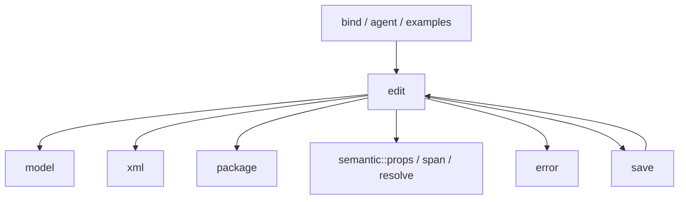

# edit 重构实施记录

基线：`843d898`。开始时 edit 目录已只有 `mod.rs`，不重复执行文件合并。
已有用户改动：`docs/13-public-api.md`、`fuzz/corpus/.gitignore`；未跟踪的
`PROMPT.md`、`PROMPT_EDIT.md`、`tools/merge-edit-text.py`。这些内容不纳入任务提交。
基线 `cargo check -p rsword` 通过；`cargo test -p rsword --lib`：425 通过。

## 依赖与剩余迁移清单

当前调用方 → 被依赖方：

`save` 与 `edit` 的双向依赖尚需拆解：保存编排保留在 save，共享数据契约与
编辑状态维护分开处理。当前图不表示该问题已经解决。

| 当前项 | 目标归属 | 调用方 / 可见性 | 所有权、布局与宏决策 |
| --- | --- | --- | --- |
| `Act::Restore` 静态保留字段表 | 私有修订策略枚举 | `MutationPlan::restore` | 按值策略替代静态切片；u8 标签，无堆分配 |
| `DROPPABLE_EMPTY` | 修订动作的私有判定方法 | 清理与还原计划 | 判定不需要容器所有权 |
| 表格自由函数 | EditSession / MutationPlan / Geometry | 编辑分派、修订处理；内部私有 | 计划继续拥有 NodeId 序列，查询优先借用 |
| track / twin 自由函数 | Tracker / EditSession | 修订与孪生同步 | 修改前快照与 part 配对保留 |
| shape 生成自由函数 | 生成类型 / EditSession | NewBlock 编辑入口 | 保留递归 Box；审查单位转换 |
| CT、part 与命名空间常量 | 语义枚举与 XML 现有枚举 | 编辑与保存调用方 | 标准 From 转换，字符串允许静态生命周期 |
| 分散领域错误 | error.rs 的 declare_error! | 解析、绑定、agent、保存 | 保留结构化载荷、格式与 source |
| 旧 locate / tests 文件历史 | 定位类型 / test_edit | 需核对 git 历史 | 不以当前文件缺失推定历史行为已完整迁移 |

这是一份进行中的审计记录；全部硬性规则和最终验证完成前不宣称完成。

## 已验证单元：修订还原策略

- `PPR_KEEP` / `SECT_KEEP` / `ROW_KEEP` / `CELL_KEEP` → 私有 `RevisionKeep`
  的 Paragraph / Section / Row / Cell 变体。None 表示没有排除字段，保持旧空表语义。
- `Act::Restore` 不再含静态容器引用；策略以 `repr(u8)` 存储，无分配。
  `DROPPABLE_EMPTY` → 私有 inline 判定 `Act::droppable_empty`。
- `MutationPlan::unwrap`、`restore` 的三处临时 NodeId Vec 改为 DOM 借用迭代器。
  DOM 在整个计划构建期间不可变，计划持有待执行命令，未改变提交与校验顺序。
  快照克隆、计划集合、合法 Option 与递归 Box 均未改变。
- 检查：fmt、diff --check、rsword check、库测试（425 通过），以及
  revisions / revision_grid / tracked_ops 专项回归。

## 已验证单元：修订使用的表格查询

- `cell_column`、`column_cells`、`grid_cols`、`absorb_cell_width` 成为
  EditSession 的私有 inline 方法，删除原受限可见性自由函数。
- 前三个查询直接借用会话 Document 中的 TableBlock / Row，无几何快照分配。
  `RowGeometry::cell_spans` 按原 gridBefore 与 gridSpan 顺序计算位置。
  缺表仍返回 None 或空迭代器，不新增错误或默认表格。
- 整列守卫与删除计划重新创建同语义借用迭代器；提交前 Document 不变。
  单格吸收宽度暂保留几何数据，避免把相邻格选择与这次查询变更混在一起。
- check、fmt、diff --check、库测试 425 项以及修订专项回归通过。

## 表格操作方法迁移

`table_of`、`insert_row`、`delete_row`、`insert_column`、`delete_column`、
`merge_cells`、`bump_row_gap`、`patch_cell_span`、`shift_bookmark_columns`
归入 EditSession 私有方法。原分派、错误信息、计划写入和提交顺序保持不变。
使用 syn 解析器按选定 ItemFn 和 ExprCall 的源码跨度生成副本，先审阅完整补丁，
再写入工作树；同名的一参数局部 `table_of` 闭包未误改。
check、fmt、diff --check、库测试 425 项以及 edit / cell_edit / revision_grid 回归通过。

历史核对：`5a140b2^` 中 locate.rs 没有模块声明或 include/path 引用。
它是早期主正文专用定位实现，当前定位已支持 part 与段内边界；其唯一测试的
`A😀B` 六个边界断言在 `position_utf16_text_conversion_preserves_boundaries_and_errors`
中完整保留，并区分代理对与越界的现行诊断。不恢复重复类型或过时调用路径。

## 通用 DOM 查询归属

- `element_children` → XML 层 `Dom::live_element_children`：借用迭代器，
  维持原始顺序、元素筛选和 Deleted 过滤，不改变为 MCE 语义展开。
- `direct_child` → `Dom::direct_child_containing`，保留包装锚点查找行为。
- `table_ops_child_named` 删除，调用方传完整 QName 给既有
  `Dom::live_children_named(...).next()`；`table_ops_w` 删除，使用 QName::w。
- 移除首项查询的临时集合；计划生成继续只读 DOM。新断言检查原始节点顺序、
  删除过滤、后代包装与不属于容器的节点。check、fmt、diff 检查、425 项库测试和
  edit / cell_edit / revision_grid 回归通过。
- `cargo check --workspace` 在表格方法单元后通过。基础层源码扫描未发现对编辑类型
  的实现依赖，仍有旧文档链接待统一更新；save 双向编排依赖仍待处理。

## 修订模板方法归属

按用户进一步明确的规则，优先选择被修改对象作为 receiver；没有可变对象时，
再选择主要借用状态及领域归属。
`with_para_mark` / `with_row_mark` / `mark_new_block_inserted` → Tracker 的私有
inline 方法；`clone_row_props_without_revisions` → MutationPlan 的私有 inline 方法。
调用使用 `t.with_para_mark(...)`、`plan.clone_row_props_without_revisions(...)` 等形式。
消费 NewElement 时移动属性集合与段落属性元素，移除六处属性 clone 及一处子树 clone。
重复属性容器需要复用同一修订标记，marker.clone 保留，未更改修订 ID 分配顺序。
check、fmt、diff 检查、库测试 425 项和三组修订回归通过。
一次库测试编译受到 SIGTERM 中断，随后原命令重跑通过；中断不计成功。

## 计划写入与宏生成项

`empty_paragraph`、`move_cell_content`、`rename_text` 归入 MutationPlan 私有 inline
方法；删除 Tracker 中仅转发文本改名的两个入口，调用直接写入计划。
`table_props_op!` 生成 EditSession 方法；`accept_reject!` 生成 Act::actions 方法。
通过 cargo expand 的实际输出再用 syn 扫描，确认这两个宏不再生成自由函数。
其余已识别自由函数继续逐个迁移，尚未通过最终“零自由函数”验收。
check、fmt、库测试 425 项及 edit / revisions / tracked_ops 回归通过。

## 编辑错误构造调用

删除 `unsupported`、`geometry_error`、`err_in_deleted` 自由转发函数；各调用点
使用 error.rs 已有的 Error::edit，保留原 DiagCode 与消息，不增加公开转发方法。
check、fmt、diff 检查、425 项库测试及 edit / revision_grid 回归通过。
此单元仅清理编辑错误构造；全 crate 错误定义归并仍未完成。

## CI compat-ts 修复

GitHub Actions run 34437434219 的 compat-ts 在 Clippy 阶段因旧 edit::ops /
edit::media_ops 路径以及合并遗留的游离文档注释失败；默认矩阵被连带取消。
兼容保存改为 EditSession::reconcile_entries 批量行为入口，具体批注与注释
upsert 仍为私有 inline 方法；DOM pPr 查询直接使用 XML 的 QName 查询迭代器。
权威列表保留缺省与空列表差别、输入顺序、特殊注释条目与返回操作数。
输入段落是待提交的拥有型数据；删除前保存 ID 序列，避免修改过程中重查目标。
新增入口使用既有事务机制，回归覆盖嵌套回滚。

px_to_emu 自由函数移除，ImageExtentPx → ImageExtentEmu → i64 使用 From。
两个 newtype 采用 repr(transparent)，与 f64 / i64 具有相同大小和对齐；
保留原 round、饱和转换及至少 1 EMU 的行为，测试包括 NaN 和正负无穷。
EntryReconciliation 含可选拥有型集合，采用 repr(C)，不采用 packed，避免
容器字段非对齐借用；这些 Option 的 None 表示不修改，不能消除。

完整测试进一步发现 API 文档清单仍指向被删除的 edit 子文件；迁移清单到
mod.rs 并补齐所有 EditSession impl（含宏模板）的文档审计属性。
未删除或放宽 api_docs 测试，新增类型继续受 missing_docs 约束。

本单元已验证：两种 feature 的严格 workspace/all-targets Clippy（无警告）、
rsword_api_docs check、compat-ts 的 rsword-js wasm32 check、默认库 427 项、
compat 库 442 项、save_blocks 两项及修正后的 api_docs 两项通过。
完整 workspace 测试的初次执行被上述 API 清单失败阻断，修正后正在重跑；
release 回归仍在运行，尚不声明完整 CI 或整体重构完成。
