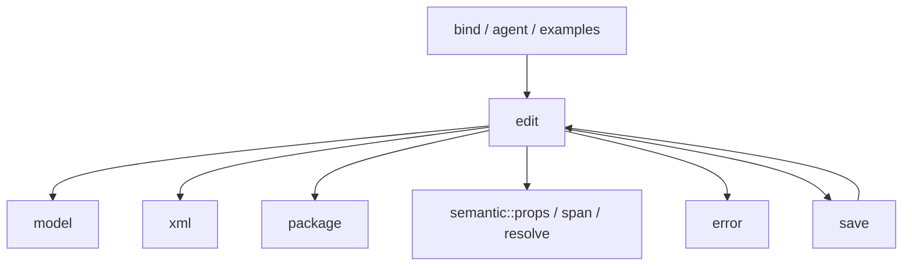

# edit 重构实施记录

基线：`843d898`。开始时 edit 目录已只有 `mod.rs`，不重复执行文件合并。
已有用户改动：`docs/13-public-api.md`、`fuzz/corpus/.gitignore`；未跟踪的
`PROMPT.md`、`PROMPT_EDIT.md`、`tools/merge-edit-text.py`。这些内容不纳入任务提交。
基线 `cargo check -p rsword` 通过；`cargo test -p rsword --lib`：425 通过。

## 依赖与剩余迁移清单

当前调用方 → 被依赖方：

`save` 与 `edit` 的双向依赖尚需拆解：保存编排保留在 save，共享数据契约与
编辑状态维护分开处理。当前图不表示该问题已经解决。

| 当前项 | 目标归属 | 调用方 / 可见性 | 所有权、布局与宏决策 |
| --- | --- | --- | --- |
| `Act::Restore` 静态保留字段表 | 私有修订策略枚举 | `MutationPlan::restore` | 按值策略替代静态切片；u8 标签，无堆分配 |
| `DROPPABLE_EMPTY` | 修订动作的私有判定方法 | 清理与还原计划 | 判定不需要容器所有权 |
| 表格自由函数 | EditSession / MutationPlan / Geometry | 编辑分派、修订处理；内部私有 | 计划继续拥有 NodeId 序列，查询优先借用 |
| track / twin 自由函数 | Tracker / EditSession | 修订与孪生同步 | 修改前快照与 part 配对保留 |
| shape 生成自由函数 | 生成类型 / EditSession | NewBlock 编辑入口 | 保留递归 Box；审查单位转换 |
| CT、part 与命名空间常量 | 语义枚举与 XML 现有枚举 | 编辑与保存调用方 | 标准 From 转换，字符串允许静态生命周期 |
| 分散领域错误 | error.rs 的 declare_error! | 解析、绑定、agent、保存 | 保留结构化载荷、格式与 source |
| 旧 locate / tests 文件历史 | 定位类型 / test_edit | 需核对 git 历史 | 不以当前文件缺失推定历史行为已完整迁移 |

这是一份进行中的审计记录；全部硬性规则和最终验证完成前不宣称完成。

## 已验证单元：修订还原策略

- `PPR_KEEP` / `SECT_KEEP` / `ROW_KEEP` / `CELL_KEEP` → 私有 `RevisionKeep`
  的 Paragraph / Section / Row / Cell 变体。None 表示没有排除字段，保持旧空表语义。
- `Act::Restore` 不再含静态容器引用；策略以 `repr(u8)` 存储，无分配。
  `DROPPABLE_EMPTY` → 私有 inline 判定 `Act::droppable_empty`。
- `MutationPlan::unwrap`、`restore` 的三处临时 NodeId Vec 改为 DOM 借用迭代器。
  DOM 在整个计划构建期间不可变，计划持有待执行命令，未改变提交与校验顺序。
  快照克隆、计划集合、合法 Option 与递归 Box 均未改变。
- 检查：fmt、diff --check、rsword check、库测试（425 通过），以及
  revisions / revision_grid / tracked_ops 专项回归。
